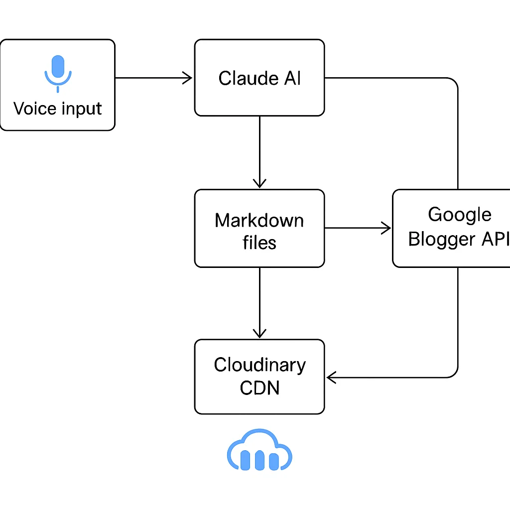

## Hello world (but make it meta)

Welcome to my first blog post ever. Quick admission: **I built an entire blog automation system just so I could write this post**.

I know that sounds backwards. Most people start a blog by writing "Hello World" in WordPress. I started by building a voice-to-published-blog pipeline powered by AI agents. Then I used it to write about itself.

Why? I kept putting off starting a blog. The friction was too high. Every time I had an idea, the thought of manually formatting markdown, finding images, configuring a blog platform, dealing with SEO... it killed the momentum before I even started.

So I did what any engineer does when procrastinating. I built a tool to automate the thing I was avoiding.

## What I built

I ended up with a complete voice-to-published-blog pipeline that took me from zero to this post you're reading.

You literally just ramble about your idea, like you're explaining it to a friend at a coffee shop, and the system:

1. ✅ **Converts your rambling into a structured blog post**
2. ✅ **Generates professional images with AI** (OpenAI GPT-Image-1)
3. ✅ **Builds the HTML with syntax highlighting and formatting**
4. ✅ **Runs SEO and quality checks automatically**
5. ✅ **Uploads images to Cloudinary CDN**
6. ✅ **Publishes to Google Blogger as a draft**
7. ✅ **Updates instead of duplicating** (it's idempotent!)

Then you review it, change `status: draft` to `status: published`, run one command, and **you're live**.

That's the whole workflow.

## How it works: the four-command workflow

This is the workflow I use now.

### Step 1: Create the post (voice or text)

I have a Claude Code slash command called `/create-post`. I just talk about my idea:

```bash
/create-post So today I made a really cool tech thing. It's for blogging.
All I have to do is ramble about whatever I want to write about—I don't
even have to structure it. The system takes my blurb, converts it into
proper markdown, and even generates images for it...
```

Claude Code (powered by Anthropic's Sonnet) then:
- Analyzes my rambling and identifies the core story
- Chooses the best blog post format (tutorial, case study, listicle, etc.)
- Writes a complete, structured blog post in markdown
- **Generates images automatically** using the image generation tool
- Suggests detailed AI prompts for each image (hero images, diagrams, etc.)
- Saves everything to `posts/YYYY-MM-DD-slug/post.md`

The trick is that `/create-post` doesn't just write text. It **actively generates the images** as part of the workflow. The command has access to the `generate_image.py` tool, so it crafts detailed prompts and creates the images while writing the post.

### Step 2: Generate images (if needed)

If you want more images beyond what the command created, you can run:

```bash
uv run tools/generate_image.py "modern minimalist illustration of
AI automation pipeline with voice input, markdown documents, and blog
publishing, blue and purple gradient, clean tech aesthetic, isometric
view, professional futuristic mood" posts/2025-10-12-my-post/hero.png
```

Each image costs about **$0.015** (less than two cents) and looks way better than stock photos. The images get saved directly in the post directory.

### Step 3: Quality check, build, and publish

With the post written and images generated, I run three more slash commands:

```bash
# Optional: Check quality (SEO + prose linting)
/quality-check posts/2025-10-12-my-post/

# Validate and preview locally
/build posts/2025-10-12-my-post/

# Publish to Blogger (creates draft)
/publish posts/2025-10-12-my-post/
```

**The `/quality-check` command** runs both Vale prose linting and SEO analysis. It catches issues like passive voice, wordy phrases, missing meta descriptions, and title length problems.

**The `/build` command** validates everything:
- Checks frontmatter and tag registry
- Validates image references
- Converts markdown to HTML with syntax highlighting
- Generates a local preview HTML file

**The `/publish` command** does the actual publishing:
- Uploads images to Cloudinary CDN (with hash-based deduplication)
- Converts markdown to HTML with Pygments syntax highlighting
- Detects if the post already exists (via directory path)
- Creates OR updates the post on Blogger (no duplicates!)
- Saves the `blogger_id` back to frontmatter for future updates

When I'm ready to go live, I change `status: draft` to `status: published` in the markdown and run `/publish` again. **One command. Live blog post.**

## The technical stack

This is what makes it work.

### AI content generation
- **Claude Code (Anthropic Sonnet 4.5)** - Converts rambling to structured posts
- **OpenAI GPT-Image-1** - Generates custom blog images from prompts

### Content pipeline
- **Python 3.13** with `uv` for dependency management
- **Markdown → HTML** conversion with Python-Markdown
- **Pygments** for code syntax highlighting
- **YAML frontmatter** for metadata (title, date, tags, status)

### Infrastructure
- **Cloudinary** - Image CDN with automatic WebP conversion
- **Google Blogger API** - Publishing platform (with OAuth 2.0)
- **Vale** - Prose linting for readability and style
- Custom **SEO checker** - Validates title length, meta descriptions, headings, content length

### Smart features
- **Idempotent publishing** - Detects existing posts by directory path, updates instead of duplicating
- **Hash-based image deduplication** - Only uploads changed images to Cloudinary
- **Tag registry** - Enforced tag consistency (no tag sprawl!)
- **Path-based URLs** - `2025-10-12-hello-world` → `/2025/10/hello-world.html`

## The architecture: how everything fits together



The flow looks like this:

1. **Voice/Text Input** → Claude Code `/create-post` command
2. **AI Processing** → Structured markdown + image prompts + frontmatter
3. **Image Generation** → OpenAI API → Saved to post directory
4. **Build Step** → Validates tags, converts markdown, generates preview HTML
5. **Quality Checks** → SEO analysis + Vale prose linting (optional)
6. **Publish Step** →
   - Upload images to Cloudinary (if changed)
   - Convert markdown to HTML with Pygments
   - Create/update post via Blogger API
   - Save `blogger_id` to frontmatter
7. **Status Toggle** → Change `draft` → `published` and republish

Everything is idempotent. You can run commands many times safely. The system is smart enough to:
- Detect existing posts by directory name
- Only upload images when their hashes change
- Update instead of duplicate
- Preserve your `blogger_id` across runs

## What this actually looks like in practice

Here's a real example. This is my actual workflow for creating **this exact post** (my first blog post ever):

```bash
# 1. Talk about my idea (literally just rambled into Claude Code)
/create-post So today I made a really cool tech thing...

# 2. Claude wrote the post AND generated the images automatically!

# 3. Optional: Run quality checks
/quality-check posts/2025-10-12-voice-to-blog-automation/

# 4. Build and preview
/build posts/2025-10-12-voice-to-blog-automation/

# 5. Publish as draft
/publish posts/2025-10-12-voice-to-blog-automation/

# 6. Review on Blogger, then publish live
# (Edit status: draft → published in post.md)
/publish posts/2025-10-12-voice-to-blog-automation/
```

**Total hands-on time: ~5 minutes** (most of it spent reviewing the AI output. The images generated automatically.)

This is my **first blog post ever**. It took 5 minutes of actual work. The system I built to enable it took a day to build, but now the barrier to writing is gone.

Compare that to traditional blogging:
- Write in markdown editor: 45-60 minutes
- Find/create images: 20-30 minutes
- Format and optimize: 15-20 minutes
- Upload to blog platform: 10-15 minutes
- SEO checks: 10 minutes

**Traditional first post: 2+ hours of friction. This approach: build once, write forever in 5 minutes.**

## The quality checks: making sure it's actually good

One concern with AI-generated content: is it any good? Will it rank? Is it readable?

The `/quality-check` command runs two automated checks.

### 1. SEO analysis

Checks for search optimization best practices:
- ✅ Title length (30-60 chars for Google)
- ✅ Meta description (150-160 chars)
- ✅ Heading structure (single H1, proper H2/H3 hierarchy)
- ✅ Content length (300+ words recommended)
- ✅ Image alt text
- ✅ Internal/external links
- ✅ Keyword density

**Example output:**
```
✅ Title length: 52 characters (optimal)
✅ Single H1 heading found
✅ Content length: 1,847 words
⚠️  Add meta description for search results
✅ 3 images with alt text
```

### 2. Prose linting with Vale

Vale checks writing quality automatically:
- Passive voice detection
- Readability scores
- Clichés and weasel words
- Technical writing best practices

**Example output:**
```
 12:34  suggestion  'really' is a weasel word  write-good.Weasel
 45:12  warning     This sentence is too long  write-good.TooWordy
```

You can ignore suggestions, but the system catches common mistakes before publishing. Run `/quality-check` on any post to get instant feedback.

## Why this matters: starting is the hardest part

The honest truth: **I'd been putting off starting a blog for years**.

Not because I didn't have ideas. Not because I couldn't write. Every time I thought about starting, I'd get overwhelmed by the setup:
- Pick a blogging platform
- Learn how to use it
- Figure out themes and styling
- Deal with image hosting
- Remember markdown syntax
- Manually publish and update
- Optimize for SEO

So I'd think "I'll do it later" and never actually start.

This automation system changed that. By building it, I removed every excuse I had. Now the barrier to writing is **as low as talking**. I went from years of procrastination to a published post in 5 minutes of actual writing.

### What's next?

I'm planning to add:
- **Automatic social media posts** (LinkedIn, Twitter) from blog content
- **Voice-to-text input** (literally just record audio, get blog post)
- **Multi-platform publishing** (Dev.to, Medium, Hashnode)
- **Analytics integration** (track what actually performs)
- **Automated internal linking** (connect related posts automatically)

## What's coming next

This blog will dive deep into each piece of this automation pipeline. From setting up the Blogger API and OAuth flows, to building the markdown converter, to integrating Cloudinary for image optimization. I'll walk through the architecture decisions, the code, and the lessons learned along the way.

But it gets even more interesting when you add **an agentic layer on top**.

Imagine the system automatically:
- Generating follow-up posts based on engagement metrics
- Creating social media threads from your blog content
- Suggesting related topics based on trending searches
- Autonomously maintaining and updating older posts
- Building internal link networks between related content

We're just scratching the surface of what's possible when you combine AI agents with content workflows.

**Stay tuned for more.** The future of content creation is autonomous, and we're going to build it together.

## Conclusion: the best way to start is to remove the excuses

So this is my first blog post. Not a typical "Hello World," but a working system that made starting possible.

The irony isn't lost on me. I spent a day building automation to avoid spending 2 hours writing a blog post. That's not really what happened, though. I spent a day **removing the barrier** that kept me from starting for years.

Now I have no excuses. The system is built. Writing takes 5 minutes. Publishing is one command.

If you've been putting off starting a blog (or any creative project), maybe you don't need motivation. Maybe you need to **automate away the friction** so that starting becomes the default instead of the exception.

This is post #1. Let's see how many more the automation makes possible.

**Welcome to Agentic Engineer. Let's build things that make building things easier.**
