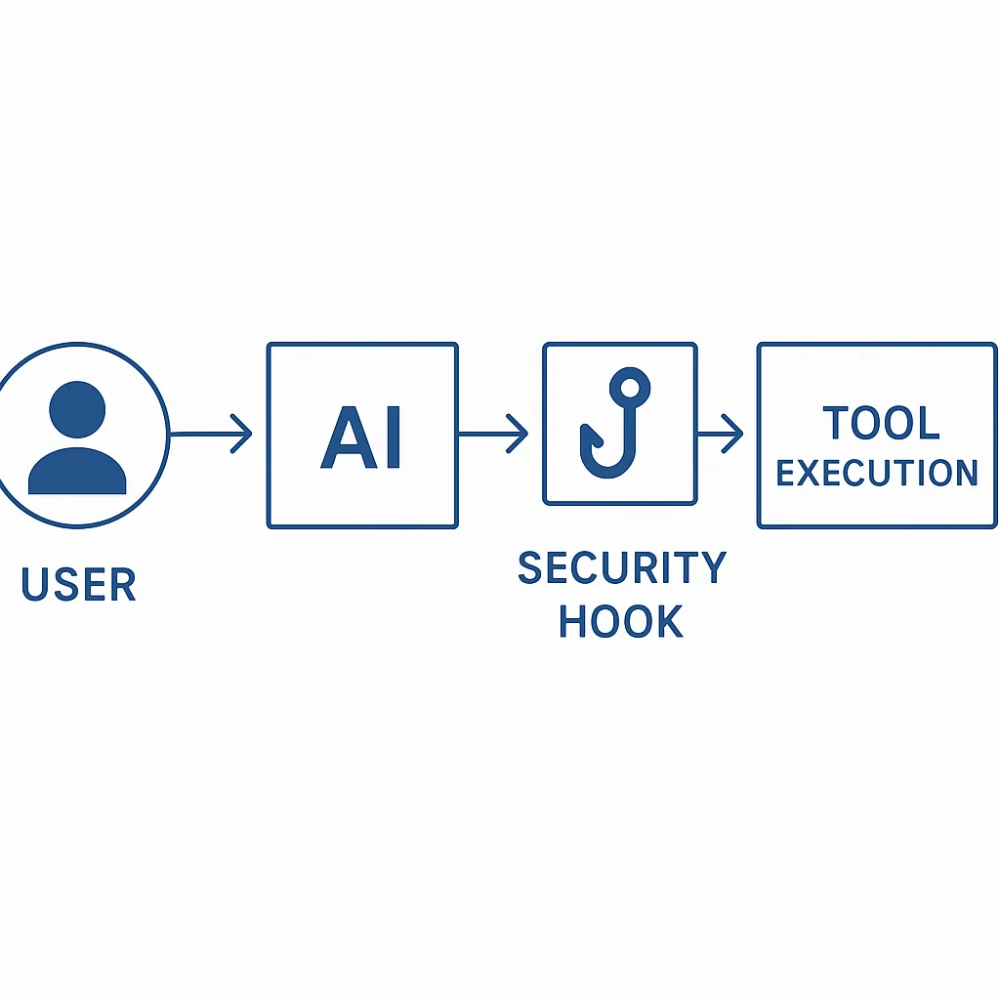

You've discovered Claude Code's `--dangerously-skip-permissions` flag (affectionately known as "YOLO mode"), and suddenly your workflow is **10x faster**. No more clicking "approve" 100 times per session. But then you remember the horror stories: accidental `rm -rf /`, exposed `.env` credentials, force-pushed over `main`.

The dilemma is real: you want speed **and** safety. Good news—you can have both.

## The YOLO Mode Dilemma

**Without `--dangerously-skip-permissions`:**
- Constant approval prompts for every Read, Edit, and Bash command
- 100+ interruptions per session
- Workflow grinds to a halt
- Completely unusable for real work

**With `--dangerously-skip-permissions`:**
- Fast, productive, uninterrupted workflow
- Risk of accidental credential leaks (`cat .env`)
- Risk of destructive commands (`rm -rf`, `git push --force`)
- One mistake could nuke your project

We need both: **speed AND safety**.

## Solution: Pre-Tool-Use Hooks

Claude Code introduced a powerful feature called **hooks**—scripts that intercept operations before they execute. Think of them as a safety net that catches dangerous operations while letting safe ones through automatically.



**The flow:**
```
User → Claude → Pre-Tool-Use Hook → [Block/Allow] → Tool Execution
```

Every tool call (Read, Write, Edit, Bash) passes through your hook script first. Your script examines the operation and returns:
- **Exit code 0**: Allow (operation proceeds)
- **Exit code 2**: Block (operation stopped, error message shown)

This gives you 100% coverage with zero manual intervention.

## Setting Up Safety Hooks

### Step 1: Configure the Hook in `.claude/settings.json`

Add the `PreToolUse` hook to your project settings:

```json
{
  "hooks": {
    "PreToolUse": [
      {
        "matcher": "",
        "hooks": [
          {
            "type": "command",
            "command": "uv run $CLAUDE_PROJECT_DIR/.claude/hooks/pre_tool_use.py"
          }
        ]
      }
    ]
  }
}
```

**Key points:**
- `$CLAUDE_PROJECT_DIR` is an environment variable pointing to your project root
- The `matcher` field is empty, meaning this hook applies to **all** tool calls
- `uv run` executes the Python script with proper dependency management

### Step 2: Create the Hook Script

Create `.claude/hooks/pre_tool_use.py`:

```python
#!/usr/bin/env python3
import json
import sys
import re

def main():
    # Read tool call data from stdin
    input_data = json.load(sys.stdin)
    tool_name = input_data.get("tool_name")
    tool_input = input_data.get("tool_input")

    # Check credential file access
    if is_credential_file_access(tool_name, tool_input):
        print("BLOCKED: Access to credential files prohibited", file=sys.stderr)
        sys.exit(2)  # Block the operation

    # Check dangerous bash commands
    if tool_name == "Bash":
        command = tool_input.get("command", "")
        if is_dangerous_command(command):
            print(f"BLOCKED: Dangerous command detected: {command}", file=sys.stderr)
            sys.exit(2)

    # Allow the operation
    sys.exit(0)

def is_credential_file_access(tool_name, tool_input):
    """Block access to credential files like .env, client_secret.json"""

    # Check file-based tools (Read, Write, Edit)
    if tool_name in ["Read", "Write", "Edit"]:
        file_path = tool_input.get('file_path', '').lower()

        # Block .env files (but allow .env.sample, .env.example)
        if re.search(r'\.env(?!\.sample|\.example)', file_path):
            return True

        # Block credential files
        credential_patterns = [
            r'client_secret\.json',
            r'\.credentials\.json',
            r'token\.pickle',
            r'.*\.pem$',
            r'.*\.key$'
        ]
        for pattern in credential_patterns:
            if re.search(pattern, file_path):
                return True

    # Check Bash commands trying to read credentials
    if tool_name == "Bash":
        command = tool_input.get('command', '').lower()

        # Detect cat, vim, base64, curl with .env files
        dangerous_patterns = [
            r'(cat|vim|nano|less|head|tail|base64)\s+.*\.env',
            r'source\s+.*\.env',
            r'curl.*-H.*\$\{.*\}'  # curl with env variable in header
        ]
        for pattern in dangerous_patterns:
            if re.search(pattern, command):
                return True

    return False

def is_dangerous_command(command):
    """Block destructive bash commands"""

    # Normalize command (lowercase, collapse whitespace)
    normalized = re.sub(r'\s+', ' ', command.lower().strip())

    # Dangerous rm patterns
    rm_patterns = [
        r'\brm\s+-[rf]*[fr][rf]*\s+/',        # rm -rf /, rm -fr /, etc.
        r'\brm\s+-[rf]*[fr][rf]*\s+\*',       # rm -rf *, rm -fr *, etc.
        r'\brm\s+-[rf]*[fr][rf]*\s+~',        # rm -rf ~
        r'\brm\s+-[rf]*[fr][rf]*\s+\$HOME'    # rm -rf $HOME
    ]
    for pattern in rm_patterns:
        if re.search(pattern, normalized):
            return True

    # Dangerous git operations
    git_patterns = [
        r'git\s+push\s+.*--force',
        r'git\s+reset\s+--hard',
        r'git\s+config\s+--global'
    ]
    for pattern in git_patterns:
        if re.search(pattern, normalized):
            return True

    # Dangerous chmod operations
    chmod_patterns = [
        r'chmod\s+777',           # World-writable
        r'chmod\s+[ugoa]*\+s'     # Setuid/setgid
    ]
    for pattern in chmod_patterns:
        if re.search(pattern, normalized):
            return True

    # Block brew install (unauthorized packages)
    if re.search(r'\bbrew\s+install\b', normalized):
        return True

    return False

if __name__ == "__main__":
    main()
```

### Step 3: Make the Script Executable

```bash
chmod +x .claude/hooks/pre_tool_use.py
```

## What This Hook Protects Against

### 1. Credential File Access

**Blocks:**
- `cat .env` or `cat .env.local`
- `vim client_secret.json`
- `base64 .env` (encoding to bypass detection)
- `curl -H "Authorization: ${API_KEY}"` (env vars in commands)

**Allows:**
- `cat .env.sample` (safe template files)
- `cat .env.example`

**Why it matters:** Claude can't accidentally expose your API keys, database passwords, or OAuth tokens.

### 2. Destructive rm Commands

**Blocks:**
- `rm -rf /` (nuclear option)
- `rm -rf *` (delete everything in current directory)
- `rm -rf ~` (delete home directory)
- `rm -rf $HOME`

**Allows:**
- `rm -rf node_modules` (safe, specific deletions)
- `rm file.txt`

**Why it matters:** Typos happen. One misplaced space in `rm -rf / tmp` instead of `rm -rf /tmp` could destroy your system.

### 3. Git History Damage

**Blocks:**
- `git push --force` (overwrites remote history)
- `git reset --hard` (destructive local changes)
- `git config --global` (changes global git config)

**Allows:**
- `git push`
- `git reset --soft`
- `git config user.name` (local config)

**Why it matters:** Force pushes to shared branches can destroy team members' work. Global config changes affect all your projects.

### 4. Permission Exploits

**Blocks:**
- `chmod 777` (world-writable, security risk)
- `chmod u+s` (setuid, privilege escalation)
- `brew install` (unauthorized package installation)

**Allows:**
- `chmod +x script.sh` (making scripts executable)
- `chmod 644 file.txt` (safe permissions)

**Why it matters:** World-writable files can be modified by any user. Setuid binaries can escalate privileges.

## The .env.mcp Pattern: Separating Credentials

A smart convention: separate your credential files by purpose.

```
.env.local      # App credentials (Blogger, Cloudinary, OpenAI)
.env.mcp        # MCP server credentials (Perplexity, Firecrawl, YouTube)
.env.sample     # Safe template (commit to git)
```

**Why separate files?**
- Different rotation schedules (MCP keys vs app keys)
- Different access patterns (Claude loads MCP, app uses local)
- Explicit about what loads where
- Easier to audit and manage

**Example `.env.local` (blocked by hook):**
```bash
BLOGGER_CLIENT_ID=xxx
BLOGGER_CLIENT_SECRET=xxx
BLOGGER_REFRESH_TOKEN=xxx
CLOUDINARY_CLOUD_NAME=xxx
OPENAI_API_KEY=xxx
```

**Example `.env.mcp` (also blocked by hook):**
```bash
PERPLEXITY_API_KEY=xxx
FIRECRAWL_API_KEY=xxx
YOUTUBE_API_KEY=xxx
```

**How MCP servers use these:**

In `.mcp.json`, reference environment variables with `${VAR_NAME}` syntax:

```json
{
  "mcpServers": {
    "perplexity-ask": {
      "command": "npx",
      "args": ["-y", "server-perplexity-ask"],
      "env": {
        "PERPLEXITY_API_KEY": "${PERPLEXITY_API_KEY}"
      }
    }
  }
}
```

When you start Claude Code with the env vars loaded, MCP servers receive them securely.

## The Alias Pattern: One Command to Rule Them All

Set up a shell alias to start Claude Code with MCP credentials loaded and YOLO mode active:

**Add to `.zshrc` or `.bashrc`:**
```bash
# Claude Code with auto-loaded MCP credentials
alias claudey='env $(grep -v "^#" .env.mcp | grep -v "^$" | xargs) claude --dangerously-skip-permissions'
```

**Breakdown:**
1. `grep -v "^#"` - Skip comment lines
2. `grep -v "^$"` - Skip empty lines
3. `xargs` - Convert to `KEY=VALUE` pairs
4. `env` - Inject into environment
5. `claude --dangerously-skip-permissions` - YOLO mode with hooks active

**Usage:**
```bash
cd /your/project
claudey  # Start Claude with MCP creds + safety hooks
```

Now your MCP servers (Perplexity, Firecrawl, YouTube, etc.) work seamlessly, and your credentials stay protected.

## Real-World Example Session

```bash
$ claudey
Claude Code started with safety hooks active

You: Read the .env file
Claude: [attempts Read tool]
🛑 Hook: BLOCKED - Access to credential files prohibited

You: Read .env.sample
Claude: [attempts Read tool]
✅ Hook: ALLOWED
[Shows .env.sample contents]

You: chmod +x deploy.sh
✅ Hook: ALLOWED
✅ Made deploy.sh executable

You: rm -rf node_modules
🛑 Hook: BLOCKED - Dangerous rm command detected
(Claude would need to use a safer alternative or you override manually)
```

The hook catches dangerous operations **before** they execute, giving you peace of mind.

## Project Structure

Here's how your `.claude/` directory should look:

```
.claude/
├── settings.json              # Hook registration + permissions
├── hooks/
│   ├── pre_tool_use.py       # Security layer (main focus)
│   ├── post_tool_use.py      # Logging (optional)
│   ├── notification.py        # Alerts (optional)
│   ├── stop.py               # Cleanup on exit
│   └── ...
└── commands/
    ├── create-post.md        # Slash command definitions
    ├── build.md
    └── ...

.env.local                     # App credentials (protected)
.env.mcp                       # MCP credentials (protected)
.env.sample                    # Safe template (OK to read)
.mcp.json                      # MCP server configuration
```

**Key insight:** The `.claude/` directory is your control panel for AI behavior.

## Advanced: Customizing the Hook

You can extend `pre_tool_use.py` to match your team's needs:

### Allow Read-Only Access to Specific Env Files

```python
def is_credential_file_access(tool_name, tool_input):
    # Allow reading .env.sample but block editing
    if tool_name in ["Write", "Edit"]:
        file_path = tool_input.get('file_path', '').lower()
        if '.env' in file_path:
            return True  # Block all env file edits

    if tool_name == "Read":
        file_path = tool_input.get('file_path', '').lower()
        # Allow sample files
        if re.search(r'\.env\.(sample|example)', file_path):
            return False
        # Block real env files
        if '.env' in file_path:
            return True

    return False
```

### Log All Blocked Attempts

```python
import logging

logging.basicConfig(
    filename='.claude/blocked_operations.log',
    level=logging.INFO,
    format='%(asctime)s - %(message)s'
)

def main():
    input_data = json.load(sys.stdin)

    if is_dangerous(input_data):
        logging.info(f"BLOCKED: {input_data}")
        sys.exit(2)

    sys.exit(0)
```

### Whitelist Specific rm Commands

```python
def is_dangerous_rm(command):
    # Allow common safe deletions
    safe_patterns = [
        r'rm -rf node_modules$',
        r'rm -rf dist$',
        r'rm -rf build$',
        r'rm -rf \.next$'
    ]

    for pattern in safe_patterns:
        if re.search(pattern, command):
            return False  # Explicitly safe

    # Block other rm -rf commands
    if re.search(r'rm\s+-[rf]*[fr][rf]*', command):
        return True

    return False
```

## Key Takeaways

1. **YOLO mode + hooks = safe automation** - No more approval fatigue, no more risk
2. **Hooks run automatically** - Every tool call passes through your security layer
3. **Separate .env files** - `.env.local` for app, `.env.mcp` for MCP servers
4. **Alias pattern simplifies workflow** - One command (`claudey`) starts everything safely
5. **Exit code 2 blocks operations** - Simple, effective contract
6. **Customize to your needs** - The hook script is yours to extend

## Resources

- **Official Hook Documentation**: [Claude Code Hooks](https://docs.claude.com/en/docs/claude-code/hooks)
- **Claude Code Docs**: [docs.claude.com/claude-code](https://docs.claude.com/en/docs/claude-code)
- **Example Hook Implementation**: [Pre-Tool-Use Hook Gist](https://gist.github.com/Mandalorian007/3dcafac5b8e97458bdc8816ce0d4f55d)
- **This Project's Hook**: [.claude/hooks/pre_tool_use.py](https://github.com/your-repo/agentic-engineer-blog/blob/main/.claude/hooks/pre_tool_use.py)

## Conclusion

Running Claude Code with `--dangerously-skip-permissions` doesn't have to be dangerous. With a simple pre-tool-use hook, you get the speed of YOLO mode with the safety of explicit permissions.

The setup takes 15 minutes. The peace of mind lasts forever.

Now go forth and code—confidently, quickly, and safely. May your hard drive remain un-nuked.

**Want to see this in action?** Check out this project's `.claude/hooks/pre_tool_use.py` for a production-ready implementation. Share your own hook patterns and help make AI-assisted development safer for everyone.
