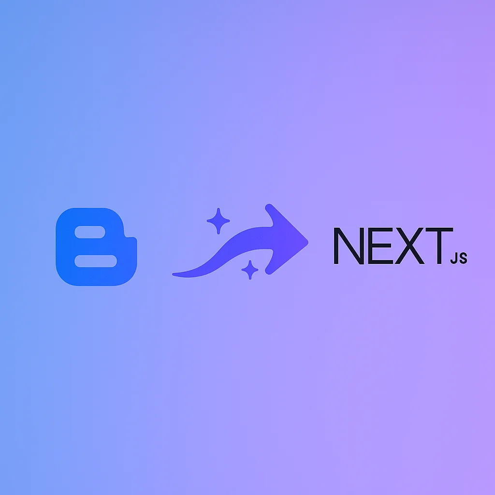
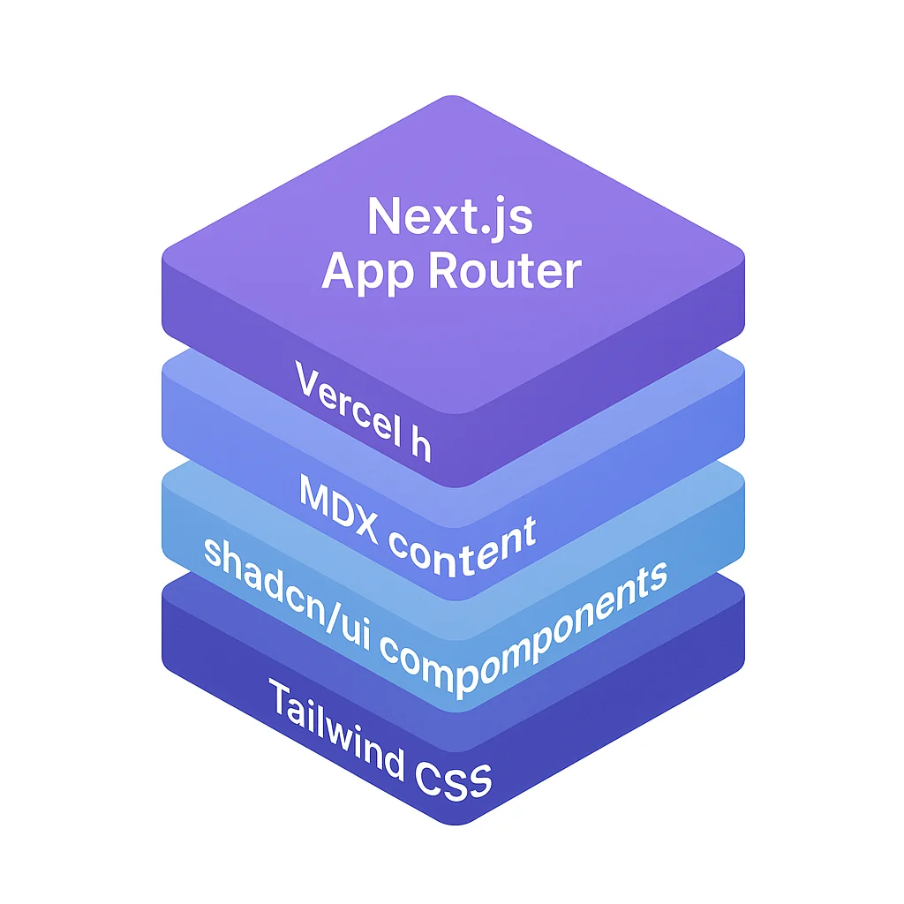
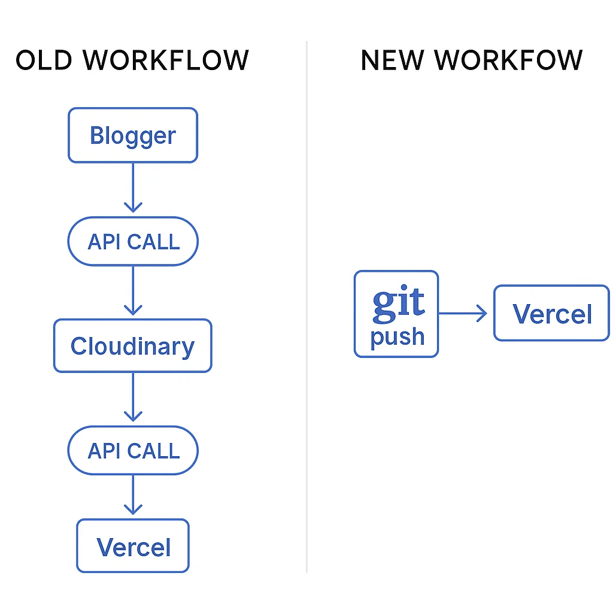

## The Rollercoaster: Excitement to Disappointment

Alright, we're here. We did it. We launched a blog!

I got stupid giddy and excited when I first published my blog. The automation was working, the content pipeline was humming, and posts were going live. It felt amazing to finally have a public platform for sharing ideas about agentic engineering.

Then I sat down and looked at Blogger more seriously.

"Yikes."

It was kind of out of date. Not very flexible. I had a Cloudinary CDN over here, a Blogger site over there, OAuth tokens to manage, API rate limits to worry about. The whole thing felt... fragile.

"Damn, this is not going to work long-term. This isn't as nice as I had hoped."

But here's the thing: we're in the world of being an **agentic engineer**. When you hit a roadblock, you don't bang your head against the wall. You summon your AI agents and let them do the heavy lifting.

## Enter the Agentic Approach

I went right back to Claude Code. I've got Perplexity MCP server set up for research, Firecrawl for deep web crawling, and Claude Code orchestrating everything. Time to put them to work.

My prompt was simple:

> "Do a full-blown investigation on where to go if our content is primarily markdown files and needs to go up on a blog. I want the best feature set. Here's my wishlist..."

And then I listed **a whole lot of requirements**:
- Modern, fast static site generation
- Great SEO out of the box
- Easy deployment pipeline
- Support for MDX (my existing format)
- Beautiful UI components
- Dark mode support
- Scheduled post publishing
- No external API dependencies

Claude Code went to work. It used Perplexity to research modern blogging platforms, Firecrawl to analyze documentation sites, and crunched through framework comparisons, hosting options, and UI libraries.

After churning through the data, it dropped a spec file with a comprehensive plan.

**The verdict?** "Go Next.js."

I was like, "Sweet. I know some Next.js. This will be no problem."

## The Decision: Next.js + shadcn/ui + Tailwind

The recommendation wasn't just Next.js in isolation. The full stack recommendation was:

### Core Framework
- **Next.js 15** with App Router for modern React patterns
- **Vercel** for zero-config deployment
- **MDX** for content (with all my existing frontmatter)

### UI & Styling
- **shadcn/ui** for beautiful, accessible components
- **Tailwind CSS** for utility-first styling
- **shadcnblocks** for pre-built layout components
- **next-themes** for dark mode support

### Content & SEO
- **react-markdown** + **remark-gfm** for rendering
- **react-syntax-highlighter** for code blocks
- **@tailwindcss/typography** for prose styling
- Built-in sitemap, robots.txt, and JSON-LD support

The research even found that shadcn/ui has a fantastic ecosystem. I could use the initial shadcn spin-up tool, grab some beautiful prefabs from shadcnblocks, and have something that looks great out of the box.

Nice and pretty. Nice and pretty. I was super, super happy.



## The Migration Plan: Two Phases

Here's where it gets interesting. The migration wasn't just about the website. I had an entire **content generation pipeline** to migrate too.

Claude Code drafted me up a ginormous migration plan with two distinct phases:

### Phase 1: Website Migration
1. Set up Next.js 15 project with TypeScript
2. Configure Tailwind + shadcn/ui with Clean Slate theme
3. Install shadcnblocks Pro components (navbar, footer, blog listing)
4. Create page structure (`/blog`, `/blog/[slug]`, `/blog/category/[category]`)
5. Implement post loading system with MDX parsing
6. Set up category system (7 hardcoded categories)
7. Add theme toggle (light/dark mode)
8. Configure SEO features (sitemap, robots.txt, JSON-LD)

### Phase 2: Pipeline Migration
1. Update `/create-post` command to output MDX directly
2. Change paths to `website/content/posts/*.mdx`
3. Update image generation to save to `website/public/blog/`
4. Remove Blogger API calls entirely
5. Remove Cloudinary upload logic
6. Simplify validation tools
7. Remove OAuth token management
8. Update quality checks for MDX format

Now, this seems a little scary, right? A full migration of both the website AND the automation pipeline?

**Honestly, it took me like maybe four hours.**

## The Implementation: Boom Boom Boom

Claude Code just **crunched**. The steps were clear:

1. "Use Clerk for auth (future-proofing for comments)"
2. "Use the shadcn CLI to spin everything up"
3. "Install these specific shadcnblocks components"
4. "Configure the MDX processing pipeline like this"
5. "Wire up the category system with these 7 categories"

Boom, boom, boom, boom, boom.

It found its place really quick. The website structure emerged in under an hour. Then we just pivoted our Python pipeline right on top of our new beautiful Next.js project.

All kinds of fancy new features came along for the ride:
- ✅ Auto-generated sitemaps
- ✅ robots.txt configuration
- ✅ JSON-LD structured data for better AI scraping
- ✅ ISR (Incremental Static Regeneration) for scheduled posts
- ✅ Login support with Clerk (ready for future features)

## The Key Wins

Let me highlight some of the biggest improvements from this migration:

### 1. Scheduled Publishing with ISR

The old system required me to manually trigger publishing at the right time. I had cron jobs, publish commands, and status syncing.

**Now?** I just use Next.js ISR:

```typescript
// app/blog/page.tsx
export const revalidate = 3600; // Rebuild every hour

export function getPublishedPosts(): Post[] {
  const allPosts = getAllPosts();
  const now = new Date();

  return allPosts.filter(post => {
    const postDate = new Date(post.date);
    return postDate <= now; // Only show posts that are due
  });
}
```

I can create all the content ahead of time. When the date arrives, the site rebuilds within the hour and the post appears. No publish command. No cron jobs. No manual intervention.

### 2. SEO Built-In

The old Blogger setup had mediocre SEO. I had to manually configure meta tags, hope the platform indexed things correctly, and pray Google found my sitemap.

**Now?** Everything is automatic:

```typescript
// Sitemap generation
export default function sitemap(): MetadataRoute.Sitemap {
  const posts = getPublishedPosts();

  return posts.map(post => ({
    url: `https://the-agentic-engineer.com/blog/${post.slug}`,
    lastModified: post.date,
    changeFrequency: 'monthly',
    priority: 0.8,
  }));
}
```

Plus JSON-LD structured data on every post, robots.txt configuration, and Open Graph metadata. All automatic.

### 3. Simplified Workflow

This is the biggest win. Let me show you the before and after:

**Old Workflow (Blogger + Cloudinary):**
```
/create-post <idea>
  ↓
posts/YYYY-MM-DD-slug/post.md
  ↓
/quality-check (SEO + Vale)
  ↓
/build (validate, generate HTML preview)
  ↓
/publish (upload images to Cloudinary, publish via Blogger API)
  ↓
/sync-publish-status (check what went live)
```

**New Workflow (Next.js + Vercel):**
```
/create-post <idea>
  ↓
website/content/posts/YYYY-MM-DD-slug.mdx
  ↓
/quality-check (SEO + Vale)
  ↓
git add . && git commit -m "..." && git push
  ↓
Vercel auto-deploys (done!)
```

My whole publish system just evaporated. No API calls. No OAuth tokens. No external CDN. Just `git push` and Vercel ships it.

The generation went from a complex multi-step process to:
1. Create a post
2. Verify the post quality
3. Make sure the Next.js build doesn't break
4. Push it

That's it. Vercel handles the rest.



### 4. Better Developer Experience

I even managed to find a nice domain through Vercel: **the-agentic-engineer.com**. Super fancy. I'm excited.

And Next.js is super powerful. I can build all kinds of cool stuff on this foundation:
- Custom components for interactive demos
- API routes for future features
- Server actions for form handling
- Edge functions for performance

The possibilities are endless.

## From Agentic Coding to Agentic Engineering

Here's the big insight from this migration: there's a difference between **agentic coding** and **agentic engineering**.

### Agentic Coding
Using AI to write code. "Claude, write me a function that does X." The AI generates code snippets, you copy-paste, maybe tweak a bit, and move on.

It's useful, but it's tactical. You're still doing all the thinking, planning, and decision-making.

### Agentic Engineering
Using AI agents to **research, plan, and execute** complex projects. You give high-level requirements, and the AI:
1. Researches solutions (Perplexity MCP)
2. Analyzes documentation (Firecrawl MCP)
3. Compares alternatives
4. Generates comprehensive plans
5. Executes the implementation
6. Validates the results

This migration was pure agentic engineering. I didn't write most of the code myself. I didn't manually research Next.js vs Gatsby vs Hugo. I didn't compare hosting platforms or UI libraries by hand.

I defined the problem space, set the requirements, and let my AI agents do the work. They researched, planned, implemented, and validated everything.

**That's** the power shift. From coding assistant to engineering partner.

## The Results: Ship It

Let me wrap this up with the final tally:

**Time Investment:** ~4 hours
**Lines of Code Changed:** Thousands
**External Dependencies Removed:** 7+ (Blogger API, Cloudinary, OAuth libraries)
**New Features Added:** 10+ (ISR, sitemap, dark mode, JSON-LD, etc.)
**Deployment Complexity:** 90% reduction

The migration is complete. The blog is live. The workflow is simpler. The site is faster. The developer experience is better.

And I did it all by leaning into agentic engineering principles.

## What's Next?

With this foundation in place, I'm excited to create more content about:
- Setting up your own agentic engineering workflow
- Configuring Claude Code with MCP servers
- Building AI-powered automation pipelines
- Moving from tactical coding to strategic engineering

I think moving from agentic coding to agentic engineering is huge. The shift from "AI writes my functions" to "AI architects my systems" is a fundamental upgrade in how we build software.

So yeah, hope to see you soon. More tutorials coming up about really how to get your Claude Code serving you as an agentic engineering tool.

Let's build something great. 🚀

---

**Want to see the full migration specs?** Check out the [migration documentation](https://github.com/your-repo/specs/content-pipeline-migration.md) in the project repo. Everything is open source and ready for you to learn from.
