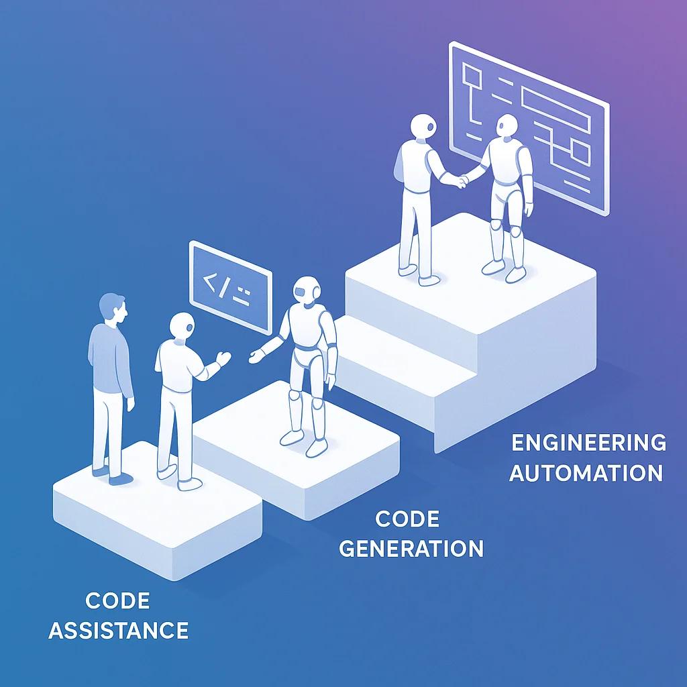
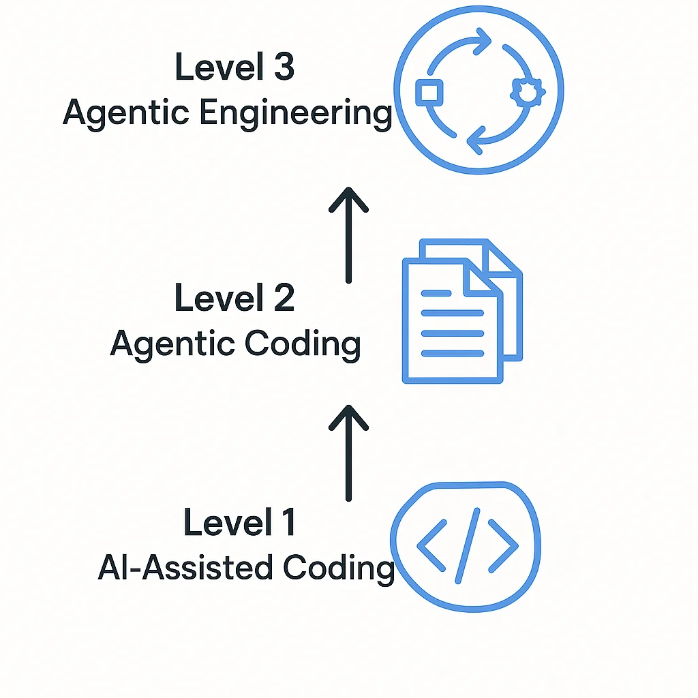

# From Code Assist to Agentic Engineering: Your Complete Guide

We're drowning in AI hype. Every day brings new tools, new capabilities, new promises about how AI will transform software development. Everyone's playing with ChatGPT, GitHub Copilot, or Claude. But here's what nobody's really talking about: **the different ways you can leverage AI in your workflow, and which approach gives you the most leverage**.

If you're using AI to fix a tricky loop in your code, that's great. But you're leaving 90% of the value on the table.

Let me show you the three levels of AI integration in software development, and why the highest level—Agentic Engineering—is where the real productivity revolution happens.



## Understanding the AI Development Stack

Think of AI integration as a maturity model. Each level builds on the previous one, offering exponentially more leverage. Most developers are stuck at Level 1, some have discovered Level 2, but Level 3 is where things get truly transformative.

Let's walk through each level.

## Level 1: AI-Assisted Coding (Pair Programming with AI)

This is where most developers start, and it's probably familiar to you.

**What it looks like:**
- You're working on a specific file or function
- You hit a problem—maybe a tricky loop, a bug you can't quite solve, or a refactoring challenge
- You copy-paste the code into ChatGPT or highlight it in your IDE
- The AI suggests improvements, rewrites, or fixes
- You review the suggestion and apply it manually

**The workflow:**
```
You write code → Get stuck → Ask AI → Review suggestion → Copy/paste fix → Continue
```

**Real example:** You're debugging a sorting algorithm that's not handling edge cases correctly. You paste it into ChatGPT with the error message, and it spots that you're not checking for null values. Problem solved.

**Strengths:**
- Better than endless Googling and Stack Overflow searches
- Quick feedback on specific problems
- Like having a knowledgeable pair programming partner available 24/7

**Limitations:**
- You're still doing all the heavy lifting
- You have to actively pull the AI into your workflow
- It's reactive, not proactive
- Context switching breaks your flow
- Limited to individual functions or small code sections

This is the **lowest level** of AI leverage in your workflow. It's helpful, but you can do so much more.

## Level 2: Agentic Coding (AI Handles Full Implementations)

Here's where things get interesting. Instead of asking AI to fix a single function, you step back and let it solve entire problems while you focus on review, feedback, and refinement.

**What it looks like:**
- You describe what you need at a higher level
- You let the AI run autonomously to implement it
- You review the output, request changes, and iterate
- The AI handles the implementation details

**The workflow:**
```
You describe the goal → AI implements → You review → Request changes → AI refines → Repeat until done
```

**Real example:** "Build me a Threads API client that can post updates and check my account status. Use TypeScript, handle rate limiting, and include proper error handling."

You describe the requirements, then let the AI write the entire client file. When it's done, you review it, maybe ask it to add retry logic or improve the error messages, and iterate until it's production-ready.

**Tools that enable this:**
- [Claude Code](https://claude.ai/code) - Longer context windows, better at understanding project structure
- [Cursor](https://cursor.sh/) - IDE built for AI-first development
- [Windsurf](https://codeium.com/windsurf) - Agentic coding in your existing IDE

**Strengths:**
- AI handles the tedious implementation work
- You focus on architecture and requirements
- Faster than writing everything yourself
- Great for building new features or components

**Limitations:**
- Context window management becomes critical
- You still need to be hands-on with the coding
- Your framing is still at the code level, not the engineering level
- Iteration can get tedious with large changes

This is the **middle level**—powerful, popular, and what most "AI-assisted development" content focuses on today. But there's one more level that changes everything.



## Level 3: Agentic Engineering (AI Automates Entire Workflows)

This is the paradigm shift. Instead of using AI to **write code**, you use AI to **automate engineering workflows**.

**The key insight:** Your framing changes from coding to engineering. You're no longer working at the code level—you're working at the system level.

### Understanding the Software Development Lifecycle

Let's simplify the typical engineering workflow:

1. **Plan** - Understand requirements, design approach
2. **Build** - Implement the solution
3. **Test** - Verify it works as expected
4. **Review** - Ensure it does what it's supposed to do (not just that it works)
5. **Document** - Explain what changed and why
6. **Ship** - Deploy to production

In traditional development, you do all of these manually. In Agentic Coding (Level 2), AI helps with #2 (Build). But in **Agentic Engineering**, AI handles the entire flow.

### How Agentic Engineering Works

You teach your AI assistant (Claude, in my case) how to perform each step of your engineering process through **workflows**. Here's how:

**1. Planning Agent**
- Analyzes the feature request or bug report
- Reviews relevant code and architecture
- Creates an implementation plan
- Documents edge cases and testing strategy

**2. Build Agent**
- Consumes the plan
- Implements the changes across multiple files
- Follows your coding standards and patterns
- Handles refactoring and dependencies

**3. Test Agent**
- Runs your test suite
- Validates the implementation works
- Checks for regressions
- Reports failures and fixes them

**4. Review Agent**
- Verifies the implementation matches the plan
- Checks code quality and best practices
- Ensures documentation is updated
- Validates the solution solves the original problem

**5. Ship Agent**
- Creates the pull request
- Generates release notes
- Tags reviewers
- Handles deployment steps

### A Real-World Example: GitHub Issues → Automated PRs

Here's the simplest, most powerful implementation of Agentic Engineering:

**The Setup:**
1. You have a GitHub repository with a webhook configured
2. When someone opens an issue (feature request or bug report), the webhook triggers a background Claude instance
3. Claude runs through the entire engineering workflow automatically

**The Flow:**
```
New GitHub Issue created
  ↓
Webhook triggers Claude
  ↓
Claude: Plan (researches codebase, designs solution)
  ↓
Claude: Build (implements the feature/fix)
  ↓
Claude: Test (runs test suite, fixes failures)
  ↓
Claude: Review (validates it solves the problem)
  ↓
Claude: Document (updates docs, writes clear commit messages)
  ↓
Claude: Ship (creates PR, tags reviewers)
  ↓
You: Review the PR, merge or request changes
```

**What this means in practice:**

You wake up to 10 GitHub issues. Instead of spending your day implementing each one, you come back later to 10 pull requests with:
- Complete implementations
- Passing tests
- Updated documentation
- Clear explanations of changes
- Evidence that the solution works

If you don't like something, you're not stuck. Everything's on a branch. You can:
- Request changes and let the AI iterate
- Jump in and tweak specific parts yourself
- Close the PR and handle it manually

**But your first draft is already done.**

### Implementing Agentic Engineering Workflows

The magic happens when you package your engineering experience into reusable workflows. Here's how:

**Using Slash Commands** (simple approach):
```
/plan-feature <description>
/implement <plan-file>
/run-tests
/review-changes
/document-changes
/create-pr
```

Each command encapsulates a step in your process. You teach Claude once how to do each step well, then chain them together.

**Using Custom Agents** (advanced approach):
Create specialized agents that handle specific parts of your workflow:
- A planning agent that understands your architecture
- A testing agent that knows your test frameworks
- A review agent that enforces your code standards

**Using CI/CD Integration** (automated approach):
Set up GitHub Actions or webhooks that trigger Claude to run these workflows automatically when certain events happen (new issues, PR comments, schedule triggers).

## The Real Power: Building the System That Builds Your Product

Here's what Agentic Engineering really unlocks: **You can build the system that builds your product.**

Need to implement 10 features? Create 10 GitHub issues and come back to 10 PRs.

Found 20 bugs in your backlog? Let your Agentic Engineering system work through them while you focus on architecture decisions.

Want to refactor your entire API layer? Break it into issues and let the automation handle the tedious work.

**The leverage is extraordinary.** You're no longer trading your time 1:1 for implementation work. You're multiplying your output by teaching AI systems to execute your engineering workflows.

## Getting Started with Agentic Engineering

Ready to level up? Here's how to start:

### 1. Start Small
Pick one workflow in your process that's repetitive and well-defined:
- Running your test suite and fixing common failures
- Updating documentation when code changes
- Creating pull requests with standardized formats

Automate that first.

### 2. Document Your Process
Write down your engineering workflows:
- How do you plan a feature?
- What's your code review checklist?
- How do you write good commit messages?

These become the templates for your AI workflows.

### 3. Use Tools That Support Agentic Workflows
- **Claude Code** with custom slash commands and hooks
- **GitHub Actions** for webhook-triggered automation
- **CI/CD pipelines** that can invoke AI agents

### 4. Iterate and Improve
Your first automated workflows won't be perfect. That's okay. Refine them over time, just like you would any code:
- Monitor what works and what doesn't
- Add more sophisticated error handling
- Expand to cover more of your workflow

### 5. Think in Systems
The goal isn't to automate one task. It's to build a **system** that handles entire categories of work:
- All bug fixes that match a pattern
- All documentation updates
- All routine refactoring tasks

## The Paradigm Shift: From Software Engineering to Agentic Engineering

We're witnessing a fundamental shift in how software gets built. The question isn't "Can AI write code?" (it can). The question is "How do we architect systems where AI handles entire engineering workflows?"

**Software Engineering:** You write the code.
**Agentic Coding:** AI writes the code, you review.
**Agentic Engineering:** AI executes the workflow, you architect the system.

The developers who master Agentic Engineering won't just be more productive. They'll be operating at a fundamentally different level—building systems that build products while they focus on strategy, architecture, and solving the next problem.

## Key Takeaways

1. **Level 1 (AI-Assisted Coding)** is helpful but limits you to reactive, function-level improvements
2. **Level 2 (Agentic Coding)** lets AI handle full implementations while you review and iterate
3. **Level 3 (Agentic Engineering)** automates entire engineering workflows, not just coding
4. **The real leverage** comes from packaging your experience as workflows that AI can execute
5. **Start small** - automate one workflow, then expand to build the system that builds your product

The AI revolution in software development isn't about AI writing better code than you. It's about **you building systems that automate engineering workflows**, freeing you to solve bigger problems while the system handles execution.

That's Agentic Engineering. And it's the leverage point we should all be thinking about.

---

**Ready to level up your AI-powered development?** Start by identifying one repetitive workflow in your process and automate it. The journey from Level 1 to Agentic Engineering begins with a single slash command.
