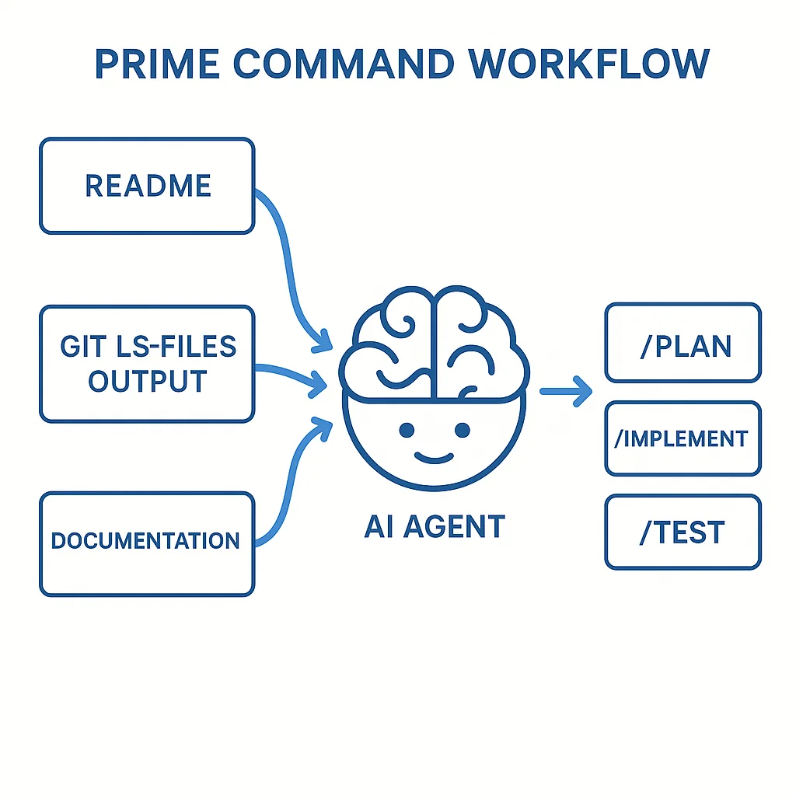

Agentic engineering at its core is about **packaging your experience**. But what does that really mean?

Think about it: when you hire a new software engineer, you don't immediately hand them a critical feature and expect magic. You onboard them. You teach them about your codebase, your architecture, your patterns, your team's preferences.

**AI agents need the exact same treatment.**

## The Empathy Gap in AI Development

Here's the uncomfortable truth: when you open a new Claude Code session, the agent knows absolutely nothing about your codebase. Zero. Zilch.

It doesn't know:
- Your project structure
- Your architectural decisions
- Your naming conventions
- Your preferred patterns
- Your business requirements

**And yet, we expect it to just "figure things out."**

This is where most developers struggle with AI coding tools. They get frustrated when the agent makes poor decisions or suggests irrelevant solutions. But the problem isn't the agent—it's the **packaging**.

## What Is Context Engineering?

Context engineering is the practice of deliberately and systematically loading the right information into your AI agent so it can work effectively.

This isn't about dumping your entire codebase into the context window. That's wasteful and ineffective. Instead, it's about **curating** the essential knowledge an agent needs to be productive.

Think of it as writing the perfect onboarding documentation—but for an AI that will read it every single time.

## The `/prime` Command: Your Agent's Onboarding Script

The most fundamental command you'll create for any codebase is what I call the **`/prime`** command (some prefer `/context`, `/load`, or `/learn`).

This command serves as your agent's onboarding checklist. Every time you start a new session, you run `/prime`, and suddenly your agent is ready to work.

### Creating Your First Prime Command

In Claude Code, custom commands live in `.claude/commands/`. Let's create `prime.md`:

```markdown
# Prime Context

List all git-tracked files using `git ls-files` and read the README to understand the project structure and features.

Read the README and anything in the docs directory that would be relevant for an overview.
```

**That's it.** Save the file, restart Claude Code, and you now have a `/prime` command.

### What Should Your Prime Command Include?

Here's what I recommend every `/prime` command should do:

#### 1. **List Your Project Structure**

```bash
git ls-files
```

This gives the agent a complete map of your codebase. Even if it doesn't read every file, it understands:
- What directories exist
- How your project is organized
- What frameworks and tools you're using (based on config files)

Good naming conventions pay dividends here. If you have directories like `components/`, `lib/`, `tests/`, the agent immediately understands your architecture.

#### 2. **Read Core Documentation**

```markdown
Read the README and anything in the docs directory that would be relevant for an overview.
```

Your README and docs are your first line of defense against context gaps. Make sure they exist and are up-to-date.

#### 3. **Read Architecture Documentation**

If you have files like:
- `docs/architecture.md`
- `CONTRIBUTING.md`
- `DEVELOPMENT.md`

Tell your agent to read them. These documents contain the "why" behind your code—something that's invisible from reading source files alone.

#### 4. **Understand Key Configuration Files**

Depending on your project, you might want to explicitly read:
- `package.json` / `pyproject.toml` (dependencies)
- `tsconfig.json` / `.eslintrc` (tooling config)
- `.env.example` (available environment variables)

## The Compound Effect of Good Packaging

Here's where it gets powerful.

Once you have a reliable `/prime` command, you can build on top of it. Now you can create:

- **`/plan`** - Generate a detailed implementation spec
- **`/implement`** - Build the feature
- **`/test`** - Write and run tests
- **`/review`** - Code review checklist
- **`/document`** - Generate documentation

Each of these commands assumes the agent already knows your codebase because you've run `/prime`.

### Example: A `/plan` Command

```markdown
# Plan a Feature

First, run `/prime` if you haven't already.

Then, based on the user's request:
1. Analyze the existing codebase to find related code
2. Identify what files need to be created or modified
3. Outline the implementation steps
4. Note any potential gotchas or dependencies
5. Provide a testing strategy
```

See how this builds on `/prime`? It doesn't need to rediscover your codebase—it already knows it.



## The New Engineer Mindset

The key mental shift is this: **treat your agent like a talented but completely inexperienced engineer**.

They're smart. They can write excellent code. But they need context.

When your agent produces a bad plan, don't blame the agent. Ask yourself:

> "What context did I fail to provide?"

This mindset shift changes everything. Instead of fighting the tool, you start improving your packaging.

## Iterative Improvement

Your first `/prime` command won't be perfect. That's okay.

Here's the loop:
1. Run `/prime`
2. Ask your agent to do something
3. Notice what it gets wrong
4. Identify the missing context
5. Update `/prime` to include that context
6. Repeat

Over time, your `/prime` command becomes incredibly refined. You'll find that new sessions become productive immediately.

## Real-World Example: This Blog

Let me show you a real example. Here's the `/prime` command for The Agentic Engineer blog:

```markdown
# Prime Context

List all git-tracked files using `git ls-files` and read the README
to understand the project structure and features.

Read the README and anything in the docs directory that would be
relevant for an overview.
```

When I run this:
1. Claude sees the full file tree (100+ files)
2. It reads the comprehensive README with quickstart, workflows, and architecture
3. It reads `docs/architecture.md` with detailed system design
4. It reads `blog-config.yaml` to understand configuration

In under 30 seconds, Claude understands:
- This is a Next.js 15 blog
- Content is in MDX format
- Images are in WebP stored in `public/blog/`
- There are 7 hardcoded categories
- Posts are published on Mondays
- Quality checks include SEO and Vale linting

**All without me explaining anything.**

## Advanced: Stitching Commands Together

Once you have strong individual commands, you can combine them into workflows.

For example, my `/create-quality-review` command:
1. Gets the next available publish date
2. Runs `/create-post` with the user's idea
3. Generates images with DALL-E
4. Runs `/mdx-quality-review` for SEO + prose linting
5. Fixes any issues automatically
6. Reminds me to commit and push

This is **workflow automation built on top of packaged expertise**.

## Why This Matters

The developers who master agentic engineering aren't the ones with the best AI tools.

They're the ones who are best at **packaging their expertise**.

When you can effectively teach an agent about your codebase, you unlock:
- ✅ **Faster iteration** - No ramp-up time per session
- ✅ **Better code quality** - Agents make decisions aligned with your architecture
- ✅ **Workflow automation** - Compose commands into powerful pipelines
- ✅ **Knowledge transfer** - Your documentation benefits human developers too

## Getting Started Today

Here's your action plan:

1. **Create `.claude/commands/prime.md`** in your project
2. **Start simple** - Just read README and list files
3. **Run it and test** - Ask your agent to explain your project
4. **Iterate** - Notice gaps and add more context
5. **Build on it** - Create `/plan`, `/implement`, etc.

The key is to start. Your first `/prime` command will be basic. That's fine. You'll improve it every time you use it.

## The Bottom Line

Agentic engineering is about **empathy**.

Empathy for the AI agent that knows nothing about your codebase.

Empathy for your future self who will need to onboard that agent again tomorrow.

Empathy for your teammates who will benefit from the documentation you create in the process.

Start thinking of AI agents as junior engineers who need onboarding. Package your expertise. Create your `/prime` command.

**Your future self will thank you.**
