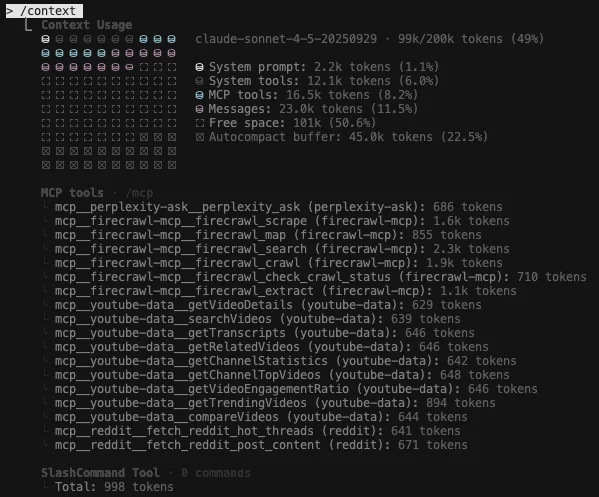
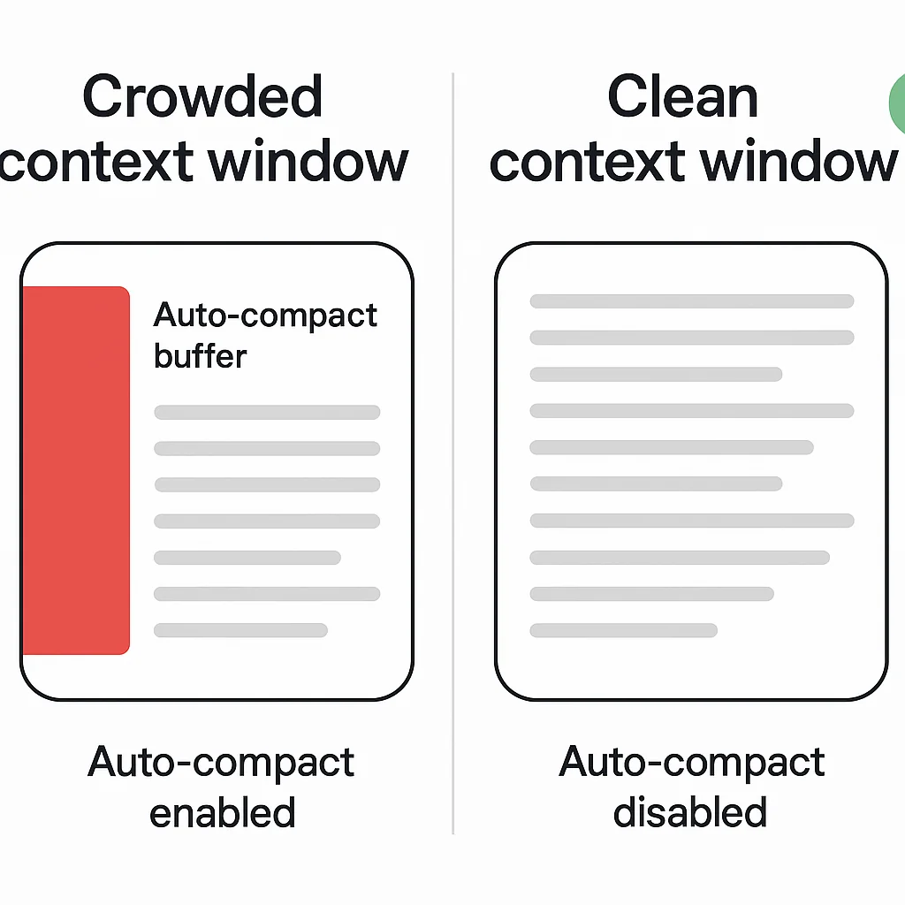

You're deep in a Claude session. Code is flowing. Then you see it: **"compacting..."**

Your stomach drops, because you know what comes next. Vaguer answers. Missed details. The coding partner that felt sharp ten minutes ago suddenly feels lobotomized.

It isn't your imagination. It's a real constraint baked into how these tools work, and the gap between developers who fight it and developers who design around it is enormous.

## The hidden cost of auto-compact

Try a quick experiment. Open a fresh Claude Code session and run:

```bash
/prime          # Load your codebase context
/context        # Check context window usage
```

You'll see something like this:



Look at the auto-compact buffer. **It's eating 22.5% of your available context window.** That's 45,000 tokens out of 200,000, gone before you've typed a single instruction.

### What auto-compact actually does

Auto-compact is Claude's safety mechanism. As your conversation history approaches the context limit, Claude automatically:

1. Compresses older messages into summaries
2. Drops details it deems less relevant
3. Keeps the conversation going past what would otherwise be a hard limit

For casual chat, fine. For agentic coding workflows, it's a silent performance tax.

## Why context loss makes AI "dumber"

Every compact event loses information. And not random information. It loses the **precise technical details** that mattered most:

- Variable names get generalized to "the variable"
- Specific error messages become "some errors occurred"
- Architecture decisions fade into "we discussed this earlier"
- Code patterns you established get forgotten

The more compacts you stack, the vaguer everything becomes. That's why long coding sessions feel like they decay. **You're literally watching the AI forget.**

## The traditional flow: fighting the context window

Most developers work in a long, continuous loop:

```
Start session → Code → Code → Code → Compact → Code (worse) → Compact → Code (even worse)
```

This "in-the-loop developer flow" is typical of agentic coding. You build context, ask questions, make changes, all inside one session.

The problem? You're trapped in one context window that keeps degrading.

## The agentic engineering solution: workflow composition

The shift is simple. Stop trying to do everything in one session.

Instead of fighting the context window, design workflows that **externalize state** and compose cleanly:

```
/prime → /plan → save plan.md → /clear
/implement plan.md → save code → /clear
/test plan.md → save results → /clear
/review plan.md → save feedback → /clear
/document plan.md code/ → save docs
```

Each workflow:
- Starts fresh with maximum context available
- Reads its inputs from files (plan, code, specs)
- Writes its outputs to files (code, tests, docs)
- Never compacts because it finishes before hitting limits

### The power of file-based state

Instead of leaning on conversation history, you lean on **artifacts**:

- Plan files capture decisions and architecture
- Code files are the source of truth
- Test results document what works
- Review comments track quality checks

Each new Claude session reads these artifacts and has full context of what matters, with none of the accumulated noise from every conversational back-and-forth.

## Turning off auto-compact

If you're designing standalone workflows, that 22.5% buffer is dead weight:

1. Open Claude Code settings
2. Find the **Auto-Compact** toggle
3. Turn it off

Run `/context` again:



You just got back 45,000 tokens. Over a fifth of your total context window.

### When to use this setting

Turn OFF auto-compact when:
- You're building standalone workflow commands
- Each task has a clear output artifact
- You're okay with sessions ending when context is full

Keep auto-compact ON when:
- You're doing exploratory coding with no clear endpoint
- You're in a long conversational debugging session
- You need the session to continue indefinitely

## Designing context-efficient workflows

A few patterns make this work in practice.

### 1. One job per session

Don't ask Claude to plan, implement, test, and document in one go. Each of those is a separate workflow:

```bash
# Planning session
/prime
/plan "Add user authentication"
# Outputs: plan.md

# Implementation session
/clear  # Start fresh!
/implement plan.md
# Outputs: code changes

# Testing session
/clear
/test plan.md
# Outputs: test results
```

### 2. Push context to files

Every workflow should produce an artifact:

```markdown
## plan.md
- Add JWT authentication
- Use bcrypt for password hashing
- Implement rate limiting
- Add password reset flow
```

Your next session reads `plan.md` and has perfect context without conversational drift.

### 3. Compose workflows like functions

Think of each workflow as a pure function:

```
plan(requirements) → plan.md
implement(plan.md) → code/
test(plan.md, code/) → results.md
review(plan.md, code/) → feedback.md
document(plan.md, code/) → docs/
```

Each function has clear inputs (files), produces clear outputs (files), and doesn't depend on previous conversation state.

## Real-world example: my blog workflow

I use this pattern for generating blog posts:

```bash
# One workflow: Create post
/create-post "Context window management"
# Outputs:
# - website/content/posts/2025-11-03-context-windows.mdx
# - website/public/blog/2025-11-03-context-windows/hero.webp

# Separate workflow: Quality review
/clear
/mdx-quality-review website/content/posts/2025-11-03-context-windows.mdx
# Outputs: SEO report, Vale linting results

# Separate workflow: Git deployment
git add .
git commit -m "Add post about context management"
git push
```

Each slash command is a standalone workflow. They don't share conversation state. They read from and write to files.

The result? Every workflow runs with maximum context and intelligence.

## The memory constraint reality

The honest truth: AI tools are incredibly intelligent, but their memories are very limiting.

No matter how smart Claude gets, it's still bound by:
- 200K token context windows (for now)
- Information loss during compaction
- Degraded quality over long sessions

We can't change those constraints yet. We can design around them.

## Key takeaways

1. Auto-compact costs you 22.5% of your context window before you start
2. Every compact loses information and makes responses vaguer
3. Long sessions degrade because the AI is literally forgetting details
4. File-based workflows let you compose clean, standalone tasks
5. Turning off auto-compact gives you more power per session, but requires workflow discipline

## Quick tips for context management

- Use `/context` regularly to check your usage
- Turn off auto-compact for workflow-based coding
- Start new sessions for each major task
- Push important decisions to plan files
- Let workflows read files instead of relying on conversation history
- Think of Claude sessions as stateless functions

## The future

One day, AI tools might have perfect context management. Infinite windows. Zero information loss.

Until that day, design your workflows around the constraints.

The developers who understand context windows aren't fighting their tools. They're architecting workflows that maximize every available token.

---

*Did this help you rethink your AI coding workflow? Let me know what context management tricks you've discovered.*
