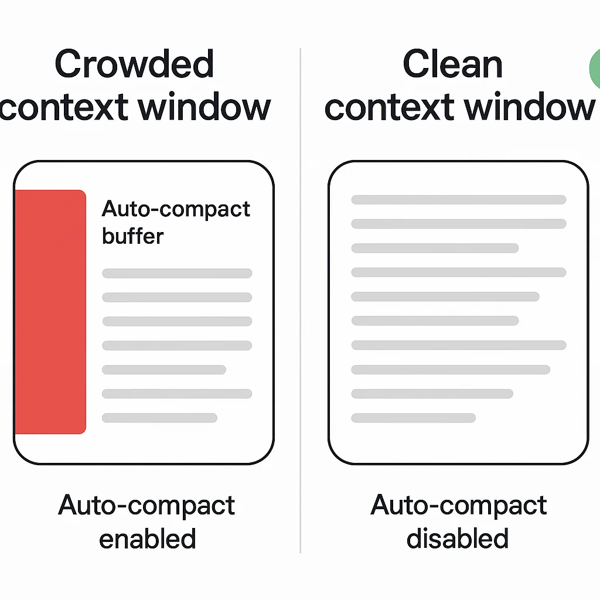

Have you ever been deep in a coding session with Claude, everything flowing perfectly, when suddenly you see that dreaded message: **"compacting..."**?

Your heart sinks. You know what's coming next. The quality drops. The responses get vaguer. What was once a brilliant coding partner just got noticeably... dumber.

This isn't your imagination. It's a fundamental constraint of AI coding tools, and understanding it is the difference between fighting your tools and designing workflows that actually work.

## The Hidden Cost of Auto-Compact

Let's run a quick experiment. Start a fresh Claude Code session and run these commands:

```bash
/prime          # Load your codebase context
/context        # Check context window usage
```

Here's what you'll see:


Notice anything alarming? **The auto-compact buffer is consuming 22.5% of your available context window** — that's 45,000 tokens out of 200,000 — before you've even started coding.

### What Is Auto-Compact?

Auto-compact is Claude's safety mechanism. When your conversation history approaches the context limit, Claude automatically:

1. **Compresses older messages** into summaries
2. **Discards details** it deems less relevant
3. **Continues the conversation** without hitting a hard limit

This sounds great for interactive chat sessions. But for agentic coding workflows? It's a silent performance killer.

## Why Context Loss Makes AI "Dumber"

Every time Claude compacts, you lose information. Not just any information — often the **precise technical details** that matter most:

- **Variable names** get generalized to "the variable"
- **Specific error messages** become "some errors occurred"
- **Architecture decisions** fade into "we discussed this earlier"
- **Code patterns** you established get forgotten

The more you compact, the vaguer everything becomes. This is why long coding sessions feel like they degrade over time. **You're literally watching the AI forget.**

## The Traditional Flow: Fighting the Context Window

Most developers use AI tools in a continuous, linear flow:

```
Start session → Code → Code → Code → Compact → Code (worse) → Compact → Code (even worse)
```

This "in-the-loop developer flow" is typical of agentic coding. You're constantly building context, asking questions, making changes, all within a single session.

**The problem:** You're trapped in one context window that keeps degrading.

## The Agentic Engineering Solution: Workflow Composition

Here's the shift: **Stop trying to do everything in one session.**

Instead of fighting the context window, design workflows that **externalize state** and **compose cleanly**:

```
/prime → /plan → save plan.md → /clear
/implement plan.md → save code → /clear
/test plan.md → save results → /clear
/review plan.md → save feedback → /clear
/document plan.md code/ → save docs
```

Each workflow:
- ✅ **Starts fresh** with maximum context available
- ✅ **Reads its inputs** from files (plan, code, specs)
- ✅ **Writes its outputs** to files (code, tests, docs)
- ✅ **Never compacts** because it finishes before hitting limits

### The Power of File-Based State

Instead of relying on conversation history, you rely on **artifacts**:

- **Plan files** capture decisions and architecture
- **Code files** are the source of truth
- **Test results** document what works
- **Review comments** track quality checks

Each new Claude session reads these artifacts and has **full context** of what matters, without the accumulated noise of every conversational back-and-forth.

## Turning Off Auto-Compact

If you're designing standalone workflows, you don't want that 22.5% buffer eating your context:

1. Open Claude Code settings
2. Find the **Auto-Compact** toggle
3. **Turn it off**

Now check your context again with `/context`:



You just gained back **45,000 tokens** — over a fifth of your total context window.

### When to Use This Setting

**Turn OFF auto-compact when:**
- Building standalone workflow commands
- Each task has a clear output artifact
- You're okay with sessions ending when context is full

**Keep auto-compact ON when:**
- Doing exploratory coding with no clear endpoint
- Having long conversational debugging sessions
- You need the session to continue indefinitely

## Designing Context-Efficient Workflows

Here's how to structure your workflows for maximum AI intelligence:

### 1. **One Job Per Session**

Don't ask Claude to plan, implement, test, and document in one go. Each of these is a separate workflow:

```bash
# Planning session
/prime
/plan "Add user authentication"
# Outputs: plan.md

# Implementation session
/clear  # Start fresh!
/implement plan.md
# Outputs: code changes

# Testing session
/clear
/test plan.md
# Outputs: test results
```

### 2. **Push Context to Files**

Every workflow should produce an artifact:

```markdown
## plan.md
- Add JWT authentication
- Use bcrypt for password hashing
- Implement rate limiting
- Add password reset flow
```

Now your next session can read `plan.md` and has **perfect context** without conversational drift.

### 3. **Compose Workflows Like Functions**

Think of each workflow as a pure function:

```
plan(requirements) → plan.md
implement(plan.md) → code/
test(plan.md, code/) → results.md
review(plan.md, code/) → feedback.md
document(plan.md, code/) → docs/
```

Each function:
- Has clear inputs (files)
- Produces clear outputs (files)
- Doesn't depend on previous conversation state

## Real-World Example: My Blog Workflow

I use this pattern for generating blog posts:

```bash
# One workflow: Create post
/create-post "Context window management"
# Outputs:
# - website/content/posts/2025-11-03-context-windows.mdx
# - website/public/blog/2025-11-03-context-windows/hero.webp

# Separate workflow: Quality review
/clear
/mdx-quality-review website/content/posts/2025-11-03-context-windows.mdx
# Outputs: SEO report, Vale linting results

# Separate workflow: Git deployment
git add .
git commit -m "Add post about context management"
git push
```

Each slash command is a **standalone workflow**. They don't share conversation state. They read from and write to files.

Result? **Every workflow runs with maximum context and intelligence.**

## The Memory Constraint Reality

Here's the truth: **AI tools are incredibly intelligent, but their memories are very limiting.**

No matter how smart Claude gets, it's still bound by:
- **200K token context windows** (for now)
- **Information loss during compaction**
- **Degraded quality over long sessions**

We can't change these constraints (yet). But we can **design around them**.

## Key Takeaways

1. **Auto-compact costs you 22.5% of your context window** before you start
2. **Every compact loses information** and makes responses vaguer
3. **Long sessions degrade** because the AI is literally forgetting details
4. **File-based workflows** let you compose clean, standalone tasks
5. **Turning off auto-compact** gives you more power per session, but requires workflow discipline

## Quick Tips for Context Management

- ✅ Use `/context` regularly to check your usage
- ✅ Turn off auto-compact for workflow-based coding
- ✅ Start new sessions for each major task
- ✅ Push important decisions to plan files
- ✅ Let workflows read files instead of relying on conversation history
- ✅ Think of Claude sessions as stateless functions

## The Future

One day, AI tools might have perfect context management. Infinite windows. Zero information loss.

Until that day, **design your workflows around the constraints.**

The developers who understand context windows aren't fighting their tools — they're architecting workflows that maximize every available token.

---

*Did this help you rethink your AI coding workflow? Let me know what context management tricks you've discovered.*
