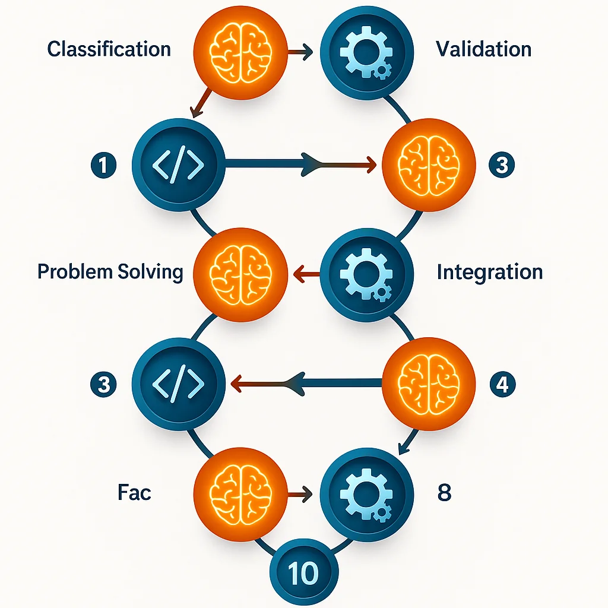

We've been talking about Agentic Engineering on this blog for a while. It's time to dig into a deeper truth, one that fundamentally changes how we think about what Agentic Engineering actually *is*.

## The initial pitch: SDLC automation

When I first introduced Agentic Engineering, I pitched it as **packaging your engineering workflows**. I equated this to the software development lifecycle. You know the flow: plan, build, test, review, document, ship.

That made sense. It was a comfortable frame of reference for developers.

Then something interesting happened.

## The plot twist: this blog post

When you look at my real-world examples of Agentic Engineering in action, they're not actually about the software development lifecycle at all.

They're about **creating the blog posts you're reading right here**.

Think about that for a second:
- `/create-post` is not part of the SDLC
- `/review-content` is not part of the SDLC
- Automated image generation? Not SDLC.
- Transcribing voice notes into structured content? Definitely not SDLC.

This is the piece of information that changes everything.

## The core truth: packaging any workflow

At its most fundamental level, **Agentic Engineering is about packaging workflows**. Any workflow at all.

It doesn't have to be software development. It can be:
- Creating blog posts
- Generating podcasts
- Processing customer support tickets
- Creating marketing content
- Financial analysis and reporting
- Data pipeline orchestration

Any workflow you can imagine.

But here's the crucial distinction: **it's not just any workflow automation**.

## The leverage point: code + intelligence

The biggest difference, and the true leverage point of Agentic Engineering, is this:

**Agentic Engineering combines code and thought.**

What does that mean in practice?

### Traditional automation: pure logic

We've always been able to automate with code and logic:
- "Do this with this"
- "If X, then Y"
- "Loop through this list and transform each item"

It's deterministic. It's predictable. It's powerful, but limited.

### Agentic automation: logic + intelligence

Now we can **bring intelligence into our scripting**.

Take my `/create-post` workflow as an example of how code and intelligence work together:

**Intelligence phase:**
1. Classification: the AI analyzes my transcription and figures out what type of blog post this should be based on blogging best practices
2. Restructuring: it takes my spoken words and rearranges them into the most appropriate format for written content
3. Content generation: it fills in gaps, adds structure, and creates a cohesive narrative

**Code phase:**
4. Validation: a Python script runs SEO checks against specific rules
5. Reporting: the script outputs structured feedback about issues

**Intelligence phase (again):**
6. Problem solving: the AI reads the validation output and fixes the issues intelligently
7. Image generation: it crafts prompts and calls OpenAI's image models (DALL-E, GPT-Image, etc.)

**Code phase (again):**
8. Integration: scripts validate that all images are in the correct format
9. File system operations: code ensures all content is created in the right locations
10. Format validation: scripts check that frontmatter, structure, and references are correct

This back-and-forth dance between **deterministic code** and **intelligent reasoning** is what makes Agentic Engineering so powerful.

## Building the system that builds the system

Here's the critical insight: **I'm not using AI to make one blog post. I'm using AI to understand and template the flows of producing steps that can be chained together to create any blog post.**

That's what I mean by "building the system that builds the system."

Once you've packaged a workflow:
- The next time you need it, it executes automatically
- You can compose workflows together
- You can evolve and improve them over time
- You can apply the same pattern to entirely different domains

## The power of composition: going beyond blogging

Take this further. Right now, I have a workflow that takes my voice transcription and creates a blog post.

But I could totally build parallel workflows from the same input:

### Podcast workflow (hypothetical)
1. Take the same transcription
2. **Intelligence**: analyze the narrative structure and identify what podcast format fits best (interview style, narrative, educational, etc.)
3. **Intelligence**: rewrite the content specifically for audio consumption (different pacing, more conversational, better transitions)
4. **Code**: hook into ElevenLabs API
5. **Intelligence**: maybe train a voice model on my own voice
6. **Code**: generate the audio podcast file
7. **Intelligence**: create show notes and chapter markers
8. **Code**: validate file format, length, and quality

### Video workflow (another hypothetical)
1. Same transcription input
2. **Intelligence**: break content into visual segments
3. **Intelligence**: generate image prompts for each segment
4. **Code**: batch generate images via DALL-E
5. **Intelligence**: create animation scripts
6. **Code**: hook into video generation tools
7. **Code**: compile everything into a final video

All from the same narrated input. All using the same pattern: **intelligence and code, working together**.

## The compound effect

Once these workflows are built, the next time you narrate something:
- It becomes a blog post automatically
- It becomes a podcast automatically
- It becomes a video automatically
- It gets distributed across platforms automatically
- It gets optimized for SEO automatically

**You do more and more with less and less effort.**

That's the power of building the system that builds the system.

## Why this matters

Agentic Engineering represents a fundamental shift in how we think about automation.

Before: automation was limited to tasks we could fully specify with logic.

After: automation can handle tasks that require judgment, creativity, and context-awareness, as long as we package them as repeatable workflows.

What that means in practice:
- Writers can automate content production pipelines
- Designers can automate asset generation workflows
- Analysts can automate insight discovery processes
- Marketers can automate campaign creation flows
- Engineers can still automate SDLC processes (of course)

The key is recognizing that **any workflow is fair game**, as long as you can break it down into a combination of:
1. Things that require intelligence (classification, generation, problem-solving)
2. Things that require deterministic code (validation, transformation, integration)

## Getting started with your own workflows

If you want to start practicing Agentic Engineering:

1. Identify a workflow you repeat frequently (doesn't have to be code-related)
2. Break it into steps (which steps need intelligence? which need deterministic logic?)
3. Package it (create slash commands, hooks, or scripts)
4. Compose workflows together (let outputs become inputs)
5. Iterate and improve (your workflows get better over time)

The barrier to entry has never been lower. Tools like Claude Code, ChatGPT's custom GPTs, and GitHub Copilot Workspaces all support this style of work.

## Final thoughts

Agentic Engineering isn't just about the software development lifecycle. It's not even just about software.

**It's about packaging workflow expertise, any workflow, by combining code and intelligence.**

It doesn't matter if your workflow is:
- Shipping code
- Writing blogs
- Creating podcasts
- Analyzing financial data
- Processing customer support tickets

The pattern is the same: **build the system that builds the system**.

Once you see this truth, you can't unsee it. Suddenly, automation possibilities are everywhere.

What workflows will you package first?
