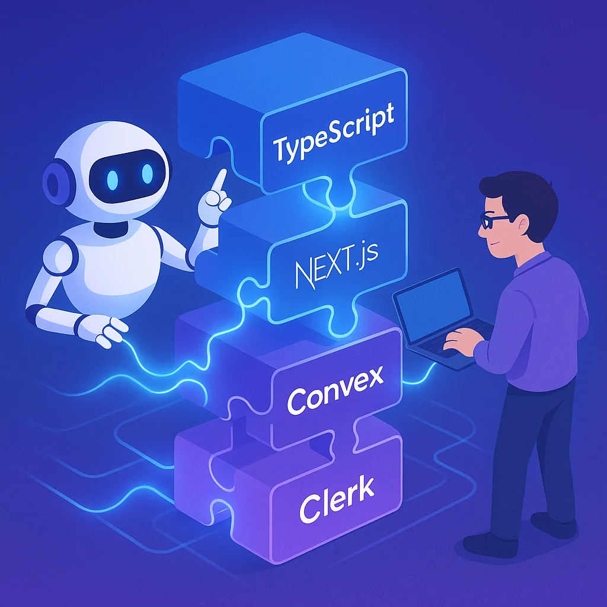
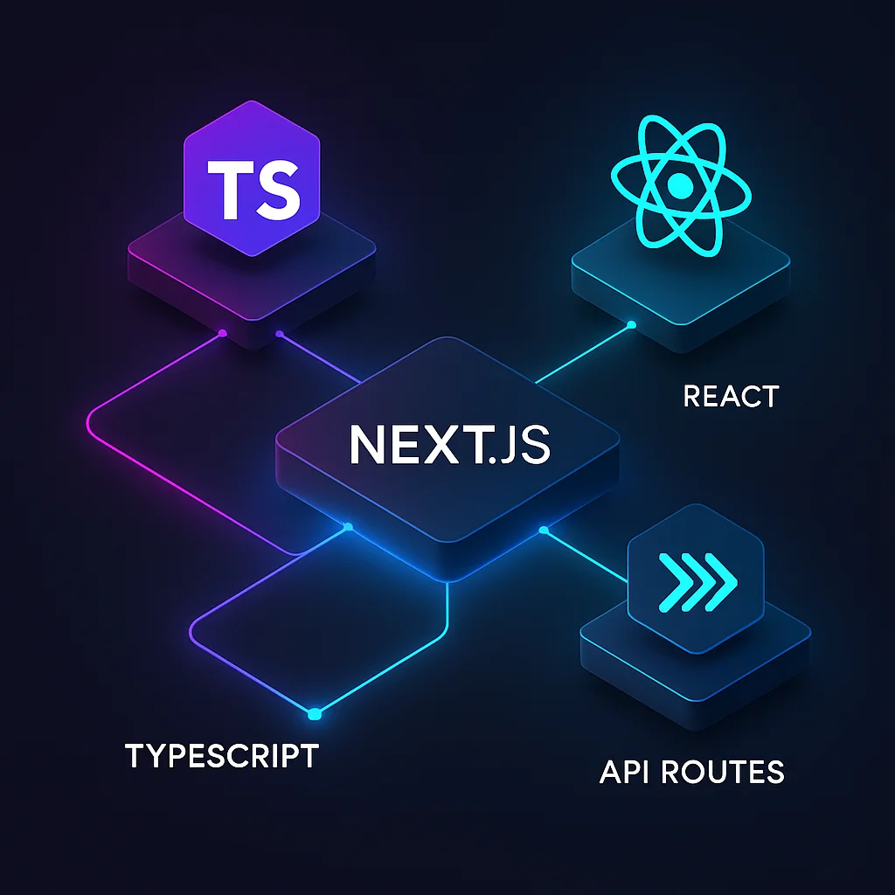
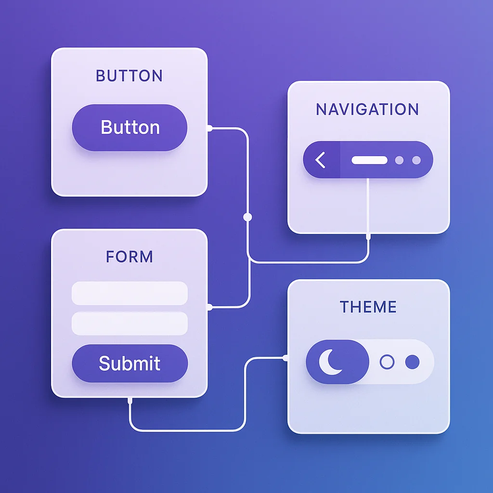

Everyone has their favorite tech stack. But what actually makes a stack *powerful* for working with AI agents? After six months of experimenting with various open source technologies, lock-in considerations, and agentic workflows, my opinions have shifted dramatically.

This is absolutely an opinion piece. Every developer has different preferences. But there are principles here about what makes us effective in agent-assisted coding that transcend personal taste.



## The Core Principle: One Language, End-to-End Types

Language choice is personal. Python, JavaScript, TypeScript, Go - they all have merits. But here's what changed my thinking: **using one language across your entire stack is incredibly powerful for agentic workflows**.

When you use TypeScript for frontend, APIs, database access, and business logic, you get something magical:

- **Single context for language standards** - Your AI agent learns the patterns once
- **One type-checking command** - `tsc` validates your entire codebase from UI to database
- **Type safety across boundaries** - No mystery conversions between layers
- **Agent validation built-in** - Just like types help us, they help AI verify correctness

I can't overstate the productivity gain. When working with AI, having a single command validate types from UI to API to data storage is transformative. It validates functionality at levels you don't expect.

While I used to have strong preferences for different languages at different layers, I've completely shifted to favoring **one language for the full stack**. The typing process alone justifies this choice.

## What Are We Optimizing For?

Most applications today are either mobile or web. I'm optimizing for **web-first SaaS platforms**. Why?

- **Fastest iteration cycle** - Create quickly, deploy cheaply, iterate constantly
- **Proven business model** - Subscription-based, globally accessible
- **Best AI agent support** - LLMs know web frameworks inside and out

Mobile development has code-sharing challenges we haven't fully polished as an industry. Web development with modern frameworks is mature, well-understood, and perfect for agentic workflows.

## The Stack: TypeScript + Next.js + Convex + Clerk

Let me break down each piece and why it matters for AI-assisted development.

### Next.js: The Web Foundation



For web development, Next.js is exceptional:

- **Built-in SEO capabilities** - Server-side rendering, static generation, metadata API
- **Excellent AI agent knowledge** - LLMs know Next.js intimately, no teaching required
- **Rich ecosystem** - shadcn/ui, Tailwind CSS, beautiful templates with minimal work
- **First-class MDX support** - Perfect for blogs and content-heavy sites

Vue and other frameworks work too, but Next.js has the combination of features, community support, and AI familiarity that makes it stand out. When I ask an LLM to build React components with shadcn, it just works. No plugins, no research, no documentation lookups.

### Convex: Type-Safe Database Layer

Here's where it gets interesting. I experimented with Supabase, running my own Postgres, and various ORMs. Then I discovered Convex, and one feature sold me completely: **end-to-end type safety with Zod**.

```typescript
import { z } from "zod";
import { zodOutputToConvex, zCustomMutation } from "convex-helpers/server/zod";
import { defineTable, mutation } from "convex/server";

// Define your Zod schema
const purchaseSchema = z.object({
  userId: z.string(),
  amount: z.number(),
  timestamp: z.number(),
});

// Convert Zod schema to Convex table definition
export const purchases = defineTable({
  schema: zodOutputToConvex(purchaseSchema)
});

// Type-safe mutation using the same schema - no duplication!
export const createPurchase = zCustomMutation(mutation, {
  args: purchaseSchema.shape, // Reuse your schema definition
  handler: async (ctx, args) => {
    // Runtime validation + TypeScript types flow through entire stack
    return await ctx.db.insert("purchases", args);
  },
});
```

This means:
- **Zod schemas define your data models** - One source of truth
- **Types flow to your database layer** - Table definitions, queries, mutations
- **Types flow to your business logic** - All the way through your API
- **Types flow to your React components** - Complete type safety in your UI

A single typed model for your entire application. One command (`tsc`) type-checks everything. This is massive for AI-assisted development.

### Clerk: Authentication & Subscriptions Made Simple

If you've ever implemented authentication, you know it's a nightmare. OAuth flows, token management, session handling, multi-provider support - it's complex and error-prone.

Clerk changes everything:

**For Authentication:**
- **Pre-built Next.js components** - Beautiful sign-in/sign-up UI out of the box
- **Multi-provider wrapper** - Google, GitHub, Discord, email - all configured via toggles
- **Zero auth code in your app** - Clerk handles everything externally
- **Profile management built-in** - Connect/disconnect providers, manage devices

**For Subscriptions:**
- **Managed subscription infrastructure** - Clerk handles payment processing, billing, everything
- **Pre-built components** - Pricing tables, subscription management UI
- **Simple permissions API** - `has({ feature: 'dashboard_access' })` - that's it
- **No permissioning system to build** - It's built into your user flow

```tsx
'use client';
import { SignedIn, useAuth } from "@clerk/nextjs";

export default function Dashboard() {
  const { has } = useAuth();

  return (
    <SignedIn>
      {has({ feature: 'dashboard_access' }) ? (
        <DashboardContent />
      ) : (
        <p>Upgrade to access. <a href="/pricing">View Plans</a></p>
      )}
    </SignedIn>
  );
}
```

Your application code stays clean. You can be up and running with user login and subscriptions incredibly fast. This is exactly what we need for rapid iteration with AI agents.

### shadcn/ui + Tailwind: Beautiful UI, Zero Effort

The visual layer matters for SaaS products. shadcn/ui gives you:

- **Pre-built accessible components** - Buttons, forms, modals, navigation
- **Tailwind-based theming** - Consistent styling across your entire app
- **Clerk integration** - Even the auth components match your theme

You can spin up a gorgeous, professionally-styled application template incredibly fast and customize it to your brand. When you're working with AI agents, this speed matters. Less time building UI infrastructure means more time shipping features.



## The MCP Advantage: AI-Native Tooling

Here's where this stack becomes truly next-level for agentic workflows: **MCP (Model Context Protocol) integrations**.

### shadcn MCP
The shadcn MCP gives your AI agent:
- **Full access to all available components** - Searchable, documented
- **Built-in usage documentation** - How to use each component correctly
- **Integration guidance** - Preventing common mistakes when adding new components

This means your agent can build beautiful UIs without you teaching it anything about your component library.

### Convex MCP
The Convex MCP is game-changing:
- **Direct database access** - Query and inspect your data
- **Automated testing** - Verify data storage during development
- **Real-time validation** - "Create a new template and verify the stored data matches expectations"

You're not writing a database visibility layer. You're not forcing your LLM to construct SQL queries. It's built-in and clean.

### Setup is Dead Simple

Add both MCPs to your `.mcp.json` and restart `claude code` or use whichever agent you love best:

```json
{
  "mcpServers": {
    "shadcn": {
      "command": "npx",
      "args": ["mcp-remote", "https://www.shadcn.io/api/mcp", "--allow-http"]
    },
    "convex": {
      "command": "npx",
      "args": ["-y", "convex@latest", "mcp", "start"]
    }
  }
}
```

That's it. Your AI agent now has full access to your component library and database. No custom tooling, no complex integrations. Just two entries in a config file.

## Why This Stack Works: Principles Over Preferences

Let's look at what we've achieved:

**1. Small, Clean Codebase**
- `convex/` directory for backend logic
- `src/` or `app/` directory for Next.js frontend
- `package.json` for dependencies
- That's basically it

**2. Easy to Reason About**
- Everything is TypeScript
- Clear separation of concerns
- No magic, no hidden complexity

**3. Perfect for AI Context Windows**
- Small codebase fits easily in LLM context
- Standardized patterns across the stack
- Popular frameworks LLMs already know

**4. End-to-End Type Safety**
- Single source of truth for data models (Zod schemas)
- Type checking validates UI → API → Database
- Catches errors before they reach production

**5. Rapid Feature Iteration**
- Pre-built auth and subscription infrastructure
- Component library ready to use
- AI agents can build features without extensive setup

## What About Other Stacks?

If you love Supabase, that's fine. Just make sure you:
- Use Prisma or another typed ORM for type safety
- Configure the Supabase MCP for data access
- Maintain end-to-end typing through your stack

The principles matter more than the specific tools:
- **One language across your stack** (easy validation, standards, and linting)
- **End-to-end type safety** (from UI to database)
- **MCP integrations** (for AI agent tooling)
- **Popular, well-documented frameworks** (better LLM knowledge)
- **Minimal complexity** (easy to reason about and load into context)

But I genuinely believe the Next.js + Convex + Clerk combination is cleaner and more effective for achieving these goals than alternatives.

## The Bottom Line

We're building in a new era where AI agents are first-class development partners. Our technology choices need to reflect this reality:

- **Types help agents validate their work** - Just like they help us
- **Small codebases fit in context windows** - Less complexity, more productivity
- **Popular frameworks leverage pre-trained knowledge** - LLMs already know Next.js
- **MCP integrations extend agent capabilities** - Built-in database access, component libraries
- **Rapid iteration wins** - Ship features faster, test faster, validate faster

This stack - TypeScript, Next.js, Convex, Clerk, shadcn/ui - represents a beautiful foundation for building production-grade products with AI agents. It's opinionated, yes. But the opinions are based on what actually makes us more productive when working with LLMs.

Your mileage may vary. Your preferences may differ. But the principles here are sound: optimize for type safety, minimize complexity, choose AI-friendly tools, and integrate with MCPs.

That's what makes a god-tier tech stack for agentic engineering.
