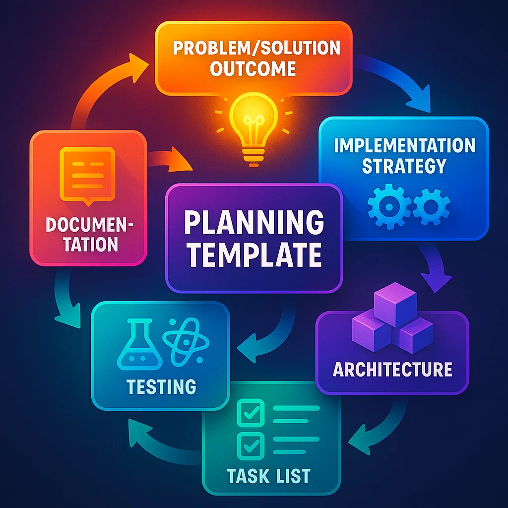
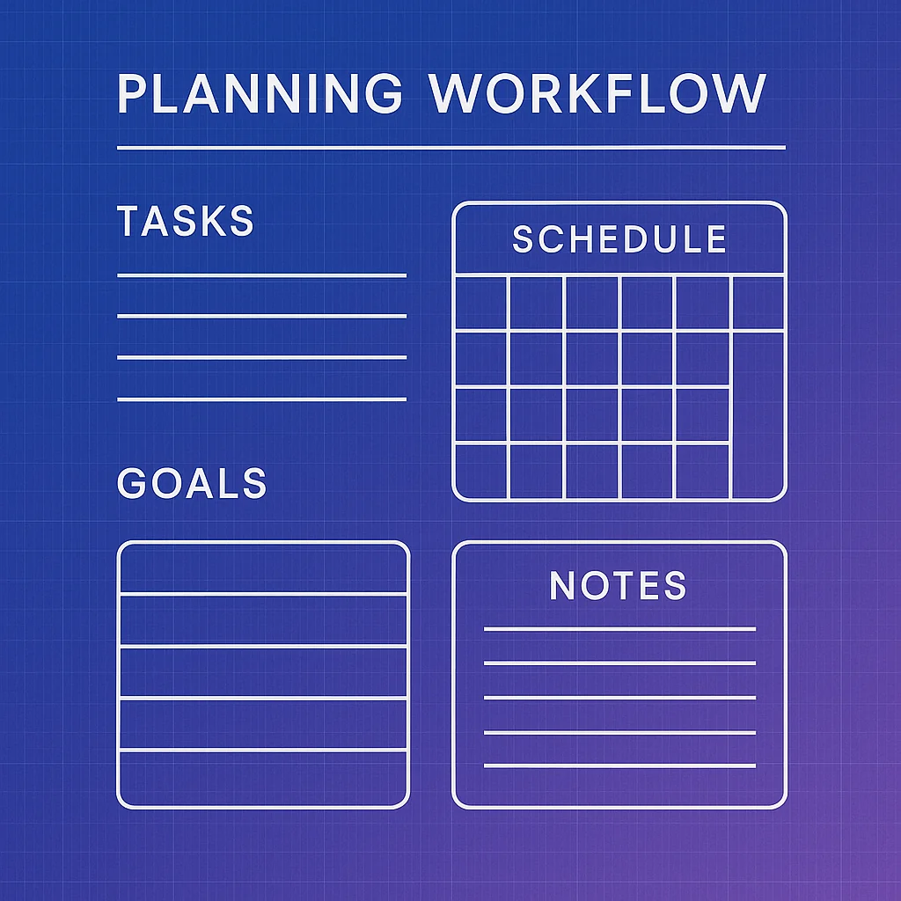

If you've been using AI coding tools for more than a few sessions, you've hit the wall. The one where you realize that getting consistent, quality results requires increasingly detailed, exhausting prompts. You're mentally drained from crafting the perfect instructions every single time.

There's a better way. The industry is shifting toward **spec-driven development** - templating your commands so you can simply ask for what you want, not exhaustively explain how to do it.



## The Problem: Prompt Fatigue is Real

Let's be honest about what happens when you work with AI agents for extended sessions:

- You need increasingly detailed prompts to get what you want
- Each session requires mental energy to craft perfect instructions
- Quality degrades when your prompts aren't comprehensive
- You're essentially re-teaching the same workflows every time

The solution? **Specification templates** - reusable planning frameworks that encode your development process once, then apply it consistently across all your work.

## What Makes a Great Planning Template?

After studying highly recommended planning approaches from across the industry and comparing them to my own experience, I've found they share common structural elements. The differences are minimal - what matters is creating clear, concise, accurate plans that are easy for both humans and AI to understand.

### The Foundation: Problem, Solution, Outcome

Every great plan starts by framing the work properly:

**Problem**: What specific issue are we solving? What's the gap?

**Solution**: What are we building to address this problem?

**Outcome**: What result do we expect from solving this problem with this solution?

This isn't just project management theater - it's critical for aligning the LLM's understanding with your own. When the AI understands *why* it's doing something, it makes better decisions throughout implementation.

## The Complete Planning Framework

Think about your agent's limited context as a single operation window. You want to follow a software development lifecycle: plan → implement → test → review → document. Let's break down how to encode each phase into your template.

### 1. Approach and Implementation Strategy

**What to include:**
- Technologies, tools, libraries, and frameworks needed
- Whether you're reusing existing code or bringing in new dependencies
- Specific library choices (pytest, vitest, playwright, etc.)

Why specify this upfront? Because you want *consistency*. You don't want your agent randomly deciding to bring in a new testing framework mid-implementation. Make these decisions during planning, not coding.



### 2. Architecture of Changes

Describe the structural impact of this change:

- New UI components needed
- Key data models to introduce
- API contract definitions
- State flow changes
- New integration points

A high-level architectural view helps structure what the agent will build. It's the difference between reactive coding and intentional architecture.

### 3. Implementation Tasks (The Critical Section)

This is where relevant context becomes key. If you want agents to parallelize work or pick up where they left off, you need specific, actionable tasks.

**Each task should specify:**
- Exact files that need changes
- What needs to change and why
- New files to create and their purpose
- Edge cases and how to handle them

Don't say "update the auth system." Say:
```
Update src/auth/login.ts to handle OAuth2 flow with Google provider
- Add googleAuthHandler function
- Handle token refresh edge case when user session expires
- Return proper error codes for invalid credentials
```

### 4. Verification and Testing

List your testing commands and frameworks:

**Build and test commands:**
- `npm run build` or `pnpm build`
- `pytest tests/` or `npm test`
- Linting: `eslint .` or your verification process

**Test types to cover:**
- Unit tests (jest, vitest, pytest)
- Integration tests
- End-to-end tests (playwright, cypress)

### 5. Acceptance Criteria

This is what ties into your review process. List clear, testable criteria:

- "When user clicks login, OAuth flow redirects to Google"
- "Invalid credentials return 401 status code"
- "Token refresh happens automatically before expiration"

Here's where it gets interesting: you can hand this section to *another agent* with access to playwright or Chrome DevTools and have it **validate your implementation automatically**. Imagine getting a video recording or screenshot series proving each acceptance criterion works.

### 6. Documentation Updates

No feature should land without documentation. Specify:

- Existing docs that need updates (and why)
- New documents to create (and what they should cover)
- Links to documentation patterns or templates

If you want feature after feature to land with quality and reliability, documentation ensures your agent understands your codebase's current state. This automates the entire end-to-end flow and gives humans (including future you) a place to understand what changed.

## What NOT to Include in Your Plans

Bad plans often include:

- Full code implementations (you need high-level direction, not code)
- Complete config files
- Full markdown documentation snippets
- Step-by-step line-by-line instructions

If your agent is returning fully written code in the planning phase, your template went too far. You need the top-level view, not the implementation.

## What to DO in Your Plans

Great plans include:

**Checklists for implementation steps** - One-time tasks agents can mark complete. If your session crashes, you know where you are.

**File and architecture structures** - Models, flows, and components that describe what should happen.

**Verification commands** - Exact commands to validate success.

**Acceptance criteria** - Clear definitions of what success looks like.

## Optimize for Your Stack

The examples above are generic on purpose, but you can optimize templates for your specific application:

- If your verification steps are always A, B, C, D, E - **put them in the template**
- If you always use the same testing libraries - **specify them by default**
- If you have specific mocking conventions - **link to the docs or patterns**

Don't make your agent guess what you always do consistently. Encode those patterns in your template.

## The Payoff: Quality at Scale

Planning is the most critical phase of agentic development. A high-quality plan template is the foundation that determines code quality across your entire workflow.

If you need agents to:
1. Understand application state
2. Plan changes
3. Implement features
4. Test thoroughly
5. Review properly
6. Document clearly
7. Deploy to production

...then planning is where you set up success for every subsequent step.

**The promise**: Create an incredibly quality plan template, and the quality of code you get will increase dramatically. If you start generating plans you hate, it's time to work on your template.

## Beyond Feature Development

The templates I've described focus on iterating applications with new features or infrastructure changes. But agents aren't limited to this. You could create planning templates for:

- Troubleshooting production alerts from PagerDuty or monitoring tools
- Research workflows for evaluating new features
- Code review processes
- Migration planning
- Performance optimization

The framework adapts to whatever workflow you need to systematize.

## Getting Started

Start with a basic template covering:
- Problem/Solution/Outcome framing
- Implementation approach
- Architecture changes
- Specific tasks
- Testing verification
- Acceptance criteria
- Documentation updates

Then iterate based on your experience. Fine-tune for your preferences, your style, your application. Add your specific tech stack details. Remove ambiguity where you have established patterns.

The quality underpinnings remain the same, but optimization comes from adapting the template to your context.

## What's Next

I'm working on publishing a high-quality planning template for application development on this site. If you don't want to create your own from scratch, that'll be a solid starting point you can customize.

Until then: start templating your commands. Stop exhausting yourself with perfect prompts. Let your templates do the heavy lifting, and watch your agents deliver consistent quality across every session.

The art of the plan isn't just about planning better - it's about planning once and executing everywhere.
