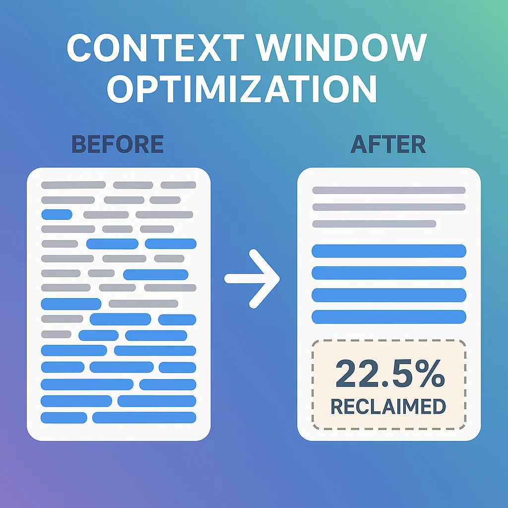

You've probably seen the horror stories in developer forums: "Claude wiped my entire Git repo." "It force-pushed to main and nuked the project." "My agent went completely off the rails and did terrible things."

If you've worked with AI coding agents for any length of time, you know that feeling when a session starts to get a little... funky. The agent's thinking becomes less accurate. It makes strange decisions. Performance degrades noticeably.

**The problem isn't the AI. It's how we're managing context.**

In this post, I'll show you the exact pattern I use to prevent these disasters while unlocking advanced capabilities most developers never even attempt. It's called **one session, one purpose** — and it's the difference between babysitting an unpredictable assistant and running a reliable engineering machine.

## The Hidden Problem: Context Windows Are Working Against You

Let's talk about what's really happening inside your AI coding sessions.

### Long Sessions = Degraded Performance

The longer your session runs, the more information your agent needs to consider with every action. That might sound obvious, but the implications are serious:

- **More mistakes** - The agent gets confused by earlier context
- **Less accuracy** - Precision drops as context fills up
- **Strange behavior** - Decisions become increasingly unpredictable
- **Catastrophic actions** - In the worst cases, destructive operations

You're essentially asking the agent to hold an ever-growing pile of information in its working memory while trying to write precise code. It doesn't scale.

### Auto-Compact: The 22.5% Tax on Your Context

Here's something most developers don't know: when you're using Claude Code, **22.5% of your 200K token context window is reserved for auto-compact**.

Run `/context` in Claude Code right now and check. That's approximately **45,000 tokens** — nearly a quarter of your available space — set aside just to handle context compression when your window gets too full.

Think about what that means:
- Less room for your actual code and specs
- Reduced capacity for complex problem-solving
- Fewer MCP tools you can load (each tool's metadata consumes context)
- Compressed, "dense" context that's harder for the agent to parse

But here's the thing: **you probably don't even need auto-compact** if you structure your workflow correctly.

## The Solution: One Session, One Purpose

The breakthrough pattern is deceptively simple:

**Use separate AI sessions for each distinct phase of your workflow, and clear context between them.**

Instead of one massive session that tries to plan, implement, test, review, and document all at once, you break it into focused sessions:

1. **Planning session** - Generate specs
2. **Implementation session** - Write the code
3. **Testing session** - Validate functionality
4. **Review session** - Ensure quality
5. **Documentation session** - Create docs

Each session starts fresh with only the context it needs.

### Why This Works

**Focus:** The agent has one clear goal and doesn't get confused by unrelated context.

**Context efficiency:** You're not carrying around 40 web searches, 12 exploratory ideas, and implementation struggles into your testing phase.

**Reduced risk:** Each session is isolated, so a confused agent in the testing phase can't accidentally destroy your implementation.

**Better results:** Targeted context means more accurate decisions.

## The Complete Workflow Pattern

Let me show you exactly how this works in practice. I'll use Claude Code slash commands as examples, but this pattern works with any AI coding tool.


### Phase 1: Prime Your Agent

Start every session by loading foundational context:

```bash
/prime
```

Your `/prime` command should:
- Run `git ls-files` to show project structure
- Read your README
- Read relevant docs from your `/docs` folder

After this, the agent has a high-level understanding of your application without being overwhelmed by implementation details.

**Pro tip:** Make this a reusable slash command so you can run it consistently across all sessions.

### Phase 2: Planning Session

With context loaded, create your specification:

```bash
/plan Build a user authentication system with JWT tokens
```

This generates a detailed spec file that outlines exactly what needs to be built.

**Key insight:** All the research, web searches, and exploratory work happens here. The agent might investigate 12 different approaches, read documentation, compare libraries, etc. This creates a ton of context.

**Then clear the session:**

```bash
/clear
```

You now have a spec file on disk, but all that messy research context is gone.

### Phase 3: Implementation Session

Start fresh:

```bash
/prime                    # Load project context
/implement @spec.md
```

Now your agent implements the feature with:
- Clean context (no research noise)
- Clear requirements (from the spec)
- Focused purpose (just implementation)

All the "should we use library X or Y?" confusion is already resolved. The agent just builds.

### Phase 4: Testing Session

After implementation, clear again:

```bash
/clear
/prime                    # Load project context
!git diff main             # Show what changed
/test @spec.md
```

Now the agent validates:
- Tests pass
- Functionality matches spec
- Edge cases are covered

**Critical advantage:** If the implementation agent made a mistake or developed a "bad belief" during coding, the testing agent starts with a fresh perspective. It's not trying to justify earlier decisions.

### Phase 5: Review Session

Another fresh start:

```bash
/clear
/prime
!git diff main
/review @spec.md
```

This agent:
- Opens the application (Playwright, Chrome DevTools)
- Walks through the UI
- Takes screenshots
- Validates the feature works end-to-end

No need to remember UI traversal patterns from implementation. Just focused validation.

### Phase 6: Documentation Session

One more time:

```bash
/clear
/prime
!git diff main
/document @spec.md
```

The documentation agent creates:
- Updated README sections
- API documentation
- Code comments
- Migration guides

Clean context, clear purpose.

### Pro Tip: Commands Can Call Commands

Here's a workflow optimization you might not know about: **Claude Code slash commands can call other slash commands**.

That's right — your `/implement`, `/test`, `/review`, and `/document` commands can automatically call `/prime` and run `!git diff main` internally. You don't even need to type them!

For example, your `/implement` command could look like:

```markdown
# Implement Feature

## Run
`/prime`
`git diff main`

## Instructions
Read the spec at $ARGUMENT (spec location) and implement the feature.
```

Now you just type `/implement @spec.md` and everything happens automatically.

**But here's the critical warning:** Don't chain these commands together in a single session. If you run `/plan` then `/implement` then `/test` all in one session, you're back to the same context pollution problem we're trying to solve.

The power of slash commands calling slash commands is **consistency** and **convenience**, not automation. You still need to `/clear` between phases to get the benefits of focused context.

Think of it this way:
- ✅ Each command calls `/prime` internally = good (consistent setup)
- ❌ Chaining commands without `/clear` = bad (context pollution)

The workflow stays the same: prime → plan → **clear** → prime → implement → **clear** → prime → test → **clear** → etc.

## The Massive Benefits You Unlock

### 1. Reclaim 22.5% of Your Context Window

If you're consistently using separate focused sessions, you can actually **disable auto-compact** for individual sessions.

That's 45,000 tokens back in your pocket.

What can you do with that?
- **Bigger specs** - Handle more complex features
- **More MCP tools** - Each MCP tool's metadata consumes context; now you can afford a much richer toolset
- **Deeper problem-solving** - More room for the agent to think

If you're typically using 8-12% of your context for MCP tools, reclaiming 22.5% means you could allocate 18-20% just for tools. That's a massively more capable agent.

### 2. Prevent Catastrophic Mistakes

When your agent has a clear, focused purpose and clean context, the chances of it going rogue drop dramatically.

No more: "It wiped my Git repo."

Why? Because:
- Each session has limited scope
- Context pollution doesn't accumulate
- Confused beliefs from earlier phases don't carry forward
- You can add safety hooks to specific session types

### 3. Enable Parallel Development

Here's where it gets really interesting.

**You don't have to run these sessions sequentially.**

Using Git worktrees, you can:
1. Create separate working directories
2. Run multiple feature implementations in parallel
3. Each in its own isolated session
4. All generating PRs to review later

Imagine scripting this:

```bash
# Build multiple features in parallel
build-feature.sh "add user auth"
build-feature.sh "implement search"
build-feature.sh "add email notifications"
```

While you're doing something else, you have N features being built simultaneously by isolated agents in separate worktrees, each following the same reliable workflow.

## Automation: Programmatic Session Chaining

You don't need to manually type `/clear` and restart sessions. We're engineers — we can script this.

Claude Code supports programmatic execution:

```bash
claude -p "Say hello"
```

This runs Claude in headless mode and returns output.

With this, you can chain entire workflows:

```bash
#!/bin/bash
# Feature builder script

# Planning phase
claude -p "/plan ${prompt}  store the plan at: ${specs/amazing-spec.md}"

# Implementation phase
claude -p "/implement @specs/amazing-spec.md"

# Testing phase
claude -p "/test @specs/amazing-spec.md"

# Review phase
claude -p "/review @specs/amazing-spec.md"

# Documentation phase
claude -p "/document @specs/amazing-spec.md"
```

**Note:** You'll need to configure permission hooks to allow automated file edits, but this is exactly what hooks are for (see my previous post on taming Claude's YOLO mode).



## Context Handoffs: How Information Flows Between Sessions

The key question: **How do you share context between sessions without carrying over the noise?**

The answer: **Deliberate context artifacts.**

Each session creates specific output:
- Planning → Spec file (`specs/feature-name.md`)
- Implementation → Code + updated spec with checkboxes
- Testing → Test results + updated spec
- Review → Screenshots/videos + review notes
- Documentation → Updated docs

The next session loads:
- Base context (`/prime` - project structure and docs)
- Current state (`git diff` - what changed)
- Requirements (the spec file)

This gives each agent exactly what it needs, nothing more.

### Example: Spec-Driven Workflow

Your planning agent generates:

```markdown
# Feature: User Authentication

## Requirements
- [ ] JWT token generation
- [ ] Login endpoint
- [ ] Logout endpoint
- [ ] Token refresh
- [ ] Password hashing

## Technical Decisions
- Library: jsonwebtoken
- Hashing: bcrypt
- Token expiry: 24 hours
```

Your implementation agent:
1. Reads the spec
2. Implements each requirement
3. Updates checkboxes as it completes them

Your testing agent:
1. Reads the spec
2. Validates each checked requirement
3. Adds test status notes

Clean handoffs, minimal context pollution.

## This Is Agentic Engineering

What we're really doing here is **templating engineering practices.**

Traditional engineering already has phases:
- Planning
- Implementation
- Testing
- Code review
- Documentation

We're not inventing something new. We're taking proven software development practices and turning them into reusable, automatable agent workflows.

This is the difference between "vibe coding" (just tell the AI what to do and hope) and **agentic engineering** (systematically applying engineering discipline through AI agents).

When you template your process like this:
- Quality becomes consistent
- Results become predictable
- Automation becomes possible
- Scale becomes achievable

You're not babysitting an unpredictable assistant anymore. You're running a reliable engineering pipeline that happens to be powered by AI.

## Getting Started: Your First One-Session-One-Purpose Workflow

Here's how to implement this pattern today:

### Step 1: Create a `/prime` Command

In `.claude/commands/prime.md`:

```markdown
# Prime Context

List all git-tracked files and read the README and docs to understand the project.

git ls-files
Read: README.md
Read: docs/architecture.md
```

### Step 2: Structure Your Specs

Create a `specs/` directory and have your planning sessions output to it.

### Step 3: Add Clear Points Between Phases

Explicitly use `/clear` between:
- Planning → Implementation
- Implementation → Testing
- Testing → Review
- Review → Documentation

### Step 4: Track Context Usage

Run `/context` regularly to see how much context you're actually using. If you're consistently under 60-70%, consider disabling auto-compact for that session type.

### Step 5: Build Your First Automated Chain

Start simple:

```bash
# Phase 1: Planning
claude -p "/prime && generate a spec for adding dark mode"

# Phase 2: Implementation
claude -p "/prime && implement the dark mode spec in specs/dark-mode.md"
```

Gradually expand to include testing, review, and documentation.

## Common Questions

**Q: Doesn't clearing context between sessions slow me down?**

Actually, no. Loading focused context is faster than the agent sifting through 100K tokens of accumulated noise. And the quality improvement more than makes up for the few seconds of setup.

**Q: What if I need information from a previous session?**

That's what your artifacts are for. Write important decisions and context to files (specs, notes, markdown docs) that the next session can read.

**Q: Can this work with tools other than Claude Code?**

Absolutely. The principle is universal: focused sessions with deliberate context handoffs. The implementation details vary by tool, but the pattern works everywhere.

**Q: How do I handle really complex features that need continuous context?**

Break them into smaller features. If you can't clearly define phases, your feature is probably too big and should be decomposed anyway.

## The Bottom Line

Long-running AI coding sessions degrade in performance, consume massive context space, and occasionally go off the rails in catastrophic ways.

The solution isn't to give up on AI agents. It's to **structure how we use them.**

One session, one purpose:
- ✅ Better performance (focused context)
- ✅ Fewer mistakes (no context pollution)
- ✅ More capability (reclaim 22.5% of context)
- ✅ Parallel development (isolated worktrees)
- ✅ Automation potential (scriptable workflows)

This is agentic engineering: taking software development best practices and turning them into reliable, repeatable, automatable AI workflows.

Stop fighting your context window. Start using it strategically.

---

**Ready to level up your agentic engineering?** Start by creating your `/prime` command today. Then experiment with clearing context between your next feature's implementation and testing phases. You'll immediately feel the difference in agent clarity and accuracy.

The future isn't one AI session doing everything. It's orchestrated workflows where each session excels at one thing — and the results compound into something greater than any single session could achieve.
