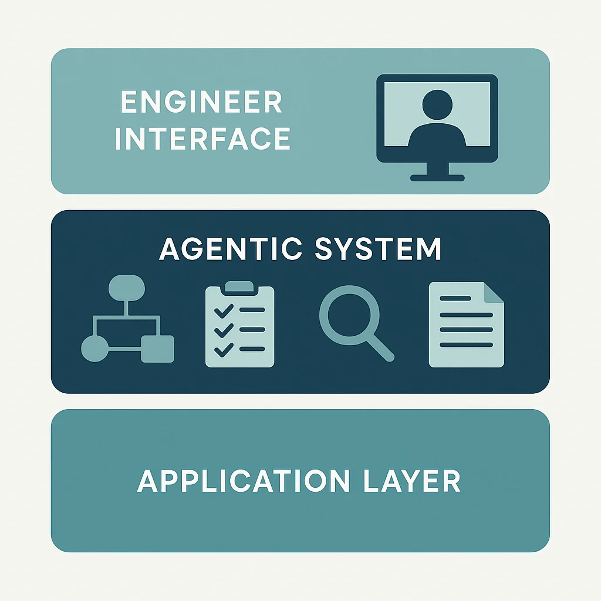
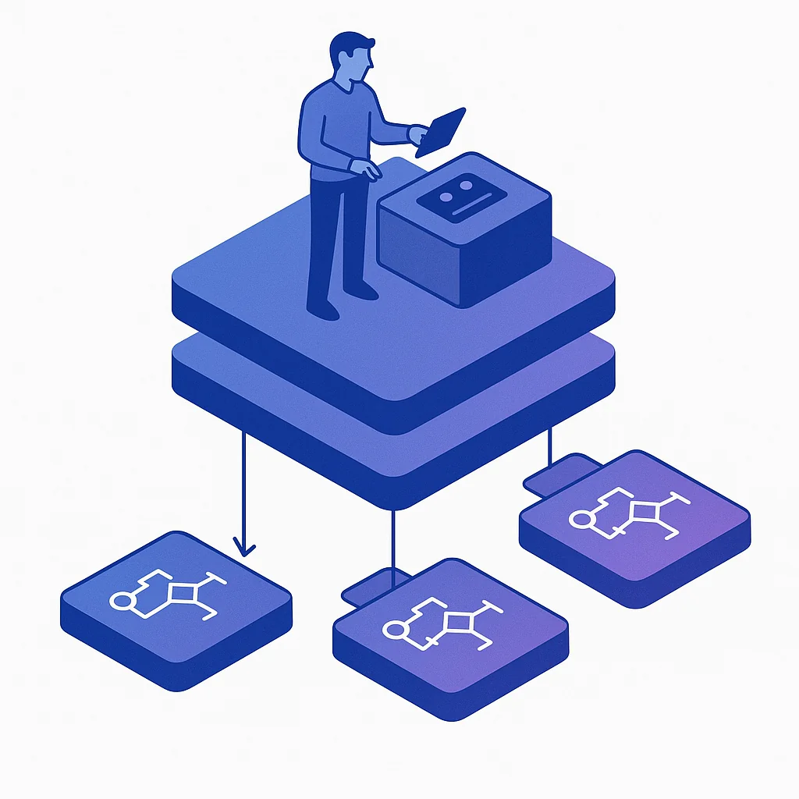
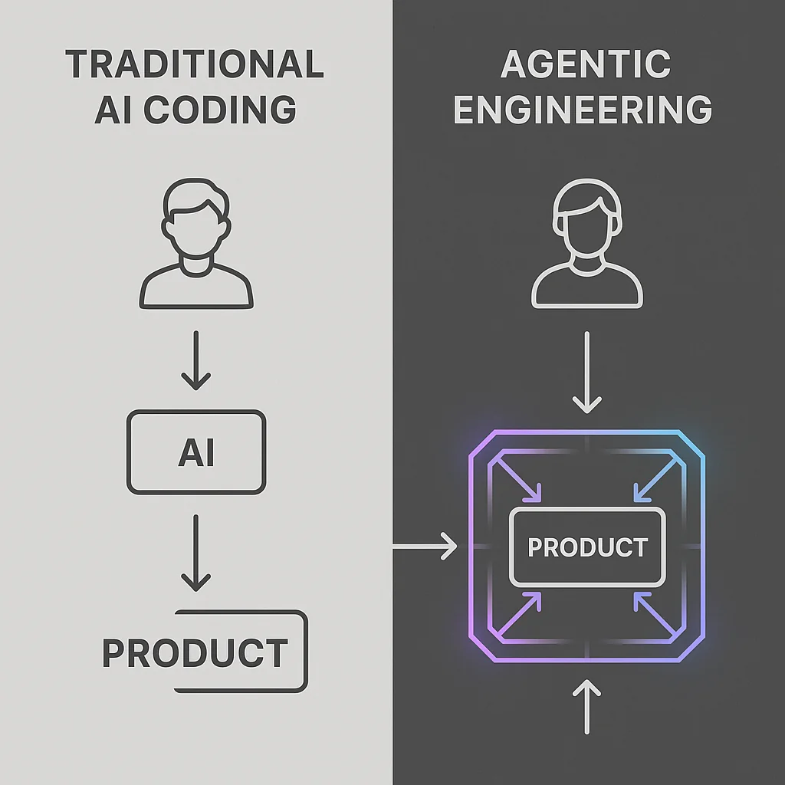

Someone asked me recently: "What is agentic engineering? Why is it different from just using AI?"

I didn't have a crisp answer immediately, and that bothered me. After thinking it through, I've landed on what I think is the clearest way to explain it:

**Agentic engineering is building the system that builds the product.**

Let me unpack why this matters and why it's fundamentally different from just "coding with AI."

## The Layer of Abstraction

When you're just coding with AI—changing a function, fixing a bug, building a feature—you're sitting down and running a tool alongside your application. There's nothing wrong with that. It's helpful.

But agentic engineering is about building a **whole layer around your application**. You're packaging your application in a way that gives you an interface for working with it at a higher level.



Think about it from a product manager's perspective. Your PM doesn't write code. They don't directly work on the application. The engineers are their layer to the application. They can't interface with or change the application without working through that layer.

**That's what we're building with agentic engineering.** A layer around the application that we can interact with to gain meaningful changes to the application. We're moving up to a higher level of abstraction.

## From Product to System

Here's the key insight: **When you shift your effort from building the product to building a system that builds the product, you can ask the system to build several features at once.**

That's huge.

Think about your backlog. Let's say you work in sprints. This sprint you have five tickets to work on. There's one of you. That means in 10 days you need to complete something every two days.

No pressure whatsoever. Meetings and other things definitely aren't going to get in your way and ruin that. Never. Never.

But if you have a system that builds the system, and you understand your systems well enough to clearly communicate what needs to change—you can go to your meetings. When you get out, sit down and see results.

You could have a full day of meetings, but 30 minutes before they begin, you describe the five changes you'd like to see. Come back later and have five features ready to be merged in.

**This is the change we're looking to achieve.**



## The Full Software Lifecycle

If we really step back, agentic engineering is about achieving:

- Planning
- Implementing
- Testing
- Reviewing
- Documenting
- Getting it up in a PR

As engineers, we're not here to just be a review bot. We're here to **develop that system**. We're here to **maintain that system**. We're here to **use that system** to achieve the next order of magnitude of productivity when working with software.

This is a really big deal. If you can get to the point where you describe the features you need and ship them off to agents to build, you can actually run many systems yourself. A small team could manage an entire area of a company.

## What We're Really Replacing

We're talking about getting rid of a lot of the boilerplate, a lot of the density, a lot of the process we need to work through to develop products.

The industry has been trying to reach this level of abstraction for years:
- Drag-and-drop templates
- Little builders with objects
- Form creators
- Website designers

These tools tried to provide the same thing—a higher level of abstraction.

**But we can finally mix code and thought together into workflows.**

Think about it. AI is a **thought engine**. We can mix code and thought together. This is a huge level of automation we never had before.

## The Diagram That Explains It All

Here's how I think about the difference:

**Traditional coding with AI:**
```
You → AI Tool → Direct Code Changes → Application
```

**Agentic engineering:**
```
You → System Layer → Automated Workflows → Application
         ↓
    (Planning, Testing, Review, Documentation)
```

The system layer handles the entire software development lifecycle, not just code generation.



## The Productivity Shift

Consider it. Digest it.

Really understanding this difference is the key between:
- Insane levels of performance and achievements we've never thought possible
- Or feeling like AI is replacing you

It's time to evolve from **software engineers** into **agentic engineers** where you can scale your impact majorly.

When you build the system that builds the product, you're not just writing code faster. You're operating at a fundamentally different level. You're building infrastructure that compounds your productivity.

## What This Looks Like in Practice

Let me make this concrete. An agentic engineering system might include:

- **Custom slash commands** that package common workflows
- **Hooks and validations** that enforce quality automatically
- **Context engineering** that primes your AI with the right information
- **Automated testing and review** pipelines
- **Documentation generation** from code
- **PR creation and management** workflows

Each of these isn't just a one-off script. It's part of a cohesive system that understands your application and how to work with it effectively.

## The Business Impact

From a business perspective, this is transformational:

- **Small teams can do what large teams used to do**
- **Individual contributors can manage entire product areas**
- **Iteration speed increases by orders of magnitude**
- **Quality remains high through systematic automation**

You're not replacing developers. You're multiplying their impact.

## Getting Started

So how do you start building this system?

1. **Identify repetitive workflows** in your development process
2. **Package them into reusable commands** (like slash commands in Claude Code)
3. **Add quality gates** through hooks and validations
4. **Build context** that helps AI understand your codebase
5. **Iterate and refine** your system over time

Start small. Build one workflow well. Then expand.

## The Core Insight

Agentic engineering is building that layer, building that system around your application so that system is able to cleanly and effectively iterate your application.

It's not about AI writing code for you. It's about **building the infrastructure that lets AI work with your application the way a team of engineers would**—with planning, testing, review, and documentation built in.

That's the difference. That's agentic engineering.

---

**What's your experience building systems that build systems? Have you found workflows that multiply your productivity? Let's discuss.**
