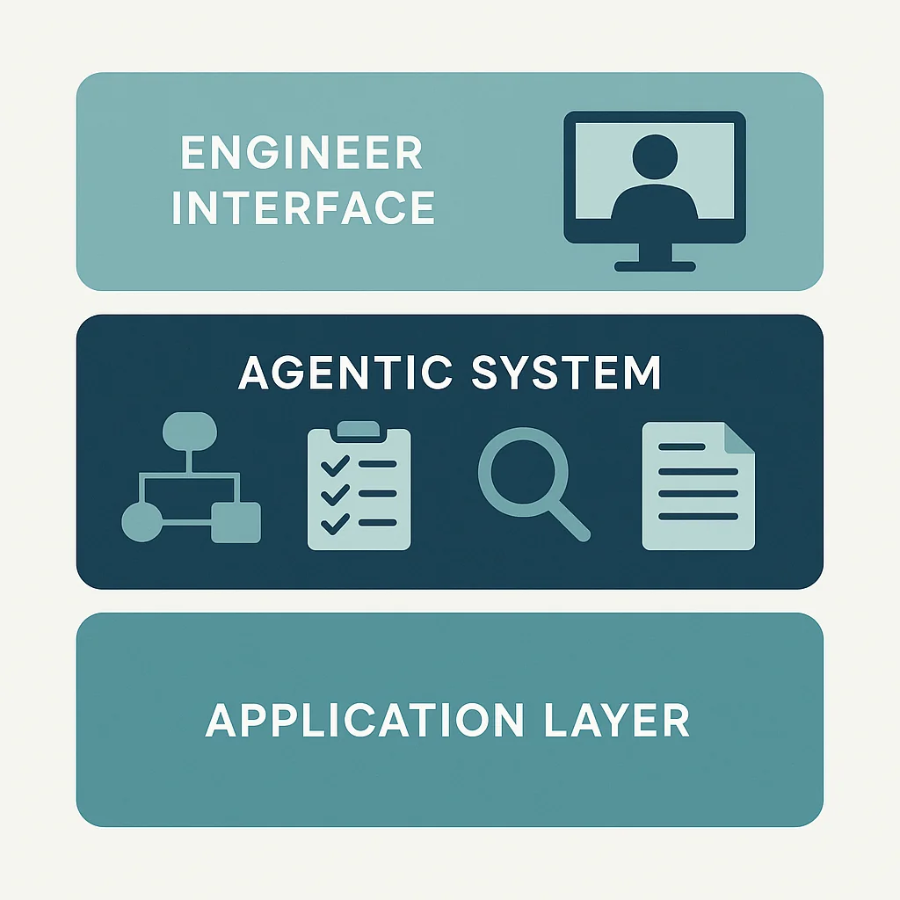
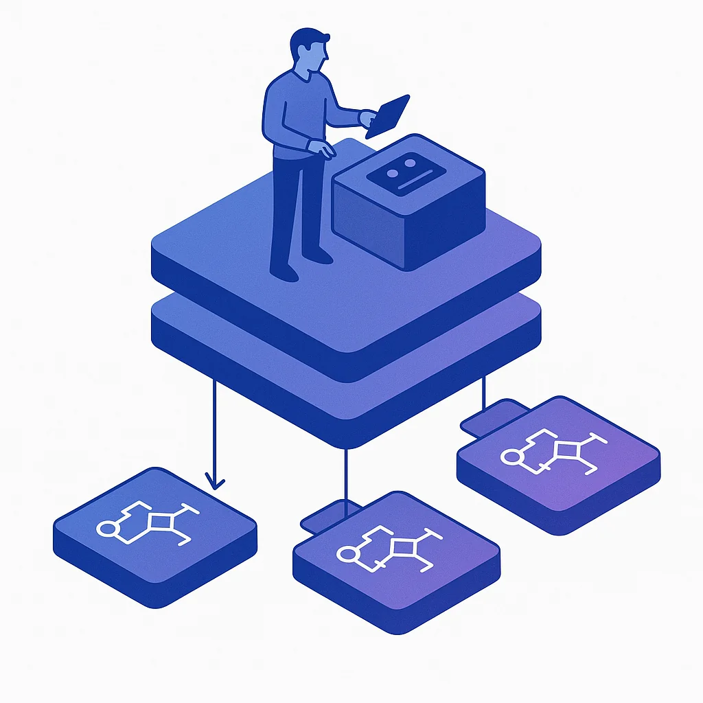
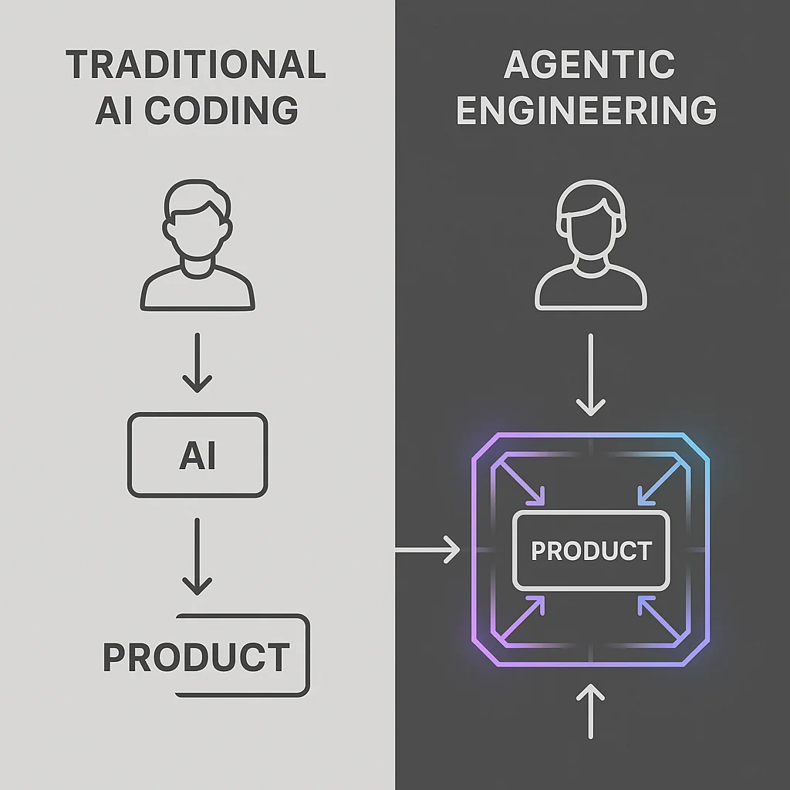

Someone asked me recently: "What is agentic engineering? Why is it different from just using AI?"

I didn't have a crisp answer in the moment, and that bothered me. After sitting with it for a while, here's the cleanest version I've got:

**Agentic engineering is building the system that builds the product.**

Worth unpacking why that matters, and why it's a different thing from "coding with AI."

## The layer of abstraction

When you're coding with AI (changing a function, fixing a bug, building a feature) you're sitting next to your application and running a tool. Nothing wrong with that. It's helpful.

Agentic engineering is different. You're building a **whole layer around your application**. You're packaging the app so you can work with it at a higher level.



Look at it from a product manager's seat. Your PM doesn't write code. They don't touch the application directly. Engineers are their interface to it. They can't change anything without going through that layer.

**That's what we're building with agentic engineering.** A layer around the application that we interact with to drive real changes. We're moving up an abstraction level.

## From product to system

Here's the key insight: **when you shift your effort from building the product to building a system that builds the product, you can ask the system to build several features at once.**

That's huge.

Think about your backlog. Say you work in sprints. This sprint you have five tickets. There's one of you. So in 10 days you have to ship something every two days.

No pressure. Meetings and other things definitely won't get in your way and wreck that. Never. Never.

But if you have a system that builds the system, and you understand your systems well enough to clearly say what needs to change, you can go to your meetings. When you come out, sit down and look at the results.

You could be in meetings all day. Thirty minutes before they start, you describe the five changes you want. You come back later and find five features ready to merge.

**That's the change we're going for.**



## The full software lifecycle

If you step back, agentic engineering covers:

- Planning
- Implementing
- Testing
- Reviewing
- Documenting
- Getting it up in a PR

As engineers, we're not here to be a review bot. We're here to **develop that system**. We're here to **maintain that system**. We're here to **use that system** to hit the next order of magnitude on productivity.

This is a really big deal. Once you can describe the features you need and hand them off to agents, you can actually run many systems yourself. A small team could own an entire area of a company.

## What we're really replacing

We're getting rid of a lot of the boilerplate, a lot of the density, a lot of the process you have to slog through to ship products.

The industry has been chasing this kind of abstraction for years:
- Drag-and-drop templates
- Little builders with objects
- Form creators
- Website designers

Those tools all reached for the same thing: a higher level of abstraction.

**But now we can finally mix code and thought together into workflows.**

Think about that. AI is a **thought engine**. We can blend code and thought. That's a level of automation we've never had before.

## The diagram that explains it all

Here's how I think about the difference.

**Traditional coding with AI:**
```
You → AI Tool → Direct Code Changes → Application
```

**Agentic engineering:**
```
You → System Layer → Automated Workflows → Application
         ↓
    (Planning, Testing, Review, Documentation)
```

The system layer handles the whole software development lifecycle, not just code generation.



## The productivity shift

Consider it. Digest it.

Really getting this difference is the line between:
- Insane levels of performance and output you didn't think were possible
- Or feeling like AI is replacing you

It's time to evolve from **software engineers** into **agentic engineers** who scale their impact massively.

When you build the system that builds the product, you're not just writing code faster. You're working at a fundamentally different level. You're building infrastructure that compounds your productivity.

## What this looks like in practice

To make it concrete, an agentic engineering system might include:

- Custom slash commands that package common workflows
- Hooks and validations that enforce quality automatically
- Context engineering that primes your AI with the right information
- Automated testing and review pipelines
- Documentation generation from code
- PR creation and management workflows

None of these is a one-off script. Each is part of a cohesive system that understands your application and knows how to work with it.

## The business impact

From a business angle, this is transformational:

- Small teams can do what large teams used to do
- Individual contributors can run entire product areas
- Iteration speed jumps by orders of magnitude
- Quality holds up because the automation is systematic

You're not replacing developers. You're multiplying their impact.

## Getting started

So how do you start building this system?

1. Identify the repetitive workflows in your development process
2. Package them into reusable commands (like slash commands in Claude Code)
3. Add quality gates with hooks and validations
4. Build context that helps AI understand your codebase
5. Iterate and refine your system over time

Start small. Build one workflow well. Then expand.

## The core insight

Agentic engineering is building that layer, building that system around your application so it can cleanly and effectively iterate the application.

It's not about AI writing code for you. It's about **building the infrastructure that lets AI work with your application the way a team of engineers would**, with planning, testing, review, and documentation built in.

That's the difference. That's agentic engineering.

---

**What's your experience building systems that build systems? Have you found workflows that multiply your productivity? Let's discuss.**
