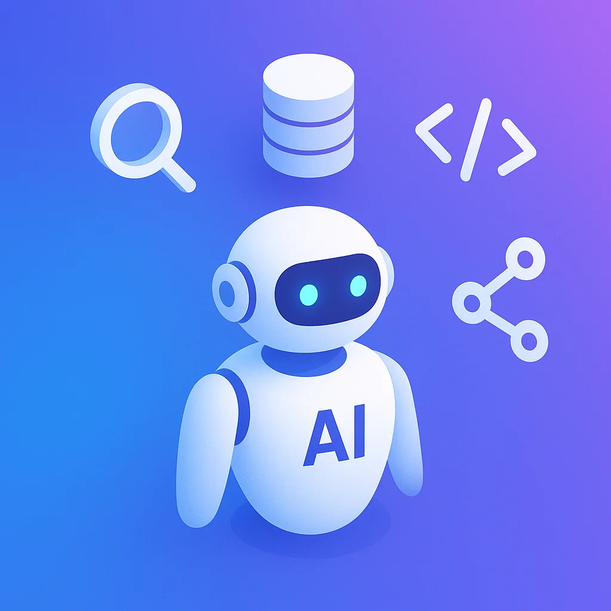
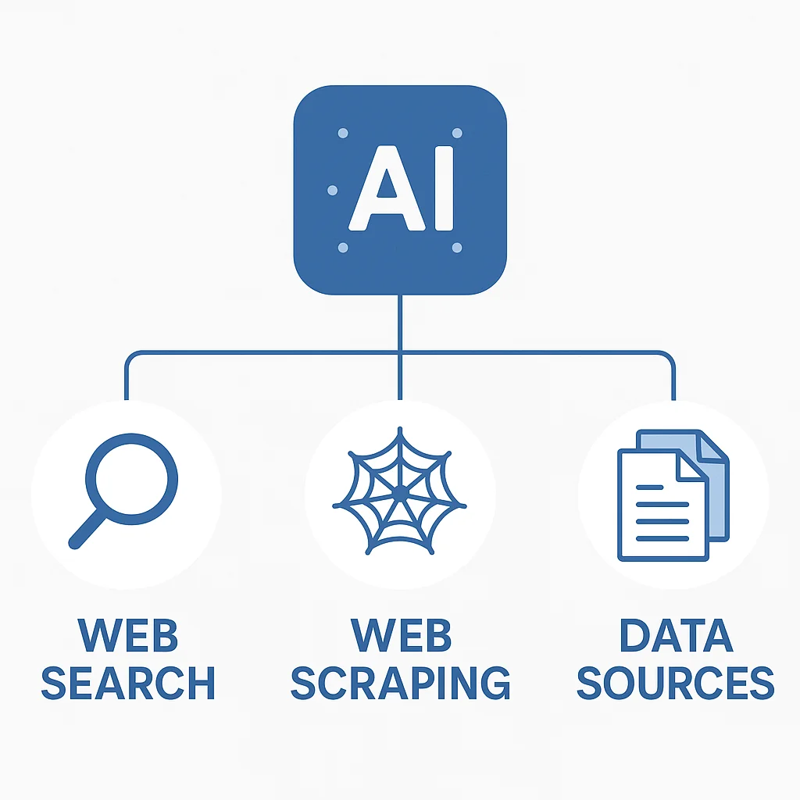
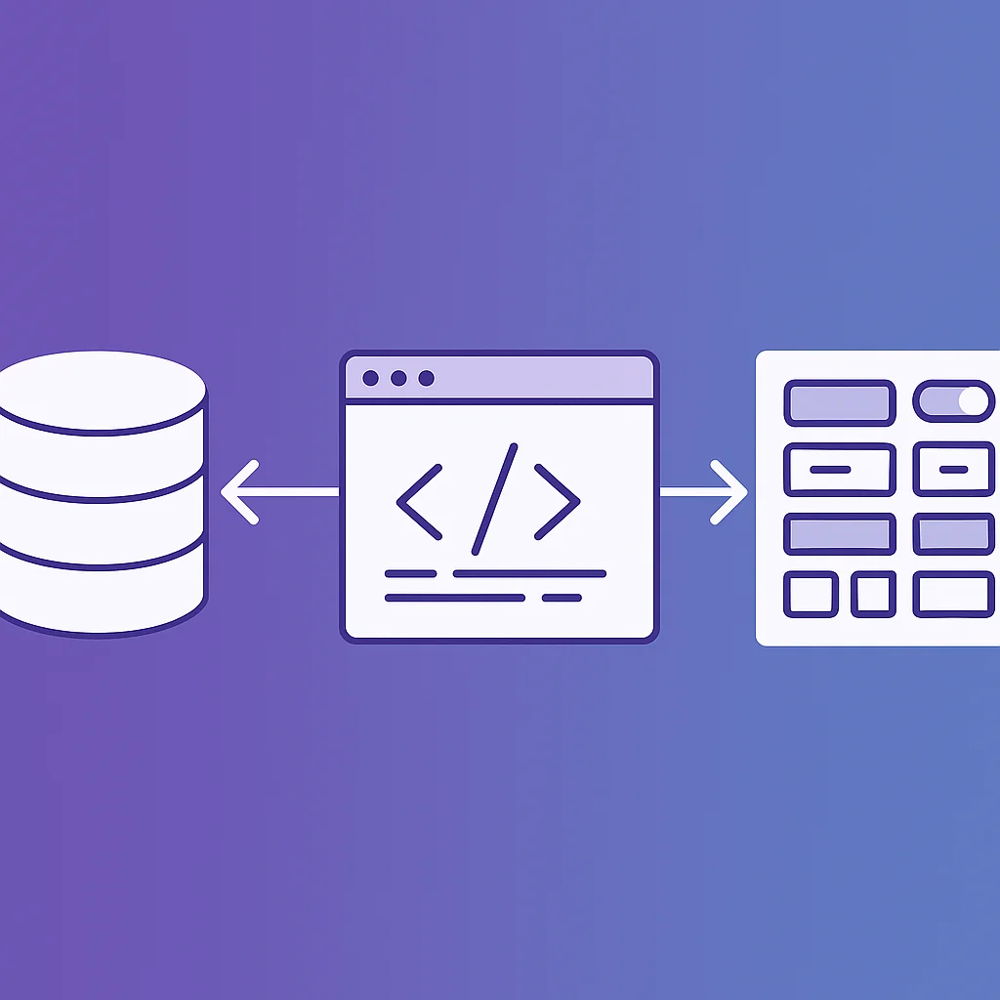
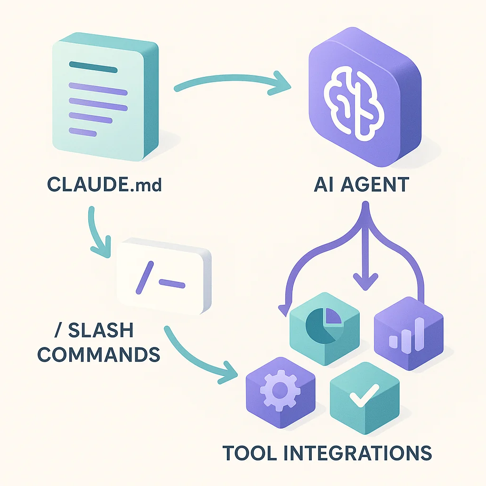

You open your AI coding assistant, start typing, and... that's it. You're using a powerful tool, but are you really using it to its full potential?

If you're like most developers, you're probably just working with the prefab setup—letting your agent write code, debug issues, and answer questions. But here's what you're missing: **MCP tools** (Model Context Protocol) can transform your agent from a helpful assistant into an incredibly capable automation system.

MCPs let you bring functionality from external systems directly into your agent's control. Think web scraping, database queries, component libraries, and specialized data sources—all accessible to your AI without leaving your workflow.

The problem? This is one of the most overlooked and underutilized areas of agentic coding. Let's change that.



## Why MCP Tools Matter

Most of us crack open Claude Code, Cursor, Windsurf, or whatever tool we're using and immediately start coding. But there's massive value in taking just a few minutes to set up key integrations.

MCP tools extend your agent's capabilities in three critical ways:

1. **Real-time data access** - Pull in current information your base model doesn't know
2. **External system control** - Query databases, manage components, scrape content
3. **Workflow automation** - Connect to project management, social platforms, analytics

Let's explore the categories of MCP tools that can level up your development workflow.

## 1. Research Tools: Bringing the Web to Your Agent



The first category every developer should explore is **research tools**. Being able to pull data from external sources into your LLM is game-changing.

### Perplexity MCP

Perplexity's MCP is a standout tool that gives you:
- Generic web search capabilities
- **Direct source links** for every piece of information
- Recent context about any topic

This is huge. Instead of alt-tabbing to Google or dealing with outdated information, you can literally say "ask Perplexity" and boom—your agent has the latest news, the most popular solution to a coding challenge, or documentation for that new framework you're exploring.

**Example use case:**
```
You: "I'm getting a weird error with Next.js 15 metadata. Can you check with Perplexity for recent solutions?"

Agent: [Uses Perplexity MCP] "Based on recent discussions, this is a known issue in 15.0.2. Here's the GitHub issue and the workaround..."
```

### Firecrawl MCP

Building on research capabilities, Firecrawl is a scraper built specifically for LLMs.

Imagine Perplexity gives you a source link, but you need deeper information. With Firecrawl, you can:
- Scrape all content from a specific page
- Crawl an entire site if needed
- Extract structured data optimized for AI consumption

**Workflow example:**
1. Perplexity finds a relevant blog post
2. Agent realizes it needs more detail
3. Firecrawl fetches the full content
4. Agent synthesizes the complete answer

These tools work together to create a powerful research stack for your agent.

### Specialized Data Sources

Beyond general web search, there are MCPs for specific platforms:

- **Reddit MCP** - Search recent trends, discussions, and community insights
- **YouTube Data API MCP** - Find popular videos, check trends, analyze content
- **Platform-specific tools** - Whatever domain you work in, there's likely an MCP

**Pro tip:** The research category is enhanced by whatever MCP tooling you can use to bring in recent context about your specific domain and experience.

## 2. Engineering Tools: Direct Access to Your Stack



Let's move beyond research into tools that interact directly with your development environment.

### Database Connectors

Here's something we frequently overlook as engineers: **your database can be an MCP tool**.

Think about your current workflow. If you have a database, you probably:
- Open a separate UI to check what's being written
- Switch to a query platform to verify flows
- Tab over to Supabase, Convex, or your admin dashboard

What if your agent could do this for you?

With a database MCP, you can:

**Query directly from your agent:**
```
You: "Run a quick query against my users table and show me the top 5 users this month"

Agent: [Executes query] "Here are your top 5 users by activity..."
```

**Validate workflows:**
```
You: "I just made a new post in the UI. Does everything in the database look correct?"

Agent: [Checks database] "Post created successfully. Related rows: 1 post, 3 tags, 1 author reference. All foreign keys valid."
```

**Skip the analytics platform:**
You don't even need a full analytics setup for basic questions. Just ask your code, and it will check the database on your behalf.

This is especially powerful for:
- Testing flows (validate data mutations)
- Debugging issues (inspect state directly)
- Quick analytics (ad-hoc queries without leaving your editor)

Popular database MCPs exist for PostgreSQL, MySQL, SQLite, MongoDB, and most major data stores. If your database isn't supported yet, you can often find a wrapper or build one.

### Component Libraries

Let's pivot to the web development side. **Components are a big deal**, especially in the modern web ecosystem.

If you're a Next.js developer, you know shadcn/ui is huge. Being able to integrate component libraries directly into your agent makes it:
- **Smarter about available components** - No more guessing what's in your library
- **Better at following best practices** - Uses components correctly
- **More productive** - Generates higher-quality UI faster

**Example workflow with ShadCN MCP:**
```
You: "Create a form with validation for user signup"

Agent: [Searches ShadCN components] "I'll use the Form, Input, Button, and Label components from your library..."

[Generates code using actual components from your setup]
```

Other component libraries with MCP support:
- Material UI
- Ant Design
- Custom internal libraries (via custom MCPs)

The key benefit: Your agent understands your actual component library, not just generic React patterns.

## 3. Advanced Integration Strategies



Having tools is great. Knowing **how to configure and teach your agent to use them** is what separates good setups from great ones.

### Where Tools Can Be Accessed

MCP tools are available anywhere in your agent, which means you can:

1. **Use them in custom slash commands**
   ```markdown
   # In your slash command file
   When analyzing performance, use the database MCP to query metrics directly.
   ```

2. **Reference them in sub-agents**
   ```markdown
   # In a specialized agent
   You are a research assistant. Use Perplexity MCP for all factual queries.
   ```

3. **Configure them in your CLAUDE.md file**
   ```markdown
   # Conventions
   - For recent documentation, always check with Perplexity first
   - When suggesting UI components, search our ShadCN library
   - Before making assumptions about database state, query directly
   ```

### Teaching Your Agent How to Use Tools

This is critical: **Don't just add the capability—teach your agent how you want it used.**

**Bad approach:**
- Install Perplexity MCP
- Hope the agent figures out when to use it

**Good approach:**
- Install Perplexity MCP
- Add to CLAUDE.md: "When you encounter unfamiliar errors or need recent documentation, use Perplexity to search for solutions. Always cite the sources."
- Create a slash command: `/research <topic>` that specifically uses Perplexity

By explicitly teaching your agent:
- When to use each tool
- How to use it effectively
- What output format you expect

You'll build workflows that are **consistent, predictable, and incredibly powerful**.

## 4. Memory and Planning Tools

While I personally prefer to maintain more control over planning processes, many developers find value in **memory and planning MCPs**.

These tools help your agent:
- Remember context across sessions
- Build and track implementation plans
- Maintain state for long-running tasks

Popular options include:
- Memory servers (persistent context)
- Planning frameworks (goal decomposition)
- State management tools (workflow tracking)

**When to use them:**
- Long-term projects with multiple sessions
- Complex implementations requiring planning
- Collaborative workflows with shared context

**When to skip them:**
- You prefer manual control over planning
- Short, focused coding sessions
- Projects with clear, simple requirements

The key is understanding your workflow and choosing tools that enhance it rather than complicate it.

## 5. Content and Media Tools

MCPs aren't just for code—they can handle content creation and distribution too.

### Image Generation

**DALL-E MCP** and similar tools let your agent:
- Generate images for documentation
- Create diagrams and visualizations
- Produce marketing assets

**Example workflow:**
```
You: "Create a hero image for our new blog post about MCP tools"

Agent: [Uses DALL-E MCP] "I've generated a modern illustration with your brand colors..."
```

### Social Media Integration

Connect your agent to platforms like:
- **Twitter/X** - Auto-post updates, schedule tweets
- **LinkedIn** - Share technical articles
- **Slack/Discord** - Send notifications, update channels

**Real-world use case:** Automatically tweet when you publish a new blog post, with the agent generating the tweet copy and hashtags.

## 6. Project Management Tools

This is where MCP tools get really interesting for team workflows.

### Issue Tracking

Connect to your project management system:
- **Jira** - Create, update, and track issues
- **Asana** - Manage tasks and projects
- **Linear** - Sprint planning and bug tracking
- **GitHub Issues** - Maintain issues alongside code

**Powerful workflow:**
```
You: "I just fixed the authentication bug. Update the Jira ticket and move it to review."

Agent: [Uses Jira MCP] "Ticket AUTH-142 updated with fix details and moved to 'Ready for Review'. Added commit reference."
```

### Kanban and Workflow Tools

Even if you use waterfall or custom workflows, MCPs can:
- Update task status automatically
- Log time spent on issues
- Generate progress reports
- Sync between systems

**The goal:** Reduce context switching and administrative overhead so you can focus on coding.

## 7. Building Really Incredible Workflows

Here's where everything comes together. The most powerful use of MCPs isn't individual tools—it's **combining them into workflows**.

### Example: Complete Research-to-Implementation Flow

```
1. You: "Implement authentication with OAuth"

2. Agent uses Perplexity MCP: Finds latest best practices

3. Agent uses Firecrawl: Grabs detailed guides from auth providers

4. Agent uses ShadCN MCP: Identifies available form components

5. Agent generates code: Implements using researched patterns + your components

6. Agent uses Database MCP: Validates user table schema

7. Agent uses Jira MCP: Updates ticket with implementation details
```

All of this happens in one flow, without you leaving your editor.

### Example: Content Creation Pipeline

```
1. You: "Create a blog post about feature X"

2. Agent uses Perplexity: Researches recent trends

3. Agent writes post: Using researched information

4. Agent uses DALL-E MCP: Generates hero image

5. Agent uses Twitter MCP: Schedules announcement tweet

6. Agent uses GitHub: Commits post to repository
```

Your agent becomes a complete content automation system.

### The Key: Configuration

The difference between "having tools" and "having incredible workflows" is **configuration**.

**In your CLAUDE.md:**
```markdown
# Research Workflow
When implementing new features:
1. Use Perplexity to check latest best practices
2. Use Firecrawl for detailed documentation if needed
3. Check component library for existing UI patterns
4. Validate database schema before writing queries

# Content Pipeline
When creating blog posts:
1. Research topic with Perplexity
2. Generate images with DALL-E MCP
3. Schedule social promotion
4. Commit and push to trigger deployment
```

**In custom slash commands:**
```markdown
# /implement-feature
1. Research with Perplexity
2. Check our component library
3. Validate database schema
4. Generate implementation
5. Update project management tool
```

This level of automation is what separates agentic engineers from traditional developers.

## Getting Started with MCP Tools

Ready to level up your agent setup? Here's how to start:

### 1. Identify Your Pain Points

What do you find yourself doing repeatedly?
- Googling the same types of issues?
- Switching to database UIs frequently?
- Looking up component documentation?
- Updating project management tools?

These are your MCP opportunities.

### 2. Start Small

Don't try to install 20 MCPs at once. Start with **1-2 tools** that address your biggest pain points:

**For research-heavy work:** Start with Perplexity MCP
**For full-stack development:** Start with a database connector
**For frontend work:** Start with a component library MCP

### 3. Configure and Teach

Once installed:
1. Add usage guidelines to your CLAUDE.md
2. Create relevant slash commands
3. Test the workflow multiple times
4. Refine based on results

### 4. Expand Gradually

As you master each tool:
- Add complementary tools (Perplexity + Firecrawl)
- Build multi-tool workflows
- Create specialized sub-agents
- Share configurations with your team

## The MCP Ecosystem Is Growing

The exciting part? The MCP ecosystem is expanding rapidly.

**Currently available:**
- Research and web tools
- Database connectors
- Component libraries
- Social media integrations
- Project management tools
- Memory and planning systems
- Content generation tools

**Coming soon:**
- More platform integrations
- Better workflow automation
- Enhanced memory systems
- Cross-tool orchestration
- Team collaboration features

The key is staying curious and exploring what's available for your specific stack and workflow.

## Final Thoughts

MCP tools transform your AI coding assistant from a helpful chatbot into an automation powerhouse. But most developers never explore beyond the default setup.

By integrating research tools like Perplexity and Firecrawl, engineering tools like database connectors and component libraries, and workflow tools for project management, you can build systems that handle entire workflows autonomously.

The difference maker? **Configuration**. Don't just add tools—teach your agent how to use them through CLAUDE.md files, custom slash commands, and sub-agent instructions.

Start with one or two tools that address your biggest pain points. Master them. Then expand gradually.

Your agent is capable of so much more than writing code. Give it the tools it needs, teach it how you want them used, and watch your productivity soar.

**Now go build something incredible.** 🚀

---

**What MCP tools are you using? What workflows have you built?** I'd love to hear about your setups and discoveries as the agentic engineering ecosystem continues to evolve.
