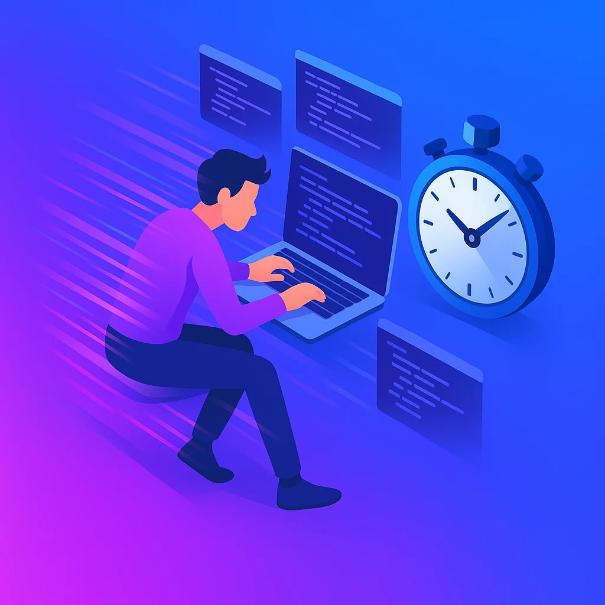
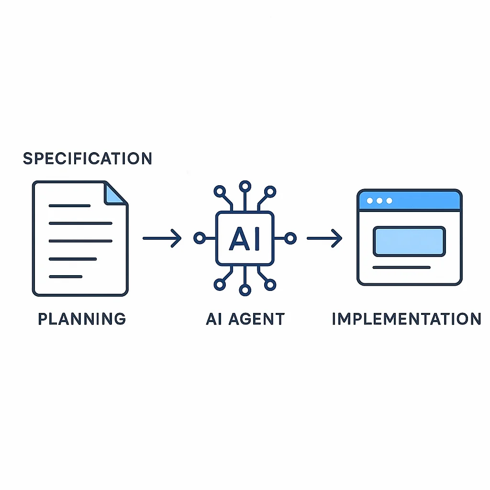

I need you to adjust your expectations about how long things should take.

I was sitting with a friend playing Diablo Immortal when the conversation turned to a problem: the game's new Shadow War feature made clan management exponentially more complex. With clan rosters now exportable and 2-3 competitive events per week for 100-person clans, the planning overhead was becoming unbearable.

My friend said, "What if we could just upload the roster to a site, see analytics, build battle plans, and push notifications to Discord?"

I replied: "That's a great idea for an afternoon project."

Not a weekend project. Not a two-week project. An **afternoon project**.

That's where agentic engineering has brought us. And I want to show you exactly how mind-blowing this reality is.

## The Old Timeline vs The New Reality

Let's be honest about what this project entailed:

**The full feature list:**
- CSV roster upload (paste or file upload)
- Roster analytics dashboard with charts
- Battle planning UI for 96 players (4 rows × 3 matches × 8 players)
- Mobile-responsive design for complex planning interface
- Discord webhook integration
- Three automated battle strategies
- User authentication (Clerk)
- $5/month subscription with Stripe
- Production deployment on Vercel

Five years ago, this would have been a **solid weekend project**—assuming you were experienced and everything went smoothly. More realistically, it would have stretched into a week or two of evening work.

**My actual timeline: 2-3 hours for the working prototype, 3-4 hours total with polish.**

The most time-consuming part? Reaching out to my legal team about setting up a business entity for payment processing. That conversation will take longer than building the entire product.

Let that sink in.

## The Build: Feature by Feature

Here's exactly how it went down. I grabbed my favorite stack: Next.js + Clerk + Convex + shadcn/ui.

### Round 1: Roster Upload and Analytics (One-Shot ✅)

I started by creating a detailed spec for the roster feature:
- CSV upload via paste or file
- Parse and validate roster data
- Display in a sortable, filterable table with pagination
- Generate analytics charts using React charting libraries
- Clean shadcn/ui styling throughout

I fed this spec to Claude Code and said "build this."

**Result: One-shot implementation.**

Sure, I did a little cleanup on styling and theming, asked for a couple of tweaks. But the core feature? Done. First try. Beautiful roster page with full analytics.

### Round 2: Battle Planning UI (Iterative 🔄)

This was more complex. I needed a UI to manage 96 player slots across a specific battle formation. Mobile responsiveness was critical—this needed to work beautifully on both desktop and mobile devices.

I created another detailed spec, describing the layout requirements, interaction patterns, and responsive behavior.

**Result: Required iteration.**

The complexity of displaying and manipulating 96 positions responsively took some refinement. I did a couple of git rollbacks, cleared the conversation, tweaked the spec, and tried again. After dialing in the plan, I got a one-shot implementation of the refined approach.

A couple of manual styling touches, but the feature was solid.

### Round 3: Discord Integration (One-Shot ✅)

Discord webhook integration. I described what I needed: post battle plans to Discord with formatted messages.

**Result: One-shot.** No problems. Done.

### Round 4: Automated Strategies (One-Shot ✅)

I described three battle strategy methodologies that could auto-populate the battle planner.

**Result: One-shot.** Strategies implemented, working beautifully.

## The Final Product

At the end of those few hours, I had:

- ✅ **A gorgeous, polished website** with modern, high-end shadcn/ui components
- ✅ **Login protection** via Clerk (with Discord OAuth for future bot integration)
- ✅ **Subscription monetization** ($5/month via Stripe, including test card support)
- ✅ **Three complete feature sections:**
   - Roster management (upload, view, analyze)
   - Battle planning (96-player formations with mobile support)
   - Discord integration (webhook publishing)
- ✅ **Production deployment** on Vercel
- ✅ **WebP images** throughout for performance
- ✅ **Animated GIFs** (converted to WebP) showcasing features

This wasn't a prototype. This wasn't an MVP with rough edges. This was a **production-ready SaaS application** with auth, payments, data persistence, external integrations, and polish.

## The Workflow That Made This Possible

The key to this speed wasn't luck or simple features. It was **spec-driven agentic development**:

1. **Plan in detail** - I didn't just say "build a roster page." I described the complete UX, data flow, validation requirements, and UI patterns.

2. **One-shot simple features** - For straightforward features (roster upload, Discord integration), detailed specs led to first-try success.

3. **Iterate complex features** - For the battle planner, I refined the spec based on what worked and what didn't, then re-ran with a clearer plan.

4. **Review, tweak, repeat** - I reviewed the plan before implementation, tweaked what I didn't like, and only then said "build this."

5. **Manual polish** - I added small styling touches and quality refinements, but the core functionality was AI-generated.

The agent was churning while I reviewed plans and made decisions. I wasn't sitting there coding—I was architecting and directing.

## The Mindset Shift: Breaking Old Expectations

Here's what messed with my head: I've been an engineer for over a decade. I have deeply ingrained expectations about how long things should take.

A project with this scope, polish, and feature set? My brain says "that's at least a weekend, probably longer."

But here we are. **Three hours.**

Breaking those expectations is genuinely challenging. When you've spent years knowing that "adding authentication" means half a day of work, watching Clerk integration happen in minutes is disorienting.

The legal setup will take longer than building the product. That's the new reality.

## Iterating on End-State, Not Increments

One of the most powerful shifts with agentic engineering is **iterating on the final vision**, not intermediate steps.

**The old way:** Build piece by piece, test incrementally, slowly approach the end goal.

**The new way:** Describe the end state, generate it, evaluate the *complete feature*, iterate if needed.

Think about the difference:

**Old:** "Let me build a meme generator. First, I'll create an image upload. Then add text positioning. Then add font controls. Then add export..."

**New:** "Generate an image with custom text overlay, styled exactly like this." *Evaluates complete meme.* "Actually, make it more like this." *Evaluates refined version.* Done.

You're seeing the end result in your iteration loop, not building toward it piece by piece. This tightens the feedback cycle dramatically and lets you validate your vision faster.

## The Broader Impact: What This Means for You

This isn't just about me building a clan management tool quickly. This is about **fundamentally changing what's possible** for solo developers and small teams.

### Side Projects Are No Longer Intimidating

How many ideas have you dismissed because they felt like too much work? How many times have you thought "that would be cool, but it would take weeks"?

Agentic engineering removes that barrier. Ideas that once felt like months of evening work are now weekend projects. Weekend projects are now afternoon builds.

**You can act on your ideas.**

### Prototyping Becomes Trivial

For businesses, this means rapid experimentation:
- Test a product concept in hours, not weeks
- Validate ideas with real, working prototypes
- Iterate based on actual user feedback, not mockups
- Move from "should we build this?" to "let's see if this works" in a single day

### The Creative Bottleneck Shifts

In a world where we're fighting for context, bandwidth, and space for creativity, **execution is no longer the bottleneck**.

Having an idea and being able to act on it is priceless. Not dismissing ideas because they're "too much work" opens up entirely new possibilities.

The constraint shifts from "can I build this?" to "what should I build?"

## The Reality Check: What Still Matters

This isn't magic, and not everything is an afternoon build. Here's what still matters:

**1. Planning and architecture** - Agentic engineering amplifies good planning. Garbage specs produce garbage features.

**2. Domain knowledge** - Understanding your problem space deeply lets you write better specs and evaluate results accurately.

**3. Taste and judgment** - Knowing when a feature is "good enough" vs needs refinement is still a human skill.

**4. Integration complexity** - One-shot features work when they're well-scoped. Highly interconnected features still require careful orchestration.

**5. Edge cases and production hardening** - Initial builds are fast. Handling every edge case and production scenario still takes time.

But the **80% case**—getting a working, polished, deployed feature—is radically faster than it used to be.

## Embrace the New Timeline

If you're still thinking in terms of old project timelines, you're handicapping yourself.

Agentic engineering isn't just about saving time on the projects you were already going to build. It's about **making projects viable that you would have never started**.

That idea you had six months ago that you dismissed as "too much work for a side project"?

Build it this weekend.

That prototype your team wanted to validate before committing resources?

Have it ready for Monday's meeting.

That automation you've been meaning to set up but never had time for?

Do it this afternoon.

The power of agentic engineering isn't just speed—it's **removing the activation energy** that keeps ideas trapped in your head.

## What's Next?

I'm going to keep building. I have a list of ideas that used to feel overwhelming, and now they feel achievable.

Some will take an afternoon. Some will take a weekend. Some will still take weeks—but they used to take months.

The bar for "worth building" has dropped dramatically. And that means **more experiments, more iterations, more learning, and more shipped products**.

Setting up your system to help you build products will change your mindset on how much you can achieve.

The question isn't "how long will this take?" anymore.

The question is "what do I want to build next?"

## Key Takeaways

- ✅ **Afternoon builds are real** - Production-ready features that used to take weekends now take hours
- ✅ **Spec-driven development works** - Detailed planning + AI implementation = one-shot features
- ✅ **Iteration speed matters** - Seeing the end state in your feedback loop accelerates decision-making
- ✅ **Old timelines are obsolete** - Adjust your expectations about what's "a lot of work"
- ✅ **Execution isn't the bottleneck** - Ideas can become reality faster than ever before
- ✅ **The constraint shifts** - From "can I build this?" to "what should I build?"

Break your old expectations. Build that idea you've been sitting on. See what's possible when execution gets out of your way.

Because in the world of agentic engineering, the only thing stopping you from acting on your ideas is the belief that it's still going to take as long as it used to.

It won't.
