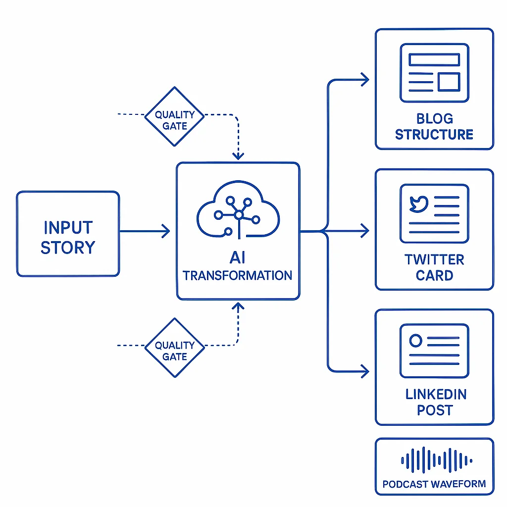

You just published an amazing blog post. Your ideas are clear, your examples are solid, and you're ready to share it with the world. So you copy the title and description, paste them into Twitter, hit send, and then... you look at what actually posted.

A plain text title. A trimmed description. A generic link preview card with no image. Nothing that makes anyone want to click.

"Wow," you think. "This is not super impressive at all."

Here's the thing: **your content is great, but each platform has a different vibe check**. Twitter wants casual and punchy. LinkedIn wants professional depth. A podcast needs narrative flow. And manually adapting your content for each platform? That's a full-time job nobody signed up for.

What if instead of manually reformatting your story for every platform, you could build a content pipeline that does the thinking for you?

## The Real Problem: Platform-Specific Everything

Let me paint the picture. You've got one story—your experience, your insight, your project. But to share it effectively, you need:

- **Blog post:** Structured sections, SEO optimization, proper headings, code examples
- **Twitter:** Casual tone, 250 characters max, hook in the first line
- **LinkedIn:** Professional framing, longer form, business value highlighted
- **Podcast script:** Conversational narrative, verbal transitions, storytelling structure
- **Email newsletter:** Personal connection, different call-to-action

Each platform has different character limits, tone expectations, visual requirements, and engagement patterns. Traditional approach? Write it once, then spend hours manually adapting it for each platform. Maybe you skip most platforms because who has the time?

**The result:** Your great ideas reach a fraction of the audience they could.

## Why Traditional Automation Falls Short

You might think, "Just write a script to auto-post everywhere!" But here's the problem:

Traditional coding is great at following rules (`if X then Y`), but terrible at understanding context and adapting tone. You can script a bot to post your blog title to Twitter, but you can't easily script it to:

- Understand which part of your 2,000-word blog will resonate most on Twitter
- Reframe your technical tutorial for a business-focused LinkedIn audience
- Transform your structured blog post into a conversational podcast narrative
- Maintain your authentic voice while meeting platform conventions

These require **thinking**, not just **executing**. And until recently, thinking couldn't be automated.

## The Solution: AI-Powered Content Pipelines



Here's where it gets interesting. AI changes everything because **it's the first time we can embed thinking into our workflows**.

A content pipeline isn't just automation—it's automation with intelligence. Here's what that looks like in practice:

### Step 1: Tell Your Story Once

Start with the raw version. For me, that's often a voice recording where I just talk through my ideas, experiences, and insights. No pressure to format it perfectly. Just the authentic story.

```bash
# Voice recording → Plain text transcript
"So I was thinking about content pipelines today..."
```

### Step 2: Transform It Into a Blog

First transformation: AI takes that narrative and structures it into a proper blog post with:

- SEO-optimized title and description
- Logical section hierarchy
- Code examples and diagrams
- Proper formatting and markdown
- Internal links and calls-to-action

**The key:** It's still your story, your examples, your voice. The AI just handles the structural transformation.

### Step 3: Generate Platform-Specific Social Posts

Now here's where it gets powerful. Add a social section to your blog's frontmatter:

```yaml
social:
  twitter:
    text: "🚀 Built a content pipeline that turns my voice notes into blog posts, tweets, and LinkedIn posts. Same story, platform-optimized delivery. AI handles the format, I keep my voice."
  linkedin:
    text: "Content distribution shouldn't be a full-time job. I built an AI-powered pipeline that transforms a single story into platform-specific formats—blog posts, social content, and soon podcasts. Here's how thinking-enabled automation changes content strategy..."
```

**Same content. Different vibes.** Twitter gets the casual, punchy version. LinkedIn gets the professional, detailed framing. Both authentic to the original story.

### Step 4: Automate Distribution

Once your content is formatted correctly for each platform:

```yaml
# GitHub Actions runs on schedule
# Checks for posts published today
# Posts Twitter content from frontmatter
# Posts LinkedIn content from frontmatter
# Zero manual intervention
```

Your content goes out at the right time, in the right format, with the right tone. You told the story once. The pipeline does the rest.

## Real Example: My Content Workflow

Let me show you what this looks like in practice.

**The Input:** I record a 5-minute voice memo about content pipelines (literally the recording that became this post).

**The Pipeline:**

1. **Transcription:** Voice → Text transcript
2. **Blog Generation:** AI structures it into a full blog post with proper MDX formatting
3. **Image Generation:** DALL-E creates hero images and diagrams
4. **Social Content:** AI generates platform-specific posts for Twitter and LinkedIn
5. **Quality Validation:** Automated checks for SEO, prose quality, and social character limits
6. **Deployment:** Git push → Vercel deploys → GitHub Actions post to socials

**The Output:**
- One comprehensive blog post
- Platform-optimized Twitter thread
- Professional LinkedIn post
- All images in WebP format
- SEO metadata and Open Graph tags
- Automated social posting on publish day

**Time investment:** 5 minutes to record my thoughts. Everything else? Automated.

## Why This Actually Works

The magic isn't in the automation alone—it's in **combining thinking with automation**.

### AI Adds Intelligence

AI can:
- Understand which parts of your blog will resonate on Twitter vs LinkedIn
- Adapt tone while maintaining your voice
- Structure content for different consumption patterns (scanning vs deep reading vs listening)
- Follow platform-specific best practices (character limits, hashtag conventions, formatting rules)

### Validation Adds Quality Control

But AI isn't perfect, so layer in automated validation:

```bash
# SEO validation
- Title length (30-60 chars)
- Description (150-160 chars)
- Proper heading hierarchy
- Image alt text

# Social validation
- Twitter: Max 250 chars (reserves 30 for URL)
- LinkedIn: Max 2970 chars
- Required text field for each platform

# Prose linting
- Vale checks readability
- Grammar and style consistency
- Active voice and clarity
```

**The combination:** AI does the creative transformation, validation ensures it meets quality standards.

## Building Your Own Content Pipeline

Here's how to start building this for yourself:

### 1. Identify Your Content Flow

What's your natural starting point?
- Voice recordings or notes?
- Long-form writing?
- Video transcripts?
- Project documentation?

Pick the format that's easiest for you to create in. That's your pipeline input.

### 2. Define Your Output Formats

Which platforms do you want to reach?
- Blog (SEO-optimized, structured)
- Twitter (casual, punchy, visual)
- LinkedIn (professional, detailed)
- Newsletter (personal, actionable)
- Podcast (conversational, narrative)

For each, document:
- Character/time limits
- Tone and style expectations
- Required elements (hashtags, CTAs, etc.)
- Visual requirements

### 3. Build AI Transformation Steps

Create prompts or workflows that:
- Take your input format
- Apply platform-specific rules
- Generate appropriate output
- Maintain your voice and key points

**Example transformation prompt:**
```
Transform this blog post into a Twitter thread.
- Max 250 chars per tweet (reserves 30 for URL in main tweet)
- Casual, engaging tone with relevant emojis
- Hook in the first tweet
- One key insight per tweet
- Maintain the author's authentic voice
```

### 4. Add Validation Layers

Don't trust AI blindly. Build checks for:
- Character limits (hard requirements)
- Required fields (metadata, hashtags)
- Content quality (SEO, readability)
- Brand consistency (tone, terminology)

### 5. Automate Distribution

Once content is validated:
- Store platform-specific versions (frontmatter, separate files, database)
- Schedule posting via APIs or GitHub Actions
- Track what's posted when
- Monitor engagement and adjust

## What About Podcasts?

Here's where it gets even more interesting. The same pipeline that goes Story → Blog → Social could extend to Story → Blog → Podcast.

**The transformation:**
- Take the blog post structure
- Convert it into a conversational script (AI transformation)
- Add verbal transitions and narrative flow
- Generate audio using voice synthesis (11Labs, ElevenLabs, etc.)
- Produce podcast episode with intro/outro music

**The validation:**
- Script readability checks
- Timing validation (target episode length)
- Audio quality verification
- RSS feed compliance

I haven't built this yet, but the infrastructure is already there. The same thinking-enabled automation that powers blog-to-social can power blog-to-podcast.

## The Deeper Truth: You Tell Stories, AI Handles Formats

Here's what makes this approach so powerful: **You don't need AI to create your stories.**

Your experiences, insights, and ideas are uniquely yours. AI can't replicate your perspective or authentic voice. What AI *can* do is handle the tedious work of adapting your story to meet platform expectations.

Think about it:
- You wouldn't manually resize every image for every device
- You wouldn't hand-code responsive CSS for every screen size
- You shouldn't manually rewrite your content for every platform

The story is yours. The formatting is automation.

## Content Pipelines vs Traditional Approaches

Let me be clear about what this isn't:

**This is NOT:**
- AI writing generic content for you
- Losing your authentic voice to automation
- Posting identical content everywhere
- Replacing human creativity with algorithms

**This IS:**
- You creating authentic content once
- AI adapting it to platform-specific requirements
- Automation handling distribution timing
- Quality validation ensuring standards
- Your voice reaching more people in formats they prefer

The creative work is still yours. The pipeline just makes sure your work reaches people in the way they want to consume it.

## Implementation: Start Small, Scale Smart

You don't need to build everything at once. Here's a practical progression:

### Phase 1: Single Format Automation
- Pick one transformation (e.g., blog → Twitter)
- Build the AI prompt for conversion
- Add validation for that platform
- Manually review and tweak

### Phase 2: Multi-Platform
- Add LinkedIn transformation
- Store platform-specific content in structured format
- Build validation for each platform
- Schedule posting automation

### Phase 3: Advanced Pipelines
- Add podcast script generation
- Integrate voice synthesis
- Build analytics tracking
- Optimize based on engagement data

**Key principle:** Each phase should provide value independently. Don't wait to build everything before shipping.

## The Tools You Actually Need

Here's my current stack:

**Content Generation:**
- Claude Code for AI transformations
- OpenAI DALL-E for image generation
- Python scripts for validation

**Validation:**
- SEO checks (title length, meta descriptions, headings)
- Vale for prose linting
- Custom validators for platform requirements

**Distribution:**
- GitHub Actions for scheduled posting
- Twitter API for social posting
- Vercel for blog deployment

**Storage:**
- MDX frontmatter for platform-specific content
- Git for version control
- Vercel CDN for images

Total complexity? Lower than you'd think. The magic is in the workflow design, not tool sophistication.

## What I've Learned Building This

After building and using this pipeline for several months:

### 1. Validation Is Critical

AI makes mistakes. Character limits get exceeded. Formatting breaks. Tone drifts. **Always validate before publishing.**

Build automated checks for hard requirements (character counts, required fields) and manual review for subjective quality (tone, voice, engagement).

### 2. Platform-Specific Works Better Than Generic

Don't try to write "one post fits all." The whole point is adapting to platform conventions. Twitter readers expect casual and visual. LinkedIn readers expect professional depth. Give each platform what it expects.

### 3. Your Voice Still Matters Most

The pipeline doesn't replace you—it amplifies you. Start with your authentic story. Let AI handle the structural transformation. But always ensure the final content sounds like you.

### 4. Iteration Beats Perfection

My first Twitter posts from this pipeline were okay but not great. I tweaked the prompts. Adjusted the tone. Added validation. Now they're consistently good. **Ship early, improve based on real feedback.**

## Future Evolution: What's Next?

The content pipeline concept extends far beyond what I've built:

**Potential additions:**
- Newsletter transformation (blog → email format)
- Video script generation (blog → YouTube script)
- Slide deck creation (blog → presentation)
- Documentation (code → tutorial blog post)
- Multi-language translation (English blog → Spanish/French/etc.)

Each follows the same pattern: **Authentic input → AI transformation → Platform-specific output → Quality validation → Automated distribution.**

## Your Content Deserves Better Distribution

Here's the bottom line: You have great stories, insights, and ideas. The reason they don't reach more people isn't because they're not valuable—it's because manual platform adaptation is exhausting.

**Stop letting distribution friction limit your reach.**

Build a content pipeline that:
- Takes your authentic story as input
- Transforms it into platform-specific formats
- Validates quality automatically
- Distributes on schedule
- Lets you focus on creating, not reformatting

Your story is the hard part. Everything else? That's just automation with a little AI thinking layered on top.

The tools exist. The workflows are proven. The only question is: **How many more people could you reach if distribution wasn't a bottleneck?**

## Take Action: Build Your Pipeline

Ready to build your own content pipeline? Here's where to start:

1. **Document your current process** - How do you create content today? Where does it get stuck?

2. **Pick one transformation** - Don't build everything. Start with blog → Twitter or notes → blog.

3. **Create the AI prompt** - Define how content should transform for that platform.

4. **Add validation** - Build automated checks for character limits and quality.

5. **Test with real content** - Run your authentic content through the pipeline.

6. **Iterate based on results** - Tweak prompts, adjust validation, improve quality.

7. **Automate distribution** - Once it works manually, automate the posting.

Start small. Ship early. Improve continuously.

Your stories deserve to reach everyone who'd benefit from them. Build the pipeline that makes it happen.
