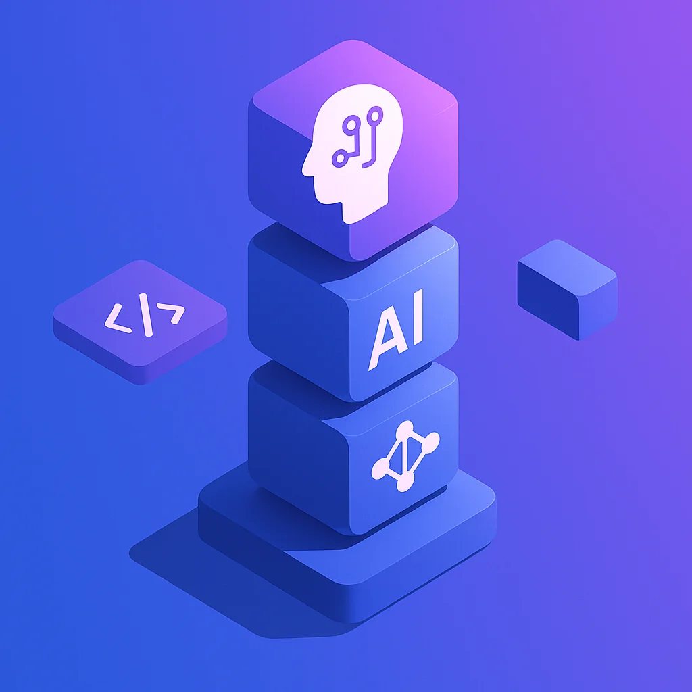
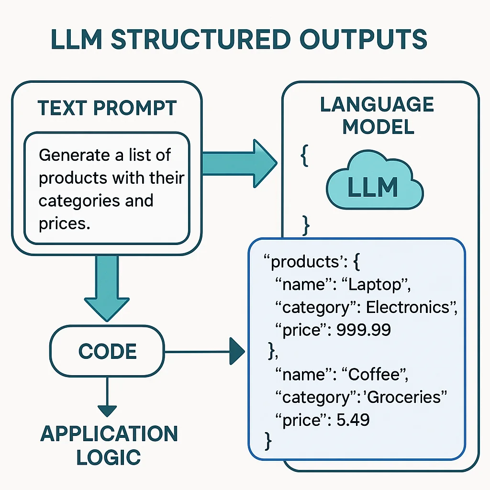
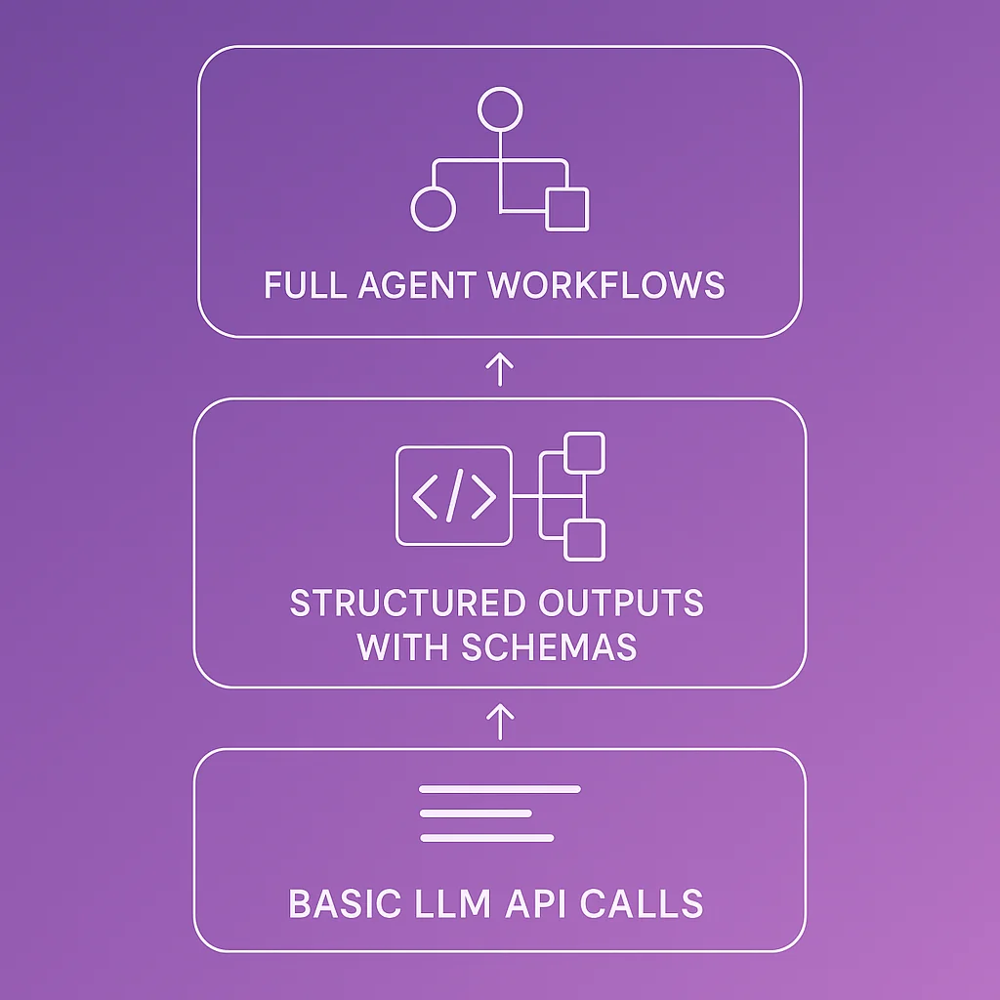

Have you ever sat down and really thought about AI as a building block? Strip away the complexity, and engineering boils down to capturing flows of logic and building them together. Historically, programmers have been called "if/else bots" because so much of our work is stringing business logic together—if this, do that; if that, do this.

We've spent immense amounts of time making programming more expressive and dynamic: rules engines, data persistence, increasingly sophisticated abstractions. But here's the thing—**programming was always super deterministic** unless we intentionally injected randomness.

And that's kind of limiting, isn't it?

**Some business ideas don't want deterministic. They want creative.**

Capturing creativity has been difficult, but it's not impossible now that we have LLMs and other AI tools. The challenge is understanding how to package them, how to bring them together. This is what we need to figure out as agentic engineers.

## The Building Blocks of AI Engineering

I don't think many of us have stopped to really think about what you can do with an LLM. Let's break down the fundamental building blocks, from the simplest to the most powerful, and see how they compose into something extraordinary.

### Building Block #1: Basic LLM Calls

Let's start with the most basic example using OpenAI's API:

```javascript
import OpenAI from 'openai';

export async function askOpenAI(prompt) {
  const client = new OpenAI({
    apiKey: process.env.OPENAI_API_KEY,
  });

  const completion = await client.chat.completions.create({
    model: 'gpt-4o',
    messages: [
      { role: 'user', content: prompt },
    ],
  });

  return completion.choices[0].message.content;
}
```

This is the foundation of LLMs: **take context, shove it through a large language model, get content back out.**

You can ask it anything:
- "Write me a poem about flowers"
- "Tell me about your favorite things"
- "Why is blue such an awesome color?"

And you'll get fluid, potentially thoughtful responses.

**But here's where it gets interesting:** Even for something as simple as form fields on a website, you could use this to create a more immersive experience. If someone has to use your site every day and all the "hello" messages are boring, hook up a function like this, throw some caching on it, and boom—your greeting message changes dynamically every hour.

This is the first time we can basically **take some text, shove it in, and get other text out with logic applied.**



### Building Block #2: Structured Outputs with Zod

But basic text output is limited. What if you need the LLM to return data in a specific format? Enter structured outputs:

```javascript
import { z } from 'zod';

/**
 * @template T
 * @param {z.ZodType<T>} schema - Zod schema defining expected output
 * @param {string} prompt - The prompt to send to the LLM
 * @returns {Promise<T>} Parsed and validated response
 */
export async function askLLMStructured(schema, prompt) {
  const client = new OpenAI({
    apiKey: process.env.OPENAI_API_KEY,
  });

  const res = await client.chat.completions.create({
    model: 'gpt-4o-mini',
    messages: [{ role: 'user', content: prompt }],
    response_format: {
      type: 'json_schema',
      json_schema: {
        name: 'Result',
        schema: schema.toJSONSchema(),
      },
    },
  });

  return schema.parse(JSON.parse(res.choices[0].message.content ?? '{}'));
}
```

**Usage example:**

```javascript
const BookSchema = z.object({
  title: z.string(),
  author: z.string(),
  year: z.number(),
});

const book = await askLLMStructured(
  BookSchema,
  'Give me information about the book "1984"'
);

console.log(book.title, book.author, book.year);
```

This is incredibly powerful. Look at what we have here: **a way to structure output from an LLM.**

This was a huge deal when it was introduced. Why? Because it lets you take complicated data structures and hook them back into code. You can easily inject logic with customizable outputs anywhere in your system.

**It's non-deterministic, but it is structured.**

If you want logical processing with some variance and creativity, but you need to hook it back into your application—this is powerful.



### The Foundation of Tool Chains

Here's the thing: **this structured schema portion is the foundation of tool chains, assistants with tools, MCPs—all of it.**

A tool call has a JSON schema for parameters. The LLM generates those parameters, hands them to you, you call your function, and pass the result back. This is true with MCPs (Model Context Protocol). Any tools they have where the LLM needs to provide data are doing the same thing you see in that 15-line code snippet above.

**It's literally just the ability to have a logical layer interface with a code layer.**

You could very easily take this snippet, shove it in your application, and I guarantee you can find interesting ways to use it.

### Building Block #3: Full Agent Workflows

Now let's move way up the stack. We've had tools, we've had MCPs, we've had custom prompting. We pushed more and more until we got assistants—long-running threads that maintain context and have access to tons of tools.

This birthed products like Claude Code, OpenAI Codex, Cursor, Windsurf, and many others.

But have you considered that **even these can be scripted, structured, and composed**?

Here's an example using Claude Code CLI:

```javascript
import { execSync } from 'child_process';

export function askClaude(prompt) {
  const cmd = `claude -p "${prompt}" --dangerously-skip-permissions --output-format json`;

  try {
    const result = execSync(cmd, {
      encoding: 'utf8',
      stdio: ['pipe', 'pipe', 'pipe'],
    });

    return JSON.parse(result);
  } catch (error) {
    console.error(`❌ Claude CLI error: ${error.message}`);
    if (error.stderr) {
      console.error(error.stderr.toString());
    }
    throw error;
  }
}
```

**Hold on.** We can have a structured result packaged in JSON format. We can pass this to Claude Code, which can run any number of MCPs, workflows, slash commands, and complex logic—and then return a summary of what it has done.

**This is just another building block.**

Is this progressively less deterministic? Yes. But not all business requirements are deterministic.

If you're working on an MVP product idea and you want to iterate—"let me see what one version looks like, then I'll give feedback for version two, then version three"—imagine iterating actual MVPs into products this way.

**This is the direction agentic engineering is bringing us toward.**



## Composing Building Blocks into Powerful Systems

You don't always need the full power of all these tools at any given time.

**Maybe you're working on a script and just need sample data for a UI.** Use the structured output approach.

**Maybe you want a dynamic welcome message that doesn't bore users.** Hook up a basic LLM call with caching, refresh it hourly, and you're done.

**Maybe you're building an MVP and want to iterate rapidly.** Script the agent workflow to generate variations based on your feedback.

These small components can be hooked together into much bigger ideas. That's what we're here to explore.

## Think in Components, Not Monoliths

Take the time to think about these little components. Think about how you could use them.

**None of these are large, crazy things.** All of them can trivially fit inside your application in a utility file that you call.

**This is powerful.** Think about it. See what you can come up with.

By bringing together these higher-order compositions, we start to unlock more and more power. This is the direction agentic engineering is taking us—toward systems that blend deterministic logic with creative, non-deterministic AI building blocks.

The future of programming isn't just about if/else statements. It's about composing intelligent, creative building blocks into applications that can surprise and delight us.
