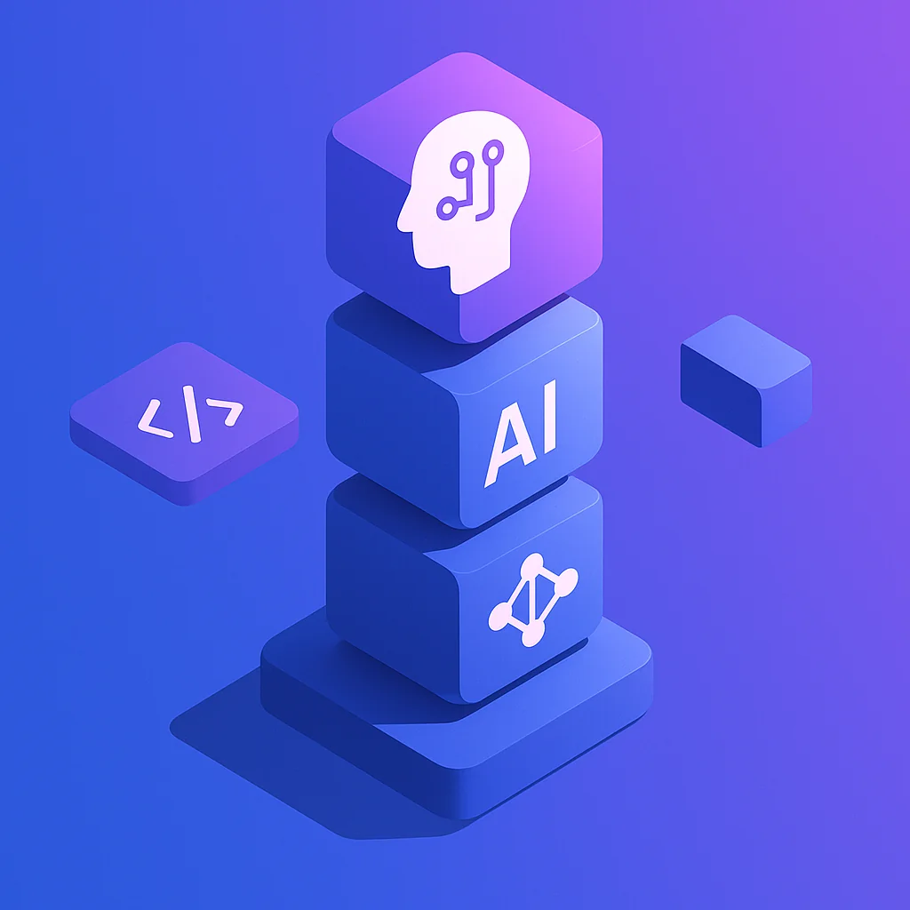
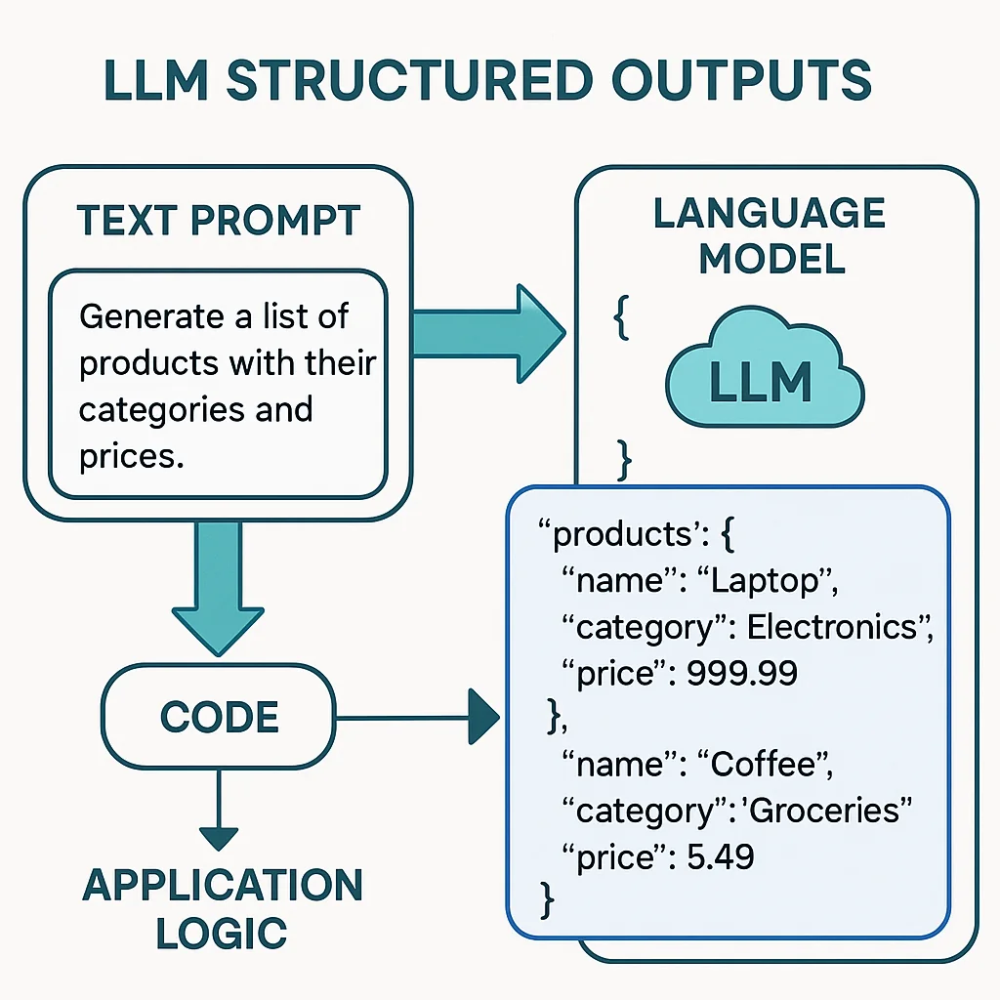
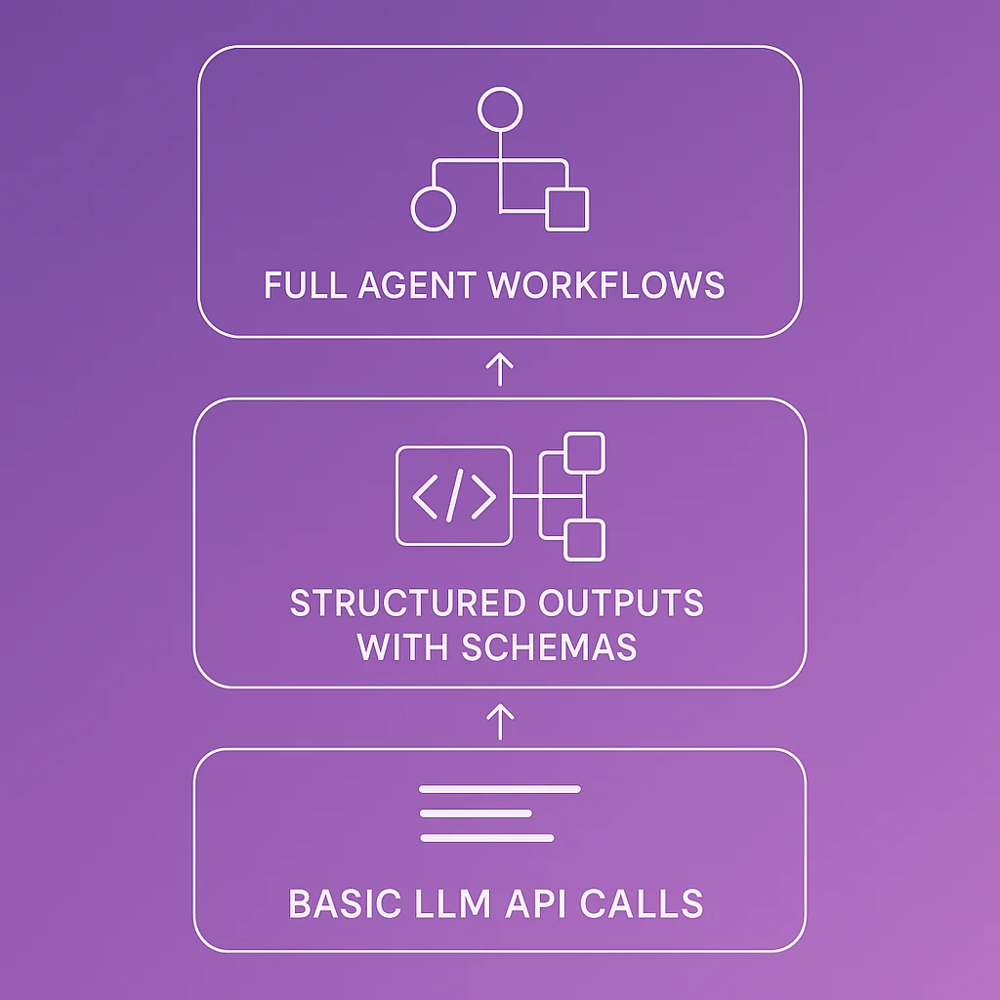

Have you ever sat down and really thought about AI as a building block? Strip away the complexity, and engineering boils down to capturing flows of logic and stitching them together. Programmers have been called "if/else bots" for a reason. So much of our work is wiring business logic: if this, do that; if that, do this.

We've spent decades making programming more expressive and dynamic. Rules engines, data persistence, increasingly sophisticated abstractions. But programming was always deterministic unless we intentionally injected randomness.

That's kind of limiting, isn't it?

**Some business ideas don't want deterministic. They want creative.**

Capturing creativity has been hard, but it's not impossible now that we have LLMs and other AI tools. The real question is how to package them, how to bring them together. That's the work for us as agentic engineers.

## The building blocks of AI engineering

Most of us haven't stopped to really think about what you can do with an LLM. So let's walk through the fundamental building blocks, from the simplest to the most powerful, and see how they compose into something bigger.

### Building block #1: Basic LLM calls

Start with the most basic example using OpenAI's API:

```javascript
import OpenAI from 'openai';

export async function askOpenAI(prompt) {
  const client = new OpenAI({
    apiKey: process.env.OPENAI_API_KEY,
  });

  const completion = await client.chat.completions.create({
    model: 'gpt-4o',
    messages: [
      { role: 'user', content: prompt },
    ],
  });

  return completion.choices[0].message.content;
}
```

This is the foundation of LLMs: **take context, shove it through a large language model, get content back out.**

You can ask it anything:
- "Write me a poem about flowers"
- "Tell me about your favorite things"
- "Why is blue such an awesome color?"

You'll get fluid, often thoughtful responses.

Now consider where this gets interesting. Even for something as simple as form fields on a website, you can use this to create a more immersive experience. If someone uses your site every day and all the "hello" messages are boring, hook up a function like this, throw some caching on it, and your greeting changes dynamically every hour.

For the first time, we can take some text, push it in, and get other text out with logic applied.



### Building block #2: Structured outputs with Zod

Basic text output is limited. What if you need the LLM to return data in a specific format? That's where structured outputs come in:

```javascript
import { z } from 'zod';

/**
 * @template T
 * @param {z.ZodType<T>} schema - Zod schema defining expected output
 * @param {string} prompt - The prompt to send to the LLM
 * @returns {Promise<T>} Parsed and validated response
 */
export async function askLLMStructured(schema, prompt) {
  const client = new OpenAI({
    apiKey: process.env.OPENAI_API_KEY,
  });

  const res = await client.chat.completions.create({
    model: 'gpt-4o-mini',
    messages: [{ role: 'user', content: prompt }],
    response_format: {
      type: 'json_schema',
      json_schema: {
        name: 'Result',
        schema: schema.toJSONSchema(),
      },
    },
  });

  return schema.parse(JSON.parse(res.choices[0].message.content ?? '{}'));
}
```

**Usage example:**

```javascript
const BookSchema = z.object({
  title: z.string(),
  author: z.string(),
  year: z.number(),
});

const book = await askLLMStructured(
  BookSchema,
  'Give me information about the book "1984"'
);

console.log(book.title, book.author, book.year);
```

This is powerful. Look at what we have: **a way to structure output from an LLM.**

This was a huge deal when it shipped. It lets you take complicated data structures and feed them back into code. You can inject logic with customizable outputs anywhere in your system.

**It's non-deterministic, but it is structured.**

If you want logical processing with some variance and creativity, but you also need to hook it back into your application, this is your tool.



### The foundation of tool chains

That structured schema pattern is also the foundation of tool chains, assistants with tools, and MCPs. All of it.

A tool call has a JSON schema for parameters. The LLM generates those parameters, hands them to you, you call your function, and pass the result back. Same story with MCPs (Model Context Protocol). Any tool where the LLM needs to provide data is doing what you see in that 15-line snippet above.

**It's literally just a logical layer interfacing with a code layer.**

You could take this snippet, drop it into your application, and I guarantee you'll find interesting ways to use it.

### Building block #3: Full agent workflows

Now move way up the stack. We've had tools, MCPs, custom prompting. We kept pushing until we got assistants: long-running threads that maintain context and have access to tons of tools.

That's where products like Claude Code, OpenAI Codex, Cursor, Windsurf, and many others came from.

But have you considered that **even these can be scripted, structured, and composed**?

Here's an example using Claude Code CLI:

```javascript
import { execSync } from 'child_process';

export function askClaude(prompt) {
  const cmd = `claude -p "${prompt}" --dangerously-skip-permissions --output-format json`;

  try {
    const result = execSync(cmd, {
      encoding: 'utf8',
      stdio: ['pipe', 'pipe', 'pipe'],
    });

    return JSON.parse(result);
  } catch (error) {
    console.error(`❌ Claude CLI error: ${error.message}`);
    if (error.stderr) {
      console.error(error.stderr.toString());
    }
    throw error;
  }
}
```

**Hold on.** We can get a structured result back in JSON. We can hand a prompt to Claude Code, which can run any number of MCPs, workflows, slash commands, and complex logic, then return a summary of what it did.

**This is just another building block.**

Is it progressively less deterministic? Yes. But not all business requirements need to be deterministic.

If you're working on an MVP product idea and you want to iterate ("let me see what one version looks like, then I'll give feedback for version two, then version three"), imagine iterating actual MVPs into products this way.

**This is the direction agentic engineering is taking us.**



## Composing building blocks into powerful systems

You don't always need the full power of all these tools at once.

Working on a script and just need sample data for a UI? Use the structured output approach.

Want a dynamic welcome message that doesn't bore users? Hook up a basic LLM call with caching, refresh it hourly, and you're done.

Building an MVP and want to iterate rapidly? Script the agent workflow to generate variations based on your feedback.

These small components can be hooked together into much bigger ideas. That's the work.

## Think in components, not monoliths

Take time to think about these little components. Think about how you could use them.

**None of these are large, crazy things.** All of them trivially fit inside your application in a utility file that you call.

**This is powerful.** Think about it. See what you can come up with.

When you bring together these higher-order compositions, you start to unlock more and more power. That's the direction agentic engineering is taking us, toward systems that blend deterministic logic with creative, non-deterministic AI building blocks.

The future of programming isn't just if/else statements. It's composing intelligent, creative building blocks into applications that can surprise and delight us.
