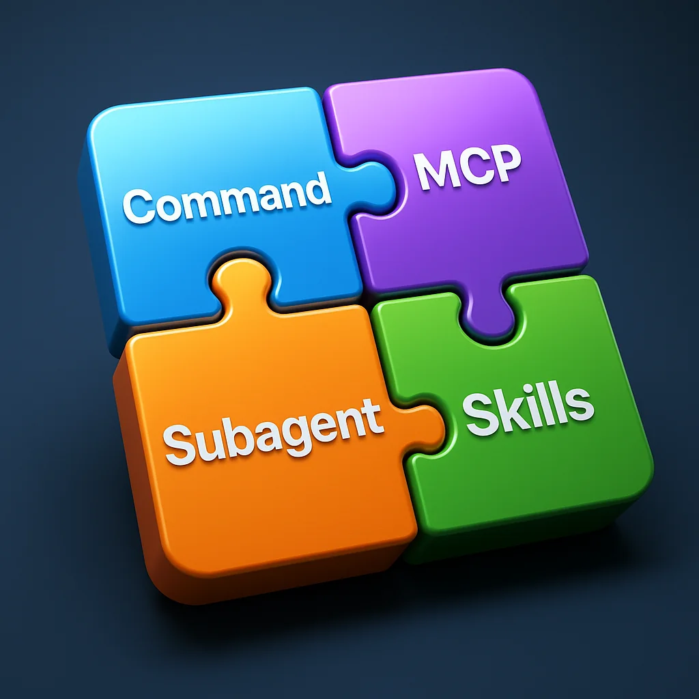
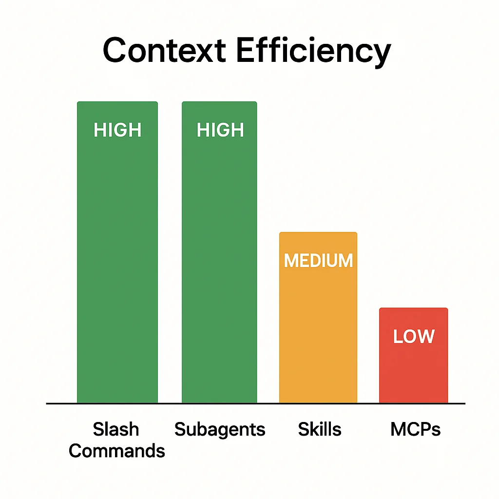
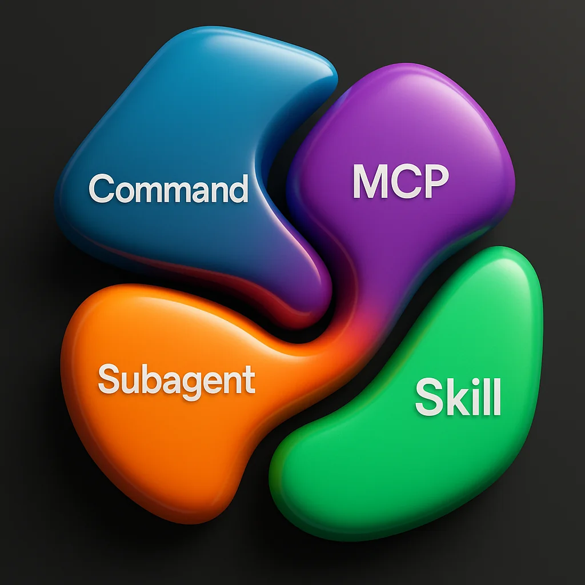

Claude Code grew up fast. What started as a coding assistant is now a real development environment with four distinct primitives: slash commands, MCPs, subagents, and skills. They all look useful in isolation. The harder question is when to reach for each one, and how they fit together.



## The four primitives of Claude Code

### 1. Slash commands: reusable prompt templates

You used to type the same long prompt every single time. Slash commands fix that. They turn a workflow into a markdown file you can trigger with a slash.

**What they are:** Reusable prompts for specific workflows or processes. A simple markdown doc, nothing more.

**Example use cases:**
- `/prime` for teaching your agent about your codebase structure
- Templated React component creation
- Standardized git commits
- Any repeatable workflow you run frequently

Slash commands were the first Claude Code feature to go viral, and the reason is obvious: they're simple and they work.

### 2. MCPs: external tool integration

MCP stands for "Model Context Protocol" (a terrible name that tells you nothing about what it does). Think of MCPs as tools for your agents. They extend what your AI can do by pulling in external capabilities.

**What they are:** External integrations that bring tools, data, and functionality into your LLM from outside systems.

**Why they exist:** Early LLMs had knowledge cutoffs and thought it was a year ago. Simple tools like "get weather" or "get coordinates" showed the pattern for bringing fresh, external information into the model. Today MCPs cover almost anything you can think of.

**Example use cases:**
- Pull JIRA or Asana tickets into your workflow
- Query your Postgres, Convex, or other data stores
- Get real-time weather data
- Access any external API or service

**Key insight:** When you think MCP, think external. These are your bridges to the outside world.

### 3. Subagents: parallel task execution

Subagents tend to be the crowd favorite, and for good reason. These specialists run in parallel, finish their task, and hand back results without polluting your main agent's context window.

**What they are:** Isolated agent instances that run in parallel and focus on a specific task.

**Unique traits:**
- **Parallelizable.** Spin off 2, 3, 4, or more at once.
- **No context persistence.** They return results, then forget their work.

**The trade-off:** Context persistence cuts both ways. If you wanted that intermediate work, it's gone. But if you needed to scrape 400 websites and only care about the final research report, you just saved a huge amount of context by not keeping all that HTML around.

**Example use cases:**
- Research 400 websites and return one summary report
- Fix failing tests when you don't care about the investigation process
- Parallel processing of multiple independent tasks
- Any workflow where you only care about the output, not the steps

If context window issues are biting you, check out our other posts on taming context windows.

### 4. Skills: local capability packages

Skills are the newest addition to Claude Code. They're packaged workflows that unlock new capabilities for your agent.

**What they are:** Local processes that give your agent specialized expertise in a particular domain.

**Key characteristics:**
- Not stored in memory like tools or MCPs
- A grep-like process finds relevant skills when needed
- Loaded into context only when triggered
- Often use libraries under the hood

**The difference from MCPs:**
- MCPs are external (API calls, remote services)
- Skills are local (libraries, local processes)

**Example use cases:**
- Extract text from images
- Generate PowerPoint or Word documents
- Manage git worktrees with your preferred workflow
- Any local process or specialized expertise domain

**Best practice:** Skills work best for a classification of problems, not a specific flow. Don't write a skill called "create a worktree." Write one called "manage worktrees" with your preferred conventions built in.

## Context efficiency comparison

How each primitive uses context shapes what you should build with it.



### Slash commands: high efficiency

Built for straightforward, direct tasks. Minimal token waste. You get exactly what you asked for, nothing more.

### MCPs: context cost

Tools are loaded into memory, almost like a system prompt, which eats into available context. Verbose descriptions and bloated tool definitions add up fast. Be picky about which MCPs you load.

### Subagents: high efficiency

Specialized agents that do their job without leaking back into your main context. The lack of persistence is exactly why they save so much context when you don't need the intermediate steps.

### Skills: mid efficiency

Not stored in memory like tools, but they can load when you didn't want them to. Skills use grep to find matches, so imprecise descriptions or wandering language will trigger context loads you didn't plan for.

**Pro tip for skills:** Write precise, targeted descriptions. Wander into related topics and you'll blow up your context window by accident.

## Composition: the secret sauce

Here's the real point. You don't use these in isolation. You compose them.

### Composition rules

**MCPs:**
- Used by everything
- Enhance slash commands, subagents, and skills
- Don't use MCPs to orchestrate other primitives. Use them as building blocks.

**Slash commands:**
- Can run slash commands, MCPs, subagents, and skills
- The most foundational primitive for orchestration
- Example: "Get Asana ticket details (MCP), research in Slack (subagent), write plan"

**Subagents:**
- Can run slash commands, MCPs, and skills
- Cannot run other subagents. No recursive agent spawning.
- Only the main agent orchestrates subagents

**Skills:**
- Can run slash commands, MCPs, subagents, and skills
- Similar orchestration power to slash commands
- Best for domain-specific expertise

### Composition matrix



| Primitive | Can Use Slash Commands | Can Use MCPs | Can Use Subagents | Can Use Skills |
|-----------|----------------------|-------------|------------------|---------------|
| Slash Commands | ✅ | ✅ | ✅ | ✅ |
| MCPs | ❌ | ❌ | ❌ | ❌ |
| Subagents | ✅ | ✅ | ❌ | ✅ |
| Skills | ✅ | ✅ | ✅ | ✅ |

## When to use each primitive

### Use slash commands when:
- You have a repeatable workflow
- You want to template a process
- You need to orchestrate multiple primitives
- You want the most foundational building block

### Use MCPs when:
- You need external data or services
- You're integrating with APIs
- You want to extend agent capabilities with outside tools
- You need real-time or current information

### Use subagents when:
- You can parallelize work
- You only care about output, not process
- You want to avoid context pollution
- You need isolated task execution

### Use skills when:
- You want to package domain expertise
- You need local process capabilities
- You're managing a classification of problems
- You want conditional context loading

## Real-world composition examples

### Example 1: feature development workflow

```
Slash Command: /build-feature
├── MCP: Get JIRA ticket details
├── Subagent: Research similar implementations in Slack history
├── Slash Command: /write-plan
└── Skill: Generate technical specification document
```

### Example 2: content research pipeline

```
Subagent (parallel): Research 10 websites each × 4 instances
├── MCP: Web scraping tool
└── Skill: Extract and summarize key points
→ Return: Single consolidated research report
```

### Example 3: git workflow management

```
Skill: Manage git worktrees
├── Slash Command: /create-worktree
├── MCP: GitHub API integration
└── Slash Command: /sync-branches
```

## Key takeaways

1. Slash commands are reusable workflow templates (high context efficiency).
2. MCPs bring external tools and data (context cost, but often necessary).
3. Subagents handle parallel task execution without context persistence (high efficiency).
4. Skills package local domain expertise (mid efficiency, write them carefully).

5. Composition is where the real power is. Don't use these in isolation. Mix and match.

6. Think about context. Knowing the efficiency profile of each primitive helps you architect better solutions.

7. Match primitives to use cases. External means MCP. Parallel means subagent. Workflow means slash command. Expertise means skill.

Claude Code has turned into a serious platform with serious primitives. Once you know when to use each one, and how to compose them, your workflows get sharper, smaller, and easier to maintain.

Now go compose wisely. Don't get discombobulated. 🚀
