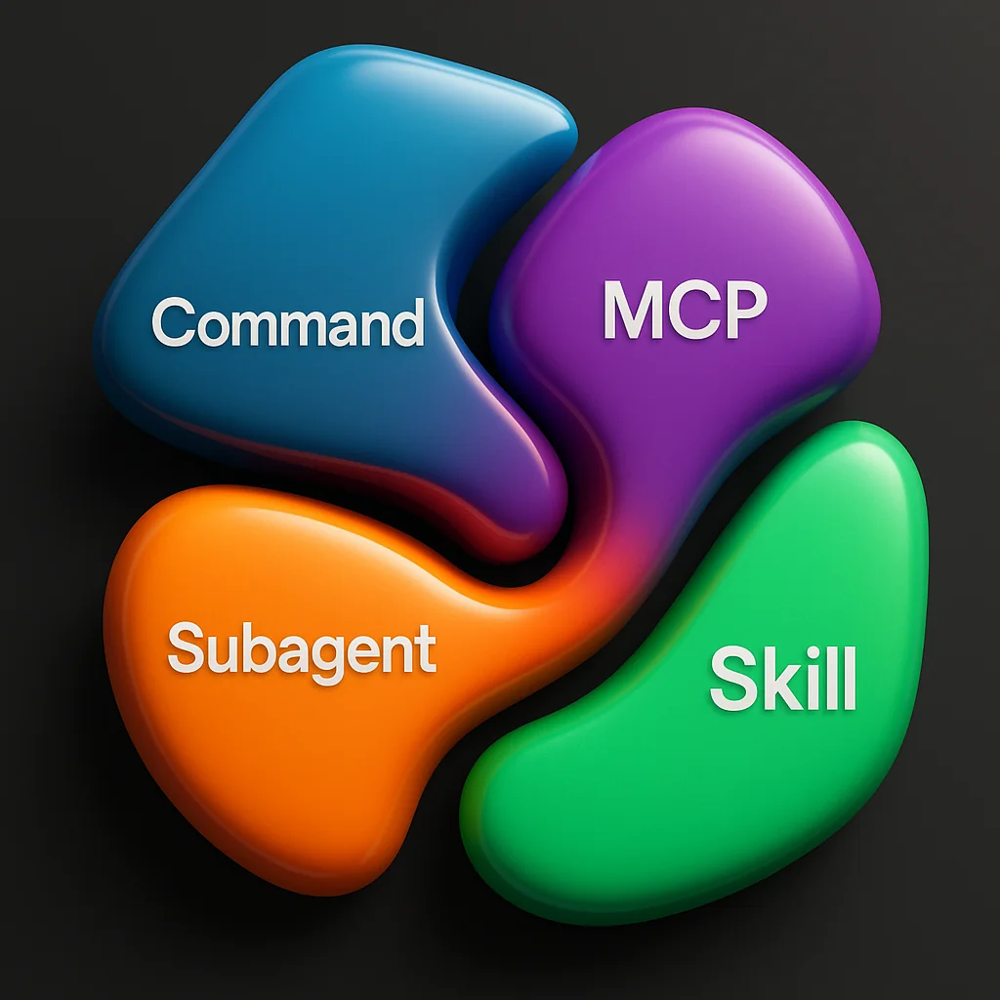

Claude Code has evolved from a simple powerhouse into a sophisticated development environment with multiple features. Now we have slash commands, MCPs, subagents, and skills—all amazing tools, but when should you use each one? Let's break down these four primitives and understand how to compose them effectively.


## The Four Primitives of Claude Code

### 1. Slash Commands: Reusable Prompt Templates

Remember when success meant typing out the perfect prompt every single time? Slash commands eliminate that repetition by templating your workflows into reusable markdown files.

**What they are:** Reusable prompts for specific workflows or processes. Just a simple markdown doc that you can trigger with a slash.

**Example use cases:**
- `/prime` - Teach your agent about your codebase structure
- Templated React component creation
- Standardized git commits
- Any repeatable workflow you run frequently

Slash commands were the first feature that went viral in Claude Code, and for good reason—they're beautifully simple and incredibly effective.

### 2. MCPs: External Tool Integration

MCP stands for "Model Context Protocol" (admittedly a terrible name that doesn't describe what it does). Think of MCPs as **tools for your agents**—they extend what your AI can do by bringing in external capabilities.

**What they are:** External integrations that bring tools, data, and functionality into your LLM from outside systems.

**Why they exist:** LLMs originally had knowledge cutoffs, thinking it was a year ago. Tools like "get weather" or "get coordinates" demonstrated how to bring current, external information into the model. Now MCPs cover almost anything you can dream of.

**Example use cases:**
- Pull JIRA or Asana tickets into your workflow
- Query your Postgres, Convex, or other data stores
- Get real-time weather data
- Access any external API or service

**Key insight:** When you think MCP, think **external**. These are your bridges to the outside world.

### 3. Subagents: Parallel Task Execution

Subagents are the crowd favorites—and with good reason. These specialists can work in parallel, complete their tasks, and return results without polluting your main agent's context window.

**What they are:** Isolated agent instances that can run in parallel and focus on specific tasks.

**Unique traits:**
- **Parallelizable** - Spin off 2, 3, 4, or more at once
- **No context persistence** - They hand back results but forget their work

**The trade-off:** Context persistence is both a pro and a con. If you wanted all that intermediate work, it's gone. But if you needed to scrape 400 websites and only want the final research report, you just saved massive amounts of context by not keeping all that HTML.

**Example use cases:**
- Research 400 websites and return one summary report
- Fix failing tests without caring about the investigation process
- Parallel processing of multiple independent tasks
- Any workflow where you only care about the output, not the steps

If you're having context window issues, check out our other posts on taming context windows for solutions!

### 4. Skills: Local Capability Packages

Skills are the newest addition to Claude Code—packaged workflows that unlock new capabilities for your agent.

**What they are:** Local processes that give your agent specialized expertise in a particular domain.

**Key characteristics:**
- **Not stored in memory** like tools/MCPs
- Use a grep-like process to find relevant skills when needed
- Load into context only when triggered
- Often use libraries under the hood to perform tasks

**The difference from MCPs:**
- **MCPs** = External (API calls, remote services)
- **Skills** = Local (libraries, local processes)

**Example use cases:**
- Extract text from images
- Generate PowerPoint or Word documents
- Manage git worktrees with your preferred workflow
- Any local process or specialized expertise domain

**Best practices:** Skills are great for managing a **classification of a problem**, not a specific flow. For instance, don't use a skill to "create a worktree"—use it to "manage worktrees" with all your preferred conventions built in.

## Context Efficiency Comparison

Understanding how each primitive uses context helps you make better architectural decisions:


### Slash Commands: High Efficiency ✅
Designed for straightforward, direct tasks. Everything runs with minimal token waste—exactly what you need, nothing more.

### MCPs: Context Cost ⚠️
Tools are loaded into memory (almost like a system prompt), which reduces available context. Large descriptions and verbose tool definitions eat tokens. Be mindful of which MCPs you load.

### Subagents: High Efficiency ✅
Specialized agents that excel at their task without polluting your main context. The lack of persistence means massive context savings when you don't need the intermediate steps.

### Skills: Mid Efficiency ⚙️
Not stored in memory like tools, but can accidentally load when you don't want them to. Skills use grep to find relevant matches, so imprecise descriptions or wandering language can trigger unwanted context loading.

**Pro tip for skills:** Write precise, targeted descriptions. Don't wander into related topics or you'll accidentally blow up your context window.

## Composition: The Secret Sauce

Here's the real insight: **You don't want to use these in isolation—you want to compose them.**

### Composition Rules

**MCPs:**
- Used by everything
- Enhance capabilities of slash commands, subagents, and skills
- Don't use MCPs to orchestrate other primitives—use them as building blocks

**Slash Commands:**
- Can run: slash commands, MCPs, subagents, skills
- Most foundational primitive for orchestration
- Example: "Get Asana ticket details (MCP) → research in Slack (subagent) → write plan"

**Subagents:**
- Can run: slash commands, MCPs, skills
- **Cannot run other subagents** (no recursive agent spawning)
- Only the main agent orchestrates subagents

**Skills:**
- Can run: slash commands, MCPs, subagents, skills
- Similar orchestration power to slash commands
- Best for domain-specific expertise management

### Composition Matrix



| Primitive | Can Use Slash Commands | Can Use MCPs | Can Use Subagents | Can Use Skills |
|-----------|----------------------|-------------|------------------|---------------|
| Slash Commands | ✅ | ✅ | ✅ | ✅ |
| MCPs | ❌ | ❌ | ❌ | ❌ |
| Subagents | ✅ | ✅ | ❌ | ✅ |
| Skills | ✅ | ✅ | ✅ | ✅ |

## When to Use Each Primitive

### Use Slash Commands When:
- You have a repeatable workflow
- You want to template a process
- You need to orchestrate multiple primitives
- You want the most foundational building block

### Use MCPs When:
- You need external data or services
- You're integrating with APIs
- You want to extend agent capabilities with outside tools
- You need real-time or current information

### Use Subagents When:
- You can parallelize work
- You only care about output, not process
- You want to avoid context pollution
- You need isolated task execution

### Use Skills When:
- You want to package domain expertise
- You need local process capabilities
- You're managing a classification of problems
- You want conditional context loading

## Real-World Composition Examples

### Example 1: Feature Development Workflow

```
Slash Command: /build-feature
├── MCP: Get JIRA ticket details
├── Subagent: Research similar implementations in Slack history
├── Slash Command: /write-plan
└── Skill: Generate technical specification document
```

### Example 2: Content Research Pipeline

```
Subagent (parallel): Research 10 websites each × 4 instances
├── MCP: Web scraping tool
└── Skill: Extract and summarize key points
→ Return: Single consolidated research report
```

### Example 3: Git Workflow Management

```
Skill: Manage git worktrees
├── Slash Command: /create-worktree
├── MCP: GitHub API integration
└── Slash Command: /sync-branches
```

## Key Takeaways

1. **Slash commands** = Reusable workflow templates (high context efficiency)
2. **MCPs** = External tools and data (context cost, but necessary)
3. **Subagents** = Parallel task execution without context persistence (high efficiency)
4. **Skills** = Local domain expertise packages (mid efficiency, write carefully)

5. **Composition is key** - Don't use these in isolation. Mix and match to create powerful workflows.

6. **Think about context** - Understanding efficiency helps you architect better solutions.

7. **Match primitives to use cases** - External = MCP, Parallel = Subagent, Workflow = Slash Command, Expertise = Skill

Claude Code has evolved into a sophisticated platform with powerful primitives. By understanding when to use each one—and more importantly, how to compose them—you'll build more efficient, maintainable, and powerful AI-assisted workflows.

Now go forth and compose wisely. Don't get discombobulated! 🚀
