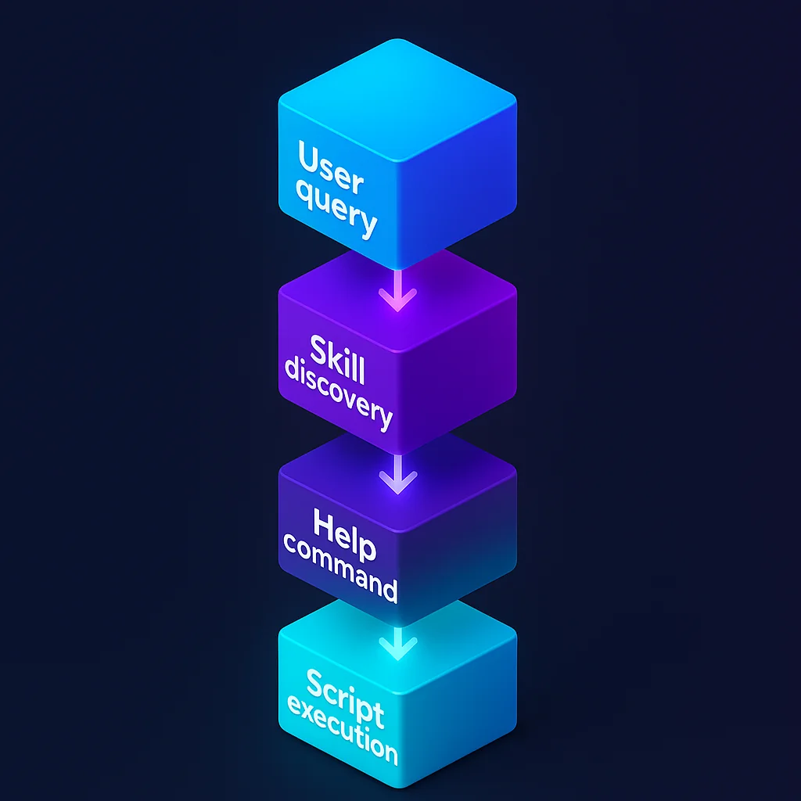
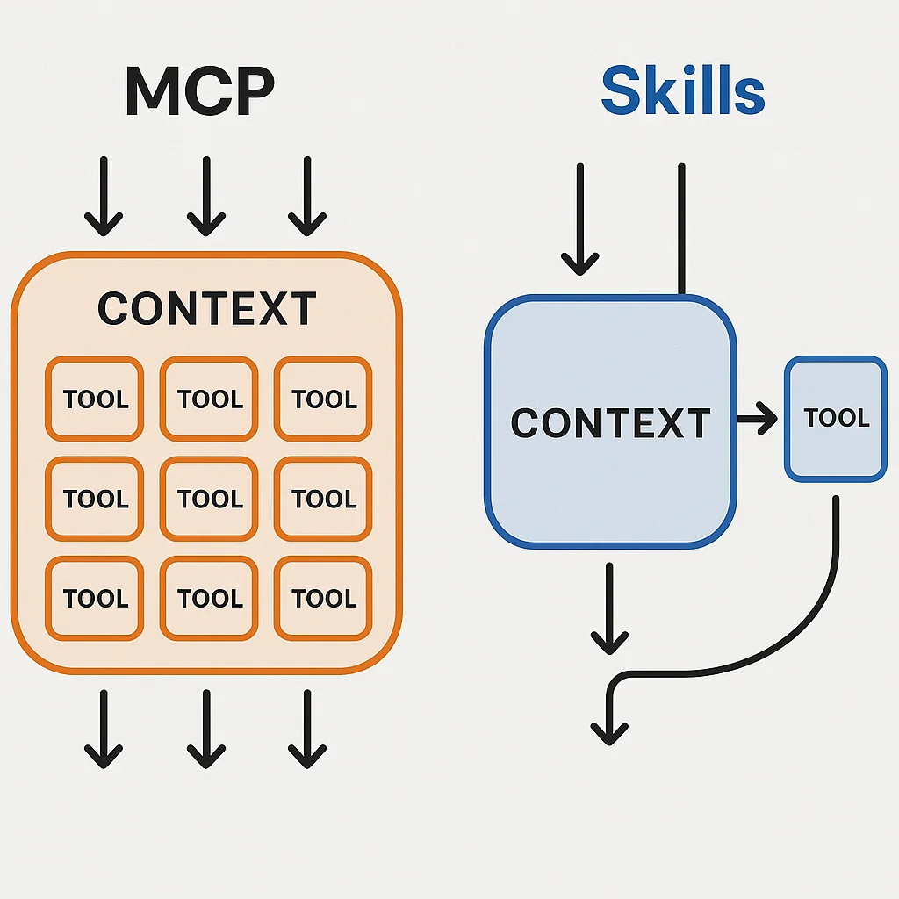

Context is precious. The more you work with AI agents, the more obvious that becomes. One of the biggest issues with Model Context Protocol (MCP) servers is that they preload tool descriptions into your agent's context window, burning tokens before you even need them.

Large MCP servers can eat up serious context. And the more complex your task gets, the more context you need to solve it. Paying a fixed context tax for tools you aren't using is wasteful.

There's a better pattern: Claude Code Skills.

## The MCP context problem

Say you spin up an agent to write some code. Maybe you have:
- An MCP for internet research
- An MCP for weather data
- An MCP for database queries
- An MCP for YouTube analysis

Useful capabilities, all of them. But they all consume context by default just by being loaded. You want them available, but you don't want them eating your context window when they're idle.

## The Skills alternative

Claude Code Skills takes a different approach: zero context until needed.



We'll build a simple weather skill that handles current conditions and forecasts. I'll walk through how this works using a [real implementation example](https://github.com/Mandalorian007/claude-skill-context-test).

### How Skills work: the discovery flow

Here's what happens when you ask about weather:

```
User: "What's the weather in NYC?"
    ↓
Claude discovers weather skill (reads SKILL.md)
    ↓
Claude runs: uv run .claude/skills/weather/scripts/current.py --help
    ↓
Claude learns the tool's interface
    ↓
Claude runs: uv run .claude/skills/weather/scripts/current.py "New York City"
    ↓
Real weather data returned
```

**Context used**: Minimal metadata and interface description
**Context saved**: All implementation details (API calls, formatting, error handling)

## Building a weather skill: step by step

### 1. Directory structure

Skills follow a clean, predictable pattern:

```
.claude/skills/weather/
├── SKILL.md                  # Discovery metadata
└── scripts/
    ├── current.py            # Current weather tool
    └── forecast.py           # Forecast tool
```

### 2. The SKILL.md file

This is the only file Claude reads by default, and only when the skill is relevant:

```markdown
---
name: weather
description: Access weather data including current conditions and forecasts. Use when the user asks about weather, temperature, forecasts, or conditions for a location.
---

# Weather

Standalone scripts for weather data.

## Instructions

- **Never read script source code** — always run `<script.py> --help` first to learn usage
- Run with `uv run .claude/skills/weather/scripts/<script.py> --help`

## Available Scripts

- `current.py` — current weather conditions
- `forecast.py` — multi-day weather forecast

## Configuration

Requires `.env` — see `.env.example` for template.
```

Key design points:
- YAML frontmatter handles skill activation matching
- Clear instruction: use `--help`, never read source code
- Minimal, focused content
- Lists available tools with one-line descriptions

### 3. Self-contained scripts with PEP 723

Each script is fully self-contained using Python's PEP 723 standard:

```python
#!/usr/bin/env -S uv run --script
# /// script
# requires-python = ">=3.11"
# dependencies = [
# "httpx",
# "python-dotenv",
# "click",
# ]
# ///
"""Fetch current weather data for a location."""

import os
import sys

import click
import httpx
from dotenv import load_dotenv

@click.command()
@click.argument("location")
def current(location: str) -> None:
    """Get current weather for LOCATION (city name, zip code, or coordinates)."""
    load_dotenv()

    api_url = os.getenv("WEATHER_API_URL")
    api_key = os.getenv("WEATHER_API_KEY")

    if not api_url or not api_key:
        click.echo("Error: WEATHER_API_URL and WEATHER_API_KEY must be set", err=True)
        sys.exit(1)

    response = httpx.get(
        f"https://{api_url}/current.json",
        params={"q": location},
        headers={
            "x-rapidapi-host": api_url,
            "x-rapidapi-key": api_key,
        },
    )

    if response.status_code != 200:
        click.echo(f"Error: API returned {response.status_code}", err=True)
        sys.exit(1)

    data = response.json()

    # Display formatted weather data
    loc = data["location"]
    cur = data["current"]

    click.echo(f"\n📍 {loc['name']}, {loc.get('region', '')}, {loc['country']}")
    click.echo(f"   Local time: {loc['localtime']}")
    click.echo(f"\n🌡️ {cur['temp_f']}°F ({cur['temp_c']}°C)")
    click.echo(f"   Feels like {cur['feelslike_f']}°F ({cur['feelslike_c']}°C)")
    click.echo(f"   {cur['condition']['text']}")
    click.echo(f"\n💧 Humidity: {cur['humidity']}%")
    click.echo(f"💨 Wind: {cur['wind_mph']} mph {cur['wind_dir']}")
    click.echo(f"👁️ Visibility: {cur['vis_miles']} miles")
    click.echo()

if __name__ == "__main__":
    current()
```

A few things to notice:

1. Inline dependencies. No requirements.txt needed. Dependencies live in script metadata.
2. Click framework gives you automatic `--help` generation with proper argument validation.
3. Self-contained config. The script loads its own environment variables.
4. Clear error handling with proper exit codes and messages.
5. Rich output. Formatted, emoji-enhanced, ready for display.

### 4. Seeing it in action

Here's real output from running the skill:

```bash
> what's the weather in NYC?

> The "weather" skill is running

⏺ Bash(uv run .claude/skills/weather/scripts/current.py --help)
  ⎿ Usage: current.py [OPTIONS] LOCATION
     Get current weather for LOCATION (city name, zip code, or coordinates)

⏺ Bash(uv run .claude/skills/weather/scripts/current.py "New York City")
  ⎿ 📍 New York, New York, United States of America
       Local time: 2025-11-29 11:07

     🌡️ 37°F (2.8°C), feels like 29°F (-1.8°C)
        Sunny, clear skies

     💧 Humidity: 40%
     💨 Wind: 12.8 mph from the NW with gusts up to 15.5 mph
     👁️ Visibility: 9 miles

⏺ Current weather in New York City:
  - Temperature: 37°F (2.8°C), feels like 29°F (-1.8°C)
  - Conditions: Sunny, clear skies
  - Humidity: 40%
  - Wind: 12.8 mph from the NW with gusts up to 15.5 mph
  - Visibility: 9 miles

  It's a cold but clear and sunny day in NYC!
```

The workflow is straightforward:
1. Skill discovered and activated
2. Help command run to learn the interface
3. Tool executed with proper parameters
4. Results formatted and presented

All without preloading implementation code into context.

## The power of progressive disclosure

This pattern uses progressive disclosure to keep context consumption minimal:

1. Default state: zero context (skill not loaded)
2. Skill discovery: SKILL.md metadata when relevant
3. Tool learning: `--help` output to understand the interface
4. Execution: only the output data



Compare with MCP:
- MCP default: all tool descriptions loaded upfront
- MCP usage: tools described whether you need them or not
- MCP growth: more tools means more context consumed

With Skills:
- Skills default: nothing loaded
- Skills usage: load only what you need, when you need it
- Skills growth: add 1,000 tools and you add zero default context

## Scaling Skills: the real benefit

This is where the pattern shines. You can build skills for:

- Research: Reddit search, YouTube data, news APIs
- Development: database queries, API testing, deployment tools
- Media: movie data, TV shows, sports scores
- Finance: stock prices, crypto data, market analysis
- Communication: email, Slack, Discord integrations


Each skill adds zero default context overhead. The LLM picks which skill to load based on your query, learns only what it needs from `--help`, and runs.

You could realistically have 4,000 tools available while using zero context until you reach for one.

## Implementation patterns

### One script, one purpose

Keep scripts focused and independent:

```python
# Good: Focused on one task
current.py      # Current weather only
forecast.py     # Forecast only
alerts.py       # Weather alerts only

# Avoid: Multi-purpose with subcommands (adds complexity)
weather.py current
weather.py forecast
weather.py alerts
```

### Use standard tooling

The example uses:
- uv for Python dependency management (could be bun, npm, etc.)
- Click for CLI interfaces (could be argparse, typer, etc.)
- PEP 723 for inline dependencies (optional but recommended)

Pick whatever fits your workflow. The pattern works with any language that supports:
1. CLI argument parsing
2. `--help` output
3. Executable scripts

### Configuration strategy

Use environment variables for secrets and config:

```python
# .env.example
WEATHER_API_URL='weatherapi-com.p.rapidapi.com'
WEATHER_API_KEY='your_api_key_here'

# Load in script
from dotenv import load_dotenv
load_dotenv()

api_key = os.getenv("WEATHER_API_KEY")
```

This keeps credentials out of code and makes scripts portable across environments.

## When to use Skills vs MCPs

Use Skills when:
- You have many optional capabilities (10+ tools)
- Tools are used infrequently or conditionally
- Context efficiency matters for your workflow
- You want to grow your toolkit without context bloat

Use MCPs when:
- You need tools constantly available (always-in-context is fine)
- Tool discovery or activation time is unacceptable
- You need tight integration with external services
- You're building shared tools for multiple users or agents

Use both when:
- Core, always-needed capabilities work as MCPs
- Extended, situational capabilities work as Skills
- You want efficiency and availability together

## Key takeaways

The core pattern is simple:
1. Package tools as standalone scripts. Each script is self-contained with inline dependencies.
2. Provide `--help` documentation. Let the agent discover usage on demand.
3. Keep zero default context. Skills only load when relevant to the user's query.

That's it. No complex setup, no context overhead, infinite room to grow.

## Real-world example: complete implementation

Check out the [full working example on GitHub](https://github.com/Mandalorian007/claude-skill-context-test) to see:

- Complete SKILL.md configuration
- Both current.py and forecast.py implementations
- Environment setup with .env.example
- Full PEP 723 script metadata
- Click-based CLI interfaces
- Rich formatted output

The complete implementation gives you two fully functional weather tools with zero default context overhead.

## The core philosophy

Skills follow one simple principle: context is precious, load only what you need.

By packaging capabilities as standalone executable scripts that:
1. Declare their own dependencies (PEP 723)
2. Provide their own help documentation (`--help`)
3. Handle their own configuration (environment variables)
4. Return clean, formatted output

You get a scalable toolkit that grows without bloating your agent's context window.

## Getting started

Want to build your first skill? Here's the minimal starter:

```bash
# 1. Create the structure
mkdir -p .claude/skills/myskill/scripts

# 2. Create SKILL.md
cat > .claude/skills/myskill/SKILL.md << 'EOF'
---
name: myskill
description: Description of when to use this skill
---

# My Skill

## Instructions

- Run scripts with `uv run .claude/skills/myskill/scripts/<script.py> --help`

## Available Scripts

- `tool.py` — What this tool does
EOF

# 3. Create your first script
cat > .claude/skills/myskill/scripts/tool.py << 'EOF'
#!/usr/bin/env -S uv run --script
# /// script
# requires-python = ">=3.11"
# dependencies = ["click"]
# ///

import click

@click.command()
@click.argument("param")
def tool(param: str) -> None:
    """Tool description for --help output."""
    click.echo(f"Processing: {param}")
    # Your implementation here

if __name__ == "__main__":
    tool()
EOF

# 4. Make executable
chmod +x .claude/skills/myskill/scripts/tool.py

# 5. Test it
uv run .claude/skills/myskill/scripts/tool.py --help
```

That's it. You now have a working skill that consumes zero context until you need it.

## Conclusion

Context is a finite, valuable resource in agent workflows. MCPs are powerful, but they come with overhead that grows with every tool you add.

Claude Code Skills offer an alternative: zero-context tool discovery with lazy loading of only what you need, when you need it.

By packaging capabilities as self-contained CLI scripts with:
- PEP 723 inline dependencies
- Click-based interfaces with automatic `--help`
- Environment-based configuration
- Clear, formatted output

You can build a toolkit of hundreds or thousands of capabilities that consume no default context. Only the minimal interface details load when relevant.

The result? More context available for solving complex problems. Less wasted on tools you might never use.

Audit your MCPs. Which ones could be refactored as Skills? Which rarely-used capabilities could free up context for the work that actually matters?

Start small. Build one skill. See the pattern. Then watch your toolkit grow without your context shrinking.

The future of agent tooling isn't only about which capabilities you have. It's about how efficiently you provide access to them.

Skills are that efficient path forward.
