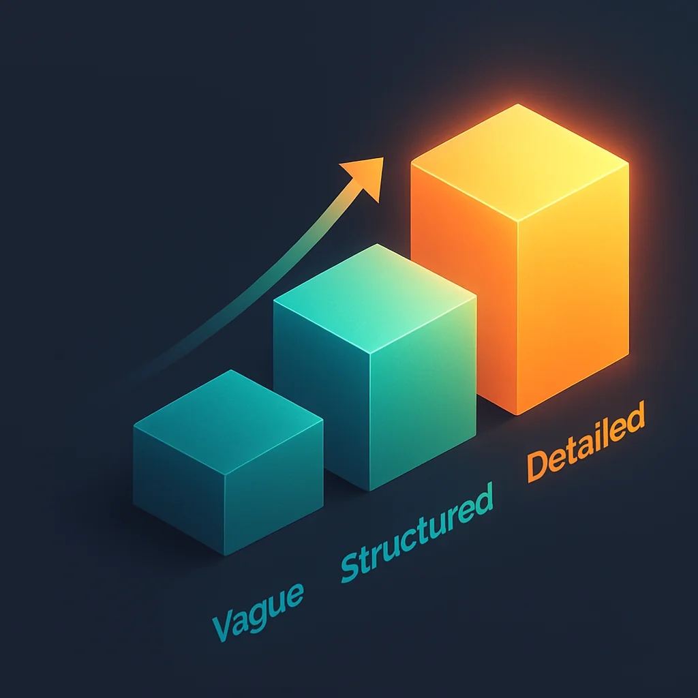

I got asked recently: **"What's one tip, one singular piece of advice you could give to anyone getting started with leveraging AI as a tool in their engineering workflows?"**

It's a really good question. We talk about a lot of subjects here, we talk about a lot of ways to do things, but we don't frequently talk enough about **how to get started**. I actually had to pause and think about this. I've been running wild and having fun doing my own stuff for a while, but there are some really solid foundational approaches to learning.

After a lot of consideration, my answer is this: **The prompt is what you really, truly need to focus on.**

## Understanding the Prompt

An LLM, at the end of the day, is basically a giant **text in, text out** machine. What text goes in is going to control what text comes out. That text that goes in is called the **prompt**.

If you take a look at all of these LLMs under the hood, it's an API: text in, text out. We've built some abstractions and conventions for tools and all this other stuff, but still, **all of that is driven by text in, text out**. That text in is the key. That is the prompt.

Let's back up and look at this:

- A **custom slash command** runs a prompt
- A **subagent** runs a prompt
- A **skill.md file** is a prompt

Almost all of the fancy things you see engineers and YouTubers doing is because **we wrote a prompt**. Very typically we write our prompts in Markdown files because they're nice and easy to read and organize.

But have you ever really stopped to think about **how important the prompt is**? It drives everything we do.

## Prompting is Coding in Natural Language

Good prompting, bad prompting—all of that is a skill you develop over time. You probably learned how to code: you got into the language, the syntax. You learned some styles, some architectural patterns, some best practices and conventions on how to write code.

Well, in many ways, **using an LLM is coding in your natural language** (English for me, but this applies to any language the model supports). You still need to learn:

- How to ask for things
- What formats work
- What doesn't work

And here's a really cool thing to understand: **A prompt written just one time rarely does what you want all the time.** Refining and tuning your prompts as you go is the way to get better and better results.

You don't start out and say "I'm going to build this amazing thing that just does everything and always does what I want perfectly without me ever communicating to it."

If you go to an LLM and say "build an entire to-do app," that specifies literally nothing. You're going to get pretty poor output.

But if your prompt dictates:
- The technologies
- The tools
- The styling
- The setup
- The testing framework
- Everything

You're going to start to find **much better quality output**.

## Learning What to Communicate

You need to learn **what to communicate and how to communicate it**. As you get better at this communication model—what you give the LLM—you can start to template it out. And that's where you start to see these huge gains.

You can make a **prompt that helps you make prompts**. These are wonderful abstractions that let you scale further and farther than ever before.

But it's really important you **start with the prompt**:

- Play with prompts
- Experiment with prompts
- Learn how to get these LLMs to do what you like

Things you can leverage:
- Instruction tags
- Sectioning
- Validation and review steps

You can do a lot when you build on top of LLMs, but you really need to **focus on learning how to prompt** or you're going to create this system that does a ton of stuff really terribly. And you're not going to understand what to change or why it doesn't work well.

## This is an Always-Learning Thing

I want to be clear: **This is an always-learning kind of thing.** You're not just going to sit down for 30 minutes, learn how to write a prompt, and you're done. That's not how it works.

The truth is that this is a **skill you refine over time**.

In fact, right before this article, I went and edited my own prompts to change the styling of the images generated. I was getting too many default images that were just boring white backgrounds and boxes that looked like I drew them in three minutes. That wasn't very great for a blog.

So I started talking about:
- Isometric views
- Volume and depth
- Color schemes
- Specific styling I want in these images

I provided additional guidance I was missing. **I'm refining and tuning my prompts** because I work on the system that builds the product. I spend my time on the system that helps me write and build these blog posts out for you.

Each blog post ideally improves over time as I enhance my system. And this is the new way to think about it: **I'm always fine-tuning these prompts. They're never done.**

## The Key Skill

Focus on understanding, learning, and developing good prompts. This will take you so far. You will have an **incredible advantage** over someone who just opens ChatGPT and says "do X."

Understanding how to communicate is a key skill. It's a skill we overlook frequently.

So take some time:
- Think about prompting
- Learn about prompting
- Read about prompting
- **Try it**

Nothing replaces experimentation. Get hands-on. Start writing prompts. Start refining them. Start seeing what works and what doesn't.

The prompt is the foundation. Master it, and everything else becomes possible.

## Next Steps

If you're ready to dive deeper into prompting:

1. **Start small** - Take one task you want to automate and write a prompt for it
2. **Iterate** - Run it, see what breaks, refine it, run it again
3. **Study patterns** - Look at open-source prompts (like Claude Code commands, AI tool documentation)
4. **Build templates** - Once you find patterns that work, template them for reuse
5. **Keep learning** - The field evolves fast; your prompts should evolve with it

Remember: **The prompt is everything.** It's the interface between your intent and the AI's execution. Master that interface, and you'll unlock incredible productivity.

Happy prompting, and epic coding!
