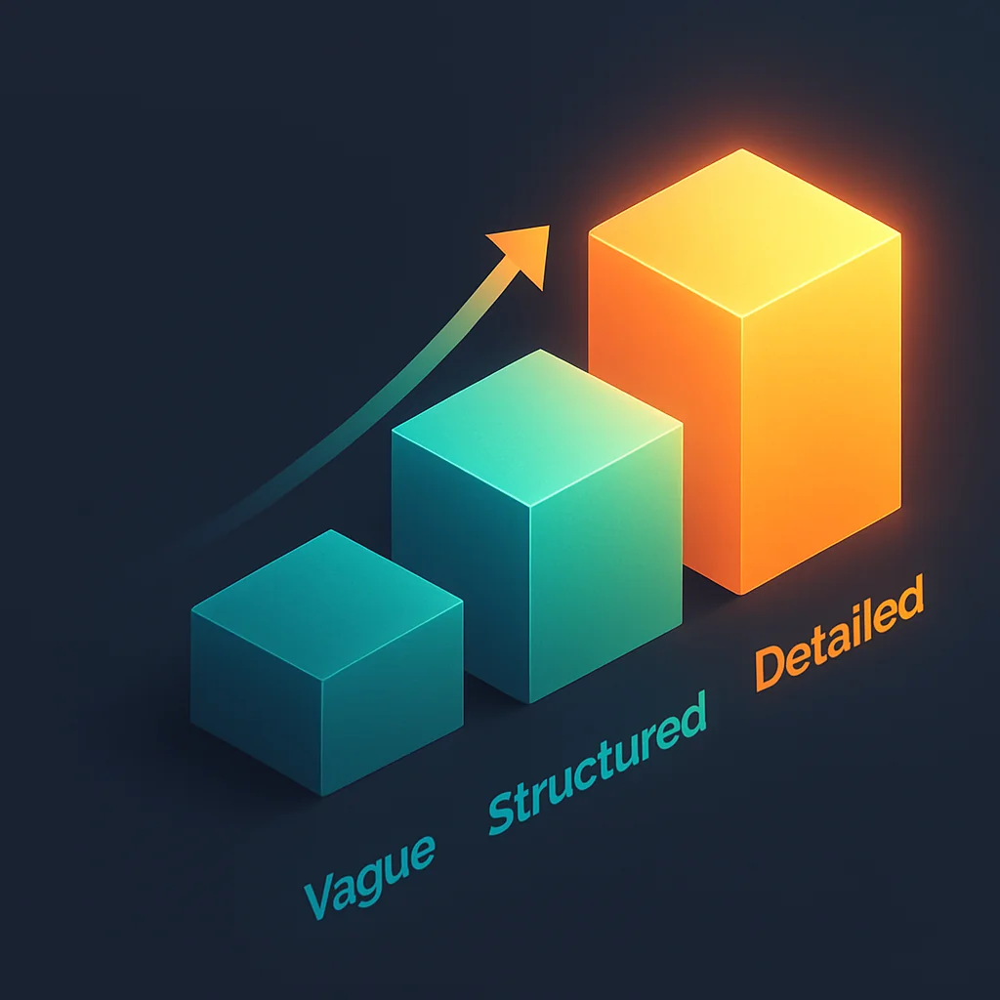

Someone asked me recently: **"What's one tip, one singular piece of advice you could give to anyone getting started with leveraging AI as a tool in their engineering workflows?"**

It's a good question. We talk about a lot of subjects here, a lot of ways to do things, but we don't talk enough about **how to get started**. I had to pause and think. I've been running wild doing my own stuff for a while, but there are some solid foundational approaches to learning.

After a lot of consideration, my answer is this: **the prompt is what you really need to focus on.**

## Understanding the prompt

An LLM, at the end of the day, is a giant **text in, text out** machine. What text goes in controls what text comes out. That text going in is called the **prompt**.

If you look at these LLMs under the hood, it's an API. Text in, text out. We've built abstractions and conventions for tools and the rest of it, but **all of that is driven by text in, text out**. That text going in is the key. That is the prompt.

Back up and look at this:

- A custom slash command runs a prompt
- A subagent runs a prompt
- A skill.md file is a prompt

Almost all of the fancy things you see engineers and YouTubers doing exist because **we wrote a prompt**. Typically we write our prompts in Markdown files because they're easy to read and organize.

Have you actually stopped to think about **how important the prompt is**? It drives everything we do.

## Prompting is coding in natural language

Good prompting, bad prompting. All of it is a skill you develop over time. You probably learned how to code. You got into the language, the syntax. You learned some styles, some architectural patterns, some best practices and conventions for writing code.

In many ways, **using an LLM is coding in your natural language** (English for me, but this applies to any language the model supports). You still need to learn:

- How to ask for things
- What formats work
- What doesn't work

Here's something worth understanding: **a prompt written one time rarely does what you want every time.** Refining and tuning your prompts as you go is how you get better results.

You don't start out and say "I'm going to build this amazing thing that does everything perfectly without me ever communicating with it."

If you go to an LLM and say "build an entire to-do app," that specifies nothing. You're going to get pretty poor output.

But if your prompt dictates:
- The technologies
- The tools
- The styling
- The setup
- The testing framework
- Everything

You'll start to find **much better quality output**.

## Learning what to communicate

You need to learn **what to communicate and how to communicate it**. As you get better at this communication model (what you give the LLM), you can start to template it out. That's where you see huge gains.

You can make a prompt that helps you make prompts. These abstractions let you scale further than ever before.

But it's really important you **start with the prompt**:

- Play with prompts
- Experiment with prompts
- Learn how to get these LLMs to do what you want

Things you can leverage:
- Instruction tags
- Sectioning
- Validation and review steps

You can do a lot when you build on top of LLMs, but you really need to **focus on learning how to prompt**, or you're going to create a system that does a ton of stuff really badly. And you won't understand what to change or why it doesn't work.

## This is an always-learning thing

Be clear about this: **it's an always-learning kind of thing.** You're not going to sit down for 30 minutes, learn how to write a prompt, and be done. That's not how it works.

The truth is this is a **skill you refine over time**.

In fact, right before this article, I went and edited my own prompts to change the styling of the images generated. I was getting too many default images. Boring white backgrounds and boxes that looked like I drew them in three minutes. Not great for a blog.

So I started talking about:
- Isometric views
- Volume and depth
- Color schemes
- Specific styling I want in these images

I provided extra guidance I'd been missing. **I'm refining and tuning my prompts** because I work on the system that builds the product. I spend my time on the system that helps me write these blog posts for you.

Each blog post ideally improves over time as I enhance my system. This is the new way to think about it. **I'm always fine-tuning these prompts. They're never done.**

## The key skill

Focus on understanding, learning, and developing good prompts. This will take you far. You'll have a real advantage over someone who just opens ChatGPT and says "do X."

Understanding how to communicate is a key skill. It's one we overlook frequently.

So take some time:
- Think about prompting
- Learn about prompting
- Read about prompting
- **Try it**

Nothing replaces experimentation. Get hands-on. Start writing prompts. Start refining them. See what works and what doesn't.

The prompt is the foundation. Master it, and everything else becomes possible.

## Next steps

If you want to go deeper into prompting:

1. **Start small.** Take one task you want to automate and write a prompt for it
2. **Iterate.** Run it, see what breaks, refine it, run it again
3. **Study patterns.** Look at open-source prompts (Claude Code commands, AI tool documentation)
4. **Build templates.** Once you find patterns that work, template them for reuse
5. **Keep learning.** The field moves fast; your prompts should move with it

Remember: **the prompt is everything.** It's the interface between your intent and the AI's execution. Master that interface, and you unlock real productivity.

Happy prompting, and epic coding!
