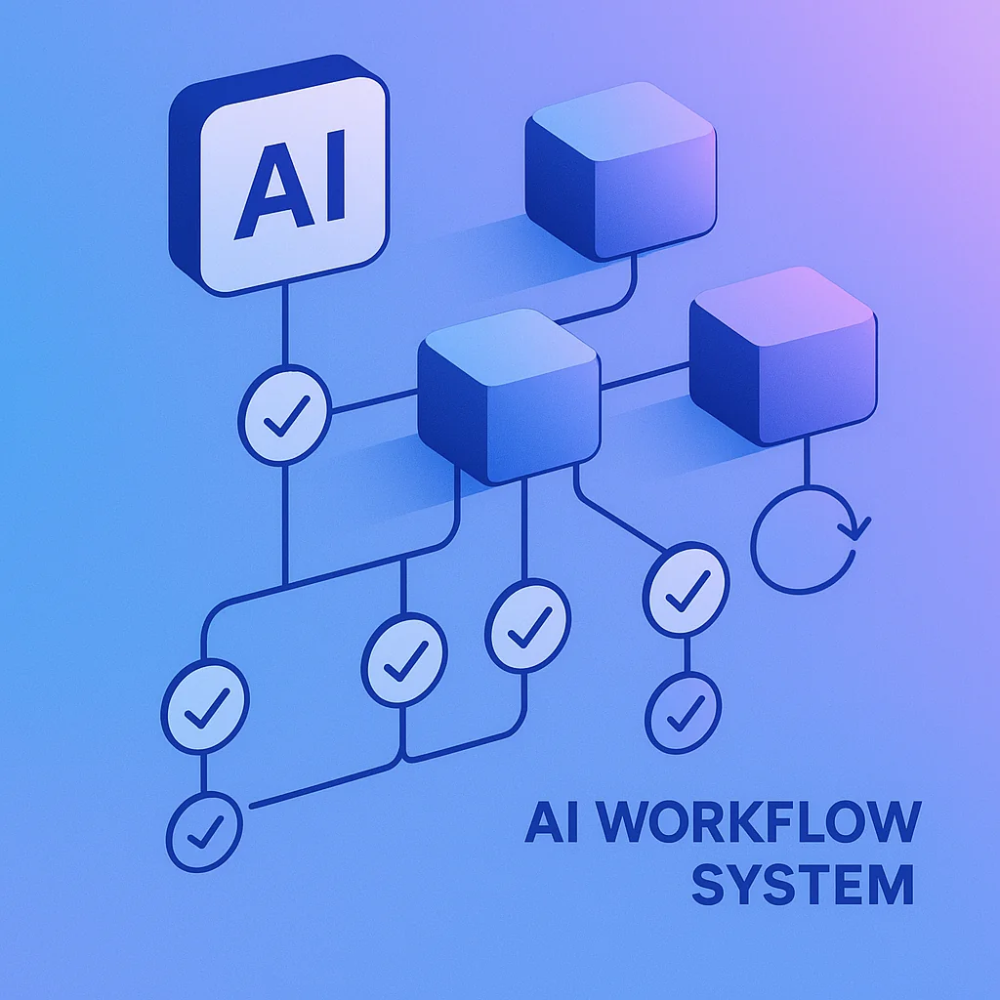
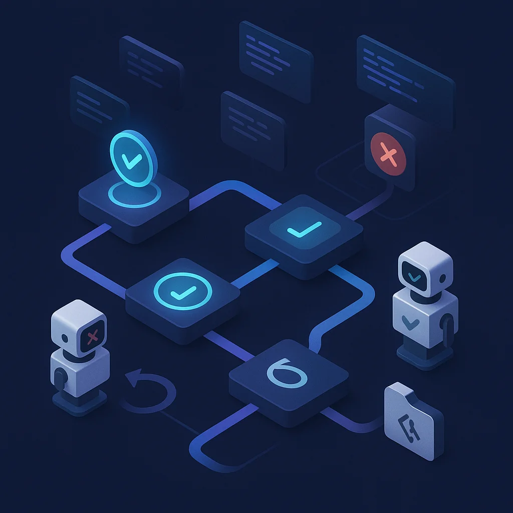

You want your AI agent to process a million loops of code? A million individual tasks? It's going to get confused and go off the rails.

But here's the thing: **we're engineers, not prompt magicians**. We don't just toss the whole problem at an AI and assume it'll magically work. We build systems.

I recently watched a YouTube video that crystallized something I've been experiencing firsthand: LLM accuracy falls apart as you scale up iterations. But there are engineering patterns that let you chain together massive numbers of AI agent calls reliably.

Let's talk about how to build AI workflows that actually work at scale.

## The Problem: Accuracy Compounds in Sequences

Here's the math that should terrify you: if you have an LLM that's 99% accurate, and you ask it to do 100 sequential tasks, you're not getting 99% accuracy overall.

You're compounding that 1% error rate across every step in the sequence.

As context grows with each iteration, you're feeding the LLM:
- All the previous conversation history
- All the intermediate states
- All the unnecessary information that can confuse it

**The result?** LLM accuracy degrades as context increases. That 99% per-task accuracy might drop to 90%, then 80%, then the agent is hallucinating file paths and making changes to code that doesn't exist.

## Solution 1: State-Based Isolation

Let's say you have a single CLI script that needs 100 different changes. That's a lot of work.

**The wrong approach:** One long conversation where the agent makes all 100 changes sequentially, accumulating context and history the entire time.

**The right approach:** 100 distinct tasks, each with the current state as input.

```python
# Pseudocode for state-based iteration
for task in tasks:
    current_state = read_file("script.py")
    result = agent.execute(
        state=current_state,
        task=task,
        # No history, no accumulated context
    )
    write_file("script.py", result)
```

**Why this works:**
- Each LLM call gets only the current state
- No accumulated context pollution
- You maintain 99% accuracy per task instead of compounding errors
- History doesn't matter—the state IS your history

This is the fundamental shift: **use your state as your history**. You no longer need to track every intermediate step. The current file state tells you everything you need to know.

## Solution 2: Structured Validation with Automatic Retry

If you require a specific response format, make it structured. Then validate it.

```typescript
interface AgentResponse {
  success: boolean;
  result: string;
  error?: string;
  fileChanges: string[];
}
```

Now your workflow system can:

1. **Check for error signals** - If the `error` field is populated, something went wrong
2. **Automatically retry** - That 1% failure rate? Just retry when you detect it
3. **Validate structure** - If the response doesn't match the schema, reject and retry

```python
def execute_with_retry(agent, task, max_retries=3):
    for attempt in range(max_retries):
        response = agent.execute(task)

        # Validate structure
        if not validate_schema(response):
            continue

        # Check for error signals
        if response.get("error"):
            continue

        return response

    raise Exception(f"Failed after {max_retries} attempts")
```

This is a **system outside the LLM call**. You could make it much more sophisticated:
- Custom validation logic per task type
- Exponential backoff between retries
- Different retry strategies based on error types
- Logging and metrics for failure patterns

## Solution 3: Git-Based Quality Gates



Let's say you're using an agent like Claude Code to write code. You send it off with a single task.

**Set up a validation gate:** If `git status` shows 12 edited files when you expected 1, something went wrong.

```python
def execute_code_task(agent, task, expected_files=1):
    # Execute the task
    agent.execute(task)

    # Check what changed
    changed_files = get_git_changed_files()

    # Validation gate
    if len(changed_files) > expected_files:
        git_rollback()
        # Retry with more specific instructions
        return execute_code_task(
            agent,
            f"{task}\nIMPORTANT: Only modify 1 file",
            expected_files
        )

    return changed_files
```

**More validation gates you can implement:**
- Test suite must pass
- Type checking must succeed
- Linter errors shouldn't increase
- Bundle size shouldn't exceed threshold
- Performance benchmarks must stay within range

These are **programmatic quality checks** that catch agent drift before it cascades.

## Solution 4: Parallel Consensus for Critical Decisions

Here's a powerful pattern for architectural decisions or complex problems: **run the same prompt across multiple agents and vote**.

Let's say you need to choose an image storage solution for your app. This is a critical decision with long-term implications.

```python
def parallel_consensus(prompt, num_agents=5, required_agreement=3):
    # Fire off the same prompt to multiple agents in parallel
    results = parallel_map(
        lambda _: agent.execute(prompt),
        range(num_agents)
    )

    # Count which answer appeared most frequently
    vote_counts = Counter(results)
    winner, count = vote_counts.most_common(1)[0]

    # Require minimum agreement threshold
    if count >= required_agreement:
        return winner

    # No consensus, needs human review
    raise ConsensusException(f"No agreement: {vote_counts}")
```

**The math here is compelling:**

If an LLM has 90% accuracy on architectural decisions:
- Running 1 agent: 90% chance of correct answer
- Running 5 agents with 3-of-5 majority: ~99.144% chance of correct answer
- Running 10 agents with 6-of-10 majority: ~99.877% chance of correct answer

Even if 1-2 agents go off the rails, you still get the right answer because you're looking at the outputs and voting.

**When to use parallel consensus:**
- Architectural decisions
- Design pattern selection
- Security-critical choices
- Anything where a wrong answer is expensive to fix later

**Implementation variations:**
- Simple majority voting for structured outputs (JSON comparison)
- LLM-as-judge for freeform responses
- Weighted voting based on agent confidence scores
- Hybrid approach with human review for low-confidence results

## The Meta Insight: Build Workflow Systems

Here's the key realization: **LLMs and agents are API calls**.

If you can call an API, you can:
- Wrap it in validation logic
- Add retry mechanisms
- Chain multiple calls together
- Implement quality gates
- Build entire workflow orchestration systems

We have enormous power to configure workflows. Why are we limited to single-shot prompts and hoping for the best?

**You're not limited.** Build the validation process. Check the work. Create feedback loops.

```python
class AIWorkflow:
    def __init__(self):
        self.validators = []
        self.retry_policy = ExponentialBackoff()

    def add_validator(self, validator_fn):
        self.validators.append(validator_fn)

    def execute(self, task):
        for attempt in self.retry_policy:
            result = self.agent.execute(task)

            # Run all validators
            for validator in self.validators:
                if not validator(result):
                    continue  # Retry

            return result
```

This is the engineering mindset applied to AI agents. **You can do a million, two million, ten million iterations** as long as you guarantee quality along the way.

## Practical Example: 100 Changes to a CLI Script

Let's put it all together with a concrete example.

**Scenario:** You have a CLI script that needs 100 refactoring tasks—extracting functions, adding type hints, improving error handling, etc.

**Naive approach (will fail):**
```python
# DON'T DO THIS
agent.execute("""
Make these 100 changes to script.py:
1. Extract the validation logic to a function
2. Add type hints to all functions
3. Improve error messages
... (97 more)
""")
```

**Engineered approach (will succeed):**
```python
tasks = load_tasks("refactoring_tasks.json")

for i, task in enumerate(tasks):
    print(f"Task {i+1}/100: {task.description}")

    # State-based isolation
    current_state = read_file("script.py")

    # Structured request
    result = execute_with_retry(
        agent=agent,
        task={
            "current_code": current_state,
            "instruction": task.description,
            "expected_changes": 1
        },
        max_retries=3
    )

    # Validation gates
    if not validate_python_syntax(result.code):
        raise ValidationError("Invalid Python syntax")

    if not run_tests():
        git_rollback()
        raise ValidationError("Tests failed")

    # Apply change
    write_file("script.py", result.code)
    git_commit(f"Refactor: {task.description}")
```

**What makes this reliable:**
- ✅ Each task operates on current state (no context pollution)
- ✅ Structured validation with automatic retry
- ✅ Git-based quality gates (syntax, tests)
- ✅ Incremental commits (easy rollback)
- ✅ Progress tracking
- ✅ Can pause and resume

This pattern scales. You could run 1,000 tasks. 10,000 tasks. As long as each individual task maintains high accuracy and you validate at each step, the system stays reliable.

## Scaling to Millions: The Workflow is the Product

The secret to scaling AI agents isn't better prompts. It's better workflows.

When you build systems around LLM calls instead of relying on single-shot magic:
- You can chain together arbitrary numbers of steps
- You can recover from failures automatically
- You can validate quality at every checkpoint
- You can parallelize independent work
- You can build feedback loops that improve over time

**This is engineering.** We build reliable systems from unreliable components all the time. AI agents are no different.

The workflows you build—the validation gates, the retry logic, the quality checks, the consensus mechanisms—these are your actual product. The LLM is just a component.

## Key Takeaways

- **State isolation beats history accumulation** - Use current state as input, skip the context pollution
- **Structure + validation = reliability** - Structured outputs with automatic retry handle the 1% error rate
- **Quality gates catch drift** - Git status, tests, linters, benchmarks—program your expectations
- **Parallel consensus for critical decisions** - Run multiple agents, vote on the answer, get 99%+ accuracy
- **Engineers build systems** - Wrap LLM calls in workflow orchestration with validation and retry logic

You can absolutely build AI agent systems that handle millions of iterations reliably. You just have to stop thinking like a prompt engineer and start thinking like a systems engineer.

Build the workflows. Add the validation. Scale with confidence.
