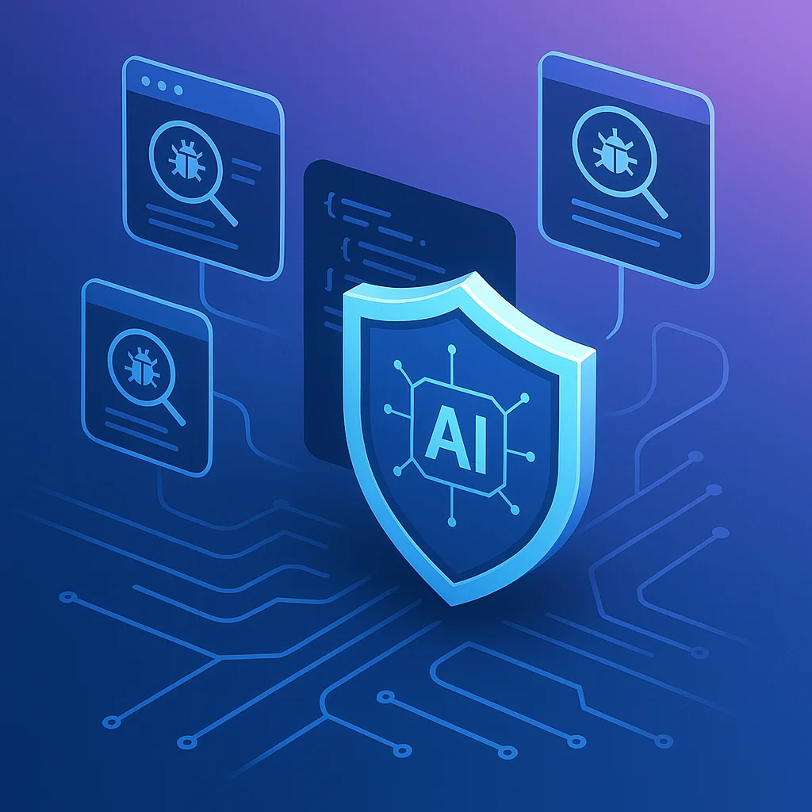
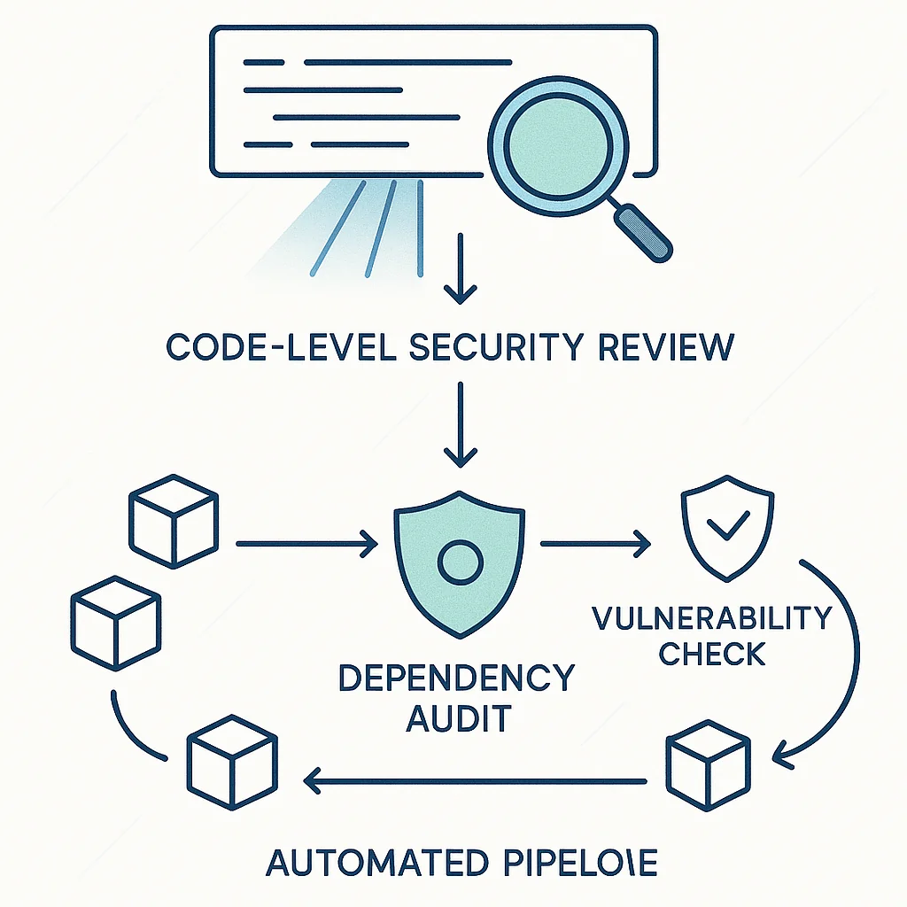

# AI Security Workflows: Automated Vulnerability Management



There's a common concern floating around the industry: AI agents produce less secure code. They'll use any version of any package. They won't check for vulnerabilities. They're not as diligent as humans.

This concern isn't unfounded. But it misses something important.

AI doesn't just create security risks. It can eliminate them at scale.

The recent React Server Components vulnerability affected millions of projects worldwide. Developers everywhere scrambled to patch their codebases manually. But what if your codebase could patch itself?

That's not science fiction. That's what happens when you think about security as an engineering problem rather than a one-off task.

## Two Layers of Security

Security vulnerabilities come from two sources: the code you write and the packages you import. Both need different approaches, but both can be automated.



**Code-level vulnerabilities** are the bugs you introduce: SQL injection, XSS, insecure authentication flows, hardcoded secrets. These require understanding your specific codebase.

**Dependency vulnerabilities** are inherited from packages: a compromised npm package, a CVE in a transitive dependency, an outdated library with known exploits. These require tracking external databases.

Most developers handle both reactively. Something breaks, someone notices, everyone scrambles. But AI agents excel at exactly this kind of systematic, repeatable work.

## Code-Level Security with Claude Code

Claude Code ships with a built-in `/security-review` command. This isn't just a fancy linter. It's a full security audit that understands context, identifies patterns, and can fix the issues it finds.

```bash
/security-review
```

What makes this powerful isn't the command itself. It's what the command represents: a **reusable workflow**.

Think about your current development process:
1. Build the feature
2. Write tests
3. Run tests
4. Deploy

Now add one step:
1. Build the feature
2. Write tests
3. Run tests
4. **Run security review**
5. Deploy

The security review becomes part of your verification pipeline. Not an afterthought when something goes wrong. A gate that every change passes through.

Claude Code's security review catches:
- SQL injection vulnerabilities
- Cross-site scripting (XSS) risks
- Insecure authentication patterns
- Hardcoded credentials and secrets
- Path traversal vulnerabilities
- Insecure deserialization
- OWASP Top 10 issues

When it finds something, it doesn't just report. It can fix. The agent understands the codebase well enough to apply patches that actually work.

## Dependency Auditing by Language

Every modern package manager now includes vulnerability scanning. This is a game-changer that many developers overlook.

Here's the command for your ecosystem:

| Language | Command |
|----------|---------|
| JavaScript/TypeScript | `npm audit` or `pnpm audit` |
| Python | `pip-audit` |
| Java (Maven/Gradle) | `dependency-check --scan .` |
| .NET | `dotnet list package --vulnerable` |
| Ruby | `bundle audit check` |
| Go | `govulncheck ./...` |
| PHP | `composer audit` |
| Rust | `cargo audit` |

Each command reads your lockfile, compares against vulnerability databases, and lists affected packages with fix versions.

The output is structured. Structured output is parseable. Parseable output can be automated.

## Building Self-Healing Pipelines

Here's where AI transforms security from burden to advantage.

Consider this workflow:

```bash
# 1. Run the audit
npm audit --json > audit-report.json

# 2. Have Claude Code parse and fix
# (Claude reads the JSON, identifies fixable issues, applies patches)

# 3. Run tests to verify fixes don't break anything
npm test

# 4. Commit if tests pass
git add . && git commit -m "security: patch vulnerabilities"
```

This can run as a GitHub Action. On a schedule. Automatically.

```yaml
name: Security Patch

on:
  schedule:
    - cron: '0 6 * * 1'  # Every Monday at 6am
  workflow_dispatch:

jobs:
  security-patch:
    runs-on: ubuntu-latest
    steps:
      - uses: actions/checkout@v4

      - name: Run security audit
        run: npm audit --json > audit-report.json
        continue-on-error: true

      - name: Apply fixes with Claude Code
        run: |
          claude --print "Review audit-report.json and apply safe fixes.
                         Run tests after each fix.
                         Only commit fixes that pass tests."

      - name: Create PR if fixes applied
        run: |
          if [ -n "$(git status --porcelain)" ]; then
            git checkout -b security-patch-$(date +%Y%m%d)
            git add .
            git commit -m "security: automated vulnerability patches"
            gh pr create --title "Security Patches" --body "Automated fixes"
          fi
```

The pipeline runs weekly. Finds vulnerabilities. Applies fixes. Runs tests. Creates a PR if everything passes.

Your codebase heals itself.

## Why This Works

AI agents are perfect for this kind of work because:

**It's systematic.** Security scanning follows predictable patterns. Run command, parse output, apply fix, verify. No creativity required.

**It's repeatable.** The same workflow works every time. Monday's audit uses the same logic as Thursday's audit.

**It's comprehensive.** An agent will check every dependency. Every file. Every pattern. It won't skip the boring parts.

**It's fast.** What takes a developer hours of context-switching takes an agent minutes of focused execution.

The concern that AI produces insecure code assumes AI operates without guardrails. But when you build security into the workflow, AI becomes the most consistent security engineer you've ever had.

## Practical Implementation

Start simple. Add `/security-review` to your development workflow. Run it after every feature, before every PR.

Then automate dependency scanning. Pick the audit command for your language. Run it in CI. Fail builds that introduce new vulnerabilities.

Finally, add the self-healing pipeline. Weekly scheduled runs. Automated fixes. Auto-created PRs. Let the system maintain itself.

The React vulnerability that sent everyone scrambling? Projects with automated security pipelines had PRs waiting the same day the CVE was announced. No manual intervention required.

## The Engineering Mindset

Security isn't a checkbox. It's not something you do once and forget. It's a continuous process that most teams treat as an interruption.

AI flips this. Security becomes infrastructure. Something that runs in the background. Something that handles itself.

You still need to review the PRs. You still need to understand what's changing. But the grunt work—the scanning, the patching, the testing—that happens automatically.

Build repeatable workflows. Create durable pipelines. Let the system handle the systematic work so you can focus on the interesting problems.

That's not replacing human judgment. That's augmenting it with tireless automation.

Your codebase doesn't have to be a security liability. With the right workflows, it becomes self-defending.
