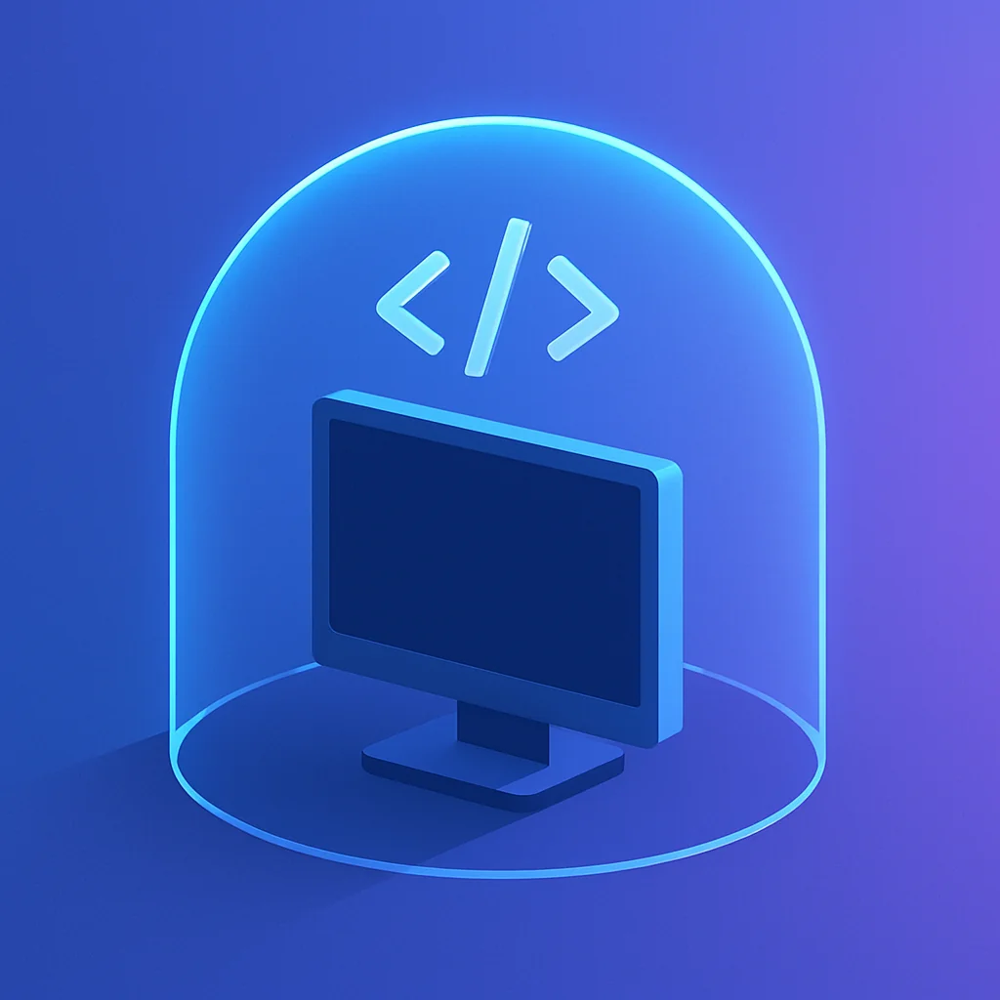
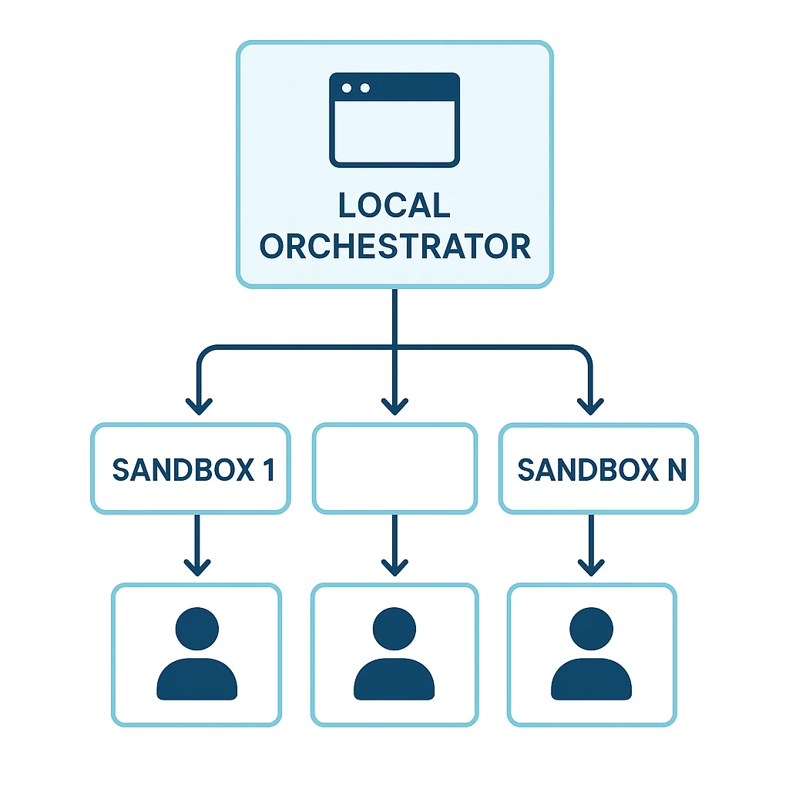

# AI Sandbox Environments: Running AI-Generated Code Without Fear

The fear is real. We have all heard the horror stories. Someone runs an AI-generated script and watches in slow motion as `rm -rf /` decimates their file system. Maybe you have even had a close call yourself. These concerns are legitimate, born from decades of hard-learned lessons about executing untrusted code.

But here is the thing: we are engineers. Solving problems like this is literally what we do. The solution is not to avoid AI code generation entirely. It is to run that code somewhere it cannot hurt you.



## The Real Problem With Local Code Execution

Running AI-generated code locally carries genuine risks:

- **File system damage** - Destructive commands can wipe critical data
- **Security vulnerabilities** - Untested code might expose your system
- **Environment pollution** - Dependencies and configurations get tangled
- **Resource exhaustion** - Runaway processes can lock up your machine

You could use Claude Code hooks to block dangerous commands, and that is a reasonable first defense. But hooks are reactive. They catch patterns you anticipated, not every possible risk an AI might introduce.

The better approach is to eliminate the risk entirely by moving code execution off your machine.

## Enter E2B: Cloud Sandboxes for AI Agents

[E2B](https://e2b.dev) provides isolated sandbox environments specifically designed for AI-generated code execution. Instead of running potentially risky code on your local machine, you spin up a cloud sandbox, execute everything there, and simply inspect the results.

Here is what makes this powerful:

```python
from e2b_code_interpreter import Sandbox

# Create isolated sandbox environment
with Sandbox() as sandbox:
    # AI-generated code runs here, completely isolated
    sandbox.run_code("x = 1")
    execution = sandbox.run_code("x += 1; x")

    print(execution.text)  # Outputs: 2
```

That code executes in a completely isolated environment. If the AI generates something destructive, it destroys a disposable sandbox, not your development machine.

## Why Sandboxes Change Everything

The shift from local to sandboxed execution is not just about safety. It fundamentally changes what becomes possible.

### Parallel Development at Scale

When every execution happens in an isolated sandbox, you can run multiple instances simultaneously without conflicts:

```python
# Clone the same repo 20 times in parallel
# No file conflicts, no state collisions
for i in range(20):
    sandbox = Sandbox()
    sandbox.run_code(f"git clone repo && make changes_{i}")
```

This is the pattern IndyDevDan demonstrates in his [excellent video on agent sandboxes](https://www.youtube.com/watch?v=1ECn5zrVUB4). He deploys nine parallel agents, each in their own E2B sandbox, to generate multiple solutions to the same problem. The "best of N" pattern becomes trivially easy when compute is isolated and disposable.

### The Orchestrator Pattern



You can still use a local agent as the orchestrator while offloading execution to sandboxes:

1. **Local orchestrator** reads your git repo and understands the task
2. **Spins up sandbox** with the codebase cloned
3. **Launches agent** (like Claude Code) inside the sandbox
4. **Issues instructions** and monitors progress
5. **Opens PR** when changes are complete

You sit back while the orchestrator coordinates everything. If something goes wrong in a sandbox, you just terminate it and try again.

### Secrets Management

E2B provides hooks for injecting secrets into sandboxes securely. Your API keys and credentials flow into the isolated environment without being exposed in logs or committed to version control.

## The Bigger Picture: Scaling Compute

This is where AI development is heading. The question is no longer "how do I run this code safely?" but "how do I scale my compute to match my ambitions?"

Consider what becomes possible:

- **Parallel feature branches** - Test multiple implementation approaches simultaneously
- **Automated PR workflows** - Agents clone, modify, test, and submit PRs autonomously
- **Batch processing** - Run the same transformation across hundreds of codebases
- **Reinforcement learning** - Train agents using thousands of concurrent sandbox evaluations

Fortune 100 companies are already building on this infrastructure. Perplexity uses E2B for their advanced data analysis features. Manus provides full virtual computers to their agents through E2B. The pattern is proven at scale.

## Getting Started

E2B offers a generous free tier for experimentation. The basic integration takes minutes:

```bash
pip install e2b-code-interpreter
```

```python
from e2b_code_interpreter import Sandbox

# Your first sandbox
sandbox = Sandbox()
result = sandbox.run_code("print('Hello from the cloud!')")
print(result.text)
sandbox.close()
```

From there, you can customize sandbox templates, add specific dependencies, and build increasingly sophisticated orchestration patterns.

## Credit Where Due

I first learned about AI sandboxes from [IndyDevDan](https://www.youtube.com/@indydevdan), who has been producing fantastic content on agentic engineering. His video on [E2B Agent Sandboxes](https://www.youtube.com/watch?v=1ECn5zrVUB4) is worth watching if you want to see these patterns in action with real code and real results.

## The Path Forward

The `rm -rf` fear is valid, but it should not stop you from leveraging AI code generation. Sandbox environments provide the isolation needed to experiment freely. Run AI-generated code with confidence. Scale your compute across parallel instances. Build orchestration patterns that seemed impossible when everything had to run locally.

Your local machine stays safe. Your ambitions stay unlimited.
