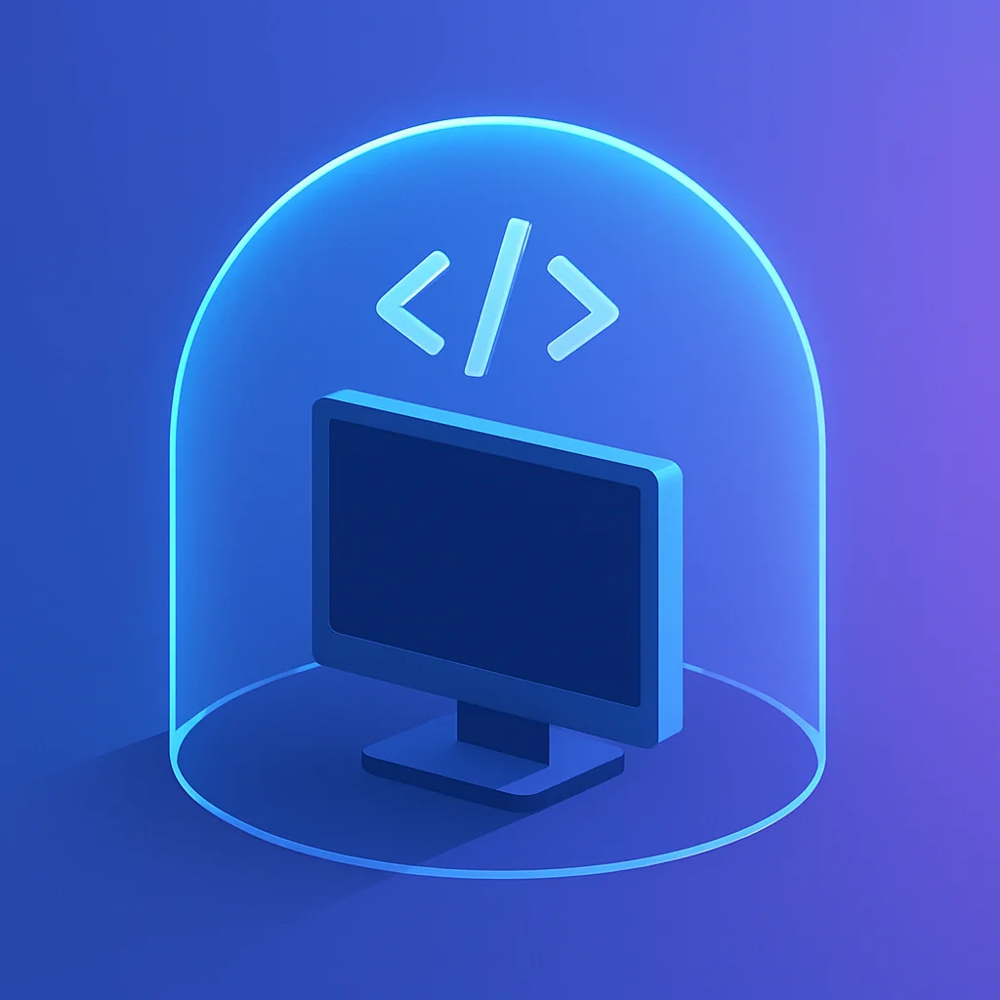
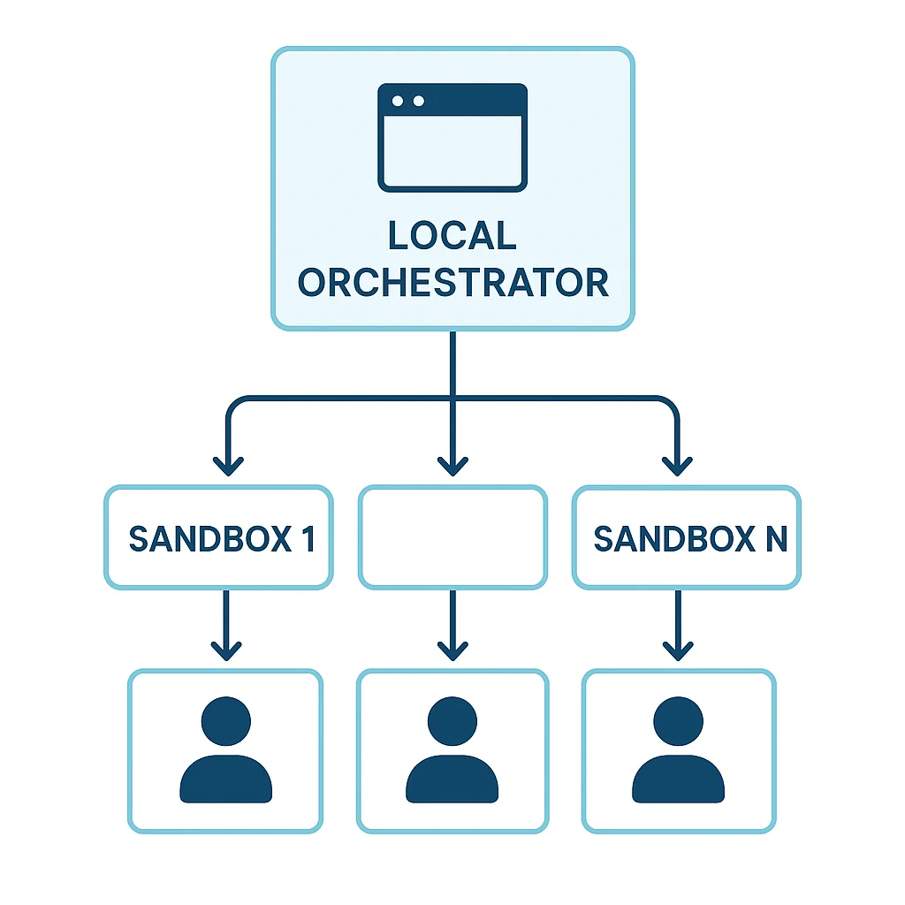

# AI Sandbox Environments: Running AI-Generated Code Without Fear

The fear is real. You've probably heard the horror stories. Someone runs an AI-generated script and watches `rm -rf /` chew through their file system in slow motion. Maybe you've had a close call yourself. These concerns aren't paranoia. They come from decades of hard lessons about executing untrusted code.

We're engineers. Solving problems like this is what we do. The fix isn't to avoid AI code generation. It's to run that code somewhere it can't hurt you.



## The real problem with local code execution

Running AI-generated code locally carries real risks:

- **File system damage** - Destructive commands can wipe critical data
- **Security vulnerabilities** - Untested code might expose your system
- **Environment pollution** - Dependencies and configurations get tangled
- **Resource exhaustion** - Runaway processes can lock up your machine

You could use Claude Code hooks to block dangerous commands, and that's a reasonable first defense. But hooks are reactive. They catch patterns you anticipated, not every risk an AI might invent.

A better approach: get the code off your machine entirely.

## Enter E2B: cloud sandboxes for AI agents

[E2B](https://e2b.dev) provides isolated sandbox environments designed for AI-generated code execution. Instead of running risky code on your local machine, you spin up a cloud sandbox, execute everything there, and inspect the results.

Here's what that looks like:

```python
from e2b_code_interpreter import Sandbox

# Create isolated sandbox environment
with Sandbox() as sandbox:
    # AI-generated code runs here, completely isolated
    sandbox.run_code("x = 1")
    execution = sandbox.run_code("x += 1; x")

    print(execution.text)  # Outputs: 2
```

That code runs in a fully isolated environment. If the AI generates something destructive, it destroys a disposable sandbox. Not your development machine.

## Why sandboxes change everything

The shift from local to sandboxed execution isn't just about safety. It changes what's possible.

### Parallel development at scale

When every execution lives in an isolated sandbox, you can run dozens of instances at once without conflicts:

```python
# Clone the same repo 20 times in parallel
# No file conflicts, no state collisions
for i in range(20):
    sandbox = Sandbox()
    sandbox.run_code(f"git clone repo && make changes_{i}")
```

This is the pattern IndyDevDan demonstrates in his [excellent video on agent sandboxes](https://www.youtube.com/watch?v=1ECn5zrVUB4). He deploys nine parallel agents, each in their own E2B sandbox, to generate multiple solutions to the same problem. The "best of N" pattern gets trivially easy when compute is isolated and disposable.

### The orchestrator pattern



You can still use a local agent as the orchestrator while offloading execution to sandboxes:

1. **Local orchestrator** reads your git repo and understands the task
2. **Spins up sandbox** with the codebase cloned
3. **Launches agent** (like Claude Code) inside the sandbox
4. **Issues instructions** and monitors progress
5. **Opens PR** when changes are complete

You sit back while the orchestrator coordinates everything. If something goes sideways in a sandbox, terminate it and try again.

### Secrets management

E2B provides hooks for injecting secrets into sandboxes securely. Your API keys and credentials flow into the isolated environment without getting exposed in logs or committed to version control.

## The bigger picture: scaling compute

This is where AI development is heading. The question isn't "how do I run this code safely?" anymore. It's "how do I scale my compute to match my ambitions?"

Consider what opens up:

- **Parallel feature branches** - Test multiple implementation approaches simultaneously
- **Automated PR workflows** - Agents clone, modify, test, and submit PRs autonomously
- **Batch processing** - Run the same transformation across hundreds of codebases
- **Reinforcement learning** - Train agents using thousands of concurrent sandbox evaluations

Fortune 100 companies are already building on this infrastructure. Perplexity uses E2B for their advanced data analysis features. Manus gives full virtual computers to their agents through E2B. The pattern is proven at scale.

## Getting started

E2B offers a generous free tier for experimentation. The basic integration takes minutes:

```bash
pip install e2b-code-interpreter
```

```python
from e2b_code_interpreter import Sandbox

# Your first sandbox
sandbox = Sandbox()
result = sandbox.run_code("print('Hello from the cloud!')")
print(result.text)
sandbox.close()
```

From there, you can customize sandbox templates, add specific dependencies, and build more sophisticated orchestration patterns.

## Credit where due

I first learned about AI sandboxes from [IndyDevDan](https://www.youtube.com/@indydevdan), who has been producing fantastic content on agentic engineering. His video on [E2B Agent Sandboxes](https://www.youtube.com/watch?v=1ECn5zrVUB4) is worth a watch if you want to see these patterns in action with real code and real results.

## The path forward

The `rm -rf` fear is valid, but it shouldn't stop you from using AI code generation. Sandbox environments give you the isolation to experiment freely. Run AI-generated code with confidence. Scale your compute across parallel instances. Build orchestration patterns that seemed impossible when everything had to run locally.

Your local machine stays safe. Your ambitions stay unlimited.
