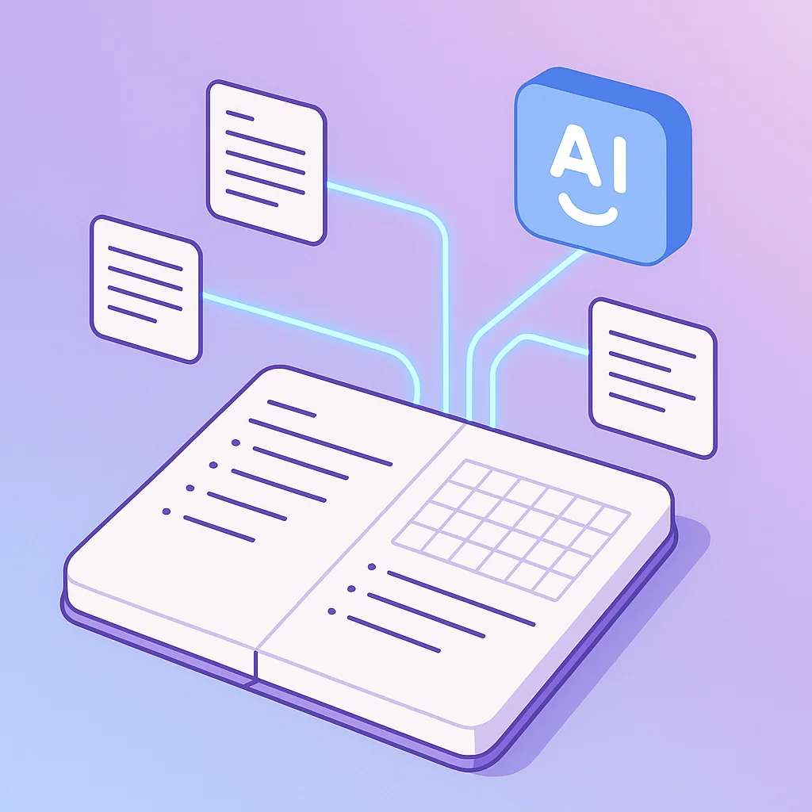

# AI-Powered Bullet Journaling: Building a Personal Productivity System with Claude Code

Bullet journaling changed how I approach productivity. The practice of thinking through your year, breaking it into quarters, structuring weeks with intentional tasks—it's powerful. The daily flow of capturing thoughts, reviewing progress, and adjusting course helped me accomplish things I never thought possible.

But I hit a wall that many bullet journalers recognize: the recovery problem.

## The Hidden Cost of Slipping Up

When you miss a day or fall off track, bullet journaling becomes a burden rather than a support system. Suddenly you're facing pages of updates, cross-references to fix, and a mental barrier just to sit down and reorganize everything.

I've tried countless bullet journaling systems over the years. The problem isn't the methodology—it's that maintaining the system requires cognitive load precisely when you're already overwhelmed.

What if AI could carry that load?

## The Design Constraint That Changes Everything

I started with one non-negotiable principle: **the system must work on your worst day.**

Not your best day when you're motivated and caffeinated. Your worst day—exhausted at 10pm on a Friday, mentally depleted, barely functional. If the system requires more than you can give in that state, it will fail exactly when you need it most.

This became my litmus test for every decision. Can I use this when I'm running on empty? If not, simplify until I can.

This led to a few hard constraints:

- **Minimal active files** - anything more is overhead you'll abandon
- **Under 10 minutes daily** - or it won't happen consistently
- **Built-in recovery mechanisms** - because falling off is inevitable

## Moving Bullet Journaling to Markdown

The first step was simple: move everything to markdown files. An inbox for capturing thoughts, a file for the current week, one for quarterly goals, and a dashboard for tracking multiple projects.

Nothing revolutionary there. Plenty of people use Obsidian or similar tools for digital bullet journaling.

The insight came from what I did next.

## Workflows as Commands

Traditional bullet journaling has several distinct processes. Quarterly planning. Weekly reviews. Morning routines. Evening reflections. And the dreaded "reboot" when you've fallen off track for days.

I knew how to do all of these. I'd done them hundreds of times. But knowing how to do something and actually doing it when you're exhausted are different things.

So I turned each workflow into a Claude Code command.

The weekly review command reads my files, walks me through each step, asks the right questions, and updates everything based on my answers. I don't have to remember the process or hold it all in my head. I just invoke `/weekly` and follow along.

The morning routine takes five minutes. It shows me my calendar, reminds me of my weekly outcomes, and asks what I want to accomplish today. The evening routine takes two minutes—check off what got done, dump anything still on my mind into the inbox.

But the most valuable command by far is the reboot.

## The Reboot: Recovery Without Shame

This handles the situation that used to derail me completely: coming back after missing several days.

The old pattern was brutal. I'd open my bullet journal, see the gap, feel the weight of everything I'd missed, and face a mountain of reorganization before I could even start working again. Often I'd just close it and avoid the whole thing for another day. Which made it worse.

The reboot command explicitly says: "No guilt, no catching up. Just restart."

It doesn't try to fill in what I missed. It archives the stale week as-is (with a note that there was a gap), does a quick brain dump to capture what's nagging at me, and asks one question: "What's the ONE most important thing to do today?"

Not three things. One thing.

Fifteen minutes later, I'm back in the system with a single clear task. The weekly review will restore the full rhythm later. Right now, I just need forward motion.

Having Claude enforce "no guilt, no catching up" matters more than I expected. When the process itself refuses to let me spiral into catch-up mode, I actually move forward instead.

## Calendar Integration That Actually Helps

I added a Google Calendar skill that the commands can use. The weekly review checks my calendar to see how much capacity I actually have before planning. The morning routine flags conflicts between meetings and deep work blocks.

The skill is sandboxed—it can only touch calendar events, nothing else. When AI touches your personal systems, clear boundaries matter.

The calendar sync also works in reverse. I can push my planned deep work blocks from my week file to the calendar, which helps protect that time from getting scheduled over.

## What Actually Changed

After a few weeks of using this system, I noticed something profound.

**Missing days lost their sting.** Instead of facing a wall of catch-up work, I have a fifteen-minute reboot that gets me back on track. The shame spiral that used to compound missed days into missed weeks just... stopped happening.

**The mental barrier dissolved.** Sitting down to plan used to feel like a chore—another task on top of all the tasks I was already avoiding. Now it feels like a conversation. Claude walks me through it, asks the questions, handles the file updates. I just have to show up and think.

**The weekly review actually happens.** This was the heartbeat of my productivity system, and I used to skip it constantly because it felt overwhelming. When the process is guided, it's no longer an overwhelming task I avoid. It's 45 minutes of conversation that leaves me clear on what matters.

**Pivoting strategies became painless.** When I needed to shift focus—change priorities, adjust quarterly goals, reorganize projects—Claude could help me see all the places that needed updating. I didn't have to manually track down every reference and hope I didn't miss something.

**I stopped optimizing the system.** This surprised me. I used to constantly tweak my productivity setup, trying new tools, adjusting formats, reading about other people's systems. Now I just... use it. The commands work. The files are simple. There's nothing to fiddle with.

## The 10pm Friday Test

The real proof is what happens when I'm exhausted.

With this setup, I can still:
1. Open the inbox and brain dump whatever's nagging me
2. Glance at tomorrow's plan

That's it. Two minutes. The weekly review handles everything else.

If you're spending more than 10% of your time on system maintenance, something is wrong. The AI handles the maintenance so I can focus on what matters.

## Why This Works Psychologically

Bullet journaling asks you to be your own project manager, accountant, and motivational coach simultaneously. That's fine on good days. On bad days, it's too many roles.

AI-powered bullet journaling gives you a partner for those roles. Not a replacement—you still make all the decisions. But a partner who remembers the process, asks the right questions, handles the bookkeeping, and refuses to let you shame-spiral when you fall off.

The non-judgmental aspect matters more than I expected. When I tell Claude I've been off the system for a week, there's no disappointment, no "you really should have..." It's just "Okay, let's get you back on track. What's the one thing for today?"

That supportive presence, available whenever I need it, changes the entire emotional texture of productivity planning.

## Thinking About Your Own Version

I'm not sharing my specific system because what works for me might not work for you. But the principles transfer:

**Design for your worst day.** Whatever you build, test it against the question: can I use this when exhausted? If not, simplify.

**Turn processes into conversations.** Any recurring workflow you know how to do but often avoid is a candidate for a command. Let Claude walk you through it.

**Build recovery first.** The reboot mechanism provides the most immediate value. When you inevitably fall off, you'll have a path back that doesn't involve guilt.

**Protect the AI's boundaries.** If you integrate with personal services, be explicit about what the AI can and cannot access. Clear boundaries build trust in the system.

**Stop optimizing once it works.** Productivity system tweaking is often procrastination in disguise. Build something simple, use it, and resist the urge to keep improving.

## The Real Insight

The real insight here isn't about productivity optimization. It's about building systems that support you as a human being—including the parts that struggle, fail, and need help getting back up.

I've been calling this system my "personal OS." It doesn't judge when I miss days. It doesn't shame me for changing priorities. It just helps me figure out the next step forward.

If you've struggled with productivity systems that work great until they don't, consider what becomes possible when AI handles the maintenance overhead. The goal isn't perfect adherence to a system—it's sustainable progress toward what matters to you.

The best productivity system is the one you actually use. And systems become much easier to use when they help you recover from the inevitable stumbles along the way.

