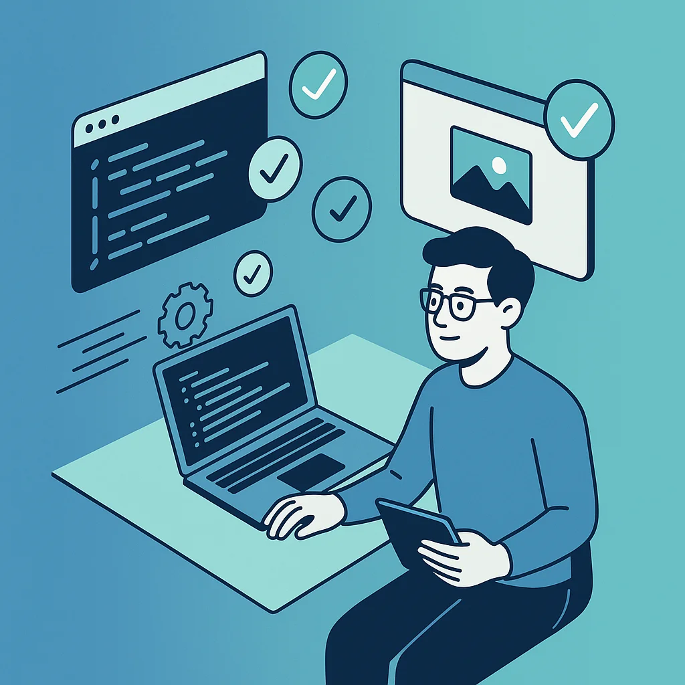
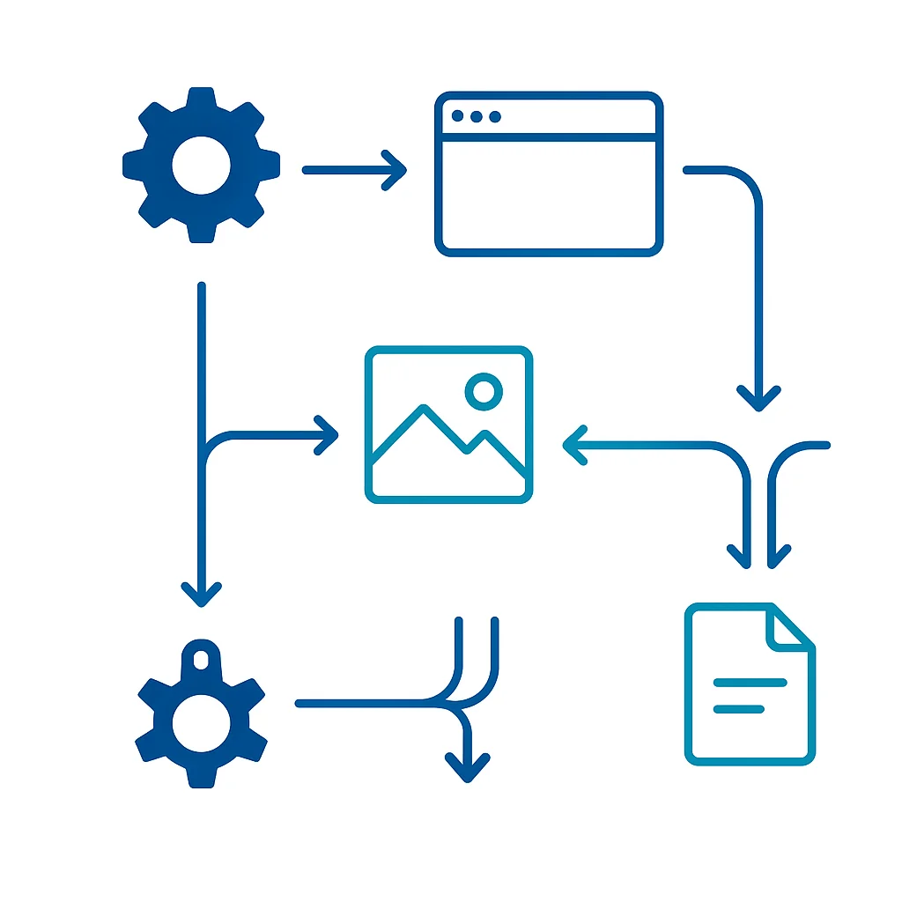

# Why I Stopped Reading AI's Code: Visual Proof Over Line-by-Line Review

The more I work with AI coding agents, the more I've realized something counterintuitive: **I've stopped reading most of the code they generate**. Not because I don't care about quality—but because I've found a better way to validate it.

When I first started engineering with AI, my workflow was predictable: write the prompt, let the agent work, then spend hours reviewing every line it produced. That felt responsible. It felt like due diligence. But as my projects grew larger and my AI-generated output scaled from hundreds to thousands of lines per session, that approach became unsustainable.

So I built something different: **review agents that prove the code works** instead of requiring me to read it.

## The Shift from Reading to Proving

Here's the fundamental insight: reading code tells you what the code *does*. Visual proof tells you whether the code *delivers what you asked for*.

These are different questions:

| Traditional Review | Proof-Based Review |
|---|---|
| Does this function handle edge cases? | Does the feature work as demonstrated? |
| Is this architecture sound? | Can the agent show it working? |
| Are there security vulnerabilities? | Do screenshots/recordings match requirements? |

Both matter. But proof-based review catches the "does it actually work" failures that slip through even careful line-by-line review. And it catches them faster.

## The Playwright MCP in Action

With the [Playwright MCP](https://github.com/microsoft/playwright-mcp) installed, proving code works becomes a conversation. No test files. No boilerplate. Just ask.

Say I ask an agent to add a new "Export to PDF" button to a dashboard. After it writes the code, I prompt:

> "Navigate to the dashboard, take a screenshot showing the new export button, click it, and screenshot the result."

Three screenshots land in my working directory. Three seconds of review. Complete confidence the feature works.

For a more complex feature, I might ask:

> "Demo the checkout flow: add a product to cart, go through checkout, and record the whole thing."

The agent walks through the flow, capturing screenshots at each step or recording a trace I can replay. Better than documentation. Interactive proof.

## Example: Proving a Form Works

Here's a real prompt I use after an agent builds a form:

> "Test the contact form: screenshot the empty form, fill it with invalid data and screenshot the validation errors, then fill it correctly and screenshot the success state."

I get back three images:
1. The form as rendered
2. Validation errors appearing correctly
3. Success message after submission

That tells me more about whether the form works than reading the validation logic ever would. And if the screenshots show something wrong? I tell the agent to fix it and prove it again.

## The Self-Correcting Loop

Here's where it gets interesting. When your review agent can't prove success, it becomes a signal for the coding agent to try again:

The workflow:
1. Coding agent implements feature
2. I prompt: "Prove this works"
3. Agent takes screenshots
4. Screenshot shows an error? Agent sees it too
5. Agent fixes the code and tries again
6. Success screenshots → ready for my review

This loop catches bugs before they ever reach you. The AI debates with itself until it can demonstrate success. You only see the winning result.

## Beyond Screenshots: What Else to Prove

Visual proof isn't limited to UI testing. You can ask for proof of code quality too:

**Architecture visualization:**
> "Generate a dependency graph of the src/ directory and save it as an image."

**Test coverage:**
> "Run the test suite with coverage and screenshot the report."

**API documentation:**
> "Navigate to the API docs page and screenshot the endpoint structure."

Now your review includes not just "the code works" but "here's how the code is structured." Architectural review becomes visual review.

## Putting Proof in Your PR

The screenshots don't have to stay local. Two options:

**Option 1: Commit to repo** - Drop them in a `review/` folder. Simple, version-controlled, but adds binary files to your history.

**Option 2: Upload to media server** - Push screenshots to S3, Cloudinary, or any image host. Add the links to your PR description. Keeps your repo clean while still providing visual proof.

Either way, anyone reviewing can see:

- What the feature looks like
- How it behaves when clicked
- What error states look like

No need to pull the branch and run it locally. The proof is right there in the PR.

## What I Still Read

To be clear: I haven't stopped reviewing AI code entirely. I still read:

- **Security-sensitive code** - Authentication, authorization, data handling
- **Core business logic** - Revenue-affecting calculations, critical workflows
- **Infrastructure changes** - Database migrations, deployment configs

But for features? UI changes? New endpoints? Visual proof handles 80% of my review workload. The remaining 20% gets my full attention.

## The Confidence Multiplier

The biggest benefit isn't speed—it's confidence. When every PR includes:

- Screenshots proving the feature works
- Videos demonstrating the user flow
- Diagrams showing the architecture

...I can merge with confidence. I know what I'm shipping because I can see it.

That confidence compounds. Faster merges. More features shipped. More time for the work that actually requires human judgment.

## Try It Today

Here's your homework:

1. Pick one feature your AI agent built recently
2. Prompt it: "Prove this works by taking screenshots with Playwright"
3. Look at the screenshots

Did that tell you what you needed to know faster than reading the code?

If yes, you've found your new review layer. Build on it.

If no, the code was probably simple enough to just read anyway. But for the complex stuff—the thousand-line changes, the multi-file refactors, the "I think this works but I'm not sure" moments—visual proof is the answer.

Stop reading. Start proving.
