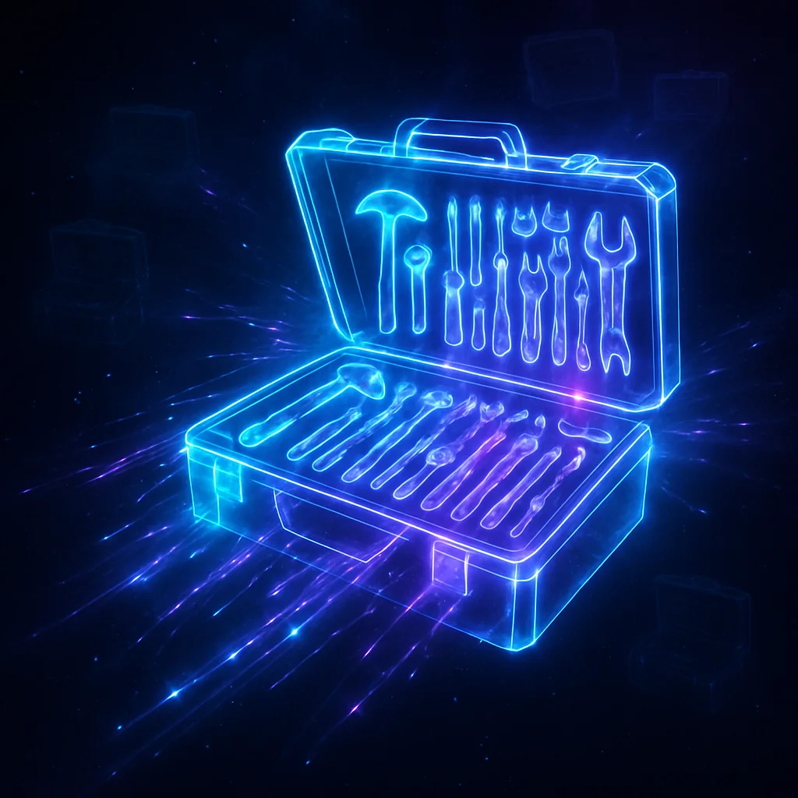
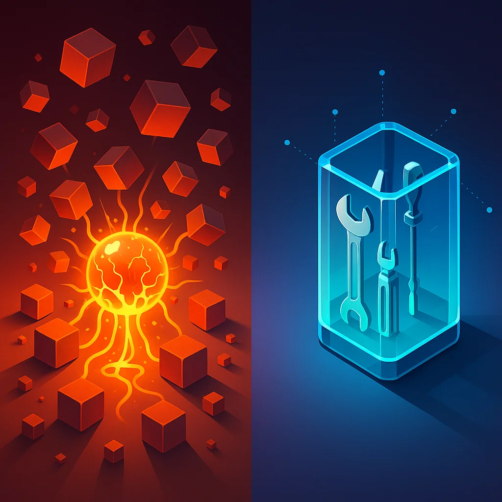

You know the drill if you've spent time with Model Context Protocol (MCP) servers. Every project wants a different set of MCPs. You toggle them on and off, add some, remove others, tweak the config. It's micromanagement that eats into actual work.

Then there's the context tax. Load up a handful of MCPs and you've burned a chunk of your context window before typing a prompt. Want more capabilities? Add more MCPs. Watch your available context shrink.

Claude Code Skills changes the equation.



## The MCP juggling act

Here's what MCP management looks like for a lot of developers:

**Project A** (web development):
- Firecrawl MCP for web scraping
- Playwright MCP for browser automation
- Database MCP for queries

**Project B** (data analysis):
- Reddit MCP for social data
- YouTube MCP for video analysis
- Perplexity MCP for research

**Project C** (content creation):
- Image generation MCP
- Translation MCP
- Grammar checking MCP

Switch projects and you're reconfiguring your agent's capabilities. Leave everything enabled and you burn context on tools you don't need. Lose-lose.

## Skills: dynamic activation changes everything

Skills trigger on need, not configuration. You can have 40, 50, even 100+ skills in a repository and they consume zero context until the moment you actually need them.



Think about what that means:

- No toggling. Skills activate automatically when relevant.
- No context waste. Zero overhead until invoked.
- No configuration per project. Same skills work everywhere.
- No accidental triggers. Well-written skills only activate when appropriate.

You stop managing tool configurations and just use the tools.

## The universal toolbox paradigm

This is the conceptual shift that matters most. With Skills, you build one toolbox that goes everywhere.

Take a practical case. Say you build a skill that converts Markdown documents to PowerPoint presentations. Useful occasionally, but not something you reach for every day. As an MCP:

- It would consume context in every session
- You'd toggle it off for most projects
- You'd forget it exists half the time

As a Skill:

- Zero context cost until you actually want a presentation
- Available in every repository automatically
- Works whenever you think "I should make a slideshow of this"

The capability stays available without being loaded.

## Building your personal toolkit

The shift compounds. Every skill you create or adopt becomes part of your permanent toolkit:

```
Your Agent Toolkit
├── Research Skills
│   ├── web-search/
│   ├── reddit-analysis/
│   └── youtube-data/
├── Development Skills
│   ├── database-query/
│   ├── api-testing/
│   └── code-review/
├── Content Skills
│   ├── markdown-to-ppt/
│   ├── image-generation/
│   └── grammar-check/
└── Automation Skills
    ├── file-conversion/
    ├── data-extraction/
    └── report-generation/
```

Every skill you add:
1. Becomes instantly available in every project
2. Costs zero context until needed
3. Never requires configuration or toggling
4. Stays out of the way until called

You're building a powerhouse agent that grows more capable over time without growing more context-hungry.

## Skills vs. MCPs: when to use each

Skills don't replace MCPs entirely. They serve different jobs.

### Use Skills when

- Occasional capabilities. Tools you need sometimes, not always.
- Universal utilities. Things useful across many project types.
- Growing toolkit. Adding new capabilities frequently.
- Context-sensitive work. Complex tasks needing maximum context.

### Use MCPs when

- Constant requirements. Tools needed in every session.
- Real-time integrations. Live data streams or webhooks.
- Team standardization. Shared tools across multiple people.
- Complex state management. Tools that maintain session state.

### The best of both worlds

Most developers will end up using both:

- MCPs for core, always-on capabilities. Your must-have tools that show up in nearly every session.
- Skills for everything else. The long tail of capabilities you need occasionally.

Your core MCPs might be 3-5 servers. Your skills library can grow to 50, 100, or more without touching context.

## The abstraction that scales

Skills are powerful for another reason: they package as regular files that travel with your code or configuration.

You can:
- Version control your skills. Track changes like any other code.
- Share skill libraries. Build team or community skill packs.
- Fork and customize. Adapt community skills to your workflow.
- Bundle into plugins. Package related skills together.

One developer or team can build skills that benefit everyone using them, without context negotiation or MCP server management.

## Share via the Claude marketplace

Claude Code has a decentralized marketplace system for distributing plugins, and skills bundle perfectly into that ecosystem.

The marketplace isn't a single app store. Anyone can create a `marketplace.json` file in a GitHub repository listing their plugins. Others add your marketplace and install your skills with simple commands:

```bash
# Add a marketplace
/plugin marketplace add username/my-skills-marketplace

# Browse available plugins
/plugin

# Install a specific plugin
/plugin install research-toolkit@my-skills-marketplace
```

Your carefully crafted skill library becomes a shareable plugin that others install in seconds. No npm publishing, no package management complexity. Just a JSON file pointing to your skills.

Community marketplaces already exist:
- Official Anthropic marketplace with demo plugins and the Agent SDK
- Community collections like research tools, CMS integrations, and workflow templates
- Aggregator sites that catalog available marketplaces

The pattern is elegant. Build skills for yourself, package them as a plugin once they're polished, publish to a marketplace, and suddenly your toolkit helps the entire community. All while keeping zero context overhead for everyone who installs them.

Your investment in building skills compounds. Not just across your own projects, but across everyone who discovers and uses your marketplace.

## Practical implementation

Getting started is straightforward. The basic structure:

```
.claude/skills/my-skill/
├── SKILL.md        # Discovery metadata and instructions
└── scripts/
    └── tool.py     # Self-contained executable
```

The SKILL.md file determines when the skill activates:

```markdown
---
name: markdown-to-ppt
description: Convert Markdown documents to PowerPoint presentations.
  Use when user wants to create a slideshow or presentation from markdown.
---

# Markdown to PowerPoint

## Instructions

Run with: `uv run .claude/skills/markdown-to-ppt/scripts/convert.py --help`

## Available Scripts

- `convert.py` — Convert markdown file to PowerPoint format
```

The agent reads this metadata only when relevant to your query. If you never ask for a presentation, this skill never loads.

## The discovery protocol

Skills work through a simple protocol:

1. Relevance check. The agent scans skill descriptions for matches to your query.
2. Metadata load. Only matching skills have their SKILL.md read.
3. Interface discovery. The agent runs `--help` to learn the tool.
4. Execution. The tool runs with your parameters.

At each step, only the minimum necessary information enters context. Implementation details, dependencies, and internal logic stay out of sight.

Compare that to MCPs, where every tool's full description loads at session start whether you'll use it or not.

## Eliminating micromanagement

The real win isn't technical efficiency. It's workflow efficiency.

With MCPs, you're constantly asking:
- "Do I need this MCP for this project?"
- "Is this consuming too much context?"
- "Should I toggle something off?"
- "Why is my agent slower today?"

With Skills, you stop asking. Your toolkit is always available, never in the way, and grows with your needs instead of fighting them.

You stop managing tools and start using them.

## Building for the future

As you work with Claude Code, invest in your Skills library:

1. Start with high-value, occasional-use tools. Things you need periodically but not constantly.
2. Convert redundant MCPs. MCPs you only use sometimes are prime skill candidates.
3. Build project-agnostic utilities. Tools that work across any repository.
4. Share with your team. Skills that help you likely help others.

Every skill you create is an investment that pays dividends on every future project.

## The paradigm shift

MCPs taught us that agents can have tools. Skills teach us that tools don't have to cost context.

The shift from "configure tools per project" to "build one universal toolkit" is fundamental. It changes how you think about agent capabilities:

- Not "what tools do I enable?" but "what tools exist?"
- Not "how much context am I burning?" but "what capability do I need?"
- Not "which MCP configurations?" but "which skills do I want to build?"

Your agent becomes a platform you invest in, not a configuration you manage.

## Get started

If you're tired of MCP juggling, start with one skill. Convert something you use occasionally but not constantly. See what zero-context-until-needed actually feels like.

Then build another. And another.

Watch your toolkit grow while your configuration overhead stays at zero.

That's the power of Skills: one toolbox, infinite capabilities, zero compromise on context.

Stop managing MCPs. Start building your toolkit.
