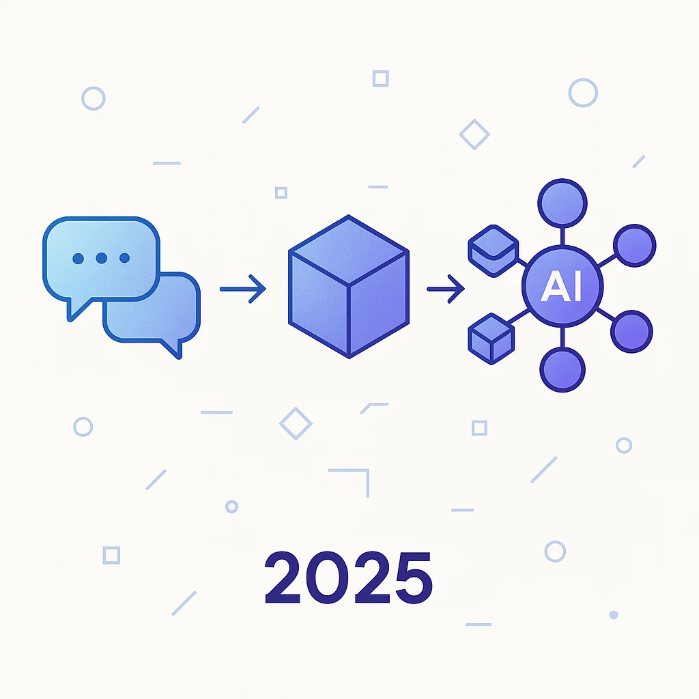
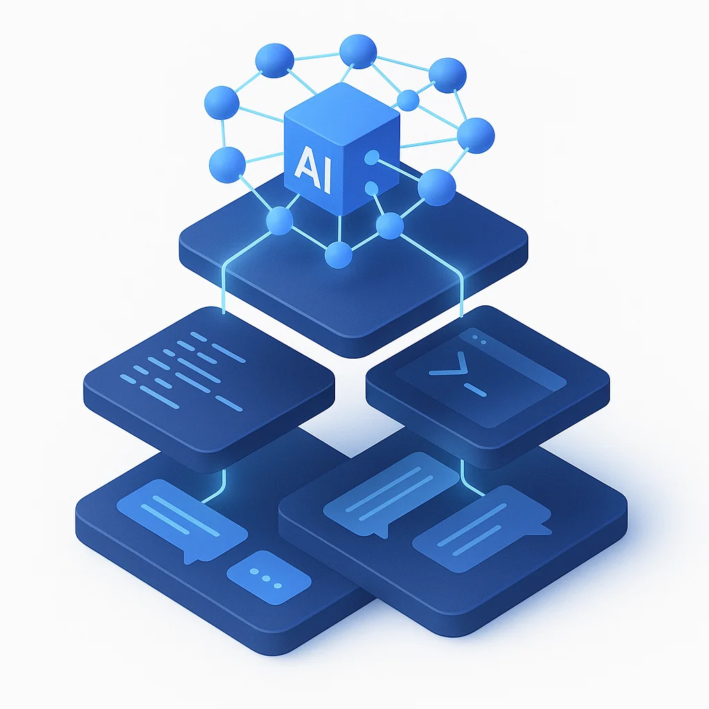

2025 wasn't the year AI got smarter. It was the year we got smarter about working with AI.

Twelve months ago, we were still debating which model was best. Today, we're debating which agent platform fits our workflow. That shift—from model-centric to agent-centric development—defines everything that happened this year.

Let me walk you through it.

## Late 2024: The Foundation

Before we dive into 2025, we need to acknowledge the groundwork laid in late 2024. These weren't just product launches—they were paradigm shifts disguised as feature releases.

### September 2024: Reasoning Arrives

OpenAI's o1-preview dropped on September 12th, and suddenly AI could *think* before answering. Not just pattern-match. Not just autocomplete. Actually reason through problems step by step.

This mattered for coding because complex debugging, architecture decisions, and multi-step refactors require exactly this kind of deliberate thinking. The autocomplete era was ending.

### October 2024: AI Gets Hands

Claude 3.5 Sonnet's October update came with something wild: computer use beta. For the first time, an AI could see your screen and control your mouse and keyboard. It was clunky, sure. But the implications were massive—AI wasn't just suggesting code anymore; it was learning to *operate* computers.

### November 2024: The USB for AI

On November 25th, Anthropic announced MCP—the Model Context Protocol. At the time, people called it "the USB for AI agents." That description undersold it.

MCP meant any AI could connect to any tool through a standardized protocol. No more N×M integration nightmares where every AI needs custom code for every tool. Just N+1: one protocol, infinite connections.

### December 2024: Shipmas

OpenAI closed out the year with 12 days of announcements. Day 1 brought ChatGPT Pro at $200/month—a signal that AI was becoming serious professional infrastructure. Day 12 brought o3, previewing the next generation of reasoning models.

The stage was set.

## 2025: The Timeline

### January: Reasoning Goes Mainstream

**January 31st: o3-mini released**

OpenAI made reasoning affordable. The mini model brought step-by-step thinking to everyone, not just enterprise customers. Suddenly, every developer could access models that actually thought through problems.

### February: The Agents Land

**February 24th: Claude Code CLI (preview)**

This was the moment everything changed. Anthropic didn't release another chatbot. They released the first true *agentic coding tool*.

What made it different? Claude Code could:

- **Edit files** across your entire codebase—not just the current file
- **Run terminal commands**—tests, builds, git operations
- **Iterate autonomously**—explore, plan, code, commit in loops
- **Maintain context** via CLAUDE.md project files

Anthropic's engineers reported using it for 90%+ of their git operations. This wasn't AI-assisted coding. This was AI-driven coding with human oversight.

**Same day: GitHub Copilot Agent Mode**

Microsoft wasn't sleeping. The same day Claude Code dropped, Copilot got agent mode in VS Code. It could analyze your codebase, propose multi-file edits, run terminal commands, and auto-correct based on output.

The race was on.

### March-April: The Arsenal Expands

**March 19th: o1-pro API**

Enterprise-grade reasoning became programmable. Teams could now build production systems on top of OpenAI's strongest reasoning capabilities.

**April 16th: OpenAI Codex CLI + o3 General Access**

OpenAI entered the agentic CLI war. Codex CLI launched open-source under Apache 2.0, featuring:

- Local repository access and multi-step task execution
- Approval modes for controlled automation
- MCP support for tool integration
- Image and screenshot input for visual context
- `codex exec` for scripting and CI/CD integration

Two major agentic CLIs in two months. The pattern was clear: the terminal was becoming the new IDE.

### May: Claude 4 Changes Everything

**May 22nd: Claude Code GA + Claude 4 launch**

Claude Code left preview and went generally available. But the bigger story was Claude 4 itself—a model built from the ground up for agentic work.

Key capabilities:

| Feature | What It Enabled |
|---------|-----------------|
| **Extended thinking** | Hybrid reasoning—fast responses or deep deliberation, same model |
| **Memory files** | Long-term task awareness across thousands of steps |
| **Multi-hour stability** | Complex tasks without quality collapse |
| **72.5% SWE-bench** | World-class autonomous coding benchmarks |

The APIs that shipped alongside mattered just as much:

- **Code Execution Tool**: Run Python in a sandbox mid-conversation
- **Files API**: First-class file read/write operations
- **MCP Connector**: Native protocol support
- **Extended prompt caching**: One-hour cache for persistent workflows

Claude 4 wasn't just a better model. It was infrastructure for building agents.

**May 2025: JetBrains MCP support**

IntelliJ IDEA 2025.1 shipped with full MCP client support. The protocol was going mainstream.

### June: The Big Three Complete

**June 10th: o3-pro released**

OpenAI's peak reasoning model arrived. The price was steep, but the capability gap was real—this was the model for problems that stumped everything else.

**June 25th: Gemini CLI unveiled**

Google completed the trifecta. Their agentic CLI came with:

- Open source under Apache 2.0
- 1 million free tokens per day
- Deep integration with Firebase, Cloud, and Workspace
- Gemini 2.5 Pro under the hood

In ten weeks, all three major AI companies shipped terminal-native coding agents.

### The IDE Wars: Throughout 2025

While the CLI battle raged, the IDE market exploded into full-scale competition.

**Cursor** positioned itself as the supervised agent—powerful but controlled. Every change showed up in a diff panel. You approved each edit. The @codebase tags let you explicitly guide context.

**Windsurf** went the other direction with Cascade, an autonomous agent that could scan your entire repo, pick relevant files, edit them, run tests, and even deploy—with minimal confirmation dialogs.

**Copilot** played the integration game, expanding agent mode to JetBrains, Eclipse, and Xcode. If you were already in the Microsoft ecosystem, the path of least resistance was clear.

The philosophical split was real:
- **Cursor**: AI pair programmer you supervise
- **Windsurf**: AI junior dev you delegate to
- **Copilot**: AI seamlessly integrated into your existing workflow

### Fall: Maturation

**August: Copilot expands everywhere**

Agent mode reached Xcode and Eclipse. Apple and enterprise Java developers got agentic capabilities.

**September 30th: Claude Sonnet 4.5**

The mid-tier model got faster and more reliable—critical for workflows where cost per token matters.

**October 20th: Claude Code web app**

Agentic coding moved beyond the terminal. Browser-based agents, multi-agent management, accessible to developers who never touched a CLI.

**November 24th: Claude Opus 4.5**

The flagship refresh brought improved long-horizon stability. Multi-hour tasks got even more reliable.

## MCP: The Connective Tissue

Throughout 2025, MCP adoption accelerated quietly but relentlessly.

By year's end, the protocol had become the standard:

| Tool | MCP Support |
|------|-------------|
| Cursor | One-click server setup |
| Windsurf | Native integration |
| JetBrains | Full client in 2025.1 |
| VS Code | Via Copilot and extensions |
| Zed | MCP prompts as slash commands |
| Sourcegraph Cody | Via OpenCtx |
| Codex CLI | Native support |

Thousands of community-built MCP servers emerged for databases, DevOps tools, productivity apps, and code operations. The N×M integration problem was solved.

## The Real Shift: From Models to Harnesses

Here's what actually changed in 2025: **we stopped caring which model and started caring which harness**.

Every major model release still mattered. Claude 4's extended thinking. o3's reasoning depth. GPT-5's speed and routing. These capabilities drove real improvements.

But the *interface*—the harness that wrapped these models—became the thing that determined your productivity.

Think about it:

- **Same model, different harness** = completely different experience
- **CLAUDE.md files** = persistent project context that survives sessions
- **Agent modes** = autonomous multi-step execution vs. one-shot suggestions
- **MCP integration** = access to your entire tool ecosystem

The model is the engine. The harness is the car. And in 2025, we realized we'd been debating engines while ignoring that some of us were driving sports cars and others were pushing shopping carts.

## From Agentic Coding to Agentic Engineering

The final evolution of 2025 wasn't technical—it was conceptual.

Early in the year, we talked about *agentic coding*. AI that could write and edit code autonomously.

By year's end, the conversation shifted to *agentic engineering*. AI that could:

- Take high-level specifications
- Break them into implementation plans
- Execute across multiple files and systems
- Iterate until tests pass
- Create commits and pull requests

We stopped reviewing code line-by-line and started reviewing *outputs*. Did the feature work? Did the tests pass? Did the implementation match the spec?

This is spec-driven development at scale. You specify *what*, the agent figures out *how*, and you verify *whether*.

## Predictions for 2026: The Year of Orchestration

If 2025 was about agents going mainstream, 2026 will be about *orchestrating* them.

We're already seeing the patterns:

- **Agent SDKs** from OpenAI and Anthropic for building custom agents
- **Multi-agent workflows** where specialized agents hand off to each other
- **Skills and toolboxes** that plug into agents without context overhead

The unit of work is shifting again. In 2024, it was the model call. In 2025, it was the agent session. In 2026, it'll be the *workflow*—multiple agents coordinated across multiple steps.

Think CI/CD pipelines, but for AI operations. A planning agent hands off to an implementation agent, which hands off to a testing agent, which hands off to a review agent.

Context management becomes orchestration. Session boundaries become workflow steps. Individual agents become nodes in a larger system.

## The Takeaway

2025 was the year AI development grew up.

Not because the models got smarter—though they did. Not because the tools got faster—though they did. But because we, as developers, finally figured out how to *work* with these systems effectively.

We learned that context engineering matters more than prompt engineering. That the harness matters as much as the model. That reviewing outputs beats reviewing code. That agents are collaborators, not just tools.

The developers who thrived this year weren't the ones with access to the best models. They were the ones who built the best workflows around whatever models they had.

That's the lesson of 2025. And it's the foundation for everything coming next.

---

*What was your biggest AI development shift in 2025? The tool that changed your workflow? The moment it clicked? I'd love to hear about it.*
