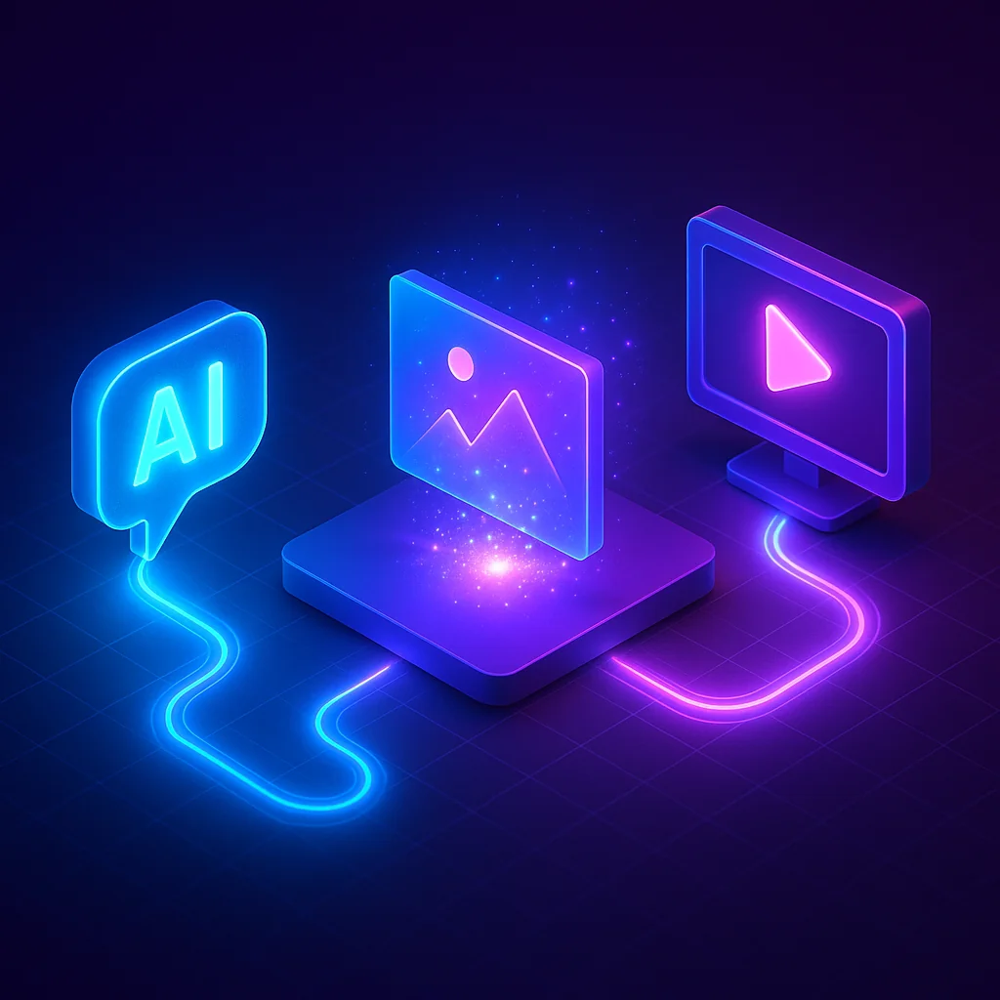
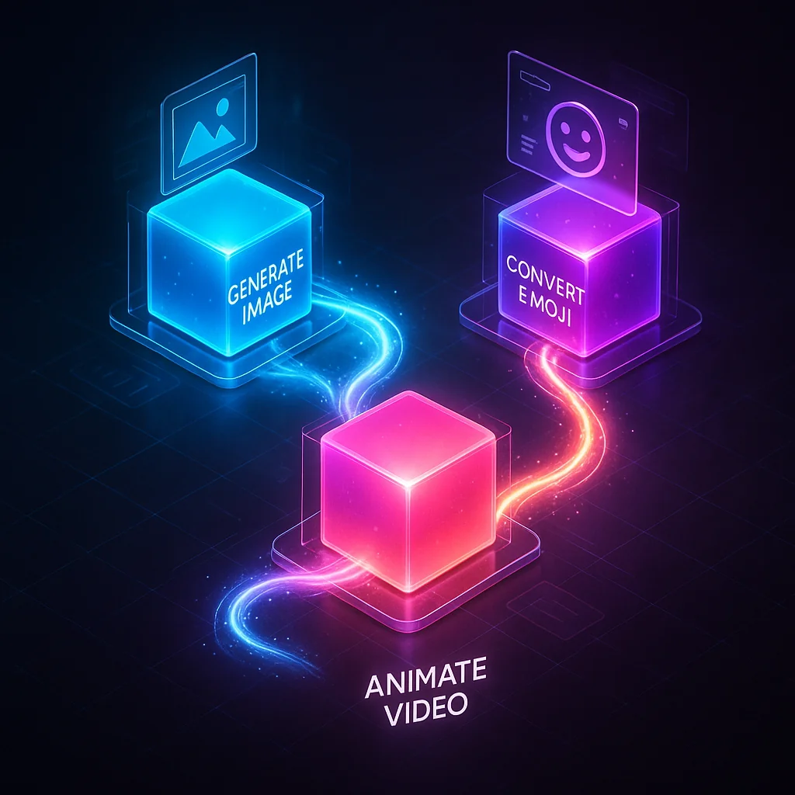
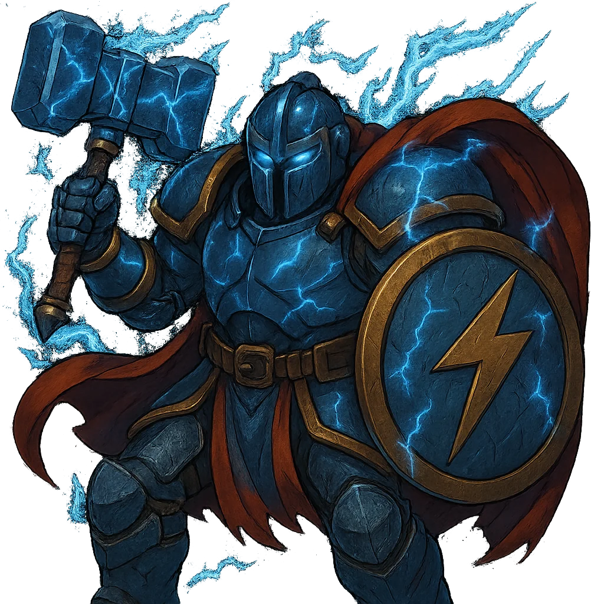
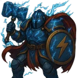

# AI Content Pipelines: From Text Prompts to Images and Video

Content pipelines have historically been one of the most expensive parts of software projects. Need character art? Hire an artist. Need animations? That's a specialist. Need both at scale? That's a team and a budget.

But with AI image and video generation, we can reframe what's possible. What used to require artists and weeks of iteration can now be prototyped in minutes. And when you compose these capabilities into workflows, you unlock something powerful: automated content pipelines that turn text descriptions into polished visual assets.



## The Problem: Media Needs Scale Quickly

I was working on a Discord game project recently. Simple enough concept, but the content requirements added up fast:

- **Profile images** for each character
- **Discord emojis** (128x128, under 256KB)
- **Ultimate ability animations** (short animated clips)

This is where small projects traditionally hit a wall. You either spend time learning art tools, pay for assets, or settle for placeholder graphics. But there's another path now.

## The Solution: Composable AI Skills

The key insight is that AI capabilities like image generation and video creation become dramatically more useful when composed into workflows. Instead of manually running prompts one at a time, you build small, focused tools that chain together.

Here's what I built using Claude Code skills:

1. **Image Generation** - Describe a character, get a high-quality image
2. **Emoji Conversion** - Resize and optimize for Discord specs
3. **Video Animation** - Take a static image and animate it with Sora



Each skill is a simple wrapper around an API call with some processing logic. But composed together, they form a complete content pipeline.

## Skill Architecture: Progressive Disclosure

The secret to effective AI skills is keeping context minimal while making capabilities discoverable. Here's the pattern:

```
skills/
└── image-gen/
    ├── SKILL.md              # Minimal - loaded into context
    └── image_gen_cli/
        ├── pyproject.toml    # uv managed, defines entry point
        └── src/main.py       # All logic + help text lives here
```

The `SKILL.md` file stays tiny (under 50 lines) because it's loaded into Claude's context on every invocation. The detailed documentation lives in the CLI's `--help` output, which only loads when explicitly requested.

```text
## Instructions

Run from CLI_PATH:
uv run img --help                # Discover all commands
uv run img generate --help       # Detailed usage
```

This progressive disclosure pattern keeps your context clean while making the full capability set accessible.

## The OpenAI Image API

Image generation uses the `gpt-image-1` model. Here's the core pattern:

```python
from openai import OpenAI
import base64

client = OpenAI(api_key=api_key)

result = client.images.generate(
    model="gpt-image-1",
    prompt="a fire mage casting a spell",
    n=1,
    size="1024x1024",
    quality="high",
    output_format="png",
)

# Response is base64 encoded
image_bytes = base64.b64decode(result.data[0].b64_json)
with open("output.png", "wb") as f:
    f.write(image_bytes)
```

Key parameters:
- **size**: `1024x1024`, `1536x1024`, or `1024x1536`
- **quality**: `low`, `medium`, `high`, or `auto`
- **background**: `opaque`, `transparent`, or `auto`
- **output_format**: `png`, `jpeg`, or `webp`

## Converting to Discord Emojis

Discord emojis have specific requirements: 128x128 pixels maximum, under 256KB for static images. Here's how to process an image:

```python
from PIL import Image
import io

def emojify(input_path: Path, size: int = 128, max_kb: int = 256):
    with Image.open(input_path) as img:
        # Preserve transparency
        if img.mode in ("RGBA", "LA", "P"):
            img = img.convert("RGBA")

        # Resize with high-quality resampling
        img_resized = img.resize((size, size), Image.Resampling.LANCZOS)

        # Save to buffer
        buffer = io.BytesIO()
        img_resized.save(buffer, format="PNG", optimize=True)

        return buffer.getvalue()
```

The LANCZOS resampling preserves detail when scaling down. For most character images, this produces clean, readable emojis.

## Animating with Sora

The video generation API (Sora) takes static images and brings them to life. The key difference from image generation: it's asynchronous. You submit a request, then poll for completion.

```python
# Start generation (returns immediately)
video = client.videos.create(
    model="sora-2",
    prompt="The hero raises their sword as lightning strikes",
    input_reference=image_buffer,  # BytesIO with .name attribute
    seconds="4",                   # 4, 8, or 12
    size="1280x720",
)

video_id = video.id  # Generation is async
```

Sora generation takes 1-5 minutes. Here's a polling pattern with progress feedback:

```python
def poll_video(client: OpenAI, video_id: str) -> object:
    while True:
        video = client.videos.retrieve(video_id)
        progress = getattr(video, "progress", 0)

        # ASCII progress bar
        filled = int((progress / 100) * 30)
        bar = "=" * filled + "-" * (30 - filled)
        sys.stdout.write(f"\rProcessing: [{bar}] {progress:.0f}%")
        sys.stdout.flush()

        if video.status == "completed":
            return video
        elif video.status == "failed":
            raise Exception(getattr(video.error, "message", "Unknown"))

        time.sleep(5)
```

Once complete, download the result:

```python
content = client.videos.download_content(video_id, variant="video")
content.write_to_file("output.mp4")
```

## Real Example: Fundrick the Thunder Knight

Let me show you what this pipeline produces. I wanted a Mandalorian-esque armored character with lightning and hammer themes. Here's what came out:

### The Profile Image

Starting from a text description, the image generation produced this:



This required minimal prompt engineering. Just describe what you want, iterate once or twice, and you have usable character art.

### The Discord Emoji

Running through the emoji conversion skill:



Same character, properly sized and optimized for Discord's requirements.

### The Ultimate Animation

And finally, the animated ultimate ability - lightning summoning with a ground strike:


From concept to three distinct media assets in a single session. No external artists, no asset stores, no waiting.

## The Click CLI Pattern

For building these skills, Click provides an excellent CLI framework. Rich docstrings become help text automatically:

```python
@click.group()
def cli():
    """Image Generation CLI - Create images with OpenAI GPT Image."""
    pass

@cli.command()
@click.argument("prompt")
@click.option("-o", "--output", help="Output file path")
@click.option("-q", "--quality", type=click.Choice(["low", "medium", "high"]), default="auto")
def generate(prompt: str, output: str | None, quality: str):
    """
    Generate an image from a text prompt.

    \b
    EXAMPLES
    --------
    uv run img generate "a cat wearing a top hat"
    uv run img generate "sunset" -o sunset.png -q high
    """
```

The `\b` marker prevents Click from rewrapping text, preserving example formatting.

## API Key Discovery

A small but important detail: making your skills work from any directory. This pattern walks up the directory tree to find a `.env` file:

```python
def get_api_key() -> str | None:
    if key := os.environ.get("OPENAI_API_KEY"):
        return key

    current = Path.cwd()
    for _ in range(10):  # Max 10 levels up
        env_file = current / ".env"
        if env_file.exists():
            for line in env_file.read_text().splitlines():
                if line.startswith("#") or "=" not in line:
                    continue
                k, _, v = line.partition("=")
                if k.strip() == "OPENAI_API_KEY":
                    return v.strip().strip('"').strip("'")
            break
        parent = current.parent
        if parent == current:
            break
        current = parent
    return None
```

This means you can invoke the skill from any subdirectory and it will find your API key.

## What This Enables

The individual capabilities aren't new. Image generation has been around for a couple years. Video generation is newer but accessible. What's different is composition.

When you build these as Claude Code skills:

1. **They're always available** - Skills persist in your workspace
2. **They compose dynamically** - Describe a workflow and Claude chains them
3. **They iterate cheaply** - Generate variations until you like one
4. **They scale** - Same pipeline works for one character or fifty

For prototyping, for small projects, for indie games, for Discord bots - the barrier to visual content just dropped dramatically.

## Getting Started

All you need is an OpenAI API key with access to image and video generation. The skill pattern is simple:

1. **Create a skill directory** with a minimal `SKILL.md`
2. **Build a CLI** with Click and uv
3. **Wrap the API calls** with appropriate error handling
4. **Add processing** for format conversion

The code samples in this post are complete enough to start from. The key is composition - build small tools that do one thing, then let Claude orchestrate them into workflows.

What used to require teams now requires prompts. That's the power of AI content pipelines.
