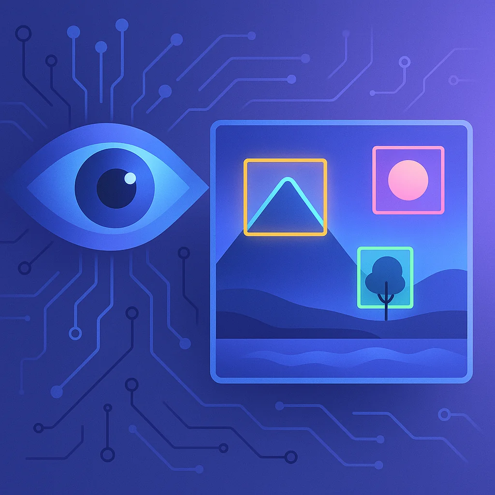
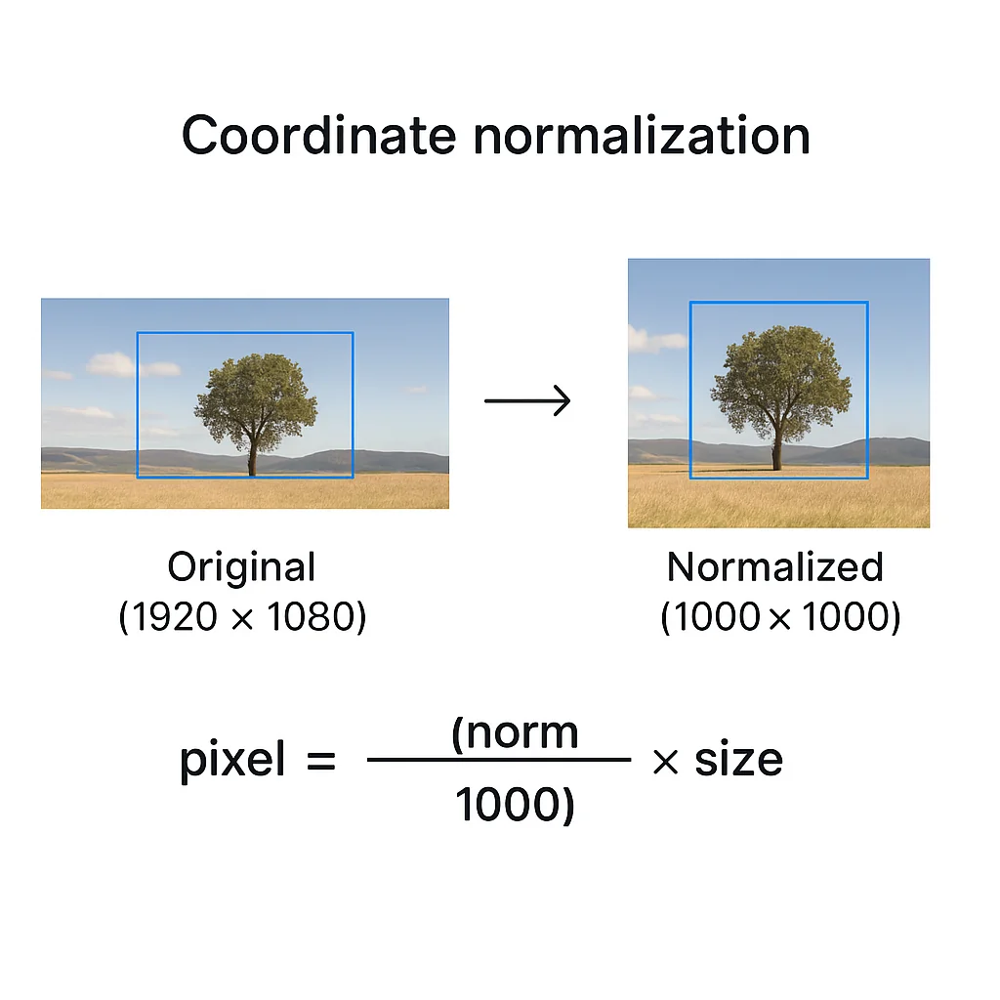

Our AI workflows have been text-focused for too long.

We write prompts, parse responses, generate code. But images? They're usually just static assets we pass around. Upload an image, get a description, move on.

That's changing. Understanding *what's in an image and where* is becoming essential for the next generation of AI applications. Not just "this is a photo of a room" but "there are three doors, a window on the north wall, and a light source in the corner at coordinates (234, 156)."

This is object detection. And Gemini makes it surprisingly accessible.



## The Problem We're Solving

Imagine you're building an AI-powered application with image generation. Users can create images, but then they want to give feedback: "Make the car on the left bigger" or "Change the color of that lamp."

You have a problem. The AI generated the image, but it doesn't actually know what's in it or where things are located. The image is just pixels.

Or consider accessibility. A user with visual impairment is playing a digital tabletop game. They want to move their character to the door using voice commands. You know where the character token is. But where's the door? The background is just an image file.

These aren't hypothetical problems. They're the kind of challenges that emerge when we try to build applications that truly understand visual content.

## Gemini's Hidden Superpower

Gemini has image understanding capabilities that most developers overlook entirely. Everyone knows it can describe images. Far fewer know it can locate objects with precise coordinates.

Here's the basic idea: you give Gemini an image and ask it to find specific objects. It returns bounding boxes—coordinates that tell you exactly where each object is located.

```python
from google import genai
from PIL import Image

client = genai.Client(api_key="YOUR_API_KEY")

prompt = """Find all the doors in this image.
Return a JSON array where each door has:
- label: description of the door
- box_2d: bounding box as [y_min, x_min, y_max, x_max]
"""

image = Image.open("dungeon_map.png")
response = client.models.generate_content(
    model="gemini-2.5-flash",
    contents=[image, prompt]
)

print(response.text)
```

The output might look like:

```json
[
  {"label": "wooden door", "box_2d": [120, 450, 280, 520]},
  {"label": "iron gate", "box_2d": [340, 100, 520, 180]},
  {"label": "secret door", "box_2d": [600, 720, 750, 800]}
]
```

Now you know not just *that* there are doors, but *where* they are.

## Understanding the Coordinate System

One quirk to know: Gemini normalizes coordinates to a 0-1000 scale. This keeps things consistent regardless of the original image dimensions.

Converting back to actual pixel coordinates is straightforward:

```python
def normalize_to_pixels(box_2d, image_width, image_height):
    """Convert Gemini's 0-1000 coordinates to actual pixels."""
    y_min, x_min, y_max, x_max = box_2d
    return {
        "x_min": int((x_min / 1000) * image_width),
        "y_min": int((y_min / 1000) * image_height),
        "x_max": int((x_max / 1000) * image_width),
        "y_max": int((y_max / 1000) * image_height)
    }

# Example: 1920x1080 image
pixel_coords = normalize_to_pixels([120, 450, 280, 520], 1920, 1080)
# Returns: {"x_min": 864, "y_min": 129, "x_max": 998, "y_max": 302}
```



## Practical Application: Accessible Gaming

Let's build something real. A voice-controlled navigation system for a tabletop game map.

The user says: "Move my character to the nearest door."

We need to:
1. Detect all doors in the map image
2. Calculate which door is closest to the character's position
3. Return the destination coordinates

```python
import math
from google import genai
from PIL import Image

def find_doors(image_path: str) -> list[dict]:
    """Detect all doors in a map image."""
    client = genai.Client(api_key="YOUR_API_KEY")

    prompt = """Analyze this tabletop game map image.
    Find all doors, gates, and entryways.
    Return JSON array with each door having:
    - label: brief description
    - box_2d: [y_min, x_min, y_max, x_max] coordinates (0-1000 scale)
    """

    image = Image.open(image_path)
    response = client.models.generate_content(
        model="gemini-2.5-flash",
        contents=[image, prompt]
    )

    # Parse JSON from response
    import json
    return json.loads(response.text)

def get_center(box_2d: list[int]) -> tuple[int, int]:
    """Get center point of a bounding box."""
    y_min, x_min, y_max, x_max = box_2d
    return ((x_min + x_max) // 2, (y_min + y_max) // 2)

def find_nearest_door(doors: list[dict], character_pos: tuple[int, int]) -> dict:
    """Find the door closest to the character."""
    nearest = None
    min_distance = float('inf')

    for door in doors:
        center = get_center(door["box_2d"])
        distance = math.sqrt(
            (center[0] - character_pos[0])**2 +
            (center[1] - character_pos[1])**2
        )
        if distance < min_distance:
            min_distance = distance
            nearest = door

    return nearest

# Usage
doors = find_doors("tavern_map.png")
character_position = (300, 400)  # Normalized coordinates
nearest = find_nearest_door(doors, character_position)

print(f"Moving to: {nearest['label']} at {get_center(nearest['box_2d'])}")
```

This is accessibility that seemed impossible a few years ago. Now it's a few dozen lines of code.

## Beyond Simple Detection

Gemini 2.5 goes further than basic object detection. It understands relationships and context.

You can ask questions like:
- "Find the person holding the umbrella" (not just "find people" and "find umbrellas")
- "Which shelf has the red books?"
- "Identify areas that look damaged"

This conversational approach means you can describe what you're looking for in natural language, even if it's complex or abstract.

```python
prompt = """In this warehouse image, find:
1. Any pallets that appear to be damaged
2. Areas where items are stacked unsafely
3. Fire exits and their current accessibility status

Return structured JSON for each finding with bounding boxes."""
```

The model applies world knowledge to understand what "damaged" or "unsafe" might look like in context.

## Building Detection into Your Pipelines

You don't need to restructure your entire application to use image detection. Here are three integration patterns:

**Pattern 1: Pre-processing enrichment**

Before storing or processing an image, extract location data and store it alongside the image. Future operations can use this metadata without re-analyzing the image.

```python
def enrich_image(image_path: str) -> dict:
    """Analyze image once, use metadata forever."""
    objects = detect_objects(image_path)
    return {
        "path": image_path,
        "objects": objects,
        "analyzed_at": datetime.now().isoformat()
    }
```

**Pattern 2: On-demand detection skill**

Build a reusable skill that any part of your application can call. The AI agent doesn't need the image in its context window—just the extracted data.

```python
# Skill: find_in_image
# Input: image_path, object_description
# Output: list of locations

def find_in_image(image_path: str, description: str) -> list[dict]:
    """Find specific objects in an image by description."""
    prompt = f"""Find all instances of: {description}
    Return JSON array with label and box_2d for each."""
    # ... detection logic
```

**Pattern 3: Context extraction**

Sometimes you just need to understand what's in an image to inform other decisions. Extract context without keeping the image in memory.

```python
def get_scene_context(image_path: str) -> str:
    """Extract structured context from an image."""
    prompt = """Analyze this image and provide:
    1. List of all identifiable objects with locations
    2. Overall scene description
    3. Any notable spatial relationships

    Return as structured JSON."""
    # ... return context for downstream processing
```

## Why Gemini for Detection?

I'm not suggesting you lock yourself into any single AI provider. Use OpenAI for image generation if it's best for your needs. Use Claude for coding. Use whatever works.

But for image detection specifically, Gemini has advantages:

1. **Zero setup** - No model training, no custom datasets, no ML infrastructure
2. **Natural language queries** - Describe what you're looking for, don't configure class labels
3. **Contextual understanding** - It gets relationships, not just objects
4. **Accessible pricing** - Gemini 2.5 Flash at $0.30 per million input tokens makes experimentation cheap
5. **Structured outputs** - Native JSON schema support for predictable responses

The barrier to entry for computer vision has dropped dramatically. What used to require specialized ML teams is now an API call.

## Getting Started

Here's the minimal code to start experimenting:

```python
# Install: pip install google-genai Pillow

from google import genai
from PIL import Image

client = genai.Client(api_key="YOUR_API_KEY")

def detect_anything(image_path: str, what_to_find: str) -> str:
    """Find anything in any image."""
    image = Image.open(image_path)
    prompt = f"""Find all instances of: {what_to_find}

    Return a JSON array where each item has:
    - label: what you found
    - box_2d: [y_min, x_min, y_max, x_max] on 0-1000 scale
    - confidence: how certain you are (0-1)
    """

    response = client.models.generate_content(
        model="gemini-2.5-flash",
        contents=[image, prompt]
    )
    return response.text

# Try it
result = detect_anything("my_photo.jpg", "light sources")
print(result)
```

Change the prompt. Change the image. See what you can find.

## The Bigger Picture

We're moving toward AI applications that truly see, not just process text about images. Detection is the foundation—knowing *what* is *where* unlocks everything else:

- Editing specific parts of generated images
- Accessibility tools that understand visual interfaces
- Automation that responds to visual state
- Quality control that spots defects
- Games that understand their own visuals

The technology is ready. It's more accessible than ever. The question is: what will you build with eyes?
