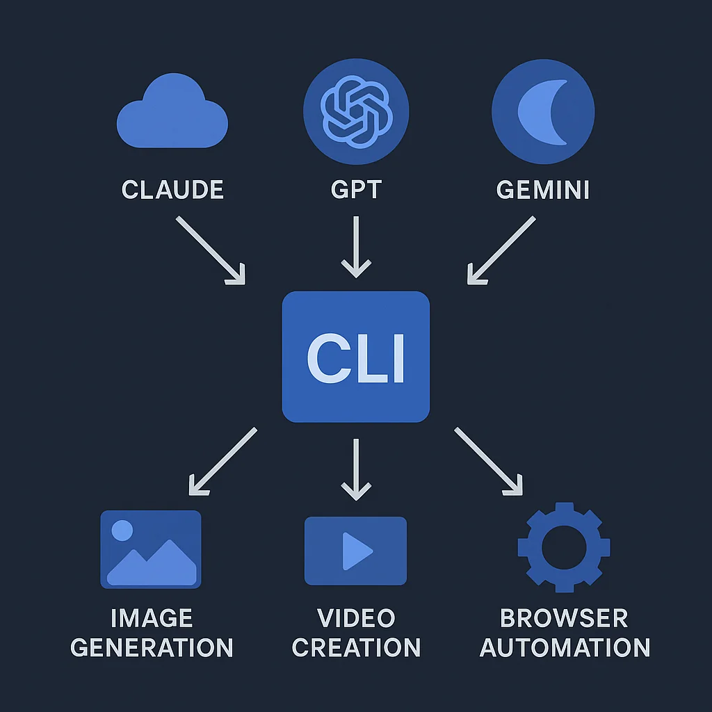

You love Claude Code. Maybe your colleague swears by Cursor. Someone else is deep in the Gemini ecosystem. The tools keep multiplying, and every platform wants you locked into their way of doing things.

Here's the problem: your carefully crafted image generation workflow, your web scraping scripts, your video creation pipelines—they're all trapped inside whatever tool you started with. Switch platforms and you're rebuilding everything from scratch.

There's a better way. What if your AI capabilities lived outside any single tool, accessible from anywhere that can run a bash command?

## The AI Toolkit Pattern

The concept is deceptively simple: package your AI tools as a standalone CLI that any agent can discover and use. Install it once, configure your API keys once, and every AI tool you work with gets access to the same capabilities.

```bash
# Install from your own git repo
uv tool install git+https://github.com/youruser/aitk

# One-time configuration
aitk config
# Stores keys in ~/.config/aitk/config

# Now ANY AI tool that can run bash has access
aitk image generate "app icon with gradient background" -o icon.webp
aitk search "latest Next.js 15 features"
aitk scrape page https://docs.example.com --only-main
```

The magic isn't in any single capability—it's in the portability. Your toolkit travels with you.

## Why This Beats Platform-Specific Solutions

I've written about [Claude Code skills](/blog/2025-12-29-skills-unified-agent-toolbox) and [MCP servers](/blog/2025-11-03-supercharge-agent-mcp-tools) for extending AI capabilities. Both work well within their ecosystems. But they share a fundamental limitation: they're tied to specific platforms.



A CLI toolkit solves this differently:

| Approach | Scope | Configuration | Discovery |
|----------|-------|---------------|-----------|
| Claude Code Skills | Claude Code only | Per-project CLAUDE.md | Automatic |
| MCP Servers | MCP-compatible tools | Per-tool config | Tool-specific |
| CLI Toolkit | Any bash-capable agent | One central config | `--help` flags |

The CLI approach wins on simplicity. If your AI tool can execute `bash` commands, it can use your toolkit. That covers Claude Code, Cursor, Windsurf, Aider, GitHub Copilot, custom agents—everything.

## Anatomy of a Portable Toolkit

Let's look at a real implementation: [AITK](https://github.com/Mandalorian007/aitk) (AI Toolkit), a Python CLI built with Click and distributed via `uv`.

### Project Structure

```
aitk/
├── pyproject.toml          # Dependencies and CLI entry point
└── src/aitk/
    ├── __init__.py         # Main CLI with command groups
    ├── env.py              # Centralized config management
    ├── image/              # Image generation commands
    ├── video/              # Video creation commands
    ├── search/             # Web search commands
    ├── scrape/             # Web scraping commands
    └── browser/            # Browser automation commands
```

### The Entry Point

The CLI uses Click's command group pattern to organize capabilities:

```python
import click
from aitk import image, video, search, scrape, browser

@click.group()
@click.version_option()
def cli():
    """AI Toolkit - Unified AI development tools."""
    pass

# Register command groups
cli.add_command(image.group, name="image")
cli.add_command(video.group, name="video")
cli.add_command(search.command, name="search")
cli.add_command(scrape.group, name="scrape")
cli.add_command(browser.group, name="browser")
```

Each module exposes either a `group` (for nested subcommands) or a `command` (for standalone operations). This creates a clean hierarchy:

```bash
aitk --help           # Show all command groups
aitk image --help     # Show image subcommands
aitk video create --help  # Show specific command options
```

### Centralized Configuration

The killer feature is centralized API key management:

```python
# ~/.config/aitk/config stores all credentials
CONFIG_PATH = Path.home() / ".config" / "aitk" / "config"

def load_config():
    """Load API keys from config file or environment."""
    config = {}
    if CONFIG_PATH.exists():
        # Parse config file
        ...
    # Environment variables override file config
    config["OPENAI_API_KEY"] = os.getenv("OPENAI_API_KEY", config.get("OPENAI_API_KEY"))
    return config
```

Configure once, use everywhere. No more copying `.env` files between projects or reconfiguring each tool.

## The Full Command Reference

Here's what a well-designed toolkit provides:

### Image Generation

```bash
# Generate from prompt
aitk image generate "minimalist logo, blue gradient" -o logo.webp -s 1024x1024

# Edit existing image
aitk image edit -i photo.png "remove the background, add soft shadow"

# Convert to emoji format (Discord-ready)
aitk image emojify avatar.png -o :custom-emoji: --max-kb 256
```

**Options:** size (1024x1024, 1536x1024, 1024x1536), quality (low/medium/high), format (png/jpeg/webp), background (opaque/transparent), count (1-10 images).

### Video Creation

```bash
# Create video from image + motion prompt
aitk video create hero.webp "camera slowly zooms in, particles float upward" -s 8

# Check generation status
aitk video status sora_abc123

# Download when complete
aitk video download sora_abc123 -o animation.mp4

# Convert to animated WebP
aitk video webpify animation.mp4 -o animation.webp --fps 15
```

**Sizes:** 1280x720 (landscape), 720x1280 (portrait), 1792x1024 (cinematic).

### Web Search

```bash
# Search with AI-summarized results
aitk search "Next.js 15 server actions best practices"

# Research current events
aitk search "OpenAI Sora API pricing 2026"
```

Returns summarized answers plus source URLs. Powered by Perplexity's sonar model.

### Web Scraping

```bash
# Scrape page to markdown
aitk scrape page https://docs.example.com/api --only-main

# Discover all URLs on a site
aitk scrape map https://example.com -l 50
```

The `--only-main` flag strips navigation, footers, and sidebars—perfect for documentation extraction.

### Browser Automation

```bash
# Initialize (one-time setup)
aitk browser init

# Start browser with remote debugging
aitk browser start --headed

# Automate interactions
aitk browser nav "https://example.com"
aitk browser click "#login-button"
aitk browser type "#email" "user@example.com"
aitk browser screenshot --full -o page.png

# Get accessibility tree for AI parsing
aitk browser a11y
```

The accessibility tree output is particularly powerful—it gives AI agents a structured view of the page for intelligent interaction.

## Making It Discoverable

The pattern only works if AI agents can discover your capabilities. This is where `--help` becomes critical:

```bash
$ aitk --help
Usage: aitk [OPTIONS] COMMAND [ARGS]...

  AI Toolkit - Unified AI development tools.

Commands:
  browser  Browser automation via Playwright
  config   Configure API credentials
  image    Image generation and editing
  scrape   Web scraping with Firecrawl
  search   Search the web using Perplexity
  video    Video generation with Sora

$ aitk image --help
Usage: aitk image [OPTIONS] COMMAND [ARGS]...

  Image generation and editing commands.

Commands:
  edit     Edit image(s) with text prompt
  emojify  Convert image to Discord emoji format
  generate Generate image from text prompt
```

AI agents can explore this hierarchy programmatically. Give them a hint in your system prompt:

```markdown
## Available Tools

Run `aitk --help` to discover available AI tools.
For specific command options, run `aitk <command> --help`.
```

That's it. The agent handles discovery from there.

## Building Your Own Toolkit

Ready to build your own? Here's the minimal setup:

### 1. Create the Project

```bash
mkdir my-toolkit && cd my-toolkit
uv init
```

### 2. Configure pyproject.toml

```toml
[project]
name = "my-toolkit"
version = "0.1.0"
requires-python = ">=3.12"
dependencies = [
    "click>=8.1.0",
    "httpx>=0.27.0",
    "openai>=1.0.0",
]

[project.scripts]
mtk = "my_toolkit:cli"

[build-system]
requires = ["hatchling"]
build-backend = "hatchling.build"
```

### 3. Create the CLI Entry Point

```python
# src/my_toolkit/__init__.py
import click

@click.group()
@click.version_option()
def cli():
    """My personal AI toolkit."""
    pass

@cli.command()
@click.argument("prompt")
@click.option("-o", "--output", default="output.webp")
def generate(prompt, output):
    """Generate image from prompt."""
    # Your implementation here
    click.echo(f"Generating: {prompt} -> {output}")
```

### 4. Install and Test

```bash
uv tool install .
mtk --help
mtk generate "test prompt" -o test.webp
```

### 5. Share via Git

```bash
git init && git add . && git commit -m "Initial toolkit"
git remote add origin git@github.com:youruser/my-toolkit.git
git push -u origin main

# Anyone can now install it
uv tool install git+https://github.com/youruser/my-toolkit
```

## The Freedom to Move

The AI landscape is evolving fast. Today's favorite tool might be tomorrow's legacy system. By packaging your capabilities as a portable CLI:

- **No lock-in**: Switch between Claude Code, Cursor, or custom agents without losing capabilities
- **One config**: API keys configured once, available everywhere
- **Version controlled**: Your toolkit evolves with your needs
- **Self-documenting**: `--help` flags make discovery automatic
- **Composable**: Combine with any workflow that supports bash

The pattern isn't revolutionary—it's deliberately boring. CLIs have worked for decades. That's the point. When the next hot AI tool arrives, your capabilities are ready to plug in.

Stop rebuilding your tools for every new platform. Build once, use anywhere.
