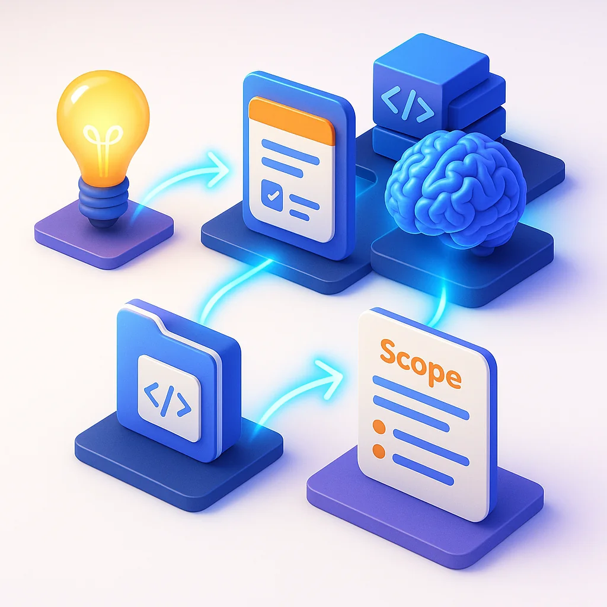

Faster. Faster. Faster.

That's the drumbeat of modern software development. Ship more features. Fix more bugs. Learn more technologies. The pressure never stops, and neither does the mental overhead of figuring out what to work on next, how long it will take, and whether you're even approaching it the right way.

This constant cognitive load is a primary driver of developer burnout. But here's the thing: much of this overhead isn't the actual work—it's the work about the work. The scoping, researching, planning, and organizing that happens before you write a single line of code.

What if an AI agent could handle all of that for you?


## The Hidden Cost of Task Management

Every idea that crosses your mind becomes a small debt. "I should look into that." "That might be a good feature." "I wonder how hard that would be." These thoughts pile up, creating an invisible backlog that weighs on you even when you're not actively working.

The traditional approach looks something like this:

1. Have an idea
2. Add it to a list somewhere
3. Eventually come back to scope it out
4. Research the codebase to understand the effort
5. Check your calendar for available time
6. Think through different approaches
7. Finally decide if it's worth doing

By the time you've done all that, you've spent significant mental energy—and you haven't even started the actual work yet. Multiply this by dozens of ideas, and you're exhausted before you begin.

## The Solution: Agent-Powered Task Scoping

The breakthrough is simple: let an AI agent handle steps 3-6 automatically. The moment you add an idea to your board, an agent wakes up and does the research for you.

Here's how it works in practice:

**You:** Drop a quick idea on your task board—"Add dark mode to the dashboard"

**The Agent:** Automatically springs into action:
- Scans your GitHub repos for relevant code
- Identifies the files that would need changes
- Checks your calendar for realistic timeframes
- Researches different implementation approaches
- Estimates the scope and complexity
- Adds all this context directly to the task

**You:** Come back later to find a fully scoped task waiting for you, complete with approach options and effort estimates.



## What the Agent Actually Does

The agent I set up handles several key responsibilities:

### 1. Repository Analysis
When a new task appears, the agent examines your codebase to understand what's involved. It identifies:
- Which files would likely need changes
- Existing patterns that should be followed
- Dependencies that might be affected
- Test coverage in the relevant areas

### 2. Approach Brainstorming
The agent doesn't just tell you what exists—it suggests how to approach the work:
- Option A: Quick and dirty, minimal changes
- Option B: Proper refactor, more effort but cleaner
- Option C: Alternative architecture that might be better long-term

Having these options laid out removes the "analysis paralysis" that often stalls projects.

### 3. Effort Estimation
Based on the code analysis and approach options, the agent provides rough effort estimates. It's not about precise hours—it's about categorizing tasks:
- Quick win (< 1 hour)
- Half-day project
- Multi-day effort
- Needs further breakdown

### 4. Context Maintenance
The agent keeps tasks updated as your codebase evolves. If you refactor a component that a pending task depends on, the agent notes the change and updates its analysis.

## Setting Up Your Own System

The beauty of this approach is its simplicity. You don't need complex infrastructure—just a few key pieces:

### The Task Board
Use whatever works for you:
- Trello, Notion, Linear, or a simple Kanban board
- The key is having an API or webhook capability
- When a card is created, it should trigger your agent

### The Agent Runtime
A home server is ideal for this:
- Mac Mini, Raspberry Pi, or any always-on machine
- Run a simple service that listens for board events
- Claude or another capable model handles the analysis

### The Integration Layer
Connect your agent to the tools it needs:
- GitHub API for repository access
- Calendar API for availability checking
- Your task board's API for updating cards

Here's a simplified flow:

```
New Card Created
       ↓
Webhook fires to your server
       ↓
Agent receives task description
       ↓
Agent analyzes relevant repos
       ↓
Agent generates scope + approaches
       ↓
Agent updates the card with findings
```

### Example Agent Prompt

The prompt that drives this system is straightforward:

```
You are a technical project scoper. A new task has been created:

Title: {task_title}
Description: {task_description}

You have access to the following repositories:
{repo_list}

Please analyze this task and provide:
1. Relevant files that would need changes
2. 2-3 possible implementation approaches
3. Rough effort estimate (quick/half-day/multi-day/needs-breakdown)
4. Any dependencies or blockers to consider

Be concise but thorough. Focus on actionable insights.
```

## The Transformation

Before implementing this system, my task list was a source of anxiety. Every item represented unknown effort, unclear approaches, and decisions I hadn't made yet.

After: my board became a menu of pre-scoped options. Each task already has:
- Clear scope and approach options
- Realistic effort estimates
- Relevant context from the codebase

The mental shift is profound. Instead of dreading the backlog, I can browse it like a catalog. "I have an hour—what quick wins are available?" "I'm in a flow state—which meaty project should I tackle?"

The agent doesn't do the work for me. It just removes the overhead that made starting feel so hard.

## Extending the System

Once you have the basic scoping agent running, you can extend it:

### Priority Suggestions
The agent can analyze tasks and suggest priority based on:
- Dependencies (what unblocks other work)
- Effort-to-value ratio
- Time sensitivity

### Automatic Grouping
Similar tasks can be automatically grouped into larger initiatives. "These five cards are all related to the authentication system—consider tackling them together."

### Progress Tracking
As you complete tasks, the agent can update related items: "The API endpoint is done—Task #47 is now unblocked and ready for frontend work."

### Calendar Integration
"You have a 3-hour block on Thursday. Based on your scoped tasks, here are good candidates for that time."

## Why This Beats Traditional Task Management

Traditional task management tools help you organize what you already know. They're containers for information you've already processed.

Agent-powered task management generates the information you need. It's the difference between a filing cabinet and a research assistant.

The result isn't just better organization—it's reduced cognitive load. Every task that gets auto-scoped is mental energy you didn't have to spend. Over weeks and months, this compounds into significantly less burnout and more sustainable productivity.

## Getting Started

You don't need to build the perfect system on day one. Start simple:

1. **Pick one board** to centralize your ideas
2. **Set up a basic agent** that can read task descriptions
3. **Give it repo access** for one or two key projects
4. **Let it scope new tasks** with just basic analysis

Once you experience having pre-scoped tasks waiting for you, you'll never want to go back to manual research and planning. The peace of mind alone is worth the setup effort.

Your future self—the one who isn't burned out from constant task overhead—will thank you.
