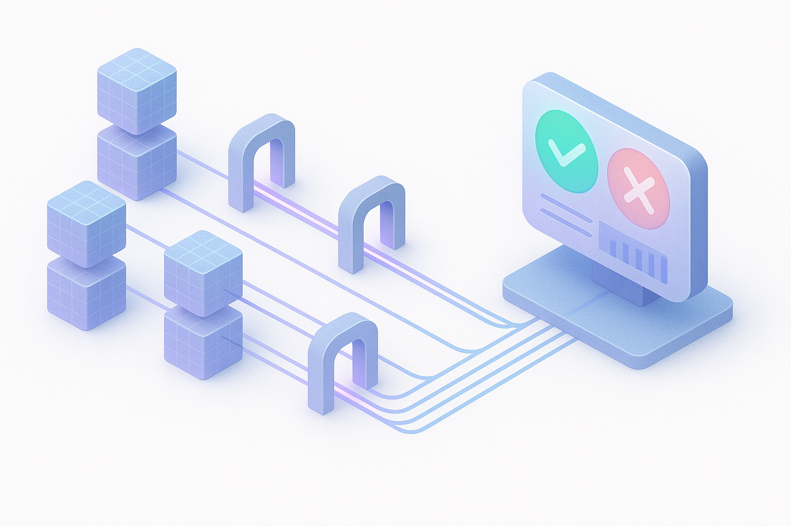

Your platform team shipped the search-and-discovery skill three months ago. Engineers can ask "where's the customer LTV table" in any coding agent and the skill walks them through your data catalog, filters out deprecated tables, checks access, and surfaces the owner. The demo was great. Six engineers said it was great.

Adoption is at 12%.

The diagnosis you'll get is some version of "we need more training" or "the team isn't ready." Both are wrong. The skill works fine in the cases the team that built it tested. What's missing is the apparatus that proves it works on the cases the team didn't think to test, every day, against the production traffic that actually exists.

That apparatus is the evaluation framework. It's the single biggest reason AI skill rollouts stall in low double digits and stay there.

## What "the eval is missing" actually means

When an agent answers a question, an engineer doesn't just need the answer. They need a reason to trust the answer enough to act on it without re-doing the work themselves.

In a non-agent world that trust comes from the human source. The senior data engineer who maintains the warehouse said this is the right table. You believe them because they've been right before, and if they're wrong, they own the consequences.

In an agent world, you don't get that. The agent is right 85% of the time. You don't know which 85%. You don't know whether your last prompt change made the right cases better or made the wrong cases more confident. You don't know whether the model upgrade your vendor pushed last Tuesday silently regressed three of your highest-stakes workflows.

Without an eval framework, every answer is a coin flip the engineer has to verify by hand. They don't use the skill. They go ask in Slack, like they used to. The skill is technically working, adoption is technically stuck, and these two facts are the same fact.

## The framework, in one breath

Build a representative set of cases your skill should handle. Define the correct answer for each. Run the skill against the set on every prompt change, every model upgrade, every catalog refactor. Surface failures. Iterate. Repeat forever.

Easy to say. The execution is what separates an evaluation discipline from a checklist.

## Where the cases come from

Start with two sources, in this order.

**User interviews.** Sit with 10–15 engineers across teams. Ask what they actually search for, in their own words, with the context they actually have. Not "what would you ideally ask an agent." What they typed into Slack last Tuesday at 4 PM when they were in a hurry. This is your seed set.

**Production session logs.** Once the skill is in light use, scrape the real queries. The distribution will surprise you. Half the questions are not what your seed set anticipated. Mining real traffic is the only way the eval set tracks the workload your engineers actually have.

Then assign correct answers. Painstaking, manual, and worth it. The "right" answer for "find the customer LTV table" is a specific table name, with optional fallbacks, and a list of acceptable owner pings. Without that ground truth, every eval result is a vibes report.

Cap the initial set at 50–100 cases. More is not better. More that you can't maintain is worse than fewer that you can.

## The two scoring modes

For each case, the skill's output gets scored two ways.

**Exact-match where it applies.** If the correct table is `dim_customer_revenue`, did the agent return `dim_customer_revenue`? Boolean. Cheap. Use it everywhere it works.

**LLM-as-judge where exact-match doesn't apply.** Most real answers are paragraphs, ranked lists, or multi-step recommendations. A judge model reads the agent's output and the gold answer and renders a verdict. Slower and more expensive, but the only way to score open-ended output at scale.

The judge has known biases. It prefers longer answers. It prefers the first answer in pairwise comparisons. It prefers outputs that look stylistically like its own. Treat the judge like any other piece of unreliable infrastructure: calibrate it. Human-label fifty cases per quarter. Require the judge to agree with the human at some bar (we run 85%) or the judge prompt gets rewritten until it does. A judge you don't calibrate is a rubber stamp wearing a suit.

## Multiple runs, parallel execution

Models are non-deterministic. Running each case once and treating the result as the truth is one of the most common eval mistakes.

Run every case at least three times. Record the variance. A skill that passes 100% on one run and 60% on the next is not an 80% skill. It's an unreliable skill, and that distinction matters more for production trust than the average. High-variance cases are flags: either the prompt is ambiguous, the gold answer is wrong, or the model is genuinely shaky on this kind of question. All three are worth knowing.

Run in parallel. A 100-case eval at three runs each is 300 model calls. Sequential, that's an hour and a budget item. Parallel, it's two minutes and a footnote. The eval discipline that runs in two minutes gets run on every prompt change. The one that runs in an hour gets run quarterly, which is the same as never.

## What most teams get wrong

The mechanics above are necessary, not sufficient. Four mistakes show up in nearly every eval setup I've seen and quietly invalidate the work.

**The iteration set and the test set are the same set.** You tune the prompt against the cases, the pass rate goes up, you ship. You have learned that your prompt is good at the cases you tuned it against. You have learned nothing about whether it's good in general. Hold 20% of your cases out of the iteration loop. Nobody on the team that tunes the prompt sees them. The holdout pass rate is the number you actually report.

**Pass and fail is the only signal.** Aggregate pass rate goes from 78% to 83%. You ship. What you didn't see: the "wrong table returned" failure mode dropped from 8% to 5%. The "returned a deprecated table the agent shouldn't have known about" failure tripled. The first is a hygiene win. The second is a business incident. Without categorized failure modes, your iteration loop optimizes the average and walks past the catastrophe. Bucket failures by type. Track each bucket separately. Set thresholds on the buckets that carry business risk.

**Vetted answers don't have an owner.** The data team refactors the warehouse. Three of your gold answers now point at tables that don't exist. The eval still runs and still reports a pass rate, because the judge thinks "the table doesn't exist" is just a different kind of correct-looking answer. Eval datasets rot the same way documentation rots. Assign an owner. Refresh quarterly. Treat it as a recurring engineering cost, not a one-time setup.

**The eval runs once.** A model upgrade lands on a Tuesday. Your vendor's release notes say "improvements to tool use." Improvements where? On their benchmarks, not on yours. A nightly shadow eval against real production traffic catches the regression in your data-catalog skill and pages the platform team before it reaches an engineer. A quarterly re-evaluation cadence catches it ninety days later, after three teams have quietly stopped using the skill.

These four are non-negotiable. The framework without them is theater.

## The leader-facing metrics

Pass rate alone doesn't fund the eval program. Track three numbers next to it on the same dashboard.

**Cost per pass.** Token spend per case. A skill that resolves correctly for $0.04 is a different product from one that resolves correctly for $4.00, even if the pass rate is identical. The second one fails the ROI conversation no matter how accurate it is.

**P95 latency.** A correct answer that takes 90 seconds is a fail in a chat-style workflow. The user gave up at 8 seconds and went back to Slack.

**Holdout pass rate.** The number you defend to leadership. Your tuned-set pass rate is engineering hygiene. Your holdout pass rate is the closest thing you have to an honest performance number.

These are what go on the slide in the quarterly readout. Pass rate without cost is a vanity metric. Cost without pass rate is bookkeeping.

## What this unlocks

An eval framework looks like overhead until you see what it lets you do.

**Confident model upgrades.** When a vendor ships a new model, you don't debate it. You run the eval. If the holdout pass rate holds, you upgrade. If it regresses, you pin the old model and file a ticket. The decision takes an hour, not a quarter.

**Confident autonomy.** The skills that hit a bar (95% holdout pass rate, low variance, small cost-per-pass) get permission to act. The ones that don't get a human-in-the-loop checkpoint. Eval scores translate directly to deploy posture. Without the eval, every skill defaults to "ask before doing anything," which is the same as "nobody uses it."

**Confident reporting.** When the CTO asks whether the AI investment is working, you have a number. Not a survey. Not an anecdote. A number that's measured the same way every week against the same real distribution of work.

This is what platform engineering for AI actually looks like. Not the skill. Not the agent. The discipline that proves the skill works and keeps proving it.

## What to do Monday morning

If you have a skill in production and no eval framework around it, three steps:

1. **Pick one skill.** The one getting the most use, or the one with the highest blast radius if it's wrong. Don't try to instrument the catalog at once.
2. **Build a 50-case eval set.** Thirty cases from user interviews this week, twenty cases from production logs once you have them. Hold ten of the fifty out as the test set the iteration team never touches.
3. **Stand up nightly shadow runs.** Three runs per case, parallel, against the current production model. Bucket failures by type. Track cost per pass and p95 latency next to accuracy.

That's the minimum viable eval discipline. It will tell you, in week two, whether the skill you've shipped is actually doing what you think it's doing. Most teams discover the answer is "not really, in the cases we didn't think to test." That discovery is the entire point.

The skill is the easy part. The eval is the part that turns the skill into a platform capability your team can defend to leadership and your engineers can trust without re-checking the work. Without it, every AI investment is a hope. With it, the investment is something you can measure, defend, and compound.

If you're building AI platform infrastructure for your engineering org, [this is the kind of work I help with](/services): vendor-agnostic, outcome-focused, hands-on-keyboard. Evaluation harnesses are never optional, because the alternative is the 12% adoption number nobody wants to talk about. If that's the problem you're staring at, get in touch.
