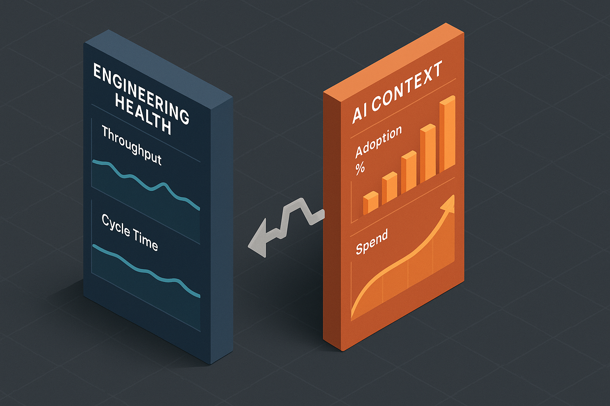

It's Sunday night and you're prepping the AI productivity slide for tomorrow's quarterly readout. The CFO will be there. There are three drafts open on your laptop.

The first leans on a vendor's commissioned ROI study quoting 376%. You know that number won't survive five minutes of CFO questioning.

The second is a satisfaction survey. 82% of engineers find AI tools "valuable." You also know what happens when the CFO asks what 82% satisfaction translates to in dollars or shipped features.

The third is your DORA dashboard. Throughput is roughly flat. Cycle time is roughly flat. The slide accidentally argues against the program.

Each draft is a different way of avoiding the truth, which is that you don't actually know how to measure this. Neither does the rest of the industry. Here's the move that fixes that.

## The reframe

Software productivity has never had a clean metric. Lines of code didn't work. Story points didn't work. DORA, the four DevOps Research and Assessment metrics that came out of Google's research team, was the closest thing to honest, and even DORA was always more useful as a diagnostic than as a number you defended in a board meeting.

AI tooling didn't break engineering measurement. AI tooling exposed a gap that has been there for thirty years. The difference is that for the first time, the C-suite is paying attention to engineering productivity as a number with a budget attached.

The right move isn't to pretend you have a number you don't have. The right move is to lead with the actual phenomenon, name it, and pitch the work to address it.

## The actual phenomenon

The most rigorous public study available right now is the [2025 DORA report](https://dora.dev/dora-report-2025/). About five thousand respondents, over a hundred hours of qualitative research. The headline finding is the one your readout should be built around.

At the individual level, AI tooling produces 21% more tasks completed and 98% more pull requests merged. At the organizational level, delivery metrics stayed flat. Stability got slightly worse.

The randomized controlled trial from [METR](https://metr.org/blog/2025-07-10-early-2025-ai-experienced-os-dev-study/), an independent AI research lab, ran the same question with a different method. Sixteen experienced open source developers, 246 real issues, properly controlled. Developers predicted a 24% speedup with AI tools. After the work was done, they self-reported a 20% speedup. Measured, they were 19% slower.

Read those numbers together. Individual lift is real and the engineers feel it. Organizational delivery hasn't translated. That gap is the entire AI productivity story for 2026.

A leader who reports only the individual lift gets caught the moment a CFO asks why the company didn't ship more this quarter. A leader who reports only org delivery makes the program look like a flop. A leader who puts both numbers next to each other and explains the gap sounds like an adult and earns the budget for the next quarter.

## Why the gap exists

Authoring code was never the bottleneck. AI sped up a step that wasn't constraining the system. Five things absorb the gain.

**Review tax.** Authors are 30% faster. Reviewers aren't. The review queue grows. Cycle time stays flat because the bottleneck moved from typing to reading. Reviewers also have less context for code they didn't write, so review takes longer per line.

**PRs got chopped, not work expanded.** PR count doubles. Total scope shipped is the same. The unit of work got smaller to look like more output. Anyone counting PRs as productivity is counting an artifact of how engineers package their work, not the work itself.

**Rework absorbs the gain.** [GitClear's longitudinal research](https://www.gitclear.com/ai_assistant_code_quality_2025_research) found code churn doubled versus the pre-AI baseline. Refactored lines fell from 25% in 2021 to under 10% in 2024. Copy-paste clones rose from 8.3% to 12.3%. Faster authoring upstream is paid back as bug-fix and rework cycles downstream.

**Coordination didn't change.** Most engineering time in a real organization is design decisions, integration debugging, cross-team alignment, and meetings. AI tooling doesn't touch any of that. A 50% speedup on the 30% of time that is actual authoring is a 15% individual gain, easily eaten by a 5% increase in coordination overhead.

**Demand absorbs supply.** Engineers got faster. The business asked for more. Per-quarter throughput looks flat because the team took on more scope, not because it isn't faster. This one is good news that looks like bad news on the slide if you don't name it.

The leader's job is to identify which absorber is eating the gain and pitch the work to address it. That's the readout.

## The slide that names the gap

Two columns, side by side, on one page. Left column is engineering health. Right column is AI context. The audience reads them together and asks the right question themselves.

| Engineering Health (left) | AI Context (right) |
|---|---|
| PR throughput per team | % engineers weekly active with AI, sliced by tenure |
| Cycle time, work start to merge | % PRs touched by AI |
| Change failure rate | Calibrated time-saved sentiment, quarterly |
| Developer Experience Index (DXI) | AI spend per engineer-month |

The left column is the [DX Core 4](https://newsletter.getdx.com/p/introducing-the-dx-core-4) framework, which absorbed DORA, SPACE (Forsgren's productivity framework), and DevEx (Noda's developer-experience framework) into one model with a single headline metric per dimension. It's the frame that has the most leadership traction right now because it survives a CTO slide. Note that throughput is reported per team, never per individual. That's a non-negotiable.

The right column is what the [DX field study of 18 mature engineering orgs](https://getdx.com/blog/how-top-companies-measure-ai-impact-in-engineering/) converged on. Adoption depth instead of seat count. Share of work touched by AI instead of lines of generated code. A calibrated sentiment number that admits it's qualitative. Spend with the receipt.

The two columns are presented next to each other on purpose. If both moved together, the program is working. If only the right column moved, the gain is leaking somewhere between the engineer and the customer, and the next investment is in finding the leak.

## What you refuse to put on the slide

Naming what you won't report is what makes you sound credible instead of promotional. Every one of these is gameable, every one is currently being marketed to engineering leaders, and every one has a named expert calling it out.

**Lines of code generated by AI.** Even McKinsey, which originally promoted this metric, now disclaims it as a weak proxy. It rewards verbosity and creates the wrong incentives.

**Suggestion acceptance rate from your vendor's dashboard.** Laura Tacho, in [her interview with Gergely Orosz](https://newsletter.pragmaticengineer.com/p/measuring-the-impact-of-ai-on-software), called this "such a tiny part of the story." Acceptance rate counts trivial completions, gets juiced by autocomplete on punctuation, and tells you nothing about whether the engineer kept the suggestion in the final PR.

**Token usage as a productivity proxy.** Gergely Orosz documented the "token-maximizing" pathology at Meta, Microsoft, and Salesforce. Leaderboards on token usage produce engineers who maximize token usage. That isn't productivity, it's compliance with a bad metric.

**Vendor-supplied "time saved" estimates without a baseline.** A platform lead at Monzo put it bluntly to the Pragmatic Engineer: vendors measure what they can measure, and that's the number you get. A time-saved number with no comparison group is not a measurement.

**Anything reported per individual.** This is the universal red line. Kent Beck, Charity Majors, and Will Larson all say the same thing for the same reason. Per-individual AI metrics break the trust contract with the engineering team and produce surveillance-coded readouts that erode the program's credibility. Report at team level or roll up further. Never below.

The leader who explicitly bans these in their readout, by name, immediately reads as more sophisticated than the leader who quietly omits them.

## The contrarian evidence as armor

Three numbers belong in your readout because they pre-empt the skeptic in the room. Citing them is not anti-AI. Citing them tells the CTO you've read the literature, you aren't selling a vendor pitch, and your measurement program is the kind that survives skepticism.

[METR (July 2025)](https://metr.org/blog/2025-07-10-early-2025-ai-experienced-os-dev-study/): predicted 24% speedup, self-reported 20% speedup, measured 19% slower. The most-cited counter-evidence in the field. Naming it in your readout disarms the executive who walks in with it ready to deploy.

[Stack Overflow 2025 Developer Survey](https://survey.stackoverflow.co/2025/ai/): AI adoption at 84%, but trust at an all-time low. 29% of developers trust AI tools, down 11 points year over year. 46% actively distrust them. Only 3% report "highly trusting" AI output. This is the data that explains why adoption metrics decoupled from delivery metrics.

[GitClear's 2025 longitudinal study](https://www.gitclear.com/ai_assistant_code_quality_2025_research): code churn doubled versus the pre-AI baseline. Copy-paste clones up from 8.3% to 12.3%. Refactored lines down from 25% to under 10%. Quality is taking a measurable hit and you should know it before your incidents report shows it.

These three lines on one slide do more for your credibility than any positive claim you could make.

## What the mature orgs actually do

The leaders who got there first have published enough to triangulate the standard.

[Dropbox](https://getdx.com/blog/how-top-companies-measure-ai-impact-in-engineering/) reports weekly active AI engineers, CSAT for the AI tooling, qualitative time saved, and AI spend. Their finding worth borrowing: AI-using engineers ship 20% more PRs and have a lower change failure rate than non-users. That's the shape of the comparison your readout wants.

Webflow slices adoption by tenure cohort. The engineers with three or more years at the company get the largest lift, which directly informs how they pace rollout to junior engineers. Tenure-cohort slicing is one of the highest-signal cuts you can put on the slide.

[Stripe's Minions agents](https://stripe.dev/blog/minions-stripes-one-shot-end-to-end-coding-agents) merge over a thousand PRs per week. Stripe reports it as an outcome metric tied to specific maintenance categories, not as a vanity stat. The reframe is worth stealing: report what the agents accomplished, not how many tokens they consumed.

[Cloudflare](https://blog.cloudflare.com/internal-ai-engineering-stack/) went from 5,600 weekly merged MRs (GitLab's term for PRs) to over 8,700 after rolling out their internal AI engineering stack. They report it as a company-level number, never per engineer. That's the discipline.

You don't need to be Cloudflare to copy the pattern. You need a team, a baseline, two columns, and a quarterly cadence.

## Monday morning, three steps

If your next readout is in less than ninety days and you don't have this slide built, here's the smallest path that gets you a credible draft.

1. **Pick one team.** The team with the highest AI adoption, or the team with the most measurable workflow. Don't try to instrument the whole organization. The slide gets built once, validated, then expanded.
2. **Instrument both columns end-to-end.** The right column is mostly already counted somewhere. The left column probably is too, but it isn't sliced by AI exposure. Cohorting your existing engineering health metrics by AI usage is the highest-leverage analytics work you can do this quarter.
3. **Commit to the readout cadence before the data is clean.** Put the meeting on the calendar. Forcing a deadline against an imperfect dataset is the discipline that produces an honest dashboard. Waiting for clean data produces nothing.

Most leaders who do this in week one discover their gap is sitting in review capacity. The next investment becomes review tooling, AI-assisted review workflows, and team-level review SLAs. Some discover the gap is in coordination, in which case the investment is in design and integration practices, not more AI seats. The point of the readout is to find out which absorber is eating your gain.

## What this is really about

A vendor will sell you a license. A consultant will sell you a workshop. A platform team can build you the measurement layer that turns a license bill into a defensible investment. The discipline of cohorting engineering health by AI exposure, calibrating sentiment surveys, tagging incidents for AI involvement, and pairing it all on a two-column dashboard isn't a one-time setup. It's a recurring engineering practice with an owner. The [skill-level eval discipline](/blog/2026-05-18-ai-skill-eval-problem) is the upstream half of this work; this readout is the downstream half.

If your next quarterly readout needs to hold up to a CFO, [this is the work I do](/services). I help engineering teams turn AI coding tools into production-grade developer platforms, vendor-agnostic, outcome-focused, hands-on-keyboard. Discovery engagements run two to three weeks; full platform builds run ten to fourteen. The measurement layer is non-negotiable in every engagement, because the alternative is the slide nobody can defend.
