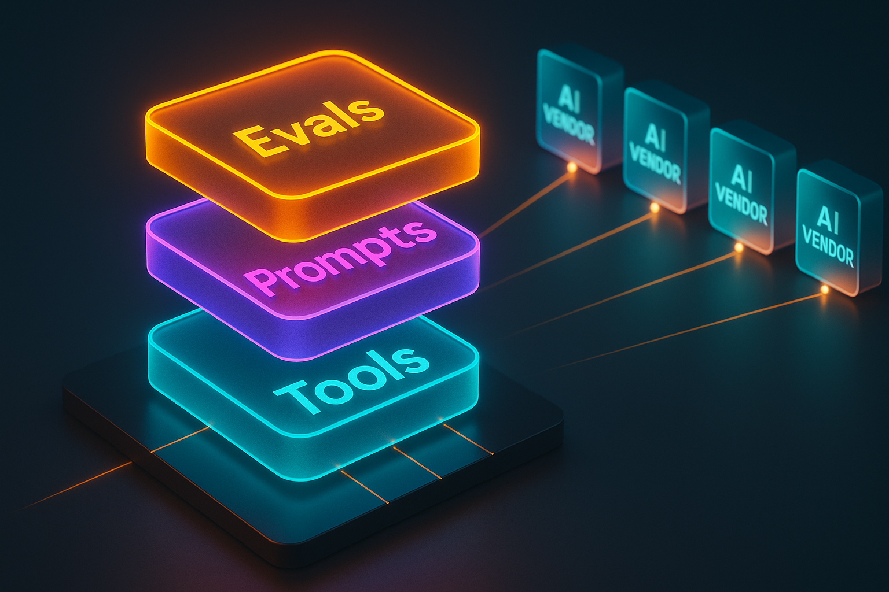

You're allocating next year's AI budget. The vendor pitch on your desk argues the obvious move is to standardize on whoever's currently winning the model benchmarks. The case sounds convincing. It's also exactly the wrong bet.

Every AI vendor is racing. First it was who has the most knowledge. Then who has the best reasoning engine. Now it's who has the best generic agentic engine. And most companies are pouring investment directly into picking the racer.

That bet doesn't survive contact with the next quarter. The model leader shifts. The pricing changes. A better agentic framework appears. Whatever you wired specifically to one vendor becomes the thing you have to rip out.

There's a simpler way to think about this. The value of AI inside your company isn't the model and isn't the agentic framing. The value is what your company can hand to AI that nobody else has. Build there, and you can swap vendors freely. Build anywhere else, and you're renting capability from someone else's roadmap.

Three layers do all the work. Tools, prompts, and evals. Everything else is plug and play.

## The model isn't the moat

Models are commodities now. They have to be, because every provider is shipping a roughly comparable one every six months. The general knowledge race ended. The reasoning race is ending. The agentic race will end the same way.

What none of them have is your company's internal context. Your data warehouse. Your nomenclature. Your business rules. Your team's particular way of doing the work. That's the gap an AI needs to cross to be useful inside your org. Closing that gap is the only investment that compounds.

The question stops being "which vendor" and becomes "what do we hand the vendor's model so it can do useful work here." Three layers cover it.

## Layer 1: the tool layer

Start with tools. A tool is any specific action a person in your company might take, packaged so a model can take it instead.

Searching for a table in your data warehouse. Pulling a customer record by an internal ID format. Running a deployment with your particular safety checks. Looking up a metric definition from your internal docs. None of these are interesting to OpenAI or Anthropic or Google. All of them are the difference between an AI that's useful at your company and an AI that's a fancy chatbot.

You package these however the ecosystem currently favors. MCP servers. CLIs. APIs the agent can hit. The packaging format will change again. What doesn't change is the underlying function: this is an action specific to how your company operates, exposed so a model can call it.

A collection of these is your tool layer. It's portable across every vendor that ever ships, because every vendor needs something to do.

## Layer 2: the prompt layer

Tools alone aren't enough. Most real work isn't one tool call. It's a sequence, sometimes with branches, sometimes with retries, sometimes normalizing the user's input before anything else can happen.

Take that data warehouse search. The tool does name-based matching on tables. Great. But the user types "user acquisitions" and your company doesn't call them acquisitions. Maybe it's "signups." Maybe it's "activations." Maybe there are three legacy terms and a current term and the legacy ones still appear in dashboard names.

The workflow has to expand. Before hitting the tool, normalize the terminology. Search internal Slack for how people actually phrase this. Check the nomenclature doc. Generate a handful of plausible permutations. Then run the search across them and reconcile what came back.

That sequence is the encoded process. It might be serial. It might fork into parallel branches and reconcile. It's a composition over your tools, and it's worth writing down because it's how the work actually gets done in your business.

This is the prompt layer, sometimes called the business layer. Workflows, prompts, tasks. Compositions over tools that encode how your company operates.

When you look at what platforms are actually shipping, this is exactly what they support. Skills. Sub-agents. Commands. Hooks. Marketplace plugins. These are generic building blocks for composing business flows. The community is converging on a common set of primitives, and most platforms now integrate them.

That convergence is what makes the prompt layer portable. A workflow written against generic primitives doesn't care whether Codex, Claude Code, Cursor, or some new IDE is the runtime. They all run the same kinds of primitives now, and many of them plug directly into the same marketplace ecosystem.

## Layer 3: the eval layer

Tools and prompts get you to a working system. The eval layer tells you whether it's actually working.

This is the part most companies skip and then quietly regret. AI agents are not deterministic. The same input does not always produce the same output. That isn't a defect, it's the nature of the tool. But it means "we tested it once and it worked" is not a meaningful claim about your system.

What's meaningful is a rubric and a percentage. If you have an AI-driven process for deploying a new metric, the useful question is: out of 100 representative inputs, how often does it produce the right deployment? If the answer is 85%, you know what you have. You can decide whether 85% is good enough, and you can measure whether your next change moved the number up or down.

A useful eval framework needs three things:

- A representative set of inputs that look like real production work
- A rubric that scores outputs against what "correct" means in your business
- A way to run the whole thing at volume, not one input at a time

Once you have that, you have a steering wheel. Swap the model. Re-run the suite. Did the score move? Tune the prompt. Re-run. Add a tool. Re-run. Every decision becomes measurable instead of vibes.

There are also techniques to drive success rates up once you can measure them. The simplest is voting. Run five agents in parallel on the same input and require three to agree before moving forward. This converts a 60% single-shot success rate into something much higher because independent errors don't usually cluster on the same wrong answer. You can scale the pool up. You can weight votes. You can layer self-critique. None of this is interesting without the eval framework underneath, because you can't tell whether your fancy technique actually moved the number.

For the deeper treatment of how to actually build and run this layer, see the [eval framework post](/blog/2026-05-18-ai-skill-eval-problem). For now the point is just: this is the third layer, and it's the one that lets you treat the other two as portable.

## Why this stays vendor-agnostic

Look at the picture you end up with. Your tool layer encodes what's unique about your company. Your prompt layer encodes how your company gets work done. Your eval layer tells you how well any combination is performing.

None of that is tied to a specific model. None of it is tied to a specific runtime. The vendor sits underneath all three, and you can pull it out and put a different one in, because what you've built up top is the same.

Most platforms now support the same primitives. They plug into the same marketplace. They run the same kinds of skills and sub-agents. Some companies will use marketplace plugins directly. Some will build their own glue layer. It honestly doesn't matter which. What matters is that your prompts, your tools, and your evals exist as first-class assets that you own and can carry across whatever vendor ecosystem is best this quarter.

That's the whole point of vendor-agnostic. Not "we don't use vendors." We use them all, swap freely, and our investment compounds in the layers we control instead of evaporating every time the market shifts.

## Where to spend the budget

If you're allocating AI investment inside a company, the priority order writes itself:

1. **Tools.** Package the actions your company already takes. Start with the highest-leverage ones: the queries an analyst runs daily, the operations an engineer does in their sleep. These have the longest half-life because they describe your business.
2. **Prompts.** Compose those tools into workflows that match how the work actually flows. Encode the normalization, the branching, the recovery paths.
3. **Evals.** Build the rubric and the input set before you need them. The team that can measure its agents will out-iterate the team that can't.

Then plug in vendors. Codex, Claude Code, Cursor, whatever fine-tuned model you've got, whatever shows up next quarter. They're the swappable bit. Your three layers stay.

The vendors are in a race. You don't have to be.

The [eval framework](/blog/2026-05-18-ai-skill-eval-problem) is how you prove the layers are working. The [leadership readout](/blog/2026-06-01-leadership-readout-ai-productivity-gap) is how you defend the spend they enable. The layers themselves are what you actually own.

If you're building AI platform infrastructure for your engineering org, [this is the work I do](/services). I help engineering teams turn AI coding tools into production-grade developer platforms, vendor-agnostic, outcome-focused, hands-on-keyboard. Discovery engagements run two to three weeks; full platform builds run ten to fourteen. The three-layer stack is non-negotiable in every engagement, because the alternative is rebuilding from scratch the next time the vendor leaderboard shifts.
