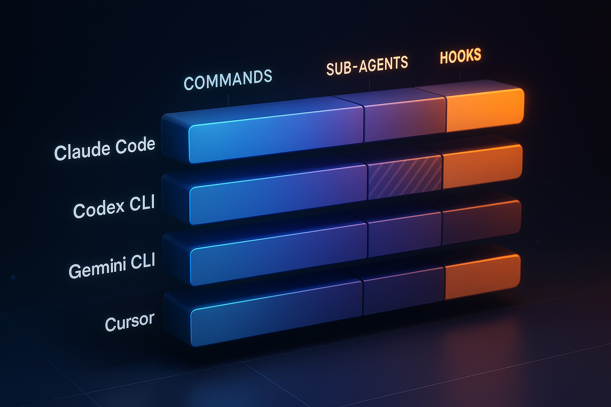

Every AI vendor is racing. They raced on knowledge. They raced on reasoning. Now they're racing on agentics. Whatever comes after, they'll race on that too. If your business AI is wired into one vendor's specific way of doing things, you're going to keep rebuilding.

There's a better layer to bet on. It's emerging right now in the form of marketplace plugins, and it ships a set of generic primitives that every major agent platform either already supports or is racing to support. Build on those, and the vendor sits underneath your work instead of wrapping around it.

I want to walk through what's actually in a marketplace plugin, how the coverage looks across the four agent platforms that matter, and why this is the right altitude to encode business workflows at.

## What a marketplace plugin actually ships

A marketplace plugin is a packaging format. It bundles together a set of primitives the community has been converging on. There are four core ones, and a fifth that's worth treating as a first-class pillar even though it sits a little differently.

The core four:

- **Slash commands.** Named entry points a user invokes directly. Good for packaging a workflow as a single button: `/research`, `/dashboard`, `/triage`.
- **Skills.** Auto-invocable capability blocks the agent pulls in when relevant. The agent decides when to apply a skill based on context, rather than the user typing a command.
- **Sub-agents.** Spawned helpers the parent agent delegates work to. Useful when you want parallel research, isolated tool permissions, or specialized roles inside one task.
- **Hooks.** Interception points around lifecycle events. Pre-tool-use checks, post-edit validation, session-start setup. The plumbing that enforces safety and shape.

The fifth pillar:

- **MCPs.** Not strictly a plugin-native primitive, but plugins reference and bundle MCP servers, and the [MCP layer](/blog/2025-11-03-supercharge-agent-mcp-tools) is where your actual tool surface lives. Treat it as the foundation the other four compose over.

That's the harness. Commands and skills are how work enters the system. Sub-agents are how it parallelizes. Hooks are how it stays safe. MCPs are how it touches your business. Together they're enough to encode real workflows without picking a vendor.

## The coverage matrix across the agent platforms that matter

Here's where it gets interesting. Four agent platforms cover most serious adoption right now, and most of them already support most of the primitives. Some support is full, some is partial, and the partials are worth understanding.

| Product | Commands | Skills | Sub-agents | Hooks |
|---|---|---|---|---|
| **Claude Code** | Full | Full | Full | Full |
| **Codex CLI** | Full | Full | Partial | Partial |
| **Gemini CLI** | Full | Full | Partial | Full |
| **Cursor** | Full | Partial | Full | Full |

Claude Code is the only one with full coverage across the four, which is unsurprising since it's the reference implementation the spec is converging toward. Gemini CLI is the closest match for portability. Codex CLI ports skills and commands cleanly but is the weakest for hook-heavy or sub-agent-heavy plugins. Cursor is strong on sub-agents and hooks but loses some fidelity on skills.

One footnote on the hooks column. Every platform ships hooks of some kind, so the "Full" marks aren't wrong, but there's no shared spec yet for which events exist or how they fire. The platforms each implemented their own model and the community hasn't converged. Hooks end up supported everywhere and portable nowhere. That's tolerable, because hooks are the least important of the five primitives — they're the safety and shaping plumbing, not the surface where work enters. The spec will mature. It's fine to let that catch up.

MCP support is full across all four, so the tool layer underneath stays stable regardless of which agent you point at it.

### What the partials actually mean

The matrix is the easy part. The partials are where the porting work shows up.

**Codex CLI, sub-agents.** Codex has a "Teams" feature for sub-agents, but it's in beta. Lifecycle controls, delegation patterns, and isolation guarantees aren't on par with Claude Code's mature sub-agent system yet. Usable, but expect rough edges and API churn before this settles.

**Hooks across all four.** Every platform has hooks of some shape, but there's no shared spec for what events exist or how they fire. Claude Code exposes nine-plus event types. Gemini CLI exposes ten. Codex exposes a more limited set. Cursor has its own model. Some lifecycle moments you can intercept on one platform (pre-tool-use, post-edit, session-start) have no equivalent on another, so a hook-heavy plugin won't port cleanly until the spec converges. The honest read: hooks are the least important of the five primitives, the spec will mature, and it's fine to let that catch up rather than block on it. Use them where they make a workflow safer or shaped, but don't build your harness assuming portable hook semantics yet.

**Gemini CLI, sub-agents.** Gemini's sub-agent model is agent-to-agent and labeled experimental. It's a different architecture from Claude Code's, more peer-style delegation than parent-spawns-child, so porting a sub-agent definition isn't a one-to-one mapping. Behavior under load and tool-permission inheritance differ.

**Cursor, skills.** Cursor doesn't consume `SKILL.md` natively. Skills get converted into Cursor Rules, which use a different activation model: Rules are matched by file globs and project scope rather than the auto-invocation heuristic Claude Code uses. The content of a skill survives the conversion. The triggering changes. Skills that depend on dynamic invocation degrade.

None of these gaps are blockers for adopting the primitives as your design layer. They are gotchas to track as you port. The picture is closer to "good coverage with some sharp edges" than "fragmented mess." For a deeper read on which of these platforms to start with, see [Claude Code vs Codex vs Cursor](/blog/2026-02-09-claude-code-vs-codex-vs-cursor-choose).

## Why this is the right altitude to invest at

Most companies sit at one of two extremes. Either they pile up MCP servers and then stitch local workflows together by hand, or they buy directly into one vendor's full stack. Both fail the same way: the work doesn't survive a vendor change.

The harness layer sits in the middle, and it's the right altitude.

A lot of industries have already adopted MCP and built up a real collection of MCPs. The barrier they're hitting now is one level up. How do you actually use these? People are stitching together local workflows. There's no standardization. Bringing together a harness of primitives like this is what lets you start encoding business workflows portably.

If you need a dashboard generator, you package it as a command or a skill. If you need a research workflow, you package it as a skill that triggers a couple of sub-agents to do parallel discovery and reconcile. Those workflows call into your MCP-backed tool layer underneath. The whole stack is composable and the whole stack is portable.

This is moving up the stack on primitives. The MCPs are the verbs. The commands, skills, sub-agents, and hooks are the sentences. You're handing the agent processes, not just actions.

That maps directly onto the [three-layer investment frame](/blog/2026-06-15-where-to-invest-ai-tools-prompts-evals): tools at the bottom (your MCPs), prompts in the middle (your harness of commands, skills, sub-agents, hooks), evals on top. The harness is how the prompt layer actually gets implemented now that the community has converged on a shared spec for it.

## What stays portable and what doesn't

Portability isn't a guarantee, it's a design constraint. The primitives are portable. How you use them isn't always.

What ports cleanly:

- Commands as named workflows over generic tools
- Skills whose activation is purely content-driven, not platform-specific
- MCP servers, since the wire protocol is the same everywhere
- Hooks that target widely supported lifecycle events (pre-tool-use, post-edit)

What needs translation:

- Sub-agent topologies, especially across the Claude Code parent-child model and Gemini's peer-to-peer model
- Skills with auto-invocation behavior, when targeting Cursor's Rules system
- Hooks targeting lifecycle moments that exist in one platform but not another

The honest rule of thumb: design at the primitive level, port at the platform level. Write your workflow against commands, skills, sub-agents, hooks, and MCPs as a shared vocabulary. Expect to do platform-specific tuning when you bring it into a particular agent. The vocabulary survives. The shimming is small.

## Where to put the work

If you're building business AI right now, here's the priority order this framing suggests.

1. **Get your MCP tool layer right.** This is your verbs. Without it, the harness has nothing to do.
2. **Encode your highest-leverage workflows as commands or skills.** Pick the work that already happens often enough to be worth packaging. Dashboard creation. Research. Triage. Onboarding flows. Anything where the steps are stable but the runtime context changes.
3. **Reach for sub-agents when parallelism or isolation actually buys something.** Don't sub-agent for the sake of it. Reach for them when you want parallel research with later reconciliation, or when you want to fence tool permissions to a specific role.
4. **Use hooks to enforce the safety and shape your business requires.** Pre-tool-use validation, post-edit checks, session-start context loading. Hooks are how you make the harness yours.
5. **Treat platform-specific tuning as a known cost.** Plan for some shimming when you port. The four-platform matrix above tells you where the sharp edges are.

Build the harness with these primitives. The vendors will keep racing each other. You'll keep moving.

If you're building this layer inside an engineering org and want help getting the architecture and tooling right, [this is the kind of work I help with](/services). The harness layer is where most of the leverage lives, because everything above it depends on it and everything below it gets swapped on someone else's timeline. If that's where you are, get in touch.
