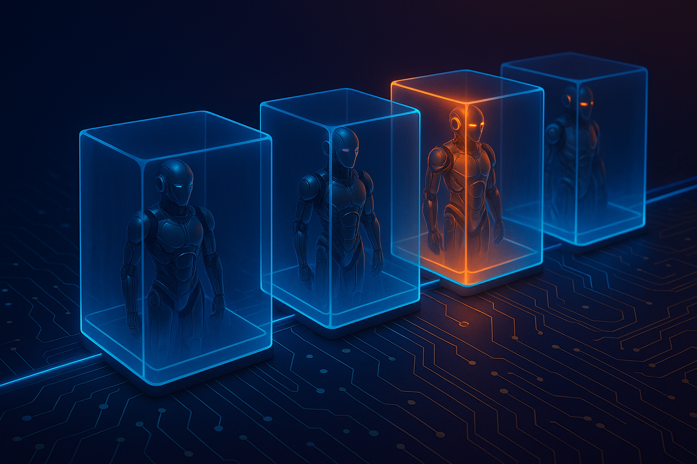
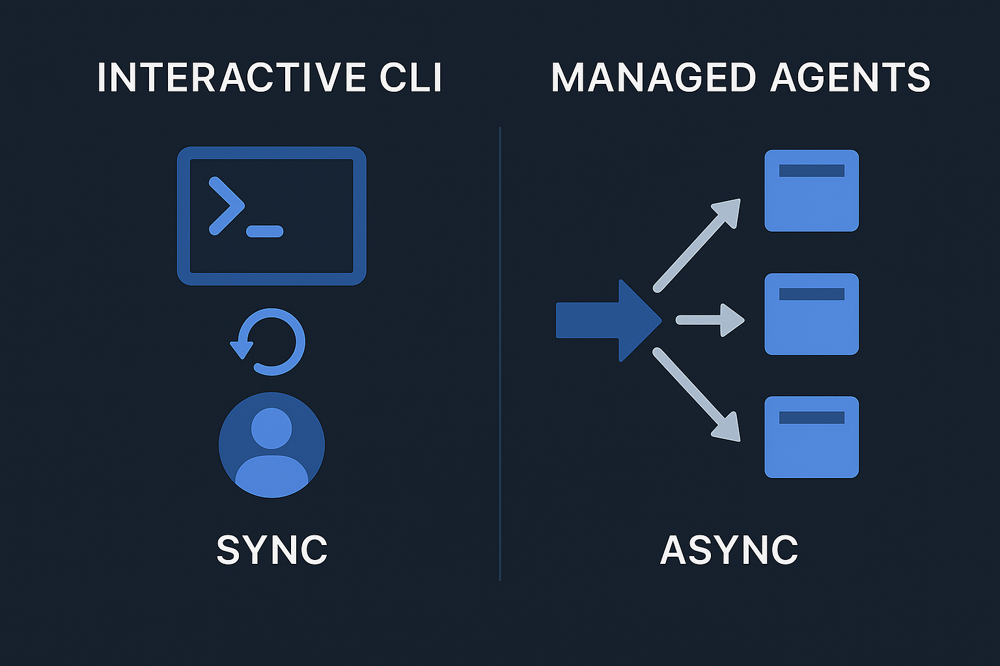

Managed agents are the story of early 2026. Look across the platforms and the investment is hard to miss: Anthropic, OpenAI, Google, and AWS are all shipping a version of the same idea. It's worth slowing down to ask what they actually are, why they're different from the CLIs we already use every day, and what value they're trying to capture.

I've spent the last two years on this blog wrapping coding harnesses to make them behave like production systems. Managed agents are the platforms catching up to that work. Here's how I think about them.

## Start with what we already have

We have Claude Code. We have Codex. We have the Gemini CLI. These are coding harnesses, and they're excellent. But notice who they're built for: an interactive developer sitting at a keyboard. That's the first-class customer. The whole experience is designed around a human in the loop, guiding and correcting in real time.

You can automate a lot with these tools, and you can push them past coding into other workflows. There are real benefits to a local environment with local permissions. But there's a gap that no amount of local tooling closes cleanly:

> I installed the tool and ran it. Now I want my *software* to use an agent to run an autonomous workflow I never have to touch.

On this blog I've covered plenty of ways to bridge that gap: YOLO modes, permission guards, wrappers that turn an interactive harness into something closer to a service. That work produces, in effect, a homegrown managed agent. The platforms are now offering the enterprise-grade version of the same thing.

## What makes an agent "managed"

Strip away the per-vendor naming and managed agents share a small set of traits.

**They're asynchronous.** This is the one that matters most. You trigger the agent, it does its thing, you get a response. You're not interrupting it mid-run to re-steer. It's close to one-shot. That single property changes how you design everything around it.

**They target production.** Managed agents come with blast-radius protection. They run in managed environments with least-privilege access: only the tools, credentials, and network egress the job actually needs. You can still build almost any agent workflow you can imagine, but now it runs in a contained, productionized flow.

**They run in parallel.** Because each agent is isolated and async, you can fan out many at once. That's exactly what you want for things like an evaluation harness, where you're running the same agent against hundreds of cases.



## The shared mental model

Once you've seen one platform's version, the rest rhyme. The names differ, but the core building blocks are the same:

- **A container** you spin up with an engine inside it.
- **Wiring** for whatever that engine needs: credentials, MCP servers, tools, network rules.
- **A mesh of agents** with sub-agent-style semantics, except each one is a standalone container.

That last point is the interesting one. Think sub-agents, but every node is independently containerized. You get easy scale-out, protected environments scoped to exactly what each agent needs, and a clean unit to reason about.

A lot of these platforms are also bolting on a **memory or persistence layer**. If you've used OpenClaw, or Hermes Assistants that succeeded it, you've seen agents retain information between runs and improve over time. Memory is how you start to attack the "agents that get better" problem. It's not magic, but it's a real lever.

## A code-first POC: Frontier Brief

To get past the abstract, I built a proof of concept on Anthropic's managed agents. It's called [Frontier Brief](https://github.com/Mandalorian007/frontier-brief), and it's a weekly intelligence briefing on the AI frontier.

The shape is simple:

- One **orchestrator** agent coordinates the run.
- It fans out to three **researcher** sub-agents, one per provider (OpenAI, Anthropic, Gemini).
- Each researcher independently digs up that provider's latest model and product releases.
- The orchestrator assembles everything into a single Markdown brief.

You schedule it on whatever cadence you want (weekly, say) and it returns a finished report. That's the whole user-facing surface.

### Memory makes it self-healing

The part I find most useful is the memory layer. Each provider has a source ledger: a set of canonical URLs the researcher reads from. When a URL goes stale (the provider moves their news page, a link 404s), the researcher doesn't just fail. It searches for the new canonical source, verifies it, and writes the corrected URL back to memory.

```yaml
# anthropic/sources.yaml — a per-provider source ledger in memory
provider: anthropic
sources:
  - label: Anthropic News
    url: https://www.anthropic.com/news
    kind: announcements
  - label: Claude Release Notes
    url: https://docs.claude.com/en/release-notes/overview
    kind: release-notes
status: active
last_verified: 2026-01-15
```

Next run, it relies on the repaired ledger. That's a concrete example of an agent improving over time: not through fine-tuning, but through accumulated, durable state. It's another way to think about what memory systems are for.

### Everything is a file you can diff

The other thing the POC demonstrates is a **code-first approach**. Every agent, environment, and memory store is a YAML or Markdown file in the repo:

```
managed-agents/
├── agents/
│   ├── frontier-brief.agent.yaml          # orchestrator
│   ├── frontier-brief.system.md           # its system prompt
│   ├── frontier-brief-researcher.agent.yaml
│   └── frontier-brief-researcher.system.md
├── environments/
│   └── frontier-brief-research.env.yaml   # tools + network egress
└── memory-stores/
    └── frontier-brief-ledger.store.yaml   # seed data + retention
```

An agent definition is just configuration:

```yaml
# frontier-brief.agent.yaml — the orchestrator
name: frontier-brief
model: claude-opus-4-6
environment: frontier-brief-research
memory_store: frontier-brief-ledger
system_prompt_file: frontier-brief.system.md
subagents:
  - frontier-brief-researcher
tools:
  - memory
  - invoke_subagent
timeout_seconds: 900
```

The environment file is where least-privilege lives. The researchers get web access, but only to the surfaces they need:

```yaml
# frontier-brief-research.env.yaml
network:
  egress: restricted
  allow:
    - "*.openai.com"
    - "*.anthropic.com"
    - "blog.google"
resources:
  cpu: 1
  memory_mb: 2048
secrets: []   # read-only research needs none
```

A single `apply.py` reads every file and creates or updates the matching resource through the API. It's idempotent, so you re-run it after any edit. Wire that into CI and you have continuous deployment for your agents.

```bash
python scripts/apply.py   # deploy agents, env, and memory store
python scripts/run.py     # trigger a briefing, print the brief
```

Your engineers build agent systems the same way they build everything else: in code, versioned, reviewed in PRs, deployed from a pipeline. That's the whole point. Managed agents stop being click-ops in a console and become software.

## Where the platforms diverge

The principles converge; the maturity doesn't. The biggest gap right now is **bring-your-own-container**.

- **Claude** leans heavily into bring-your-own-environment.
- **AWS Agent Core** has the strongest story for provisioning whatever infrastructure you need. It's worth a look even though it doesn't get top billing in most conversations.
- **Gemini and OpenAI** don't really offer a bring-your-own-environment story yet.

These are new products at different stages. Set your expectations accordingly and check the specifics before you commit.

## What this actually means

Frontier Brief is deliberately small. It's read-only: no MCP tooling, no actions taken on anyone's behalf, just research and assembly. But it's not hard to see the production version. That's a data-sourcing pipeline you could grow into a weekly AI newsletter, or any number of autonomous workflows that run without supervision.

Step back and the trajectory is clear. Managed agents are the platforms abstracting the work the community has been doing by hand for two years: packaging autonomous, no-human-in-the-loop agents and running them safely. The difference is that this version comes with the compliance, security, and isolation that production actually requires.

This is becoming the standard way to package an agent and ship it. Agents in production need a higher quality bar than an interactive session does, and managed agents are how you hit it. If you've been wrapping coding CLIs to fake this, it's time to look at the real thing.

---

If you're an engineering leader trying to figure out where managed agents fit in your stack, or how to move autonomous workflows from experiment to production, this is the kind of problem I help teams work through. [Get in touch](/services).
