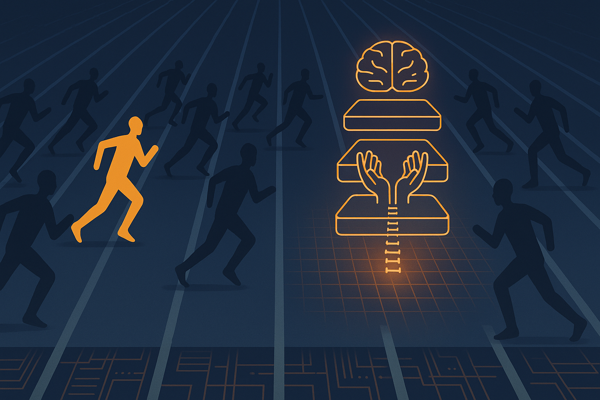

I spent a week reading the documentation for twelve platforms that want to run your AI agents in production: Anthropic, OpenAI, the three hyperscalers, the durability layer underneath them, and the open-source projects coming up fast behind all of them.

I expected to find them placing different bets. What I found instead is that they've nearly all converged on one architecture, and most of them got there on their own.

## Strip the branding and it's the same three parts

Every platform is selling some arrangement of three things. A brain, which is the model and the agent loop wrapped around it. A pair of hands, meaning an isolated sandbox where the model's generated code can run without reaching anything that matters. And a spine: the durable state and orchestration that survives longer than a single request.

Anthropic puts it plainly when it tells you to "decouple the brain from the hands." AWS, OpenAI, and Microsoft each publish a version of the same control-plane-versus-execution-plane diagram. Temporal and Vercel don't bother with the brain at all and sell you the spine by itself. The entry points vary a lot. The skeleton underneath them barely does.

## The same primitives keep showing up

Look one level down and the building blocks repeat from platform to platform. The runtime is long-running and asynchronous instead of a one-shot chat, so you kick off a job, it runs for minutes or hours, and you collect the result later. The model's untrusted code executes inside a per-session microVM or container, where a bad command stays contained. Memory comes in two tiers: short-term session state, and a longer-term store that carries across runs. There is usually a coordinator that hands work down to specialized sub-agents. And credentials sit behind a least-privilege boundary, so the model never touches your secrets directly.

The interop question has settled too. MCP wires up tools and A2A handles agent-to-agent calls, and by now a platform is expected to support both rather than bragging about it.

## Why the convergence matters

Running agents in production is still a young problem. Two years ago, everyone working on it was doing it by hand, with YOLO modes and permission guards and wrappers that dressed up an interactive coding CLI as a service it was never meant to be.

I've spent a good part of that time doing the same thing. The internal agent I work on at Airbnb runs behind CLI and API MCP servers with their own authentication and authorization, and scoping that tool surface correctly was most of the real work. What these platforms ship now is the productionized version of what I built out of spare parts.

The convergence is the part worth paying attention to. Twelve teams didn't independently land on brain, hands, and spine because they were watching each other. They landed there because that is the shape the problem forces on you, the same way containers and orchestration settled into place about a decade ago, right before everyone stopped arguing about them.

## The racers, and where they start

The architecture is shared, but the starting lines are not. Each camp is coming at the production layer from whatever it already owns.

- **The model vendors** (Anthropic, OpenAI) own the model and are moving down the stack to capture the runtime before it commoditizes underneath them. The cost of that position is that their hosted runtimes hold your state, which keeps the strictest compliance regimes like ZDR and HIPAA out of reach for now.
- **The hyperscalers** (AWS, Google, Microsoft) already have your compute, your compliance paperwork, and a signed contract. They don't need to win the model, only to make "run your agents in our cloud" the easiest option on the menu.
- **The durability layer** (Temporal, Vercel, Cloudflare, LangChain) owns one primitive and sells it as neutral ground. Temporal, for one, never sees your code or your keys.
- **The open-source projects** (Letta, Mastra, CrewAI) own developer attention and one sharp idea apiece, and they are racing to turn that into a managed runtime before a larger player ships the same thing.

Four different starting lines, and a finish line that already has a blueprint.

## The same skeleton, side by side

| Platform | Async runtime | Per-session sandbox | Two-tier memory | Sub-agent mesh | MCP / A2A | The part that's actually different |
|---|---|---|---|---|---|---|
| **Anthropic** | Yes (hours) | Fresh container | Yes (memory stores) | Coordinator roster | MCP | Native rubric-grader as a runtime primitive |
| **OpenAI** | Yes (background) | Sandbox agents | Server-side state | SDK handoffs | MCP | UI-to-runtime bundle (Builder to ChatKit) |
| **Google** | Yes (days) | Hardened sandbox | Sessions + Memory Bank | ADK graphs + A2A | Both | Cryptographic per-agent identity, governance |
| **AWS** | Yes (8-hr) | microVM | Short + long | A2A + sub-agents | Both | Most modular: à-la-carte services |
| **Microsoft** | Yes (30-day) | Micro VM | Managed memory | Connected + A2A | Both | Deepest Entra / Teams / M365 embedding |
| **LangChain** | Yes | LangSmith sandboxes | Checkpoints + Store | LangGraph + RemoteGraph | Both | Observability and eval as the substrate |
| **Cloudflare** | Yes (fibers) | Sandboxes / Workers | SQLite + Sessions | Facets | MCP | One Durable Object per agent (edge economics) |
| **Vercel** | Yes (months) | Firecracker Sandbox | Event log; semantic BYO | None native | Via AI SDK | Sells only the spine |
| **Temporal** | Yes (years) | None (BYO compute) | Event history; BYO | Child workflows | Pattern | Never sees your code or keys |
| **CrewAI** | Request/response | Managed build-run | SDK memory | Crew + A2A | Both | Bring your SDK code, they host it |
| **Letta** | Yes (persistent) | Per-tool sandbox | Git-backed "MemFS" | Subagents + skills | MCP | Git-native memory ("memory swarms") |
| **Mastra** | Background tasks | None (container) | 3-tier + Memory Gateway | A2A by default | Both | Portable build artifact (managed / self-host / VPC) |

The first five columns barely change as you read down the list, which is the whole point. The interesting one is the last column. Governance, economics, portability, and who ends up holding your data are where these platforms genuinely diverge, and where your decision actually sits. Even the pricing mostly rhymes (consumption on compute time plus tokens), though the fine print swings the bill hard for wait-heavy work, depending on whether you pay per session-hour while running, for active CPU only, nothing at all while hibernated, or per replayed action.

## Don't bet on the runner

I'm not going to tell you who wins this race. I don't think it's the right question, and the honest answer comes down to your compliance posture and your existing cloud bill anyway.

The question I'd ask instead: now that the primitives have settled this quickly, across this many serious players, what should you be building against? The primitives, not whichever vendor is ahead this quarter. Architect for a brain you can swap out, hands you can move, and a spine you get to keep. Treat MCP and A2A as the stable interfaces they have become, and keep the parts that are genuinely yours, your tools and your memory and your eval harness, on your side of the boundary.

The architecture is settling down, and that is the signal worth acting on. Teams that design around the shared shape will still be moving when the leaderboard reshuffles, which it will, on roughly the schedule it always does. Teams that bolt themselves to a single vendor's runtime will spend a good part of next year unbolting.

The runners will keep trading places. The track they are running on is already poured.

---

If you're an engineering leader trying to figure out where managed agents fit, or how to move autonomous workflows from experiment to production without betting the stack on a single vendor, [this is the kind of work I help with](/services).
