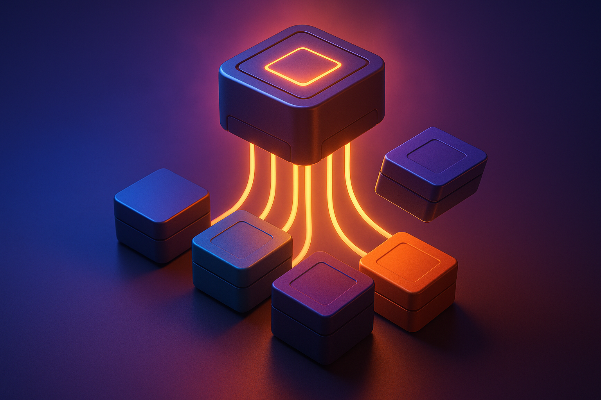

For three years the story of this industry was a single number going up. Whoever had the best model this quarter got the news cycle, the benchmark crown, and the developer mindshare that came with it.

That story is quietly ending. Not because the models stopped improving, but because improving them stopped being the thing that wins.

Look at what the two labs driving most of the traffic actually shipped in the first half of 2026. Almost none of it was a model. It was product, deployment tooling, and admin surface. I think that's the shift worth paying attention to right now, and it lands in favor of anyone who wants a real choice of models at real price points.

## The receipts are in what they cancelled

OpenAI announced the end of Sora on March 24. The web and app experiences went dark on April 26, and the API follows on September 24. Reporting at the time put Sora's daily operating cost somewhere between $1 million and $15 million at peak, and a billion-dollar Disney partnership had already collapsed.

Killing a flagship consumer product isn't a small move. It's a statement about where the money goes instead, and the answer was Codex and the enterprise tier of ChatGPT. OpenAI's own growth commentary credits the coding agent and enterprise deployment work for lifting recent revenue. The consumer video toy lost to the thing enterprises put on a purchase order.

Anthropic spent the same window building outward from the app. Claude Cowork went generally available on April 9. Claude Design landed a week later on April 17 as an Anthropic Labs research preview. By August 3, Cowork was in beta on web and mobile for Team and Enterprise plans, wrapped in role-based access controls, group spend limits, OpenTelemetry observability, and admin usage analytics.

Read that list again. Role-based access control and spend limits aren't model research. They're the unglamorous plumbing you build when your buyer is a procurement committee instead of a developer with a credit card.

## Coding became a primitive, not the product

The most telling change is what happened to the coding agent itself.

Claude Code used to be the headline. Now it reads more like a component. Cowork, Design, and the desktop app all sit above it, and the interesting question stopped being "how good is the agent" and became "what surfaces does the agent plug into." Same trajectory at OpenAI, where Codex is increasingly the engine underneath an enterprise offering rather than the offering.

Anthropic now takes roughly 80% of its revenue from business customers, with a reported eight of the Fortune 10 on the list. OpenAI still leads on total revenue at something like $13B ARR against Anthropic's $5B, but Anthropic has pulled ahead on enterprise API share. The framing I keep coming back to: OpenAI is a consumer company selling enterprise products, and Anthropic is an enterprise company that happens to have a consumer product.

Either way, they're aiming at the same buyer. And when the buyer is an enterprise, the coding agent is a line item, not the pitch.

## The capability pushes stopped landing automatically

Frontier releases don't sell themselves anymore.

Fable 5 is the clearest example. It shipped behind stricter safety classifiers that can route a request to Opus 4.8 instead, and it tells you when it does. Anthropic's own figure is that more than 95% of Fable sessions run entirely on Fable, so the fallback is genuinely rare and mostly confined to cybersecurity, biology, chemistry, and distillation-adjacent prompts. That didn't stop the perception problem. Engineers who hit the swap once tend to remember it, and plenty of them just stayed on Opus.

The deeper reason adoption has been soft is less dramatic. Fable isn't producing dramatically better results than Opus for everyday engineering work. When the top tier is a modest gain over the tier below it, staying where the behavior is predictable is the rational move.

Meanwhile Sonnet 5 is unusually strong for what it costs. That compresses the whole ladder. If the cheap tier is good and the expensive tier is only somewhat better, "always use the best model" stops being obvious advice and becomes a budgeting question.

Users have options now, including the option to not upgrade. That's normal in every other software market and brand new here.

## The open-weight gap went from a canyon to a crack

While the frontier flattened, the models underneath it caught up fast.

Open-weight models used to trail the closed frontier by close to a year. Epoch AI now puts the average lag at about four months since January 2026, roughly an eight-point gap on its composite index. Four months is a different world than twelve. It means the open option isn't a downgrade you tolerate, it's a slightly older version of the same thing.

The specific models bear this out. DeepSeek V4, Kimi K2.7 Code, Qwen 3.6 Plus with its million-token context, and GLM-5.2 are all running inside real engineering pipelines rather than sitting in benchmark tables. Serving them is a solved problem too, with vLLM, SGLang, Ollama, and LM Studio all exposing OpenAI-compatible endpoints.

Fully local inference is still the harder story. You're not running a frontier-class model on a laptop this year. But the techniques for fitting larger models onto consumer hardware keep improving, and the tradeoff moved from "impossible" to "slower." Slower is a tradeoff you can make on purpose.

## The prediction: labs will sell expertise, not tiers

The labs are going to keep moving toward enterprise. More work on deployed customers, more solutions engineering, more people whose whole job is helping a large company actually use the thing. Selling the expertise to deploy AI well, instead of selling a permanent seat in an infinite model race.

That's a better business. A model lead lasts a quarter. A deployment relationship with a Fortune 100 lasts years, and nobody rips it out because a competitor gained two points on a benchmark.

It's also a business they have to move toward, because the alternative is defending a lead that gets cheaper to match every quarter.

## Why this is a win if you want model choice

If you like having many models available at many price points, this pivot is good news.

The reason is the harness. Codex and Claude Code both speak to API-compatible endpoints. You keep the tool you actually like, with the plugin ecosystem and the workflows you've already built, and point it at a different model. The harness is the part you have muscle memory for. The model behind it is a configuration value.

That's where the cost of running agents comes out. Right now most people pay a subscription to a lab and accept whatever model tier that buys. As open-weight quality closes in and serving gets easier, the same harness running against a model you host starts to look reasonable for a large fraction of day-to-day engineering work. Not all of it. The hard architecture calls and the gnarly debugging still want the frontier. The mechanical volume doesn't.

I think the subscriptions hold for a while. Demand is real and the convenience is worth paying for today. But as infrastructure gets easier to stand up, that business model weakens at the edges, which pushes both OpenAI and Anthropic harder toward enterprise. The two trends feed each other, and that loop is more worth watching than any single release.

## What to actually build against

The industry has spent a lot of energy trying to push everyone into vertical, all-in-one stacks. I'd resist that, and right now resisting is cheap.

Align on the portable pieces instead:

- **MCP and open tool interfaces**: your tools shouldn't care which model calls them
- **Plugin and skill architecture**: workflows written against generic primitives run on whatever harness wins
- **Model as a toggle**: treat the model as a setting on the work, not a foundation under it. Route the expensive tier to the calls that need judgment and let something cheaper handle the volume

None of this is new advice. I've written before about [investing in the layers you own](/blog/2026-06-15-where-to-invest-ai-tools-prompts-evals) and about [building a toolkit that survives platform changes](/blog/2026-01-19-ai-toolkit-escape-ecosystem-lock-in). What changed is that the market is now pushing the same direction. When the labs themselves stop competing mainly on model quality, betting on portability stops being a hedge and starts being the obvious read.

The last few years rewarded whoever picked the winning model. The next few reward whoever built so the answer doesn't matter much.

If you are working out how to structure an AI platform that survives the next three vendor shifts, [this is the kind of problem I help with](/services): the tool layer, the workflow layer, and the portability decisions that keep them from becoming someone else's roadmap. If that is on your desk right now, get in touch.
