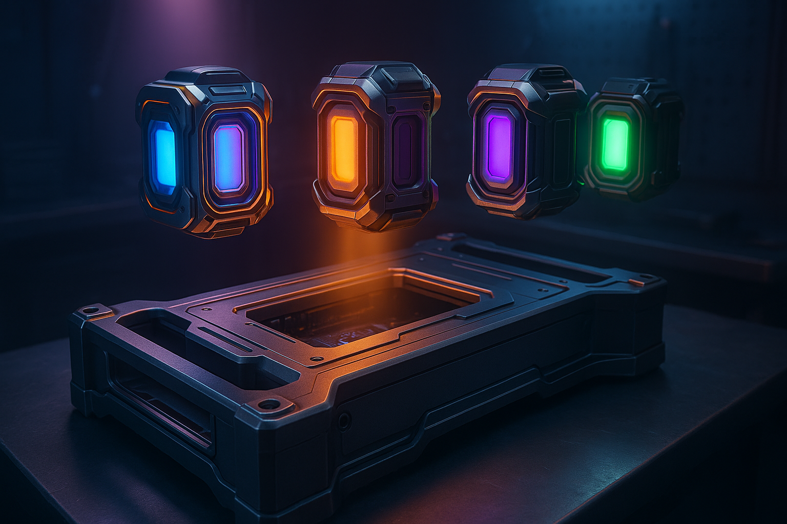

Two things get bundled together in your head when you use Claude Code, and they are not the same thing.

One is the model. The other is the harness: the agent loop, the tool definitions, the context management, the permission system, the subagents. When people say Claude Code is good, they are mostly praising the harness. No harness ships more of it today, and the benchmark results that flow through it hold up even when the model underneath gets swapped out.

That second part is the interesting part. You can swap the model underneath.

Claude Code does not hardcode `api.anthropic.com`. It sends Anthropic-shaped requests to whatever `ANTHROPIC_BASE_URL` points at, because Anthropic needed that for Bedrock and Vertex. The side effect is that anything speaking the same wire format works. OpenRouter speaks it, in front of roughly 400 models.

You keep the harness you like and choose the engine that goes in it. That choice is the whole point. The Qwen models in the examples below are just what I happen to run today, and swapping them for something else is one argument.

## Why you would want a different model

Cost is the obvious one. The main model I run through OpenRouter costs about 9x less per input token than Opus. On a long refactor that is real money.

The less obvious reasons matter more over time:

- **Capability spread.** Models are uneven. Some are strong at long-context reading, some at tight diff editing, some at speed. One default for every task is a compromise you never chose deliberately.
- **Different training, different refusals.** Vendors are converging on caution around politics, medicine, and finance. That is a defensible product decision and an occasional research problem. If a model declines to engage with a medical literature question, that is a bias in your process, not a safety win.
- **Provider risk.** Rate limits, outages, pricing changes, and deprecations all land on whoever has one option.

None of that requires abandoning the tool you already know. It requires being able to move.

## How the wiring works

Claude Code appends `/v1/messages` to whatever base URL you give it. OpenRouter serves a genuine Anthropic-compatible endpoint at `https://openrouter.ai/api/v1/messages`.

You do not run a proxy and you do not install a shim. OpenRouter does the Anthropic-to-OpenAI conversion on its side, including folding a model's reasoning output back into Anthropic `thinking` blocks. A bare POST comes back in exactly the shape the client expects:

```json
{"id":"gen-...","type":"message","role":"assistant",
 "content":[{"type":"thinking","thinking":"..."},{"type":"text","text":"..."}],
 "stop_reason":"max_tokens",
 "usage":{"input_tokens":12,"output_tokens":24,"cache_read_input_tokens":0}}
```

That is the whole mechanism. Everything below is about doing it without breaking your normal setup, and without quietly paying Anthropic prices inside a session you built to be cheap.

## Step 1: Keep credentials out of your shell rc

Put the key in its own file:

```sh
# ~/.config/openrouter.env
export OPENROUTER_API_KEY=sk-or-v1-...
```

```sh
chmod 600 ~/.config/openrouter.env
```

Two reasons. Your `.zshrc` probably lives in a dotfiles repo and this file should not. And keeping it separate is what lets the wrapper build its environment on demand instead of at every shell startup.

## Step 2: The environment shim

```zsh
_claudeq_env() {
  source ~/.config/openrouter.env
  export ANTHROPIC_BASE_URL="https://openrouter.ai/api"
  export ANTHROPIC_AUTH_TOKEN="$OPENROUTER_API_KEY"
  export ANTHROPIC_API_KEY=
  export ANTHROPIC_DEFAULT_HAIKU_MODEL="qwen/qwen3.5-35b-a3b"
  export CLAUDE_CODE_DISABLE_EXPERIMENTAL_BETAS=1
}
```

Three of those lines are not obvious.

**`ANTHROPIC_AUTH_TOKEN` and `ANTHROPIC_API_KEY` are different headers.** The first becomes `Authorization: Bearer`, which is what OpenRouter wants. The second becomes `x-api-key`, which is what Anthropic wants.

**Blanking `ANTHROPIC_API_KEY` is load-bearing.** It sits first in the credential resolution order, ahead of the auth token and ahead of any stored login profile. Leave it populated and you will send an Anthropic key to OpenRouter and get a 401 that looks like an OpenRouter problem. Setting it empty also stops the resolver from falling through to a profile on disk.

**`CLAUDE_CODE_DISABLE_EXPERIMENTAL_BETAS` is not doing what it looks like.** OpenRouter ignores unknown `anthropic-beta` headers. I sent it a made-up `totally-fake-beta-2099-01-01` and got a clean 200. The variable earns its place on the client side, where it stops Claude Code from behaving as though 1M context, effort levels, and fine-grained tool streaming are live when the upstream is silently dropping all three.

## Step 3: The subshell wrapper

This is the part worth stealing. An alias cannot do it.

```zsh
claudeq() { ( _claudeq_env; claude --dangerously-skip-permissions --model "qwen/qwen3.5-397b-a17b" "$@" ) }
```

The parentheses are the entire design. `( ... )` runs the body in a subshell, so every `export` dies when the command exits. Your interactive shell never learns that `ANTHROPIC_BASE_URL` was set.

That means one terminal tab runs Qwen through Claude Code, and the next command in that same tab runs your normal Anthropic-backed Claude Code. No unset, no re-source, no stale environment poisoning a session three hours later.

The alternatives all fail somewhere:

| Approach | What breaks |
|----------|-------------|
| `alias claudeq='ANTHROPIC_BASE_URL=... claude'` | Cannot source a credentials file or set five variables cleanly |
| `export` in `.zshrc` | Poisons every session; normal Claude Code stops reaching Anthropic |
| `source or.env && claude` | Leaks into the shell; you forget, then wonder why billing looks strange |
| Function plus subshell | Scoped to the one invocation |

`"$@"` forwards arguments, so `claudeq -p "explain this"` and `claudeq --continue` behave normally.

## Step 4: Generalize to any model

The version above hardcodes one slug. Take it as an argument instead:

```zsh
claudeor() {
  local model="${1:?usage: claudeor <openrouter-model-slug> [claude args...]}"; shift
  (
    _claudeq_env
    export ANTHROPIC_DEFAULT_SONNET_MODEL="$model"
    export ANTHROPIC_DEFAULT_OPUS_MODEL="$model"
    claude --dangerously-skip-permissions --model "$model" "$@"
  )
}

# keep the old name as a shortcut
claudeq() { claudeor qwen/qwen3.5-397b-a17b "$@" }
```

Now any model is one argument away:

```sh
claudeor qwen/qwen3.5-397b-a17b
claudeor moonshotai/kimi-k2-thinking -p "summarize this repo"
claudeor z-ai/glm-4.6 --continue
```

Those two extra exports are not decoration. Here is why.

## Four slots, not one

This is where it gets genuinely useful, and most people miss it.

Claude Code does not run on one model. It fills four independent slots, and each one is a decision you get to make.

| Slot | Set by | What reaches for it |
|------|--------|---------------------|
| Main | `--model` | your session and the top-level agent loop |
| Small / fast | `ANTHROPIC_DEFAULT_HAIKU_MODEL` | background work, and subagents that want something quick and cheap |
| Sonnet tier | `ANTHROPIC_DEFAULT_SONNET_MODEL` | `/model sonnet`, subagents pinned to the mid tier |
| Opus tier | `ANTHROPIC_DEFAULT_OPUS_MODEL` | `/model opus`, subagents pinned to the top tier |

That second row is the one worth sitting with. When a subagent spins up to grep a repo or skim a directory, it asks for the small fast model instead of burning your main one on a search. Whatever slug you put in that variable is what answers the call. Point it at something cheap and you keep the exact behavior Claude Code has by default, at a fraction of the cost, without changing how you work.

The four slots are really a routing table. A strong model on main for the reasoning, something fast and cheap underneath for the fan-out, and each job billed at a rate that matches what it needs. That beats paying one flat rate for everything, which is what you get by default.

The `claudeor` function above already does this. Main, Sonnet, and Opus all point at the model you named, while the small slot stays on the cheap one from the shim. Split them further whenever a job earns it.

Which is exactly why leaving the tier slots unset bites.

You would expect a bare Anthropic model id sent to OpenRouter to fail. It does not:

```
HTTP 200
{"id":"gen-...","model":"anthropic/claude-sonnet-5","content":[{"type":"text",...}]}
```

OpenRouter normalizes the bare id to its own `anthropic/` slug and bills you for real Sonnet, brokered through OpenRouter. No error. No warning. Nothing visible in the UI.

You set up a session to run at $0.55 per million input tokens and paid Anthropic rates inside it. This is the part that actually caught me out, and the reason those two extra exports exist. The rule is that every slot needs a value. Point them all at one slug for simplicity, or split them deliberately for routing, but never leave one blank and assume it inherits.

## Choosing a model

The one hard requirement is tool calling. Without `tools` support the harness cannot read a file or run a command, so it cannot function at all. As of this writing, 364 of 431 OpenRouter models qualify.

```sh
curl -s https://openrouter.ai/api/v1/models \
  | jq -r '.data[]
      | select(.supported_parameters | index("tools"))
      | [.id, .context_length, .pricing.prompt, .pricing.completion]
      | @tsv' \
  | sort -k3 -g
```

Check three fields before you commit to a slug:

- `supported_parameters` contains `tools`
- `context_length` is big enough for real agentic work, so 200K and up
- `top_provider.max_completion_tokens`, which is a separate and often much smaller cap

The pair I run:

| Model | Context | Max output | In / Out per Mtok |
|-------|---------|------------|-------------------|
| `qwen/qwen3.5-397b-a17b` | 262,144 | 235,929 | $0.55 / $3.50 |
| `qwen/qwen3.5-35b-a3b` | 262,144 | 16,384 | $0.08 / $0.75 |

Against Opus at $5.00 / $25.00, the main model is roughly 9x cheaper on input and 7x on output.

## Verify before you trust it

Confirm the endpoint independently of Claude Code, so a failure tells you something:

```sh
( source ~/.config/openrouter.env
  curl -s https://openrouter.ai/api/v1/messages \
    -H "Authorization: Bearer $OPENROUTER_API_KEY" \
    -H "content-type: application/json" \
    -H "anthropic-version: 2023-06-01" \
    -d '{"model":"qwen/qwen3.5-397b-a17b","max_tokens":24,
         "messages":[{"role":"user","content":"say OK"}]}' | jq . )
```

A `"type":"message"` response means the base URL, the auth header, and the slug are all correct. If that works and Claude Code still fails, the bug is in your wrapper, not your credentials.

Then confirm the isolation actually holds:

```sh
claudeor qwen/qwen3.5-397b-a17b -p "hi"
echo "${ANTHROPIC_BASE_URL:-<unset>}"    # must print <unset>
```

## What you give up

This is not a drop-in replacement, and pretending otherwise wastes your afternoon.

**Auto permission mode stops working.** `--permission-mode auto` routes tool calls through a classifier that needs a Claude model. On a third-party slug your only workable mode is `--dangerously-skip-permissions`. That turns model choice into a safety decision rather than a cost one, because you are handing unattended shell access to a model you have not evaluated.

Run it in a container or a repo you can afford to throw away. Better, put guardrails under it: I wrote up the pre-tool-use hook setup I use for this in [Taming Claude YOLO Mode with Safety Hooks](/blog/2025-10-13-taming-claude-yolo-mode), and it applies here more than anywhere, because the model on the other end is one you know less well than Claude.

**Context is the model's, not Claude's.** No 1M window. Qwen3.5 397B gives you 262K.

**`--effort` is inert.** Effort levels are an Anthropic API feature. Passing `--effort high` at an OpenRouter slug changes nothing, which is why these wrappers leave it out.

**Prompt caching economics change.** Cache pricing is per provider. Some models expose a cache read rate, many do not, and your hit rates will not match what you see on Anthropic.

**Quality is not equivalent.** You are changing the model that drives the agent loop. Long multi-step tasks, subagent orchestration, and careful diff editing are what degrade first. Benchmark it on your own work before you move anything that matters.

## The complete block

```zsh
# Claude Code, Anthropic
alias claudey='claude --dangerously-skip-permissions --model "opus[1m]" --effort high'
alias claudea='claude --permission-mode auto --model "opus[1m]" --effort high'

# Claude Code, any OpenRouter model
# Credentials in ~/.config/openrouter.env (chmod 600).
_claudeq_env() {
  source ~/.config/openrouter.env
  export ANTHROPIC_BASE_URL="https://openrouter.ai/api"
  export ANTHROPIC_AUTH_TOKEN="$OPENROUTER_API_KEY"
  export ANTHROPIC_API_KEY=
  export ANTHROPIC_DEFAULT_HAIKU_MODEL="qwen/qwen3.5-35b-a3b"
  export CLAUDE_CODE_DISABLE_EXPERIMENTAL_BETAS=1
}

# Subshell () keeps OpenRouter env out of the interactive shell,
# so claudey/claudea in the same terminal still hit Anthropic.
# All three tier slots are pinned so nothing silently escapes to Anthropic.
# Note: --permission-mode auto is unavailable here (classifier needs a Claude model).
claudeor() {
  local model="${1:?usage: claudeor <openrouter-model-slug> [claude args...]}"; shift
  (
    _claudeq_env
    export ANTHROPIC_DEFAULT_SONNET_MODEL="$model"
    export ANTHROPIC_DEFAULT_OPUS_MODEL="$model"
    claude --dangerously-skip-permissions --model "$model" "$@"
  )
}

claudeq() { claudeor qwen/qwen3.5-397b-a17b "$@" }
```

## Model choice is yours again

The tooling conversation keeps getting framed as a pick between ecosystems. Choose Claude, choose Cursor, choose Gemini, and inherit whatever model comes bundled with it.

That framing is doing vendors a favor. The harness and the model were never the same product, and prying them apart takes about twenty lines of shell.

Keep the harness you are fastest in. Then route each slot to whatever actually serves the job: something cheap for the fan-out, something strong for the long-context reading, something that will engage with a medical literature question instead of deciding on your behalf that it should not. Every one of those is a trade-off you get to make yourself.

Your harness should be a preference. Your model should not be a constraint.
